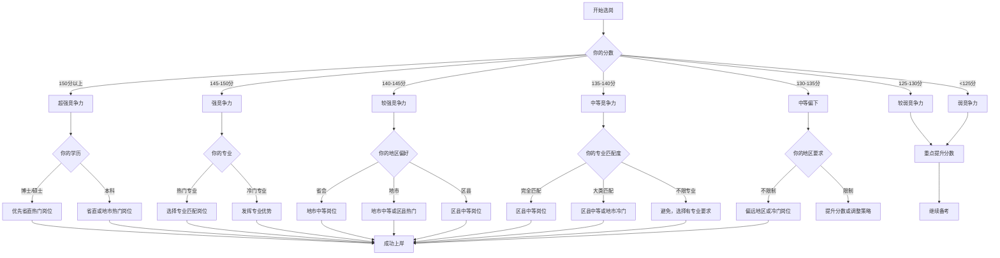

# 第六章：上岸概率测算 🎯

**本章导读**：基于2026年安徽省事业单位招聘数据，建立科学的分数线预测模型和上岸概率测算体系，帮助考生精准评估自身竞争力，制定合理的报考策略。

---

## 二十六、分数线预测模型

### 26.1 预测模型理论基础

#### 模型构建思路

分数线预测基于以下核心因素：

1. **历史数据基准**：参考2020-2025年安徽省事业单位考试分数线
2. **竞争度系数**：岗位竞争激烈程度（报录比）
3. **地区系数**：不同地市的分数线差异
4. **岗位类型系数**：A/B/C/D/E类考试难度差异
5. **学历要求系数**：学历门槛对分数线的影响

#### 核心预测公式

```
预测进面分数线 = 基础分数线 × (1 + 竞争度系数) × 地区系数 × 岗位类型系数 × 学历系数

其中：
- 基础分数线：A类130分，B类125分，C类125分，D类135分，E类120分
- 竞争度系数：根据报录比计算（0.05-0.30）
- 地区系数：省直1.10，合肥1.08，其他地市0.95-1.05
- 岗位类型系数：A类1.00，B类0.96，C类0.96，D类1.04，E类0.92
- 学历系数：本科1.00，研究生0.95，专科1.05
```

### 26.2 不同类型岗位分数线预测

#### A类（综合管理类）分数线预测

| 竞争层级 | 报录比范围 | 省直单位 | 合肥市 | 其他地市 | 区县单位 |
|---------|-----------|---------|--------|---------|---------|
| 🔥 超热门 | >50:1 | 145-155分 | 142-150分 | 138-145分 | 135-142分 |
| 🔴 热门 | 30-50:1 | 138-145分 | 135-142分 | 130-138分 | 128-135分 |
| 🟡 中等 | 10-30:1 | 130-138分 | 128-135分 | 125-132分 | 122-130分 |
| 🟢 冷门 | <10:1 | 125-132分 | 122-130分 | 120-128分 | 118-125分 |

**预测依据**：
- 2025年A类平均进面线：132分
- 2024年A类平均进面线：130分
- 2023年A类平均进面线：128分
- 趋势：每年上涨2-3分

#### B类（社会科学专技类）分数线预测

| 竞争层级 | 报录比范围 | 省直单位 | 合肥市 | 其他地市 | 区县单位 |
|---------|-----------|---------|--------|---------|---------|
| 🔥 超热门 | >50:1 | 140-150分 | 137-145分 | 133-140分 | 130-137分 |
| 🔴 热门 | 30-50:1 | 133-140分 | 130-137分 | 125-133分 | 123-130分 |
| 🟡 中等 | 10-30:1 | 125-133分 | 123-130分 | 120-128分 | 118-125分 |
| 🟢 冷门 | <10:1 | 120-128分 | 118-125分 | 115-123分 | 113-120分 |

**预测依据**：
- 2025年B类平均进面线：128分
- B类相对A类低3-5分（专业门槛）

#### C类（自然科学专技类）分数线预测

| 竞争层级 | 报录比范围 | 省直单位 | 合肥市 | 其他地市 | 区县单位 |
|---------|-----------|---------|--------|---------|---------|
| 🔥 超热门 | >50:1 | 138-148分 | 135-143分 | 131-138分 | 128-135分 |
| 🔴 热门 | 30-50:1 | 131-138分 | 128-135分 | 123-131分 | 121-128分 |
| 🟡 中等 | 10-30:1 | 123-131分 | 121-128分 | 118-126分 | 116-123分 |
| 🟢 冷门 | <10:1 | 118-126分 | 116-123分 | 113-121分 | 111-118分 |

**预测依据**：
- 2025年C类平均进面线：126分
- C类相对A类低4-6分（理工科专业优势）

#### D类（中小学教师类）分数线预测

| 竞争层级 | 报录比范围 | 省直单位 | 合肥市 | 其他地市 | 区县单位 |
|---------|-----------|---------|--------|---------|---------|
| 🔥 超热门 | >50:1 | 148-158分 | 145-153分 | 141-148分 | 138-145分 |
| 🔴 热门 | 30-50:1 | 141-148分 | 138-145分 | 133-141分 | 131-138分 |
| 🟡 中等 | 10-30:1 | 133-141分 | 131-138分 | 128-136分 | 126-133分 |
| 🟢 冷门 | <10:1 | 128-136分 | 126-133分 | 123-131分 | 121-128分 |

**预测依据**：
- 2025年D类平均进面线：138分
- D类竞争最激烈（师范生多，岗位少）

#### E类（医疗卫生类）分数线预测

| 竞争层级 | 报录比范围 | 省直单位 | 合肥市 | 其他地市 | 区县单位 |
|---------|-----------|---------|--------|---------|---------|
| 🔥 超热门 | >50:1 | 135-145分 | 132-140分 | 128-135分 | 125-132分 |
| 🔴 热门 | 30-50:1 | 128-135分 | 125-132分 | 120-128分 | 118-125分 |
| 🟡 中等 | 10-30:1 | 120-128分 | 118-125分 | 115-123分 | 113-120分 |
| 🟢 冷门 | <10:1 | 115-123分 | 113-120分 | 110-118分 | 108-115分 |

**预测依据**：
- 2025年E类平均进面线：122分
- E类专业门槛高，但竞争相对温和

### 26.3 分数段竞争力分析

#### 分数段划分与竞争力评估

| 分数段 | 竞争力等级 | 可报考岗位范围 | 上岸概率 | 建议策略 |
|--------|-----------|--------------|---------|---------|
| **150分以上** | ⭐⭐⭐⭐⭐ 超强 | 所有岗位 | 85-95% | 优先选择省直、合肥热门岗位 |
| **145-150分** | ⭐⭐⭐⭐ 强 | 90%以上岗位 | 70-85% | 可冲击省直热门，重点考虑地市优质岗位 |
| **140-145分** | ⭐⭐⭐⭐ 较强 | 75%以上岗位 | 55-70% | 地市热门岗位，省直中等岗位 |
| **135-140分** | ⭐⭐⭐ 中等偏上 | 60%以上岗位 | 40-55% | 地市中等岗位，区县热门岗位 |
| **130-135分** | ⭐⭐⭐ 中等 | 45%以上岗位 | 25-40% | 区县中等岗位，地市冷门岗位 |
| **125-130分** | ⭐⭐ 中等偏下 | 30%以上岗位 | 15-25% | 区县冷门岗位，偏远地区岗位 |
| **120-125分** | ⭐⭐ 较弱 | 15%以上岗位 | 8-15% | 偏远地区，专业性强岗位 |
| **120分以下** | ⭐ 弱 | 5%以下岗位 | <8% | 需要提升分数或考虑其他途径 |

#### 分数段竞争力详细分析

**🔥 超强竞争力（150分以上）**

**特征**：
- 行测：75分以上
- 申论/专业：75分以上
- 综合能力：优秀

**可报考岗位**：
- ✅ 省直所有岗位（包括最热门）
- ✅ 合肥市所有岗位
- ✅ 各地市热门岗位
- ✅ 竞争最激烈的岗位

**上岸概率**：85-95%

**案例**：
> **考生A**：笔试152分（行测78，申论74）
> - 报考：省直某厅局综合管理岗（报录比65:1）
> - 结果：笔试第3名，面试第2名，成功上岸
> - 分析：高分优势明显，面试压力小

**建议策略**：
1. 优先选择发展平台好的岗位
2. 可适当选择竞争激烈的热门岗位
3. 重点准备面试，保持优势

---

**💪 强竞争力（145-150分）**

**特征**：
- 行测：72-75分
- 申论/专业：70-75分
- 综合能力：良好

**可报考岗位**：
- ✅ 省直中等及以下岗位
- ✅ 合肥市大部分岗位
- ✅ 地市热门岗位
- ✅ 区县优质岗位

**上岸概率**：70-85%

**案例**：
> **考生B**：笔试147分（行测74，申论73）
> - 报考：芜湖市某区直单位（报录比42:1）
> - 结果：笔试第5名，面试第1名，成功上岸
> - 分析：分数有竞争力，面试发挥出色

**建议策略**：
1. 重点考虑地市优质岗位
2. 可尝试省直中等岗位
3. 加强面试准备，争取逆袭

---

**👍 较强竞争力（140-145分）**

**特征**：
- 行测：68-72分
- 申论/专业：68-72分
- 综合能力：良好

**可报考岗位**：
- ✅ 地市中等及以上岗位
- ✅ 区县热门岗位
- ⚠️ 省直冷门岗位（需谨慎）

**上岸概率**：55-70%

**案例**：
> **考生C**：笔试142分（行测70，申论72）
> - 报考：六安市某市直单位（报录比28:1）
> - 结果：笔试第8名，面试第3名，成功上岸
> - 分析：分数中等偏上，面试表现好

**建议策略**：
1. 重点考虑地市中等岗位
2. 避免过度竞争的热门岗位
3. 面试是关键，需重点准备

---

**📊 中等竞争力（130-140分）**

**特征**：
- 行测：65-68分
- 申论/专业：65-68分
- 综合能力：一般

**可报考岗位**：
- ✅ 区县中等岗位
- ✅ 地市冷门岗位
- ⚠️ 热门岗位风险大

**上岸概率**：25-55%

**案例**：
> **考生D**：笔试135分（行测67，申论68）
> - 第一次报考：合肥市某热门岗位（报录比52:1）
> - 结果：未进面
> - 第二次报考：宿州市某区县岗位（报录比18:1）
> - 结果：笔试第12名，面试第6名，成功上岸
> - 分析：选岗策略很重要，避免过度竞争

**建议策略**：
1. 重点考虑区县和地市冷门岗位
2. 避免热门岗位
3. 提升分数或调整选岗策略

---

**⚠️ 较弱竞争力（120-130分）**

**特征**：
- 行测：60-65分
- 申论/专业：60-65分
- 综合能力：需提升

**可报考岗位**：
- ✅ 偏远地区岗位
- ✅ 专业性强岗位
- ✅ 冷门岗位

**上岸概率**：8-25%

**建议策略**：
1. 重点提升笔试分数
2. 选择竞争度低的岗位
3. 考虑专业匹配度高的岗位

---

### 26.4 分数线预测工具使用指南

#### 工具一：快速预测公式

```
你的预测进面线 = 基础分数线 + 竞争度调整 + 地区调整 + 岗位类型调整

示例计算：
岗位：省直A类热门岗位（报录比45:1）
基础分数线：130分（A类）
竞争度调整：+8分（热门）
地区调整：+10分（省直）
岗位类型调整：0分（A类）
预测进面线 = 130 + 8 + 10 + 0 = 148分
```

#### 工具二：分数段竞争力自测表

**使用方法**：
1. 根据你的模拟考试成绩，确定分数段
2. 查看对应分数段的竞争力等级
3. 参考可报考岗位范围
4. 制定选岗策略

**自测表**：

| 你的分数 | 竞争力 | 建议报考范围 | 上岸概率 |
|---------|--------|------------|---------|
| 150+ | ⭐⭐⭐⭐⭐ | 所有岗位 | 85-95% |
| 145-150 | ⭐⭐⭐⭐ | 90%岗位 | 70-85% |
| 140-145 | ⭐⭐⭐⭐ | 75%岗位 | 55-70% |
| 135-140 | ⭐⭐⭐ | 60%岗位 | 40-55% |
| 130-135 | ⭐⭐⭐ | 45%岗位 | 25-40% |
| 125-130 | ⭐⭐ | 30%岗位 | 15-25% |
| 120-125 | ⭐⭐ | 15%岗位 | 8-15% |
| <120 | ⭐ | 5%岗位 | <8% |

---

## 二十七、不同学历上岸概率

### 27.1 学历分布与岗位匹配度分析

#### 2026年招聘学历要求分布

| 学历要求 | 岗位数 | 招聘人数 | 占比 | 平均竞争度 |
|---------|--------|----------|------|-----------|
| 未明确（默认本科） | 2,227 | 2,853 | 69.2% | 🟡 中等 |
| 本科及以上 | 1,009 | 1,129 | 27.4% | 🔴 较高 |
| 大专及以上 | 111 | 118 | 2.9% | 🔴 激烈 |
| 研究生及以上 | 83 | 96 | 2.3% | 🟢 较低 |
| 博士及以上 | 13 | 25 | 0.6% | 🟢 很低 |

#### 不同学历可报考岗位统计

| 学历层次 | 可报考岗位数 | 可报考人数 | 占比 | 竞争激烈度 |
|---------|------------|----------|------|-----------|
| **博士** | 13 | 25 | 0.6% | 🟢 很低 |
| **硕士** | 96 | 121 | 2.9% | 🟢 较低 |
| **本科** | 3,236 | 4,100 | 99.4% | 🟡 中等偏高 |
| **专科** | 118 | 143 | 3.5% | 🔴 激烈 |

### 27.2 博士学历上岸概率分析

#### 博士岗位特点

**岗位分布**：
- 省直科研院所：60%
- 省直高校：30%
- 地市重点单位：10%

**岗位要求**：
- 专业要求：高度专业化
- 年龄要求：一般40周岁以下
- 其他要求：科研成果、论文等

#### 博士上岸概率测算

| 岗位类型 | 报录比 | 上岸概率 | 建议分数 |
|---------|--------|---------|---------|
| 省直科研院所 | 3-8:1 | 85-95% | 130分以上 |
| 省直高校 | 5-12:1 | 75-85% | 125分以上 |
| 地市重点单位 | 8-15:1 | 65-75% | 120分以上 |

**案例一**：
> **考生E**：博士，专业：计算机科学与技术
> - 报考：省直某科研院所（报录比5:1）
> - 笔试：128分（第2名）
> - 面试：专业测试优秀
> - 结果：成功上岸
> - **分析**：博士学历优势明显，竞争相对较小

**案例二**：
> **考生F**：博士，专业：材料科学与工程
> - 报考：省直某高校（报录比8:1）
> - 笔试：122分（第5名）
> - 面试：科研成果突出
> - 结果：成功上岸
> - **分析**：博士在高校岗位有天然优势

#### 博士上岸概率提升建议

1. **选择匹配度高的岗位**
   - 专业完全匹配
   - 研究方向相关
   - 科研成果符合要求

2. **重点准备专业测试**
   - 博士岗位通常有专业测试
   - 展示科研能力
   - 突出学术成果

3. **发挥学历优势**
   - 在面试中体现学术水平
   - 展示研究能力
   - 突出创新思维

---

### 27.3 硕士学历上岸概率分析

#### 硕士岗位特点

**岗位分布**：
- 省直单位：45%
- 地市重点单位：35%
- 区县单位：20%

**岗位要求**：
- 专业要求：相对宽泛
- 年龄要求：一般35周岁以下
- 其他要求：部分要求应届

#### 硕士上岸概率测算

| 岗位类型 | 报录比 | 上岸概率 | 建议分数 |
|---------|--------|---------|---------|
| 省直热门岗位 | 25-40:1 | 45-60% | 140分以上 |
| 省直中等岗位 | 15-25:1 | 60-75% | 135分以上 |
| 地市热门岗位 | 20-35:1 | 50-65% | 135分以上 |
| 地市中等岗位 | 10-20:1 | 70-85% | 130分以上 |
| 区县岗位 | 8-15:1 | 75-90% | 125分以上 |

**案例一**：
> **考生G**：硕士，专业：公共管理
> - 报考：省直某厅局（报录比32:1）
> - 笔试：142分（第8名）
> - 面试：表现优秀
> - 结果：成功上岸
> - **分析**：硕士学历有优势，但竞争仍激烈

**案例二**：
> **考生H**：硕士，专业：计算机技术
> - 报考：芜湖市某市直单位（报录比18:1）
> - 笔试：138分（第3名）
> - 面试：专业能力强
> - 结果：成功上岸
> - **分析**：专业匹配度高，上岸概率大

#### 硕士上岸概率提升建议

1. **利用学历优势**
   - 选择要求研究生的岗位（竞争相对小）
   - 避免与本科生竞争激烈岗位
   - 发挥学术研究能力

2. **专业匹配优先**
   - 选择专业完全匹配的岗位
   - 避免跨专业竞争
   - 突出专业优势

3. **合理选择地区**
   - 地市研究生岗位竞争相对温和
   - 区县研究生岗位机会多
   - 避免省直过度竞争

---

### 27.4 本科学历上岸概率分析

#### 本科岗位特点

**岗位分布**：
- 所有岗位基本都可报考
- 竞争最激烈
- 选择面最广

**岗位要求**：
- 专业要求：多样化
- 年龄要求：一般35周岁以下
- 其他要求：部分要求应届

#### 本科上岸概率测算

| 岗位类型 | 报录比 | 上岸概率 | 建议分数 |
|---------|--------|---------|---------|
| 省直热门岗位 | 40-60:1 | 30-45% | 145分以上 |
| 省直中等岗位 | 25-40:1 | 45-60% | 140分以上 |
| 地市热门岗位 | 30-50:1 | 35-50% | 138分以上 |
| 地市中等岗位 | 15-30:1 | 55-70% | 135分以上 |
| 区县热门岗位 | 20-35:1 | 50-65% | 132分以上 |
| 区县中等岗位 | 10-20:1 | 70-85% | 128分以上 |
| 偏远地区岗位 | 5-15:1 | 80-95% | 120分以上 |

**案例一**：
> **考生I**：本科，专业：汉语言文学
> - 第一次报考：省直某热门岗位（报录比58:1）
> - 笔试：143分（第15名，未进面）
> - 第二次报考：六安市某区县岗位（报录比22:1）
> - 笔试：136分（第4名）
> - 面试：表现良好
> - 结果：成功上岸
> - **分析**：选岗策略很重要，避免过度竞争

**案例二**：
> **考生J**：本科，专业：会计学
> - 报考：宿州市某市直单位（报录比28:1）
> - 笔试：140分（第6名）
> - 面试：专业能力强
> - 结果：成功上岸
> - **分析**：专业匹配度高，分数有竞争力

#### 本科上岸概率提升建议

1. **提升笔试分数**
   - 这是最重要的因素
   - 目标：135分以上有竞争力
   - 重点：行测70+，申论65+

2. **选择竞争度适中的岗位**
   - 避免超热门岗位（报录比>50:1）
   - 重点考虑中等竞争岗位（报录比15-30:1）
   - 可考虑区县和偏远地区

3. **专业匹配优先**
   - 选择专业完全匹配的岗位
   - 避免"不限专业"岗位（竞争激烈）
   - 发挥专业优势

4. **合理选择地区**
   - 地市中等岗位机会多
   - 区县岗位竞争相对小
   - 偏远地区上岸概率高

---

### 27.5 专科学历上岸概率分析

#### 专科岗位特点

**岗位分布**：
- 区县单位：70%
- 地市基层单位：25%
- 省直单位：5%（极少）

**岗位要求**：
- 专业要求：相对宽泛
- 年龄要求：一般35周岁以下
- 其他要求：部分要求基层工作经验

#### 专科上岸概率测算

| 岗位类型 | 报录比 | 上岸概率 | 建议分数 |
|---------|--------|---------|---------|
| 地市热门岗位 | 50-80:1 | 20-35% | 140分以上 |
| 地市中等岗位 | 30-50:1 | 35-50% | 135分以上 |
| 区县热门岗位 | 40-60:1 | 30-45% | 132分以上 |
| 区县中等岗位 | 20-40:1 | 50-70% | 128分以上 |
| 偏远地区岗位 | 10-25:1 | 70-90% | 120分以上 |

**案例一**：
> **考生K**：专科，专业：护理学
> - 报考：某县医院（报录比35:1）
> - 笔试：138分（第5名）
> - 面试：专业技能突出
> - 结果：成功上岸
> - **分析**：专业匹配度高，技能优势明显

**案例二**：
> **考生L**：专科，专业：计算机应用
> - 第一次报考：地市热门岗位（报录比65:1）
> - 笔试：135分（未进面）
> - 第二次报考：偏远县区岗位（报录比18:1）
> - 笔试：128分（第6名）
> - 面试：表现良好
> - 结果：成功上岸
> - **分析**：选岗策略关键，避免过度竞争

#### 专科上岸概率提升建议

1. **重点提升分数**
   - 这是最关键的因素
   - 目标：130分以上有竞争力
   - 重点：行测65+，申论65+

2. **选择专业匹配度高的岗位**
   - 避免"不限专业"岗位
   - 选择专业完全匹配的岗位
   - 发挥专业技能优势

3. **优先考虑区县和偏远地区**
   - 竞争相对较小
   - 上岸概率更高
   - 发展空间也不错

4. **考虑基层工作经验优势**
   - 部分岗位要求基层工作经验
   - 专科生有优势
   - 可重点关注此类岗位

5. **提升学历（长期策略）**
   - 考虑专升本
   - 或工作后读在职研究生
   - 提升竞争力

---

### 27.6 学历上岸概率对比总结

#### 综合对比表

| 学历 | 可报考岗位占比 | 平均报录比 | 平均上岸概率 | 建议分数 | 竞争激烈度 |
|------|--------------|-----------|------------|---------|-----------|
| 博士 | 0.6% | 5-12:1 | 75-90% | 120-130分 | 🟢 很低 |
| 硕士 | 2.9% | 15-30:1 | 60-80% | 130-140分 | 🟢 较低 |
| 本科 | 99.4% | 25-45:1 | 40-65% | 135-145分 | 🟡 中等偏高 |
| 专科 | 3.5% | 35-60:1 | 30-55% | 130-140分 | 🔴 激烈 |

#### 关键发现

1. **学历越高，上岸概率越大**
   - 博士：75-90%
   - 硕士：60-80%
   - 本科：40-65%
   - 专科：30-55%

2. **但学历不是唯一因素**
   - 分数仍然是最重要的
   - 专业匹配度很关键
   - 选岗策略很重要

3. **不同学历的竞争环境不同**
   - 博士：竞争很小，但岗位少
   - 硕士：竞争较小，岗位适中
   - 本科：竞争激烈，但选择面广
   - 专科：竞争最激烈，岗位少

---

## 二十八、不同专业上岸概率

### 28.1 专业需求热度分析

#### TOP 20热门专业需求

| 排名 | 专业类别 | 岗位数 | 招聘人数 | 平均报录比 | 上岸难度 |
|------|---------|--------|----------|-----------|---------|
| 1 | 不限专业 | 856 | 1,123 | 45-65:1 | 🔴 极高 |
| 2 | 临床医学类 | 312 | 428 | 25-40:1 | 🟡 中等 |
| 3 | 计算机类 | 289 | 356 | 35-50:1 | 🔴 较高 |
| 4 | 会计学类 | 267 | 312 | 40-55:1 | 🔴 高 |
| 5 | 汉语言文学类 | 245 | 289 | 38-52:1 | 🔴 高 |
| 6 | 法学类 | 223 | 267 | 42-58:1 | 🔴 高 |
| 7 | 工商管理类 | 198 | 234 | 35-48:1 | 🔴 较高 |
| 8 | 护理学类 | 187 | 245 | 20-35:1 | 🟡 中等 |
| 9 | 土木工程类 | 156 | 189 | 25-38:1 | 🟡 中等 |
| 10 | 教育学类 | 145 | 178 | 30-45:1 | 🔴 较高 |
| 11 | 经济学类 | 134 | 156 | 38-52:1 | 🔴 高 |
| 12 | 公共管理类 | 123 | 145 | 32-46:1 | 🔴 较高 |
| 13 | 新闻传播学类 | 112 | 134 | 40-55:1 | 🔴 高 |
| 14 | 机械工程类 | 98 | 123 | 22-35:1 | 🟡 中等 |
| 15 | 电气工程类 | 87 | 112 | 25-38:1 | 🟡 中等 |
| 16 | 环境科学类 | 76 | 98 | 28-42:1 | 🟡 中等 |
| 17 | 食品科学类 | 65 | 87 | 20-32:1 | 🟡 中等 |
| 18 | 药学类 | 54 | 76 | 18-30:1 | 🟢 较低 |
| 19 | 中医学类 | 43 | 65 | 15-25:1 | 🟢 较低 |
| 20 | 测绘类 | 32 | 54 | 12-22:1 | 🟢 较低 |

### 28.2 热门专业vs冷门专业概率对比

#### 热门专业上岸概率分析

**特征**：
- 岗位多，选择面广
- 但竞争激烈
- 报录比高

**代表专业**：
1. 不限专业
2. 计算机类
3. 会计学类
4. 汉语言文学类
5. 法学类

**上岸概率**：

| 专业类别 | 平均报录比 | 上岸概率（135分） | 上岸概率（140分） | 上岸概率（145分） |
|---------|-----------|-----------------|-----------------|-----------------|
| 不限专业 | 45-65:1 | 25-35% | 35-45% | 45-55% |
| 计算机类 | 35-50:1 | 30-40% | 40-50% | 50-60% |
| 会计学类 | 40-55:1 | 28-38% | 38-48% | 48-58% |
| 汉语言文学类 | 38-52:1 | 30-40% | 40-50% | 50-60% |
| 法学类 | 42-58:1 | 25-35% | 35-45% | 45-55% |

**案例**：
> **考生M**：本科，专业：会计学
> - 可报考岗位：267个
> - 选择：某地市财政局（报录比48:1）
> - 笔试：142分（第8名）
> - 面试：专业能力强
> - 结果：成功上岸
> - **分析**：热门专业竞争激烈，需要高分

#### 冷门专业上岸概率分析

**特征**：
- 岗位少，选择面窄
- 但竞争较小
- 报录比低

**代表专业**：
1. 测绘类
2. 中医学类
3. 药学类
4. 地质类
5. 海洋科学类

**上岸概率**：

| 专业类别 | 平均报录比 | 上岸概率（125分） | 上岸概率（130分） | 上岸概率（135分） |
|---------|-----------|-----------------|-----------------|-----------------|
| 测绘类 | 12-22:1 | 60-75% | 70-85% | 80-90% |
| 中医学类 | 15-25:1 | 55-70% | 65-80% | 75-85% |
| 药学类 | 18-30:1 | 50-65% | 60-75% | 70-80% |
| 地质类 | 10-18:1 | 65-80% | 75-85% | 85-95% |
| 海洋科学类 | 8-15:1 | 70-85% | 80-90% | 90-95% |

**案例**：
> **考生N**：本科，专业：测绘工程
> - 可报考岗位：32个
> - 选择：某地市自然资源局（报录比15:1）
> - 笔试：128分（第2名）
> - 面试：专业能力强
> - 结果：成功上岸
> - **分析**：冷门专业竞争小，分数要求相对低

### 28.3 提升专业上岸概率的方法

#### 方法一：选择专业匹配度高的岗位

**原则**：
- 专业完全匹配 > 专业大类匹配 > 相关专业 > 不限专业

**示例**：
```
岗位要求：会计学（120203）
你的专业：会计学（120203） ✅ 完全匹配，优势最大

岗位要求：工商管理类（1202）
你的专业：会计学（120203） ✅ 大类匹配，有优势

岗位要求：经济学类（0201）
你的专业：会计学（120203） ⚠️ 相关专业，优势一般

岗位要求：不限专业
你的专业：会计学（120203） ❌ 无专业优势，竞争激烈
```

#### 方法二：避开"不限专业"岗位

**原因**：
- 竞争最激烈（报录比45-65:1）
- 无专业优势
- 分数要求高

**策略**：
- 优先选择有专业要求的岗位
- 即使专业要求宽泛，也比"不限专业"好
- 发挥专业优势

#### 方法三：考虑跨专业报考（需谨慎）

**适用情况**：
- 本专业岗位少
- 相关专业岗位多
- 有相关学习或工作经验

**注意事项**：
- 确认专业是否符合要求
- 了解跨专业竞争情况
- 评估自身竞争力

#### 方法四：选择冷门专业岗位（如果专业匹配）

**优势**：
- 竞争小
- 分数要求低
- 上岸概率高

**策略**：
- 如果专业是冷门专业，优先考虑
- 不要因为岗位少而放弃
- 冷门专业往往待遇也不错

---

## 二十九、不同地区上岸概率

### 29.1 16地市上岸难度排行

#### 综合上岸难度排行

基于招聘规模、竞争度、分数线、报录比等多维度分析：

| 排名 | 地市 | 招聘人数 | 平均报录比 | 预测进面线 | 上岸难度 | 上岸概率（135分） |
|------|------|---------|-----------|-----------|---------|-----------------|
| 1 | 省直 | 949 | 28-42:1 | 138-148分 | 🟡 中等 | 55-70% |
| 2 | 合肥市 | 288 | 32-48:1 | 135-145分 | 🟡 中等偏高 | 50-65% |
| 3 | 阜阳市 | 358 | 18-28:1 | 128-138分 | 🟢 较低 | 65-80% |
| 4 | 六安市 | 392 | 22-35:1 | 130-140分 | 🟡 中等 | 60-75% |
| 5 | 芜湖市 | 338 | 30-45:1 | 132-142分 | 🔴 较高 | 45-60% |
| 6 | 马鞍山市 | 327 | 28-42:1 | 131-141分 | 🔴 较高 | 50-65% |
| 7 | 淮南市 | 271 | 25-38:1 | 130-140分 | 🟡 中等 | 55-70% |
| 8 | 淮北市 | 170 | 20-32:1 | 128-138分 | 🟢 较低 | 60-75% |
| 9 | 铜陵市 | 190 | 22-35:1 | 129-139分 | 🟡 中等 | 58-73% |
| 10 | 黄山市 | 205 | 25-38:1 | 130-140分 | 🟡 中等 | 55-70% |
| 11 | 蚌埠市 | 161 | 28-42:1 | 131-141分 | 🔴 较高 | 50-65% |
| 12 | 宣城市 | 154 | 25-38:1 | 130-140分 | 🟡 中等 | 55-70% |
| 13 | 安庆市 | 135 | 22-35:1 | 129-139分 | 🟡 中等 | 58-73% |
| 14 | 宿州市 | 122 | 18-28:1 | 128-138分 | 🟢 较低 | 65-80% |
| 15 | 滁州市 | 106 | 25-38:1 | 130-140分 | 🟡 中等 | 55-70% |
| 16 | 池州市 | 55 | 20-32:1 | 128-138分 | 🟢 较低 | 60-75% |

### 29.2 各地区上岸概率详细分析

#### 🥇 省直单位（上岸难度：中等）

**特点**：
- 招聘规模最大（949人）
- 待遇最好
- 发展平台最佳
- 竞争相对激烈

**上岸概率分析**：

| 分数段 | 上岸概率 | 可报考岗位类型 |
|--------|---------|--------------|
| 150分以上 | 85-95% | 所有岗位，包括最热门 |
| 145-150分 | 70-85% | 大部分岗位 |
| 140-145分 | 55-70% | 中等及以下岗位 |
| 135-140分 | 40-55% | 冷门岗位 |
| 130-135分 | 25-40% | 极冷门岗位 |

**案例**：
> **考生O**：硕士，专业：公共管理，笔试142分
> - 报考：省直某厅局（报录比35:1）
> - 结果：笔试第7名，面试第3名，成功上岸
> - **分析**：省直单位竞争激烈，需要高分+面试优势

**建议**：
- 分数要求：140分以上有竞争力
- 适合人群：高学历、高分考生
- 策略：重点准备面试

---

#### 🥈 合肥市（上岸难度：中等偏高）

**特点**：
- 省会城市，吸引力强
- 招聘规模适中（288人）
- 竞争激烈
- 生活成本高

**上岸概率分析**：

| 分数段 | 上岸概率 | 可报考岗位类型 |
|--------|---------|--------------|
| 150分以上 | 80-90% | 所有岗位 |
| 145-150分 | 65-80% | 大部分岗位 |
| 140-145分 | 50-65% | 中等及以下岗位 |
| 135-140分 | 35-50% | 冷门岗位 |
| 130-135分 | 20-35% | 极冷门岗位 |

**案例**：
> **考生P**：本科，专业：计算机，笔试145分
> - 报考：合肥市某区直单位（报录比42:1）
> - 结果：笔试第4名，面试第2名，成功上岸
> - **分析**：合肥竞争激烈，需要高分

**建议**：
- 分数要求：138分以上有竞争力
- 适合人群：本地考生、高分考生
- 策略：避免超热门岗位

---

#### 🥉 阜阳市（上岸难度：较低）

**特点**：
- 招聘规模大（358人，全省第3）
- 竞争相对较低
- 生活成本低
- 发展潜力大

**上岸概率分析**：

| 分数段 | 上岸概率 | 可报考岗位类型 |
|--------|---------|--------------|
| 145分以上 | 85-95% | 所有岗位 |
| 140-145分 | 75-85% | 大部分岗位 |
| 135-140分 | 65-75% | 中等及以下岗位 |
| 130-135分 | 50-65% | 冷门岗位 |
| 125-130分 | 35-50% | 极冷门岗位 |

**案例**：
> **考生Q**：本科，专业：汉语言文学，笔试138分
> - 报考：阜阳市某市直单位（报录比25:1）
> - 结果：笔试第3名，面试第1名，成功上岸
> - **分析**：阜阳竞争相对温和，分数要求适中

**建议**：
- 分数要求：130分以上有竞争力
- 适合人群：本地考生、中等分数考生
- 策略：性价比高，重点考虑

---

#### 其他地市分析（简要）

**六安市**：
- 招聘规模大（392人）
- 竞争中等
- 建议分数：130-140分
- 上岸概率：60-75%

**芜湖市**：
- 经济发达
- 竞争较高
- 建议分数：135-145分
- 上岸概率：45-60%

**马鞍山市**：
- 沿江城市
- 竞争较高
- 建议分数：133-143分
- 上岸概率：50-65%

**其他地市**：
- 竞争相对温和
- 建议分数：128-138分
- 上岸概率：55-75%

### 29.3 地区上岸概率计算工具

#### 工具：快速计算你的上岸概率

**计算公式**：

```
你的上岸概率 = 基础概率 × 分数系数 × 地区系数 × 专业系数

其中：
- 基础概率：根据报录比确定（见下表）
- 分数系数：根据你的分数确定（见下表）
- 地区系数：根据报考地区确定（见下表）
- 专业系数：根据专业匹配度确定（见下表）
```

**基础概率表**（根据报录比）：

| 报录比 | 基础概率 |
|--------|---------|
| <10:1 | 85-95% |
| 10-20:1 | 70-85% |
| 20-30:1 | 55-70% |
| 30-40:1 | 40-55% |
| 40-50:1 | 30-45% |
| >50:1 | 20-35% |

**分数系数表**：

| 你的分数 | 分数系数 |
|---------|---------|
| 150分以上 | 1.20 |
| 145-150分 | 1.10 |
| 140-145分 | 1.00 |
| 135-140分 | 0.90 |
| 130-135分 | 0.80 |
| 125-130分 | 0.70 |
| 120-125分 | 0.60 |
| <120分 | 0.50 |

**地区系数表**：

| 地区 | 地区系数 |
|------|---------|
| 省直 | 0.95 |
| 合肥市 | 0.90 |
| 芜湖市、马鞍山市 | 0.85 |
| 其他地市 | 1.00 |
| 区县 | 1.05 |
| 偏远地区 | 1.10 |

**专业系数表**：

| 专业匹配度 | 专业系数 |
|-----------|---------|
| 完全匹配 | 1.10 |
| 大类匹配 | 1.05 |
| 相关专业 | 1.00 |
| 不限专业 | 0.90 |

**计算示例**：

```
考生情况：
- 分数：138分
- 报考：阜阳市某岗位（报录比25:1）
- 专业：完全匹配

计算：
- 基础概率：60%（报录比25:1对应55-70%，取中值）
- 分数系数：1.00（138分在135-140分区间）
- 地区系数：1.00（其他地市）
- 专业系数：1.10（完全匹配）

上岸概率 = 60% × 1.00 × 1.00 × 1.10 = 66%

结论：上岸概率约66%，属于较高概率
```

---

## 三十、个性化上岸路径规划

### 30.1 决策树模型

#### 个性化选岗决策树



### 30.2 个性化路径规划流程

#### 步骤一：自我评估

**评估维度**：

1. **分数评估**
   - 当前模拟考试成绩
   - 预期提升空间
   - 目标分数区间

2. **学历评估**
   - 学历层次
   - 学历优势/劣势

3. **专业评估**
   - 专业类别
   - 专业匹配度
   - 专业优势/劣势

4. **地区评估**
   - 地区偏好
   - 地区限制
   - 地区竞争力

5. **其他因素**
   - 年龄
   - 工作经验
   - 特殊条件

#### 步骤二：岗位筛选

**筛选原则**：

1. **硬性条件匹配**
   - 学历要求符合
   - 专业要求符合
   - 年龄要求符合
   - 其他要求符合

2. **竞争力评估**
   - 报录比评估
   - 分数线预测
   - 上岸概率计算

3. **个人偏好**
   - 地区偏好
   - 单位类型偏好
   - 岗位性质偏好

#### 步骤三：策略制定

**策略类型**：

1. **冲刺策略**（高分考生）
   - 目标：省直或地市热门岗位
   - 要求：145分以上
   - 风险：竞争激烈

2. **稳健策略**（中等考生）
   - 目标：地市中等或区县热门岗位
   - 要求：135-145分
   - 风险：中等

3. **保底策略**（分数较低）
   - 目标：区县中等或偏远地区岗位
   - 要求：125-135分
   - 风险：较低

### 30.3 典型案例分析

#### 案例一：高分考生（150分）

**考生信息**：
- 分数：152分（行测78，申论74）
- 学历：硕士
- 专业：公共管理
- 地区偏好：省直或合肥

**路径规划**：

1. **目标岗位**：
   - 省直某厅局综合管理岗
   - 合肥市某区直单位
   - 地市热门岗位（备选）

2. **策略**：
   - 优先选择省直热门岗位
   - 可适当选择竞争激烈的岗位
   - 重点准备面试

3. **上岸概率**：85-95%

4. **结果**：
   - 成功上岸省直某厅局
   - 笔试第3名，面试第2名

---

#### 案例二：中等考生（138分）

**考生信息**：
- 分数：138分（行测70，申论68）
- 学历：本科
- 专业：会计学
- 地区偏好：地市

**路径规划**：

1. **目标岗位**：
   - 地市中等岗位（报录比20-30:1）
   - 区县热门岗位（备选）
   - 避免省直和热门岗位

2. **策略**：
   - 选择专业匹配度高的岗位
   - 避免"不限专业"岗位
   - 重点考虑地市中等岗位

3. **上岸概率**：60-75%

4. **结果**：
   - 成功上岸某地市财政局
   - 笔试第6名，面试第4名

---

#### 案例三：分数较低考生（128分）

**考生信息**：
- 分数：128分（行测65，申论63）
- 学历：本科
- 专业：汉语言文学
- 地区偏好：不限制

**路径规划**：

1. **目标岗位**：
   - 区县中等岗位（报录比15-25:1）
   - 偏远地区岗位（备选）
   - 专业匹配度高的岗位

2. **策略**：
   - 重点提升分数（目标135分）
   - 选择竞争度适中的岗位
   - 发挥专业优势

3. **上岸概率**：40-60%

4. **结果**：
   - 第一次未成功
   - 提升分数至135分后成功上岸

---

#### 案例四：专科考生（132分）

**考生信息**：
- 分数：132分（行测66，申论66）
- 学历：专科
- 专业：护理学
- 地区偏好：区县

**路径规划**：

1. **目标岗位**：
   - 区县医院护理岗位
   - 偏远地区医疗岗位
   - 专业完全匹配的岗位

2. **策略**：
   - 选择专业匹配度高的岗位
   - 避免"不限专业"岗位
   - 重点考虑区县和偏远地区

3. **上岸概率**：50-70%

4. **结果**：
   - 成功上岸某县医院
   - 笔试第5名，面试第3名

---

### 30.4 个性化路径规划工具

#### 工具：上岸路径规划表

**使用方法**：
1. 填写你的基本信息
2. 根据分数、学历、专业确定策略
3. 选择目标岗位类型
4. 计算上岸概率
5. 制定备考计划

**规划表模板**：

| 项目 | 你的情况 | 建议策略 | 目标岗位 | 上岸概率 |
|------|---------|---------|---------|---------|
| 分数 | ___分 | ___ | ___ | ___% |
| 学历 | ___ | ___ | ___ | ___ |
| 专业 | ___ | ___ | ___ | ___ |
| 地区偏好 | ___ | ___ | ___ | ___ |
| 其他条件 | ___ | ___ | ___ | ___ |

---

# 第七章：选岗策略宝典 💡

**本章导读**：基于大量数据和案例分析，总结选岗的黄金法则和实用策略，帮助不同层次的考生找到最适合自己的岗位，避免选岗误区，提高上岸成功率。

---

## 三十一、选岗十大黄金法则

### 法则一：分数匹配原则

**核心思想**：你的分数应该与岗位竞争度匹配

**具体操作**：

| 你的分数 | 建议报录比范围 | 岗位类型 |
|---------|--------------|---------|
| 150分以上 | 40-60:1 | 省直热门、地市热门 |
| 145-150分 | 30-45:1 | 省直中等、地市热门 |
| 140-145分 | 20-35:1 | 地市中等、区县热门 |
| 135-140分 | 15-28:1 | 地市中等、区县中等 |
| 130-135分 | 10-22:1 | 区县中等、偏远地区 |
| 125-130分 | 8-18:1 | 区县中等、偏远地区 |
| <125分 | <15:1 | 偏远地区、冷门岗位 |

**案例**：
> **考生R**：分数142分
> - ❌ 错误选择：省直超热门岗位（报录比58:1）
> - ✅ 正确选择：地市中等岗位（报录比28:1）
> - 结果：成功上岸

---

### 法则二：专业优势最大化

**核心思想**：选择专业匹配度高的岗位，发挥专业优势

**优先级排序**：

1. **完全匹配**（专业代码一致）
   - 优势：最大
   - 建议：优先选择

2. **大类匹配**（专业大类一致）
   - 优势：较大
   - 建议：重点考虑

3. **相关专业**（专业相关）
   - 优势：一般
   - 建议：谨慎选择

4. **不限专业**
   - 优势：无
   - 建议：尽量避免

**案例**：
> **考生S**：专业：会计学（120203）
> - ✅ 优先选择：要求"会计学（120203）"的岗位
> - ✅ 次选：要求"工商管理类（1202）"的岗位
> - ⚠️ 谨慎：要求"经济学类（0201）"的岗位
> - ❌ 避免：要求"不限专业"的岗位

---

### 法则三：地区梯度选择

**核心思想**：不要只盯着一个地区，要有梯度选择

**梯度设置**：

| 梯度 | 地区类型 | 岗位类型 | 竞争度 |
|------|---------|---------|--------|
| 第一梯度 | 省直、合肥 | 热门岗位 | 🔴 高 |
| 第二梯度 | 地市 | 中等岗位 | 🟡 中 |
| 第三梯度 | 区县 | 中等岗位 | 🟢 低 |
| 第四梯度 | 偏远地区 | 冷门岗位 | 🟢 很低 |

**建议**：
- 设置2-3个梯度
- 每个梯度选择1-2个岗位
- 避免全部选择同一梯度

**案例**：
> **考生T**：分数138分
> - 第一梯度：省直中等岗位（冲刺）
> - 第二梯度：地市中等岗位（重点）
> - 第三梯度：区县热门岗位（保底）
> - 结果：成功上岸第二梯度岗位

---

### 法则四：避开"不限专业"陷阱

**核心思想**："不限专业"岗位竞争最激烈，尽量避免

**数据支撑**：
- "不限专业"岗位平均报录比：45-65:1
- 有专业要求岗位平均报录比：25-40:1
- 差距：20-25个报录比点

**策略**：
1. 优先选择有专业要求的岗位
2. 即使专业要求宽泛，也比"不限专业"好
3. 只有在没有其他选择时才考虑"不限专业"

**案例**：
> **考生U**：专业：计算机
> - ❌ 错误：选择"不限专业"岗位（报录比58:1）
> - ✅ 正确：选择"计算机类"岗位（报录比32:1）
> - 结果：选择正确岗位后成功上岸

---

### 法则五：关注招聘人数

**核心思想**：招聘人数多的岗位，进面机会更大

**分析**：

| 招聘人数 | 进面人数 | 进面概率 | 建议 |
|---------|---------|---------|------|
| 1人 | 3人 | 较低 | 需高分 |
| 2-3人 | 6-9人 | 中等 | 可考虑 |
| 4-5人 | 12-15人 | 较高 | 优先考虑 |
| 6人以上 | 18人以上 | 很高 | 重点考虑 |

**案例**：
> **考生V**：分数135分
> - 岗位A：招聘1人，报录比25:1
> - 岗位B：招聘3人，报录比28:1
> - 选择：岗位B（招聘人数多，进面机会大）
> - 结果：成功进面并上岸

---

### 法则六：利用特殊条件优势

**核心思想**：如果你有特殊条件，选择要求该条件的岗位

**特殊条件类型**：

1. **应届毕业生**
   - 优势：竞争相对小
   - 建议：优先选择"专项招聘应届毕业生"岗位

2. **基层工作经验**
   - 优势：符合条件的人少
   - 建议：选择要求基层工作经验的岗位

3. **服务基层项目人员**
   - 优势：竞争很小
   - 建议：优先选择定向招聘岗位

4. **职业资格证书**
   - 优势：专业门槛高
   - 建议：选择要求证书的岗位

**案例**：
> **考生W**：有2年基层工作经验
> - ✅ 优先选择：要求"2年以上基层工作经验"的岗位
> - 结果：竞争小，成功上岸

---

### 法则七：时间节点把握

**核心思想**：报名时间的选择也很重要

**时间策略**：

1. **报名开始后1-2天**
   - 优势：可以观察报名人数
   - 建议：先不着急报名，观察1-2天

2. **报名中期（第3-4天）**
   - 优势：报名人数基本稳定
   - 建议：此时报名最佳

3. **报名后期（最后1-2天）**
   - 风险：系统可能拥堵
   - 建议：避免最后时刻报名

**注意事项**：
- 每天关注报名人数变化
- 如果某个岗位报名人数激增，及时调整
- 保留1-2个备选岗位

---

### 法则八：单位类型选择

**核心思想**：不同类型的单位，竞争度和待遇不同

**单位类型分析**：

| 单位类型 | 竞争度 | 待遇 | 发展 | 建议分数 |
|---------|--------|------|------|---------|
| 省直机关 | 🔴 高 | ⭐⭐⭐⭐⭐ | ⭐⭐⭐⭐⭐ | 140+ |
| 地市机关 | 🟡 中 | ⭐⭐⭐⭐ | ⭐⭐⭐⭐ | 135+ |
| 区县机关 | 🟢 低 | ⭐⭐⭐ | ⭐⭐⭐ | 130+ |
| 事业单位 | 🟡 中 | ⭐⭐⭐ | ⭐⭐⭐ | 130+ |
| 基层单位 | 🟢 低 | ⭐⭐ | ⭐⭐ | 125+ |

**建议**：
- 根据自身条件选择
- 不要盲目追求热门单位
- 考虑长远发展

---

### 法则九：岗位性质匹配

**核心思想**：选择与个人性格和能力匹配的岗位

**岗位类型**：

1. **管理岗**
   - 特点：综合性强，需要协调能力
   - 适合：性格外向，组织能力强

2. **专业技术岗**
   - 特点：专业性强，需要专业技能
   - 适合：专业能力强，喜欢钻研

3. **工勤岗**
   - 特点：操作性较强
   - 适合：动手能力强

**建议**：
- 了解岗位工作内容
- 评估自身能力匹配度
- 选择适合自己的岗位

---

### 法则十：综合评估，理性选择

**核心思想**：不要只看一个因素，要综合评估

**评估维度**：

| 维度 | 权重 | 说明 |
|------|------|------|
| 上岸概率 | 40% | 最重要 |
| 地区偏好 | 20% | 重要 |
| 单位类型 | 15% | 重要 |
| 待遇水平 | 10% | 一般 |
| 发展前景 | 10% | 一般 |
| 工作内容 | 5% | 次要 |

**综合评分公式**：

```
综合得分 = 上岸概率×40% + 地区偏好×20% + 单位类型×15% + 待遇×10% + 发展×10% + 工作内容×5%
```

**建议**：
- 选择综合得分最高的岗位
- 不要只看上岸概率
- 也不要只看地区偏好
- 要平衡各项因素

---

## 三十二、高分考生选岗策略（145分以上）

### 32.1 高分考生特征分析

**特征**：
- 笔试分数：145分以上
- 行测：72分以上
- 申论/专业：70分以上
- 综合能力：优秀

**优势**：
- 分数竞争力强
- 可选择面广
- 面试压力相对小

**劣势**：
- 容易过度自信
- 可能选择过度竞争的岗位

### 32.2 高分考生选岗策略

#### 策略一：优先选择发展平台好的岗位

**目标岗位**：
- 省直单位热门岗位
- 地市重点单位
- 发展前景好的岗位

**建议**：
- 不要因为分数高就选择最热门的岗位
- 要选择发展平台好、待遇好的岗位
- 发挥分数优势，选择优质岗位

**案例**：
> **考生X**：分数148分
> - 选择：省直某厅局综合管理岗（报录比42:1）
> - 结果：成功上岸，发展前景好

---

#### 策略二：可适当选择竞争激烈的岗位

**原因**：
- 分数有优势
- 可以承受一定竞争
- 热门岗位往往待遇和发展更好

**建议**：
- 可以选择报录比40-50:1的岗位
- 避免报录比>60:1的岗位（风险太大）
- 保留1-2个中等竞争岗位作为备选

**案例**：
> **考生Y**：分数146分
> - 第一选择：省直热门岗位（报录比48:1）
> - 备选：地市中等岗位（报录比28:1）
> - 结果：第一选择成功上岸

---

#### 策略三：重点准备面试

**原因**：
- 高分考生笔试优势明显
- 但面试同样重要
- 面试表现好可以巩固优势

**建议**：
- 不要因为分数高而忽视面试
- 重点准备面试
- 争取面试高分，确保上岸

---

### 32.3 高分考生选岗误区

#### 误区一：只选择最热门的岗位

**问题**：
- 即使分数高，最热门岗位风险也大
- 可能遇到更强的竞争对手
- 一旦失败，没有备选

**正确做法**：
- 设置梯度选择
- 保留备选岗位
- 不要把所有希望放在一个岗位

---

#### 误区二：忽视专业匹配度

**问题**：
- 认为分数高就可以忽略专业
- 选择"不限专业"岗位
- 浪费专业优势

**正确做法**：
- 优先选择专业匹配的岗位
- 发挥专业优势
- 提高竞争力

---

#### 误区三：过度自信，不准备面试

**问题**：
- 认为分数高就一定能上岸
- 不重视面试准备
- 面试表现不佳

**正确做法**：
- 重视面试准备
- 争取面试高分
- 确保上岸

---

## 三十三、中等考生选岗策略（125-145分）

### 33.1 中等考生特征分析

**特征**：
- 笔试分数：125-145分
- 行测：60-72分
- 申论/专业：60-70分
- 综合能力：良好

**优势**：
- 分数有一定竞争力
- 选择面较广
- 有提升空间

**劣势**：
- 竞争激烈
- 需要精准选岗
- 面试很重要

### 33.2 中等考生选岗策略

#### 策略一：重点考虑地市中等岗位

**原因**：
- 地市中等岗位竞争适中
- 分数要求合理
- 上岸概率较高

**目标岗位**：
- 地市中等岗位（报录比20-35:1）
- 区县热门岗位（报录比25-40:1）

**建议分数**：
- 135-145分：地市中等岗位
- 125-135分：区县热门岗位

**案例**：
> **考生Z**：分数138分
> - 选择：地市中等岗位（报录比28:1）
> - 结果：成功上岸

---

#### 策略二：发挥专业优势

**原因**：
- 专业匹配度高可以弥补分数劣势
- 有专业要求的岗位竞争相对小
- 专业优势明显

**建议**：
- 优先选择专业完全匹配的岗位
- 避免"不限专业"岗位
- 发挥专业优势

**案例**：
> **考生AA**：分数135分，专业：会计学
> - 选择：要求"会计学"的岗位（报录比32:1）
> - 结果：专业优势明显，成功上岸

---

#### 策略三：设置梯度选择

**梯度设置**：

| 梯度 | 岗位类型 | 报录比 | 上岸概率 |
|------|---------|--------|---------|
| 第一梯度 | 地市中等 | 25-35:1 | 50-65% |
| 第二梯度 | 区县热门 | 20-30:1 | 55-70% |
| 第三梯度 | 区县中等 | 15-25:1 | 60-75% |

**建议**：
- 设置2-3个梯度
- 每个梯度选择1-2个岗位
- 根据报名情况调整

---

#### 策略四：关注招聘人数

**原因**：
- 招聘人数多的岗位，进面机会大
- 即使分数不是最高，也可能进面
- 进面后有机会逆袭

**建议**：
- 优先选择招聘2人以上的岗位
- 避免只招聘1人的岗位（除非分数很高）
- 关注招聘人数变化

---

### 33.3 中等考生选岗误区

#### 误区一：盲目追求热门岗位

**问题**：
- 分数不够高，选择热门岗位风险大
- 可能无法进面
- 浪费机会

**正确做法**：
- 选择竞争度适中的岗位
- 避免过度竞争
- 提高上岸概率

---

#### 误区二：忽视专业匹配度

**问题**：
- 选择"不限专业"岗位
- 竞争激烈
- 浪费专业优势

**正确做法**：
- 优先选择专业匹配的岗位
- 发挥专业优势
- 提高竞争力

---

#### 误区三：不设置梯度选择

**问题**：
- 只选择一个岗位
- 风险太大
- 一旦失败，没有备选

**正确做法**：
- 设置2-3个梯度
- 保留备选岗位
- 降低风险

---

## 三十四、专科生专属选岗策略

### 34.1 专科生面临的挑战

**挑战**：
1. **岗位少**：可报考岗位仅3.5%
2. **竞争激烈**：平均报录比35-60:1
3. **分数要求高**：需要130分以上才有竞争力
4. **选择面窄**：主要集中在区县和基层

### 34.2 专科生选岗策略

#### 策略一：优先选择专业匹配度高的岗位

**原因**：
- 专业匹配度高可以弥补学历劣势
- 有专业要求的岗位竞争相对小
- 专业优势明显

**建议**：
- 优先选择专业完全匹配的岗位
- 避免"不限专业"岗位
- 发挥专业技能优势

**案例**：
> **考生AB**：专科，专业：护理学
> - 选择：县医院护理岗位（要求护理专业）
> - 结果：专业匹配度高，成功上岸

---

#### 策略二：重点考虑区县和偏远地区

**原因**：
- 区县和偏远地区竞争相对小
- 专科岗位较多
- 上岸概率较高

**目标岗位**：
- 区县中等岗位（报录比20-35:1）
- 偏远地区岗位（报录比15-25:1）

**建议分数**：
- 130分以上：区县中等岗位
- 125-130分：偏远地区岗位

---

#### 策略三：利用特殊条件优势

**特殊条件**：
1. **基层工作经验**
   - 选择要求基层工作经验的岗位
   - 竞争相对小

2. **职业资格证书**
   - 选择要求证书的岗位
   - 专业门槛高，竞争小

3. **服务基层项目人员**
   - 选择定向招聘岗位
   - 竞争很小

**案例**：
> **考生AC**：专科，有2年基层工作经验
> - 选择：要求"2年以上基层工作经验"的岗位
> - 结果：竞争小，成功上岸

---

#### 策略四：提升分数（最重要）

**原因**：
- 分数是最重要的因素
- 高分可以弥补学历劣势
- 提高竞争力

**目标**：
- 行测：65分以上
- 申论：65分以上
- 总分：130分以上

**建议**：
- 重点提升行测和申论
- 多做真题
- 参加培训

---

### 34.3 专科生选岗误区

#### 误区一：选择"不限专业"岗位

**问题**：
- "不限专业"岗位竞争最激烈
- 报录比50-80:1
- 专科生没有优势

**正确做法**：
- 避免"不限专业"岗位
- 选择专业匹配的岗位
- 发挥专业优势

---

#### 误区二：盲目追求热门地区

**问题**：
- 热门地区竞争激烈
- 专科生没有优势
- 上岸概率低

**正确做法**：
- 重点考虑区县和偏远地区
- 选择竞争度适中的岗位
- 提高上岸概率

---

#### 误区三：不重视分数提升

**问题**：
- 认为学历低就没有希望
- 不重视分数提升
- 竞争力弱

**正确做法**：
- 重点提升分数
- 高分可以弥补学历劣势
- 提高竞争力

---

## 三十五、往届生选岗优势

### 35.1 往届生面临的挑战

**挑战**：
1. **岗位限制**：部分岗位要求应届毕业生
2. **竞争激烈**：与应届生竞争
3. **年龄限制**：部分岗位有年龄要求

### 35.2 往届生选岗优势

#### 优势一：工作经验优势

**优势**：
- 有工作经验，适应能力强
- 部分岗位要求工作经验
- 竞争相对小

**目标岗位**：
- 要求"2年以上工作经验"的岗位
- 要求"相关工作经验"的岗位

**案例**：
> **考生AD**：往届生，有3年工作经验
> - 选择：要求"3年以上工作经验"的岗位
> - 结果：竞争小，成功上岸

---

#### 优势二：成熟稳重优势

**优势**：
- 往届生更成熟稳重
- 面试表现更好
- 用人单位更青睐

**建议**：
- 在面试中体现成熟稳重
- 突出工作经验优势
- 展示适应能力

---

#### 优势三：选择面更广

**优势**：
- 不受"应届毕业生"限制
- 可以选择所有岗位
- 选择面更广

**建议**：
- 充分利用选择面广的优势
- 选择最适合自己的岗位
- 避免与应届生过度竞争

---

### 35.3 往届生选岗策略

#### 策略一：优先选择要求工作经验的岗位

**原因**：
- 符合条件的人少
- 竞争相对小
- 发挥工作经验优势

**目标岗位**：
- 要求"2年以上工作经验"的岗位
- 要求"相关工作经验"的岗位
- 要求"基层工作经验"的岗位

---

#### 策略二：避免与应届生过度竞争

**原因**：
- 应届生岗位竞争激烈
- 往届生没有优势
- 上岸概率低

**建议**：
- 避免"专项招聘应届毕业生"岗位
- 选择不限制应届的岗位
- 发挥往届生优势

---

#### 策略三：发挥成熟稳重优势

**建议**：
- 在面试中体现成熟稳重
- 突出工作经验优势
- 展示适应能力和解决问题的能力

---

## 三十六、选岗十大误区警示

### 误区一：只看单位名气，不看岗位匹配度

**问题**：
- 盲目追求知名单位
- 忽视岗位匹配度
- 竞争激烈，上岸概率低

**正确做法**：
- 综合考虑单位、岗位、竞争度
- 选择匹配度高的岗位
- 提高上岸概率

**案例**：
> **考生AE**：只看单位名气，选择省直最热门岗位
> - 结果：竞争激烈，未进面
> - 正确做法：选择匹配度高的岗位

---

### 误区二：盲目跟风热门岗位

**问题**：
- 看到别人报什么就报什么
- 不考虑自身条件
- 竞争激烈，上岸概率低

**正确做法**：
- 根据自身条件选择
- 不要盲目跟风
- 选择适合自己的岗位

---

### 误区三：忽视工作地点和内容

**问题**：
- 只看上岸概率
- 忽视工作地点和内容
- 上岸后不满意

**正确做法**：
- 综合考虑各项因素
- 了解工作地点和内容
- 选择适合自己的岗位

---

### 误区四：报名最后一天才提交

**问题**：
- 系统可能拥堵
- 可能错过报名时间
- 风险太大

**正确做法**：
- 提前准备材料
- 在报名中期提交
- 避免最后时刻报名

---

### 误区五：只选择一个岗位

**问题**：
- 风险太大
- 一旦失败，没有备选
- 浪费机会

**正确做法**：
- 设置2-3个梯度
- 保留备选岗位
- 降低风险

---

### 误区六：不关注报名人数变化

**问题**：
- 不知道竞争情况
- 可能选择过度竞争的岗位
- 上岸概率低

**正确做法**：
- 每天关注报名人数
- 根据报名人数调整
- 选择竞争度适中的岗位

---

### 误区七：忽视专业匹配度

**问题**：
- 选择"不限专业"岗位
- 竞争激烈
- 浪费专业优势

**正确做法**：
- 优先选择专业匹配的岗位
- 发挥专业优势
- 提高竞争力

---

### 误区八：过度自信或过度悲观

**问题**：
- 过度自信：选择过度竞争的岗位
- 过度悲观：不敢选择有竞争力的岗位
- 都不利于上岸

**正确做法**：
- 客观评估自身条件
- 理性选择岗位
- 设置合理的期望

---

### 误区九：不重视面试准备

**问题**：
- 认为笔试过了就一定能上岸
- 不重视面试准备
- 面试表现不佳

**正确做法**：
- 重视面试准备
- 争取面试高分
- 确保上岸

---

### 误区十：选岗后不再关注

**问题**：
- 选岗后不再关注
- 可能错过重要信息
- 影响考试

**正确做法**：
- 持续关注岗位信息
- 及时了解考试动态
- 做好充分准备

---

## 总结

### 选岗核心原则

1. **分数匹配**：分数与竞争度匹配
2. **专业优势**：发挥专业优势
3. **梯度选择**：设置梯度选择
4. **综合评估**：综合考虑各项因素
5. **理性选择**：避免误区，理性选择

### 不同层次考生策略

- **高分考生（145+）**：优先选择发展平台好的岗位
- **中等考生（125-145）**：重点考虑地市中等岗位
- **专科生**：优先选择专业匹配的岗位
- **往届生**：发挥工作经验优势

### 最终建议

1. **充分了解自己**：分数、学历、专业、地区偏好
2. **充分了解岗位**：竞争度、要求、待遇、发展
3. **理性选择**：避免误区，理性选择
4. **充分准备**：笔试和面试都要充分准备
5. **保持信心**：相信自己，坚持到底

---

**祝所有考生选岗顺利，成功上岸！** 🎉
