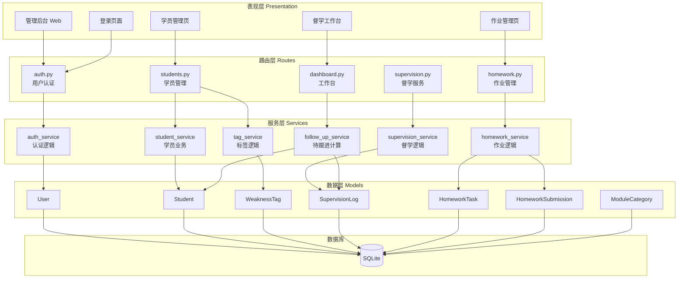
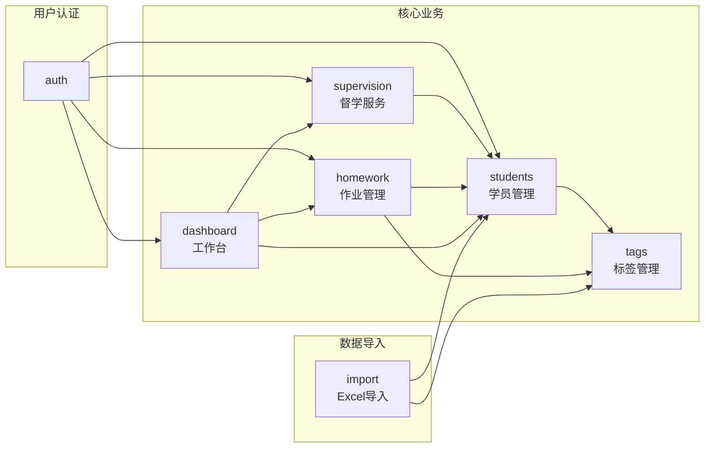
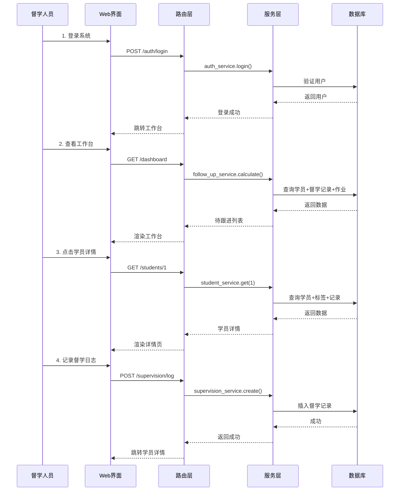
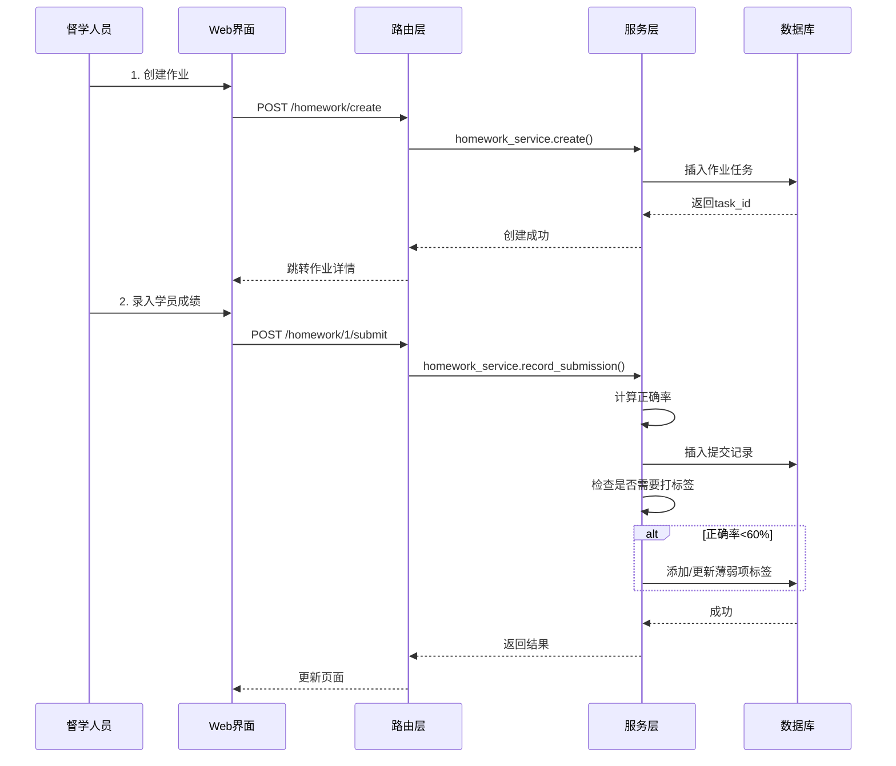

# 架构设计文档 - 公考培训机构管理系统

## 文档信息
- **创建日期**：2026-01-27
- **文档版本**：v1.0
- **任务阶段**：Architect（架构阶段）
- **依赖文档**：CONSENSUS_公考培训管理系统.md

---

## 1. 整体架构图



---

## 2. 分层设计

### 2.1 表现层（Templates）

| 模板目录 | 页面 | 功能 |
|---------|------|------|
| `templates/auth/` | login.html | 用户登录页 |
| `templates/dashboard/` | index.html | 督学工作台首页 |
| `templates/students/` | list.html | 学员列表 |
| `templates/students/` | detail.html | 学员详情（含标签） |
| `templates/students/` | form.html | 新增/编辑学员 |
| `templates/supervision/` | log_form.html | 督学日志记录 |
| `templates/supervision/` | history.html | 督学历史 |
| `templates/homework/` | list.html | 作业列表 |
| `templates/homework/` | create.html | 创建作业 |
| `templates/homework/` | detail.html | 作业详情+录入 |

### 2.2 路由层（Routes）

| 路由文件 | URL前缀 | 职责 |
|---------|--------|------|
| auth.py | /auth | 登录、注销、权限验证 |
| dashboard.py | /dashboard | 工作台首页、待跟进列表 |
| students.py | /students | 学员CRUD、搜索、标签管理 |
| supervision.py | /supervision | 督学日志记录、历史查询 |
| homework.py | /homework | 作业发布、录入成绩 |

### 2.3 服务层（Services）

| 服务文件 | 职责 |
|---------|------|
| auth_service.py | 用户认证、密码验证、权限检查 |
| student_service.py | 学员增删改查、搜索筛选 |
| tag_service.py | 薄弱项标签管理、自动标记 |
| supervision_service.py | 督学日志记录、历史查询 |
| homework_service.py | 作业发布、成绩录入、统计 |
| follow_up_service.py | 计算待跟进学员列表 |

### 2.4 数据层（Models）

| 模型文件 | 表名 | 核心关系 |
|---------|------|---------|
| user.py | users | 1:N → students (supervisor) |
| student.py | students | 1:N → weakness_tags, supervision_logs |
| tag.py | weakness_tags | N:1 → students |
| supervision.py | supervision_logs | N:1 → students, users |
| homework.py | homework_tasks, homework_submissions | 1:N关系 |
| category.py | module_categories | 独立表 |

---

## 3. 核心组件设计

### 3.1 用户认证组件

```
┌─────────────────────────────────────────────┐
│              Flask-Login 认证               │
├─────────────────────────────────────────────┤
│  LoginManager                               │
│  ├── user_loader: 从数据库加载用户          │
│  ├── login_required: 装饰器保护路由         │
│  └── current_user: 当前登录用户             │
├─────────────────────────────────────────────┤
│  User模型                                   │
│  ├── UserMixin: 提供认证方法               │
│  ├── check_password(): 验证密码            │
│  └── is_admin(): 检查管理员权限            │
├─────────────────────────────────────────────┤
│  密码安全                                   │
│  ├── werkzeug.security.generate_password_hash │
│  └── werkzeug.security.check_password_hash   │
└─────────────────────────────────────────────┘
```

### 3.2 学员管理组件

```
┌─────────────────────────────────────────────┐
│              学员管理组件                    │
├─────────────────────────────────────────────┤
│  StudentService                             │
│  ├── create_student(data)                  │
│  ├── update_student(id, data)              │
│  ├── delete_student(id)  # 软删除          │
│  ├── get_student(id)                       │
│  ├── search_students(filters)              │
│  └── get_students_by_supervisor(user_id)   │
├─────────────────────────────────────────────┤
│  TagService                                 │
│  ├── add_tag(student_id, module, level)    │
│  ├── update_tag(tag_id, data)              │
│  ├── delete_tag(tag_id)                    │
│  ├── get_tags_by_student(student_id)       │
│  └── auto_tag_from_homework(student_id, module, rate) │
└─────────────────────────────────────────────┘
```

### 3.3 督学服务组件

```
┌─────────────────────────────────────────────┐
│              督学服务组件                    │
├─────────────────────────────────────────────┤
│  SupervisionService                         │
│  ├── create_log(data)                      │
│  ├── get_logs_by_student(student_id)       │
│  ├── get_logs_by_date(date)                │
│  └── get_recent_logs(supervisor_id, days)  │
├─────────────────────────────────────────────┤
│  FollowUpService                            │
│  ├── calculate_follow_up_list(supervisor_id) │
│  ├── get_priority_level(student)           │
│  ├── mark_followed(student_id)             │
│  └── get_risk_students()                   │
├─────────────────────────────────────────────┤
│  待跟进计算规则                             │
│  ├── 昨日作业未完成 → 高优先级              │
│  ├── 连续3天正确率<60% → 中优先级          │
│  ├── 超过7天未跟进 → 中优先级              │
│  └── 手动标记重点关注 → 高优先级            │
└─────────────────────────────────────────────┘
```

### 3.4 作业管理组件

```
┌─────────────────────────────────────────────┐
│              作业管理组件                    │
├─────────────────────────────────────────────┤
│  HomeworkService                            │
│  ├── create_task(data)                     │
│  ├── get_task(task_id)                     │
│  ├── get_tasks_by_status(status)           │
│  ├── close_task(task_id)                   │
│  ├── record_submission(task_id, student_id, data) │
│  ├── get_submissions_by_task(task_id)      │
│  ├── get_submissions_by_student(student_id)│
│  └── calculate_statistics(task_id)         │
└─────────────────────────────────────────────┘
```

---

## 4. 模块依赖关系图



**依赖说明**：
- 所有业务模块依赖 `auth` 进行权限验证
- `tags` 依赖 `students`（标签属于学员）
- `supervision` 依赖 `students`（督学记录关联学员）
- `homework` 依赖 `students` 和 `tags`（作业→学员→标签）
- `dashboard` 聚合多个模块数据
- `import` 初始化时导入数据

---

## 5. 接口契约定义

### 5.1 认证接口

| 接口 | 方法 | URL | 请求 | 响应 |
|------|------|-----|------|------|
| 登录页面 | GET | /auth/login | - | HTML |
| 执行登录 | POST | /auth/login | username, password | redirect |
| 注销 | GET | /auth/logout | - | redirect to login |

### 5.2 学员管理接口

| 接口 | 方法 | URL | 请求 | 响应 |
|------|------|-----|------|------|
| 学员列表 | GET | /students | ?search=&class_name=&page= | HTML |
| 学员详情 | GET | /students/<id> | - | HTML |
| 新增表单 | GET | /students/create | - | HTML |
| 创建学员 | POST | /students/create | form data | redirect |
| 编辑表单 | GET | /students/<id>/edit | - | HTML |
| 更新学员 | POST | /students/<id>/edit | form data | redirect |
| 删除学员 | POST | /students/<id>/delete | - | redirect |
| 添加标签 | POST | /students/<id>/tags | module, sub_module, level | JSON |
| 删除标签 | POST | /students/<id>/tags/<tag_id>/delete | - | JSON |

### 5.3 督学服务接口

| 接口 | 方法 | URL | 请求 | 响应 |
|------|------|-----|------|------|
| 记录表单 | GET | /supervision/log?student_id= | - | HTML |
| 创建记录 | POST | /supervision/log | form data | redirect |
| 学员督学历史 | GET | /supervision/history/<student_id> | - | HTML |
| 标记已跟进 | POST | /supervision/mark-followed/<student_id> | - | JSON |

### 5.4 作业管理接口

| 接口 | 方法 | URL | 请求 | 响应 |
|------|------|-----|------|------|
| 作业列表 | GET | /homework | ?status= | HTML |
| 创建表单 | GET | /homework/create | - | HTML |
| 创建作业 | POST | /homework/create | form data | redirect |
| 作业详情 | GET | /homework/<id> | - | HTML |
| 录入成绩 | POST | /homework/<id>/submit | student_id, correct, total, time | JSON |
| 关闭作业 | POST | /homework/<id>/close | - | redirect |

### 5.5 工作台接口

| 接口 | 方法 | URL | 请求 | 响应 |
|------|------|-----|------|------|
| 工作台首页 | GET | /dashboard | - | HTML |
| 待跟进列表 | GET | /dashboard/follow-up | - | HTML |

---

## 6. 数据流向图

### 6.1 督学日常工作流



### 6.2 作业录入流程



---

## 7. 异常处理策略

### 7.1 全局异常处理

```python
# 在 app/__init__.py 中配置

@app.errorhandler(404)
def not_found(error):
    return render_template('errors/404.html'), 404

@app.errorhandler(500)
def internal_error(error):
    db.session.rollback()  # 回滚数据库事务
    return render_template('errors/500.html'), 500

@app.errorhandler(403)
def forbidden(error):
    return render_template('errors/403.html'), 403
```

### 7.2 业务异常处理

| 异常类型 | 处理方式 | 用户提示 |
|---------|---------|---------|
| 学员不存在 | 跳转列表页 | "学员不存在或已删除" |
| 权限不足 | 返回403 | "您没有权限执行此操作" |
| 数据验证失败 | 返回表单 | 显示具体错误信息 |
| 数据库错误 | 记录日志+回滚 | "系统繁忙，请稍后重试" |

### 7.3 数据验证

| 字段 | 验证规则 |
|------|---------|
| 用户名 | 必填，2-50字符，唯一 |
| 密码 | 必填，6-50字符 |
| 学员姓名 | 必填，2-50字符 |
| 手机号 | 可选，11位数字 |
| 正确率 | 0-100之间 |
| 日期 | 有效日期格式 |

---

## 8. 静态资源组织

```
static/
├── css/
│   ├── bootstrap.min.css      # Bootstrap 5
│   ├── style.css              # 自定义样式
│   └── dashboard.css          # 工作台样式
├── js/
│   ├── jquery.min.js          # jQuery 3.7
│   ├── bootstrap.bundle.min.js # Bootstrap JS
│   ├── chart.min.js           # Chart.js（预留）
│   ├── common.js              # 公共函数
│   ├── students.js            # 学员管理JS
│   └── homework.js            # 作业管理JS
└── images/
    ├── logo.png               # 系统Logo
    └── avatar-default.png     # 默认头像
```

---

## 9. 配置管理

### 9.1 配置文件结构

```python
# config.py

import os
from datetime import timedelta

class Config:
    """基础配置"""
    SECRET_KEY = os.environ.get('SECRET_KEY') or 'dev-secret-key-change-in-production'
    SQLALCHEMY_TRACK_MODIFICATIONS = False
    
    # Flask-Login配置
    REMEMBER_COOKIE_DURATION = timedelta(days=7)
    
    # 分页配置
    STUDENTS_PER_PAGE = 20
    LOGS_PER_PAGE = 10
    
    # 常用短语（督学日志）
    COMMON_PHRASES = [
        "今天情绪不错，学习积极",
        "作业完成良好，正确率有提升",
        "数量关系仍然薄弱，需要加强",
        "需要多鼓励，增强自信心",
        "学习态度认真，继续保持",
    ]

class DevelopmentConfig(Config):
    """开发环境配置"""
    DEBUG = True
    SQLALCHEMY_DATABASE_URI = 'sqlite:///dev.db'

class ProductionConfig(Config):
    """生产环境配置"""
    DEBUG = False
    SQLALCHEMY_DATABASE_URI = os.environ.get('DATABASE_URL') or 'sqlite:///prod.db'

config = {
    'development': DevelopmentConfig,
    'production': ProductionConfig,
    'default': DevelopmentConfig
}
```

### 9.2 环境变量（.env）

```bash
# .env 文件（不提交Git）
SECRET_KEY=your-secret-key-here
FLASK_ENV=development
```

---

## 10. 设计决策记录

| 决策 | 选择 | 理由 |
|------|------|------|
| 用户认证 | Flask-Login | 成熟稳定，文档丰富 |
| 密码加密 | Werkzeug | Flask内置，无需额外依赖 |
| 前端框架 | Bootstrap 5 | 快速开发，响应式设计 |
| 数据库 | SQLite | 简单部署，足够30人规模 |
| 模板渲染 | Jinja2 | Flask默认，服务端渲染 |
| 分页 | 手动实现 | 简单场景，不引入额外库 |
| AJAX | jQuery | 轻量级，学习成本低 |

---

## 11. 质量门控检查

### 11.1 架构检查

- [x] 架构图清晰，分层明确
- [x] 模块职责单一，边界清晰
- [x] 依赖关系无循环
- [x] 接口定义完整

### 11.2 可行性验证

- [x] Flask-Login已验证可用
- [x] SQLite满足数据规模
- [x] Bootstrap满足UI需求
- [x] 无需外部API依赖

### 11.3 与需求对齐

- [x] 覆盖所有第一期功能
- [x] 不包含第二期功能
- [x] 数据模型支持Excel导入

---

## 12. 下一步

### 12.1 即将进入
**阶段3: Atomize（原子化阶段）**
- 拆分开发任务
- 定义任务输入/输出契约
- 建立任务依赖关系
- 评估任务复杂度

### 12.2 预计任务清单（预览）
1. 项目初始化与配置
2. 数据库模型创建
3. 用户认证模块
4. 学员管理模块
5. 标签管理模块
6. 督学服务模块
7. 作业管理模块
8. 工作台模块
9. Excel数据导入
10. 测试与调试

---

*文档状态：架构设计完成 ✅*
