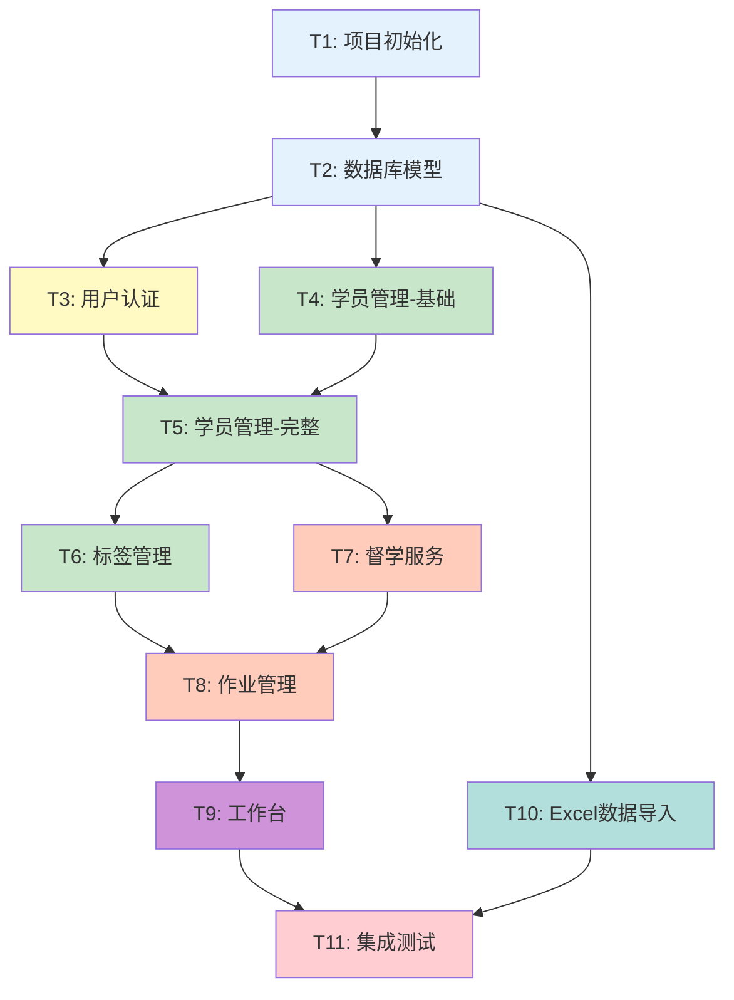

# 任务拆分文档 - 公考培训机构管理系统

## 文档信息
- **创建日期**：2026-01-27
- **文档版本**：v1.0
- **任务阶段**：Atomize（原子化阶段）
- **依赖文档**：DESIGN_公考培训管理系统.md

---

## 1. 任务依赖图



**图例**：
- 🔵 蓝色：基础设施
- 🟡 黄色：认证模块
- 🟢 绿色：学员模块
- 🟠 橙色：业务模块
- 🟣 紫色：工作台
- 🔴 红色：测试

---

## 2. 任务总览

| 任务ID | 任务名称 | 预计时间 | 复杂度 | 前置依赖 |
|--------|---------|---------|--------|---------|
| T1 | 项目初始化与配置 | 1小时 | ⭐ | 无 |
| T2 | 数据库模型创建 | 2小时 | ⭐⭐ | T1 |
| T3 | 用户认证模块 | 2小时 | ⭐⭐ | T2 |
| T4 | 学员管理-基础CRUD | 2小时 | ⭐⭐ | T2 |
| T5 | 学员管理-完整功能 | 2小时 | ⭐⭐ | T3, T4 |
| T6 | 标签管理模块 | 1.5小时 | ⭐⭐ | T5 |
| T7 | 督学服务模块 | 2小时 | ⭐⭐ | T5 |
| T8 | 作业管理模块 | 2.5小时 | ⭐⭐⭐ | T6, T7 |
| T9 | 工作台模块 | 2小时 | ⭐⭐⭐ | T8 |
| T10 | Excel数据导入 | 1.5小时 | ⭐⭐ | T2 |
| T11 | 集成测试与调试 | 2小时 | ⭐⭐ | T9, T10 |

**总计预估**：约 20 小时

---

## 3. 任务详细定义

---

### T1: 项目初始化与配置

#### 输入契约
| 项目 | 内容 |
|------|------|
| 前置依赖 | 无 |
| 环境依赖 | Python 3.9+, pip |
| 输入数据 | 无 |

#### 输出契约
| 项目 | 内容 |
|------|------|
| 交付物 | 完整的项目目录结构 |
| 输出文件 | requirements.txt, config.py, run.py, app/__init__.py |

#### 验收标准
- [ ] 项目目录结构创建完成
- [ ] requirements.txt 包含所有依赖
- [ ] `python run.py` 可启动Flask应用
- [ ] 访问 http://localhost:5000 显示欢迎页面

#### 实现约束
```
技术栈：Flask 2.3+, SQLAlchemy 3.0+
目录结构：
gongkao-system/
├── app/
│   ├── __init__.py
│   ├── models/
│   ├── routes/
│   ├── services/
│   ├── static/
│   └── templates/
├── data/
├── config.py
├── requirements.txt
└── run.py
```

#### 依赖关系
- 后置任务：T2, T3, T4, T10
- 可并行：无

---

### T2: 数据库模型创建

#### 输入契约
| 项目 | 内容 |
|------|------|
| 前置依赖 | T1 完成 |
| 环境依赖 | Flask-SQLAlchemy 已安装 |
| 输入数据 | DESIGN文档中的数据库设计 |

#### 输出契约
| 项目 | 内容 |
|------|------|
| 交付物 | 所有数据模型文件 |
| 输出文件 | app/models/*.py (7个模型文件) |

#### 验收标准
- [ ] User 模型创建完成
- [ ] Student 模型创建完成
- [ ] WeaknessTag 模型创建完成
- [ ] SupervisionLog 模型创建完成
- [ ] HomeworkTask 模型创建完成
- [ ] HomeworkSubmission 模型创建完成
- [ ] ModuleCategory 模型创建完成
- [ ] 数据库表可成功创建（db.create_all()）
- [ ] 模型关系正确（外键、反向引用）

#### 实现约束
```python
# 必须包含的字段类型
- 主键：INTEGER PRIMARY KEY
- 时间戳：created_at, updated_at（自动填充）
- 外键：正确定义relationship
- 软删除：status字段
```

#### 依赖关系
- 后置任务：T3, T4, T10
- 可并行：无

---

### T3: 用户认证模块

#### 输入契约
| 项目 | 内容 |
|------|------|
| 前置依赖 | T2 完成（User模型） |
| 环境依赖 | Flask-Login 已安装 |
| 输入数据 | User模型 |

#### 输出契约
| 项目 | 内容 |
|------|------|
| 交付物 | 完整的用户认证功能 |
| 输出文件 | app/routes/auth.py, templates/auth/login.html |

#### 验收标准
- [ ] 登录页面可访问 (/auth/login)
- [ ] 用户名+密码登录成功后跳转工作台
- [ ] 登录失败显示错误提示
- [ ] 注销功能正常 (/auth/logout)
- [ ] 未登录用户访问受保护页面自动跳转登录
- [ ] 密码使用werkzeug加密存储
- [ ] 创建初始管理员账号（admin/admin123）

#### 实现约束
```python
# 使用Flask-Login
from flask_login import LoginManager, login_user, logout_user, login_required, current_user

# 密码加密
from werkzeug.security import generate_password_hash, check_password_hash
```

#### 依赖关系
- 后置任务：T5
- 可并行：T4

---

### T4: 学员管理-基础CRUD

#### 输入契约
| 项目 | 内容 |
|------|------|
| 前置依赖 | T2 完成（Student模型） |
| 环境依赖 | 无 |
| 输入数据 | Student模型 |

#### 输出契约
| 项目 | 内容 |
|------|------|
| 交付物 | 学员基础增删改查功能 |
| 输出文件 | app/routes/students.py, app/services/student_service.py, templates/students/*.html |

#### 验收标准
- [ ] 学员列表页面可访问 (/students)
- [ ] 可添加新学员
- [ ] 可查看学员详情
- [ ] 可编辑学员信息
- [ ] 可删除学员（软删除）
- [ ] 表单验证正常（姓名必填）

#### 实现约束
```
页面：
- list.html：学员列表（表格）
- detail.html：学员详情
- form.html：新增/编辑表单

路由：
- GET /students - 列表
- GET /students/create - 新增表单
- POST /students/create - 创建
- GET /students/<id> - 详情
- GET /students/<id>/edit - 编辑表单
- POST /students/<id>/edit - 更新
- POST /students/<id>/delete - 删除
```

#### 依赖关系
- 后置任务：T5
- 可并行：T3

---

### T5: 学员管理-完整功能

#### 输入契约
| 项目 | 内容 |
|------|------|
| 前置依赖 | T3, T4 完成 |
| 环境依赖 | 无 |
| 输入数据 | 用户认证 + 学员基础功能 |

#### 输出契约
| 项目 | 内容 |
|------|------|
| 交付物 | 完整的学员管理功能（含搜索、权限） |
| 输出文件 | 更新 students.py, student_service.py |

#### 验收标准
- [ ] 学员列表需登录才能访问
- [ ] 支持按姓名搜索
- [ ] 支持按班次筛选（全程班/暑假班）
- [ ] 支持按报考类型筛选
- [ ] 分页功能正常（每页20条）
- [ ] 督学人员只能看到自己负责的学员
- [ ] 管理员可以看到所有学员

#### 实现约束
```python
# 搜索参数
?search=张三&class_name=全程班&exam_type=国省考&page=1

# 权限控制
@login_required
def student_list():
    if current_user.role == 'admin':
        students = Student.query.all()
    else:
        students = Student.query.filter_by(supervisor_id=current_user.id).all()
```

#### 依赖关系
- 后置任务：T6, T7
- 可并行：无

---

### T6: 标签管理模块

#### 输入契约
| 项目 | 内容 |
|------|------|
| 前置依赖 | T5 完成 |
| 环境依赖 | 无 |
| 输入数据 | Student模型, WeaknessTag模型 |

#### 输出契约
| 项目 | 内容 |
|------|------|
| 交付物 | 薄弱项标签管理功能 |
| 输出文件 | app/services/tag_service.py, 更新 detail.html |

#### 验收标准
- [ ] 学员详情页显示薄弱项标签
- [ ] 可手动添加标签（选择模块+等级）
- [ ] 可删除标签
- [ ] 标签按颜色显示（红/黄/绿）
- [ ] 标签显示正确率和练习次数

#### 实现约束
```python
# 标签等级
- red: 正确率 < 50%（急需攻克）
- yellow: 50% <= 正确率 < 70%（需加强）
- green: 正确率 >= 70%（掌握良好）

# 模块选项（从Excel题型分类导入）
- 常识判断：科技、法律、时事、地理、人文、经济
- 言语理解：篇章阅读、语句表达、逻辑填空、片段阅读
- 数量关系：行程问题、经济利润、比赛计数、几何问题
- 判断推理：图形推理、定义判断、类比推理、逻辑判断
- 资料分析：增长率、比重、平均数
```

#### 依赖关系
- 后置任务：T8
- 可并行：T7

---

### T7: 督学服务模块

#### 输入契约
| 项目 | 内容 |
|------|------|
| 前置依赖 | T5 完成 |
| 环境依赖 | 无 |
| 输入数据 | Student模型, SupervisionLog模型 |

#### 输出契约
| 项目 | 内容 |
|------|------|
| 交付物 | 督学日志记录功能 |
| 输出文件 | app/routes/supervision.py, app/services/supervision_service.py, templates/supervision/*.html |

#### 验收标准
- [ ] 可从学员详情页进入督学记录
- [ ] 督学日志表单包含所有字段（沟通方式、时长、内容、心态评估等）
- [ ] 常用短语可快速插入
- [ ] 保存后自动跳转学员详情
- [ ] 学员详情页显示督学历史记录
- [ ] 可设置下次跟进时间

#### 实现约束
```python
# 常用短语配置
COMMON_PHRASES = [
    "今天情绪不错，学习积极",
    "作业完成良好，正确率有提升",
    "数量关系仍然薄弱，需要加强",
    "需要多鼓励，增强自信心",
    "学习态度认真，继续保持",
]

# 心态选项
MOOD_OPTIONS = ['积极', '平稳', '焦虑', '低落']

# 学习状态选项
STATUS_OPTIONS = ['优秀', '良好', '一般', '较差']
```

#### 依赖关系
- 后置任务：T8
- 可并行：T6

---

### T8: 作业管理模块

#### 输入契约
| 项目 | 内容 |
|------|------|
| 前置依赖 | T6, T7 完成 |
| 环境依赖 | 无 |
| 输入数据 | HomeworkTask, HomeworkSubmission, WeaknessTag模型 |

#### 输出契约
| 项目 | 内容 |
|------|------|
| 交付物 | 作业发布和成绩录入功能 |
| 输出文件 | app/routes/homework.py, app/services/homework_service.py, templates/homework/*.html |

#### 验收标准
- [ ] 作业列表页可访问 (/homework)
- [ ] 可创建新作业（名称、模块、题量、截止时间、目标学员）
- [ ] 作业详情页显示完成情况
- [ ] 督学人员可录入学员成绩（正确数/总数/用时）
- [ ] 系统自动计算正确率
- [ ] 正确率<60%时自动添加薄弱项标签
- [ ] 可关闭作业

#### 实现约束
```python
# 作业状态
- published: 已发布
- closed: 已关闭

# 自动打标签逻辑
def record_submission(task_id, student_id, correct, total, time_spent):
    rate = correct / total * 100
    # 保存提交记录
    submission = HomeworkSubmission(...)
    
    # 自动打标签
    if rate < 60:
        tag_service.auto_tag(student_id, task.module, rate)
```

#### 依赖关系
- 后置任务：T9
- 可并行：无

---

### T9: 工作台模块

#### 输入契约
| 项目 | 内容 |
|------|------|
| 前置依赖 | T8 完成 |
| 环境依赖 | 无 |
| 输入数据 | 所有模型 |

#### 输出契约
| 项目 | 内容 |
|------|------|
| 交付物 | 督学工作台首页 |
| 输出文件 | app/routes/dashboard.py, app/services/follow_up_service.py, templates/dashboard/*.html |

#### 验收标准
- [ ] 工作台为登录后默认首页
- [ ] 显示待跟进学员列表（按优先级排序）
- [ ] 显示今日作业完成情况统计
- [ ] 待跟进学员可一键进入详情
- [ ] 可标记学员为"已跟进"
- [ ] 显示风险预警（连续未完成作业的学员）

#### 实现约束
```python
# 待跟进计算规则
def calculate_follow_up_list(supervisor_id):
    students = []
    
    # 规则1: 昨日作业未完成
    # 规则2: 连续3天正确率<60%
    # 规则3: 超过7天未跟进
    # 规则4: 手动标记重点关注
    
    # 按优先级排序
    return sorted(students, key=lambda x: x['priority'], reverse=True)
```

#### 依赖关系
- 后置任务：T11
- 可并行：无

---

### T10: Excel数据导入

#### 输入契约
| 项目 | 内容 |
|------|------|
| 前置依赖 | T2 完成 |
| 环境依赖 | pandas, openpyxl 已安装 |
| 输入数据 | 泗洪校区.xlsx |

#### 输出契约
| 项目 | 内容 |
|------|------|
| 交付物 | 数据导入脚本 |
| 输出文件 | data/import_excel.py |

#### 验收标准
- [ ] 导入26个学员数据（学员档案管理sheet）
- [ ] 导入4个教师数据（教师管理sheet）
- [ ] 导入题型分类（作为模块选项）
- [ ] 导入历史刷题记录（可选）
- [ ] 数据验证（跳过空行，处理缺失值）
- [ ] 导入日志输出

#### 实现约束
```python
# 字段映射
STUDENT_MAPPING = {
    '姓名': 'name',
    '联系方式': 'phone',
    '入学时间': 'enrollment_date',
    '课程类别': 'exam_type',
    '课程名称': 'class_name',
    '是否有基础': 'has_basic',
    '是否为协议班': 'is_agreement',
    '家长联系方式': 'parent_phone',
    '家庭住址': 'address',
    '身份证号': 'id_number',
}

# 数据清洗
- 电话号码转字符串
- 日期格式统一
- 空值处理
```

#### 依赖关系
- 后置任务：T11
- 可并行：T3-T9

---

### T11: 集成测试与调试

#### 输入契约
| 项目 | 内容 |
|------|------|
| 前置依赖 | T9, T10 完成 |
| 环境依赖 | 完整系统 |
| 输入数据 | 导入的测试数据 |

#### 输出契约
| 项目 | 内容 |
|------|------|
| 交付物 | 测试通过的完整系统 |
| 输出文件 | 修复的bug |

#### 验收标准
- [ ] 完整业务流程测试通过
- [ ] 登录→工作台→学员管理→督学记录→作业管理 流程顺畅
- [ ] 26个学员数据显示正确
- [ ] 搜索、筛选功能正常
- [ ] 无明显UI问题
- [ ] 无控制台错误

#### 测试用例
```
1. 登录测试
   - 正确账号密码登录成功
   - 错误密码登录失败
   - 未登录访问受保护页面跳转登录

2. 学员管理测试
   - 列表显示26个学员
   - 搜索"高赫"返回正确结果
   - 筛选"全程班"返回正确结果
   - 新增学员成功
   - 编辑学员成功

3. 督学服务测试
   - 记录督学日志成功
   - 督学历史显示正确

4. 作业管理测试
   - 创建作业成功
   - 录入成绩成功
   - 自动计算正确率
   - 正确率<60%自动打标签

5. 工作台测试
   - 待跟进列表显示正确
   - 标记已跟进后从列表移除
```

#### 依赖关系
- 后置任务：无（项目完成）
- 可并行：无

---

## 4. 执行顺序建议

### 4.1 串行执行路径（推荐）

```
T1 → T2 → T3 → T4 → T5 → T6 → T7 → T8 → T9 → T10 → T11
                          ↘   ↗
                           并行
```

### 4.2 优化执行路径（可并行）

```
阶段1: T1（项目初始化）
        ↓
阶段2: T2（数据库模型）
        ↓
阶段3: T3（用户认证）‖ T4（学员基础）‖ T10（数据导入脚本）
        ↓
阶段4: T5（学员完整）
        ↓
阶段5: T6（标签）‖ T7（督学）
        ↓
阶段6: T8（作业）
        ↓
阶段7: T9（工作台）
        ↓
阶段8: T11（测试）
```

---

## 5. 风险评估

| 任务 | 风险点 | 应对措施 |
|------|-------|---------|
| T2 | 模型关系复杂 | 参考DESIGN文档，逐个创建 |
| T5 | 权限控制逻辑 | 使用current_user简化判断 |
| T8 | 自动打标签逻辑 | 先实现基础，再优化 |
| T9 | 待跟进计算复杂 | 简化规则，分步实现 |
| T10 | Excel数据格式不规范 | 添加数据清洗和验证 |

---

## 6. 质量门控

### 6.1 任务覆盖检查
- [x] 用户认证 → T3
- [x] 学员管理 → T4, T5
- [x] 标签管理 → T6
- [x] 督学服务 → T7
- [x] 作业管理 → T8
- [x] 工作台 → T9
- [x] 数据导入 → T10

### 6.2 依赖关系检查
- [x] 无循环依赖
- [x] 关键路径明确
- [x] 可并行任务已标识

### 6.3 验收标准检查
- [x] 每个任务都有明确的验收标准
- [x] 验收标准可测试

---

## 7. 下一步

### 7.1 即将进入
**阶段4: Approve（审批阶段）**
- 执行检查清单
- 确认任务计划完整性
- 最终确认后进入开发

### 7.2 审批检查项
- [ ] 任务计划覆盖所有需求
- [ ] 与前期文档保持一致
- [ ] 技术方案确实可行
- [ ] 风险在可接受范围
- [ ] 验收标准明确可执行

---

*文档状态：任务拆分完成 ✅*
