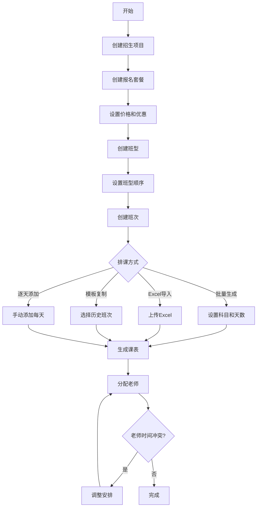
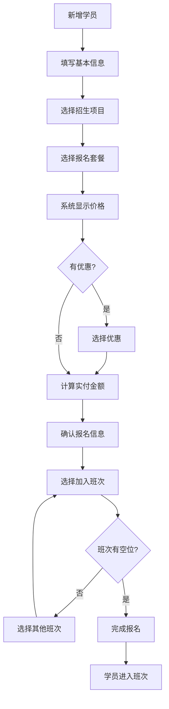
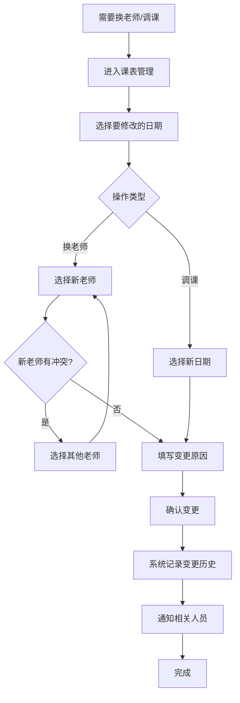
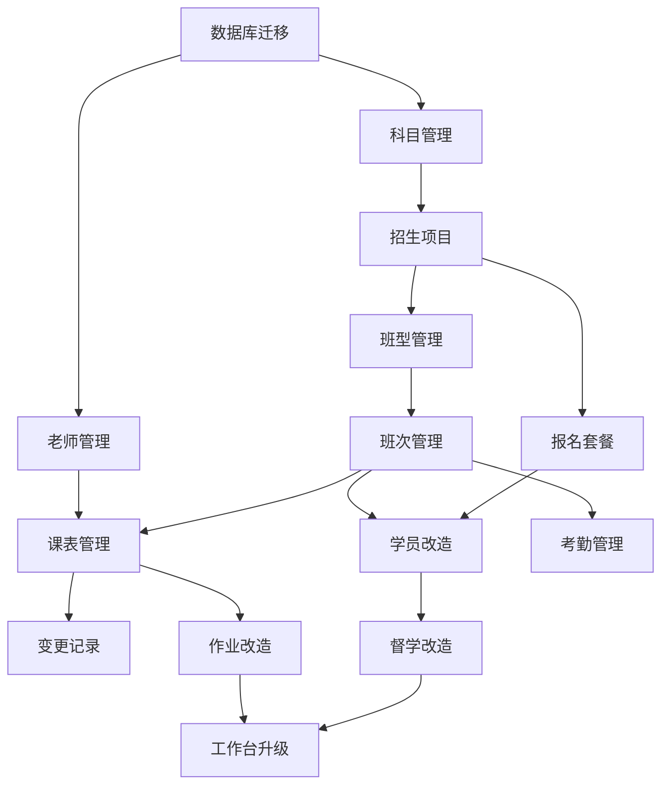

# 公考培训管理系统 - 第二阶段需求规格文档

## 文档信息

| 项目 | 内容 |
|------|------|
| **文档名称** | 第二阶段 - 课程管理模块需求规格文档 |
| **版本** | v1.0 |
| **创建日期** | 2026-01-27 |
| **编写人** | AI Assistant |
| **审核人** | - |
| **状态** | 待确认 |

---

## 目录

1. [项目概述](#1-项目概述)
2. [第一阶段回顾](#2-第一阶段回顾)
3. [第二阶段目标](#3-第二阶段目标)
4. [功能需求详细规格](#4-功能需求详细规格)
5. [现有模块改造规格](#5-现有模块改造规格)
6. [数据库设计](#6-数据库设计)
7. [界面设计规格](#7-界面设计规格)
8. [业务流程图](#8-业务流程图)
9. [开发计划](#9-开发计划)
10. [验收标准](#10-验收标准)

---

## 1. 项目概述

### 1.1 项目背景

公考培训管理系统第一阶段已完成以下核心功能：
- 用户认证系统
- 学员档案管理
- 督学日志记录
- 作业发布与跟踪
- 督学工作台

第二阶段将在此基础上，新增**课程管理**模块，并与现有模块深度整合，形成完整的培训机构管理系统。

### 1.2 核心理念

> **这是一个整体系统，不是独立模块的拼凑。**

第二阶段的开发遵循以下原则：
1. **渐进式整合**：新功能与现有功能无缝衔接
2. **数据互通**：学员、课程、督学数据相互关联
3. **体验一致**：UI风格、操作逻辑保持统一
4. **向后兼容**：不破坏现有功能和数据

### 1.3 业务场景概述

```
培训机构核心业务流程：

招生 → 学员报名 → 分配班次 → 上课学习 → 督学跟进 → 作业练习 → 考试上岸

      ↑                ↑           ↑          ↑           ↑
   课程体系         班次管理      课表排课     督学管理     作业管理
   (第二阶段)       (第二阶段)    (第二阶段)   (第一阶段)   (第一阶段)
```

---

## 2. 第一阶段回顾

### 2.1 已完成功能

| 模块 | 功能 | 状态 |
|------|------|------|
| **用户认证** | 登录、登出、权限控制 | ✅ 已完成 |
| **学员管理** | 学员CRUD、搜索筛选、标签管理、关注状态 | ✅ 已完成 |
| **督学管理** | 督学日志记录、历史查询、筛选 | ✅ 已完成 |
| **作业管理** | 作业发布、成绩录入、统计 | ✅ 已完成 |
| **工作台** | 统计卡片、待跟进学员、快速操作 | ✅ 已完成 |

### 2.2 现有数据模型

```
现有数据表：
├── users          # 用户表（督学人员）
├── students       # 学员表
├── weakness_tags  # 薄弱项标签
├── supervision_logs  # 督学日志
├── homework_tasks    # 作业任务
└── homework_submissions  # 作业提交记录
```

### 2.3 需要改造的字段

**students 表现有字段**（需改造）：
- `class_name` (VARCHAR) - 当前是文本字段，存储"全程班"、"暑假班"等
- 需要改为关联课程体系

---

## 3. 第二阶段目标

### 3.1 核心目标

1. **建立完整的课程体系管理**
   - 招生项目、报名套餐、班型、班次的层级管理
   - 灵活的课表排课系统
   
2. **老师资源管理**
   - 老师信息管理
   - 老师排课与工作量统计
   - 调课/换老师变更记录
   
3. **学员与课程的深度关联**
   - 学员报名时选择课程套餐
   - 学员绑定具体班次
   - 课程进度追踪
   
4. **现有模块整合升级**
   - 督学日志显示课程进度
   - 作业按班次布置
   - 工作台显示课程相关信息

### 3.2 功能优先级

| 优先级 | 功能 | 阶段 |
|--------|------|------|
| 🔴 P0 | 科目管理 | 第二阶段-核心 |
| 🔴 P0 | 招生项目管理 | 第二阶段-核心 |
| 🔴 P0 | 报名套餐管理 | 第二阶段-核心 |
| 🔴 P0 | 班型管理 | 第二阶段-核心 |
| 🔴 P0 | 班次管理 | 第二阶段-核心 |
| 🔴 P0 | 课表管理 | 第二阶段-核心 |
| 🔴 P0 | 老师管理 | 第二阶段-核心 |
| 🔴 P0 | 变更记录 | 第二阶段-核心 |
| 🟡 P1 | 学员模块改造 | 第二阶段-整合 |
| 🟡 P1 | 督学模块改造 | 第二阶段-整合 |
| 🟡 P1 | 作业模块改造 | 第二阶段-整合 |
| 🟡 P1 | 考勤管理 | 第二阶段-扩展 |
| 🟢 P2 | 工作台升级 | 第二阶段-优化 |

### 3.3 不包含的功能（第三阶段）

- 财务管理（收款、账单、统计）
- 数据看板（高级报表）
- 微信小程序
- 打卡机集成

---

## 4. 功能需求详细规格

### 4.1 科目管理

#### 4.1.1 功能描述

管理考试科目，支持预设科目和自定义科目。

#### 4.1.2 科目体系

```
考试类型
├── 国省考（行测+申论）
│   ├── 言语理解与表达
│   ├── 判断推理
│   ├── 数资（数量关系+资料分析）
│   ├── 常识判断
│   └── 申论
│
└── 事业编（灵活配置）
    ├── 公共基础知识
    ├── 职业能力测验
    ├── 专业知识
    └── ...（自定义）
```

#### 4.1.3 数据字段

| 字段 | 类型 | 必填 | 说明 |
|------|------|------|------|
| id | INT | 是 | 主键 |
| name | VARCHAR(50) | 是 | 科目名称 |
| short_name | VARCHAR(20) | 否 | 简称（如：数资） |
| exam_type | VARCHAR(20) | 是 | 考试类型（国省考/事业编/通用） |
| is_preset | BOOLEAN | 是 | 是否预设科目 |
| sort_order | INT | 否 | 排序 |
| status | VARCHAR(10) | 是 | 状态（启用/停用） |
| created_at | DATETIME | 是 | 创建时间 |

#### 4.1.4 功能列表

| 功能 | 说明 |
|------|------|
| 查看科目列表 | 按考试类型分组显示 |
| 添加自定义科目 | 支持用户新增科目 |
| 编辑科目 | 修改名称、简称、排序 |
| 启用/停用科目 | 停用后不可选择 |
| 预设科目保护 | 预设科目不可删除 |

---

### 4.2 招生项目管理

#### 4.2.1 功能描述

管理培训机构的招生项目，如"2026国省考系统班"、"2026暑期集训营"等。

#### 4.2.2 数据字段

| 字段 | 类型 | 必填 | 说明 |
|------|------|------|------|
| id | INT | 是 | 主键 |
| name | VARCHAR(100) | 是 | 项目名称 |
| exam_type | VARCHAR(20) | 是 | 考试类型（国省考/事业编） |
| year | INT | 是 | 招生年份 |
| start_date | DATE | 否 | 项目开始日期 |
| end_date | DATE | 否 | 项目结束日期 |
| description | TEXT | 否 | 项目描述 |
| status | VARCHAR(20) | 是 | 状态（招生中/已结束/筹备中） |
| created_at | DATETIME | 是 | 创建时间 |
| updated_at | DATETIME | 是 | 更新时间 |

#### 4.2.3 功能列表

| 功能 | 说明 |
|------|------|
| 项目列表 | 显示所有招生项目，支持筛选 |
| 创建项目 | 新建招生项目 |
| 编辑项目 | 修改项目信息 |
| 项目详情 | 查看项目下的套餐、班型、统计 |
| 结束项目 | 标记项目已结束 |

---

### 4.3 报名套餐管理

#### 4.3.1 功能描述

管理报名套餐，如"全程班"、"暑假班"、"单班型"等，包含价格和优惠规则。

#### 4.3.2 数据字段

| 字段 | 类型 | 必填 | 说明 |
|------|------|------|------|
| id | INT | 是 | 主键 |
| project_id | INT | 是 | 所属招生项目 |
| name | VARCHAR(50) | 是 | 套餐名称 |
| package_type | VARCHAR(20) | 是 | 类型（全程班/期限班/单班型/单科目） |
| price | DECIMAL(10,2) | 是 | 原价 |
| valid_days | INT | 否 | 有效天数（全程班365天） |
| valid_start | DATE | 否 | 有效期开始（期限班） |
| valid_end | DATE | 否 | 有效期结束（期限班） |
| include_all_types | BOOLEAN | 是 | 是否包含所有班型 |
| included_type_ids | VARCHAR(200) | 否 | 包含的班型ID（逗号分隔） |
| discount_rules | TEXT | 否 | 优惠规则（JSON格式） |
| description | TEXT | 否 | 套餐说明 |
| status | VARCHAR(10) | 是 | 状态（在售/下架） |
| sort_order | INT | 否 | 排序 |
| created_at | DATETIME | 是 | 创建时间 |

#### 4.3.3 优惠规则格式

```json
{
  "group_discount": [
    {"min_people": 2, "discount": 2000, "description": "2人团报优惠2000元"},
    {"min_people": 3, "discount": 3000, "description": "3人团报优惠3000元"}
  ],
  "early_bird": {
    "end_date": "2026-02-28",
    "discount": 1000,
    "description": "早鸟优惠1000元"
  }
}
```

#### 4.3.4 功能列表

| 功能 | 说明 |
|------|------|
| 套餐列表 | 按项目显示套餐 |
| 创建套餐 | 新建报名套餐，设置价格和包含班型 |
| 编辑套餐 | 修改套餐信息 |
| 设置优惠规则 | 配置团报、早鸟等优惠 |
| 上架/下架 | 控制套餐是否可选 |

---

### 4.4 班型管理

#### 4.4.1 功能描述

管理班型，如"基础班"、"提高班"、"刷题班"、"冲刺班"等。

#### 4.4.2 数据字段

| 字段 | 类型 | 必填 | 说明 |
|------|------|------|------|
| id | INT | 是 | 主键 |
| project_id | INT | 是 | 所属招生项目 |
| name | VARCHAR(50) | 是 | 班型名称 |
| planned_days | INT | 否 | 计划天数 |
| single_price | DECIMAL(10,2) | 否 | 单独售价 |
| sort_order | INT | 是 | 顺序（基础1→提高2→刷题3→冲刺4） |
| description | TEXT | 否 | 班型说明 |
| status | VARCHAR(10) | 是 | 状态（启用/停用） |
| created_at | DATETIME | 是 | 创建时间 |

#### 4.4.3 功能列表

| 功能 | 说明 |
|------|------|
| 班型列表 | 按项目显示班型，支持拖拽排序 |
| 创建班型 | 新建班型 |
| 编辑班型 | 修改班型信息 |
| 调整顺序 | 设置班型学习顺序 |

---

### 4.5 班次管理

#### 4.5.1 功能描述

管理具体的班次（期数），如"基础班一期"、"基础班二期"等。

#### 4.5.2 数据字段

| 字段 | 类型 | 必填 | 说明 |
|------|------|------|------|
| id | INT | 是 | 主键 |
| class_type_id | INT | 是 | 所属班型 |
| name | VARCHAR(50) | 是 | 班次名称 |
| batch_number | INT | 是 | 期数（1、2、3...） |
| start_date | DATE | 是 | 开课日期 |
| end_date | DATE | 是 | 结课日期 |
| actual_days | INT | 否 | 实际天数 |
| max_students | INT | 否 | 招生上限 |
| enrolled_count | INT | 否 | 已报人数（统计字段） |
| classroom | VARCHAR(50) | 否 | 教室 |
| status | VARCHAR(20) | 是 | 状态（招生中/已开课/已结课） |
| created_at | DATETIME | 是 | 创建时间 |

#### 4.5.3 功能列表

| 功能 | 说明 |
|------|------|
| 班次列表 | 按班型显示班次，显示报名人数 |
| 创建班次 | 新建班次，设置日期和人数上限 |
| 编辑班次 | 修改班次信息 |
| 班次详情 | 查看报名学员、课表 |
| 开课/结课 | 更改班次状态 |
| 复制班次 | 从现有班次复制创建新班次 |

---

### 4.6 课表管理

#### 4.6.1 功能描述

管理班次的具体课表，精确到每天的科目和老师安排。

#### 4.6.2 上课时间段（固定）

| 时段 | 时间 | 内容 |
|------|------|------|
| 上午 | 9:00-12:00 | 上课（有老师） |
| 下午 | 14:30-17:30 | 上课（有老师） |
| 晚上 | 18:30-21:00 | 自习/习题（无老师） |

**规则**：一整天都是同一个科目

#### 4.6.3 数据字段

| 字段 | 类型 | 必填 | 说明 |
|------|------|------|------|
| id | INT | 是 | 主键 |
| batch_id | INT | 是 | 所属班次 |
| schedule_date | DATE | 是 | 上课日期 |
| day_number | INT | 是 | 第几天 |
| subject_id | INT | 是 | 科目 |
| morning_teacher_id | INT | 否 | 上午老师 |
| afternoon_teacher_id | INT | 否 | 下午老师 |
| evening_type | VARCHAR(20) | 是 | 晚间安排（自习/习题/上课） |
| evening_teacher_id | INT | 否 | 晚间老师（如果上课） |
| remark | VARCHAR(200) | 否 | 备注 |
| created_at | DATETIME | 是 | 创建时间 |
| updated_at | DATETIME | 是 | 更新时间 |

#### 4.6.4 功能列表

| 功能 | 说明 |
|------|------|
| 课表列表 | 日历视图/列表视图展示课表 |
| 逐天添加 | 选日期→选科目→选老师 |
| 批量生成 | 设置科目顺序和天数，一键生成 |
| Excel导入 | 上传Excel批量导入课表 |
| 模板复制 | 从历史班次复制课表 |
| 编辑课表 | 修改单天安排 |
| 课表导出 | 导出为Excel/PDF |
| 课表打印 | 打印课表 |

#### 4.6.5 批量生成逻辑

```
输入：
- 开课日期：2026-03-01
- 科目安排：
  - 言语 4天
  - 判断 4天
  - 数资 5天
  - 常识 2天
  - 申论 3天

输出：
- 3月1日-4日：言语
- 3月5日-8日：判断
- 3月9日-13日：数资
- 3月14日-15日：常识
- 3月16日-18日：申论
```

#### 4.6.6 Excel导入格式

| 日期 | 科目 | 上午老师 | 下午老师 | 晚间安排 | 备注 |
|------|------|---------|---------|---------|------|
| 2026-03-01 | 言语理解 | 张老师 | 张老师 | 自习 | |
| 2026-03-02 | 言语理解 | 张老师 | 张老师 | 习题 | |
| ... | ... | ... | ... | ... | ... |

---

### 4.7 老师管理

#### 4.7.1 功能描述

管理外聘老师信息，包括排课和薪资。

#### 4.7.2 数据字段

| 字段 | 类型 | 必填 | 说明 |
|------|------|------|------|
| id | INT | 是 | 主键 |
| name | VARCHAR(50) | 是 | 姓名 |
| phone | VARCHAR(20) | 是 | 手机 |
| subject_ids | VARCHAR(100) | 是 | 擅长科目ID（逗号分隔） |
| daily_rate | DECIMAL(10,2) | 否 | 日薪 |
| hourly_rate | DECIMAL(10,2) | 否 | 课时费 |
| id_card | VARCHAR(20) | 否 | 身份证号 |
| bank_account | VARCHAR(50) | 否 | 银行账号 |
| bank_name | VARCHAR(50) | 否 | 开户行 |
| remark | TEXT | 否 | 备注 |
| status | VARCHAR(10) | 是 | 状态（在职/离职） |
| created_at | DATETIME | 是 | 创建时间 |

#### 4.7.3 功能列表

| 功能 | 说明 |
|------|------|
| 老师列表 | 显示所有老师，按科目筛选 |
| 添加老师 | 新增老师信息 |
| 编辑老师 | 修改老师信息 |
| 老师详情 | 查看老师排课记录、工作量统计 |
| 老师日程 | 日历视图显示老师排课情况 |
| 时间冲突检测 | 排课时自动检测老师时间冲突 |
| 工作量统计 | 统计老师上课天数、应付薪资 |

---

### 4.8 变更记录管理

#### 4.8.1 功能描述

记录课表变更历史，包括换老师、调课等。

#### 4.8.2 数据字段

| 字段 | 类型 | 必填 | 说明 |
|------|------|------|------|
| id | INT | 是 | 主键 |
| schedule_id | INT | 是 | 关联课表 |
| change_type | VARCHAR(20) | 是 | 变更类型（换老师/调课/取消） |
| original_value | TEXT | 是 | 原值（JSON） |
| new_value | TEXT | 是 | 新值（JSON） |
| reason | VARCHAR(200) | 否 | 变更原因 |
| operator_id | INT | 是 | 操作人 |
| created_at | DATETIME | 是 | 变更时间 |

#### 4.8.3 功能列表

| 功能 | 说明 |
|------|------|
| 变更记录列表 | 查看所有变更记录 |
| 按班次筛选 | 查看某班次的变更历史 |
| 按老师筛选 | 查看涉及某老师的变更 |

---

## 5. 现有模块改造规格

### 5.1 学员管理模块改造

#### 5.1.1 数据库改造

**students 表新增字段**：

| 字段 | 类型 | 说明 |
|------|------|------|
| package_id | INT | 报名套餐ID |
| enrollment_date | DATE | 报名日期 |
| valid_until | DATE | 有效期至 |
| actual_price | DECIMAL(10,2) | 实付金额 |
| discount_info | VARCHAR(200) | 优惠信息 |

**新增 student_batches 表**（学员-班次关联，多对多）：

| 字段 | 类型 | 说明 |
|------|------|------|
| id | INT | 主键 |
| student_id | INT | 学员ID |
| batch_id | INT | 班次ID |
| enroll_time | DATETIME | 加入时间 |
| status | VARCHAR(20) | 状态（在学/已完成/退出） |
| progress_day | INT | 当前进度（第几天） |

**原有字段处理**：
- `class_name` 字段保留，用于兼容旧数据
- 新学员使用 `package_id` 关联

#### 5.1.2 学员新增/编辑页面改造

```
原来的表单：
├── 基本信息
│   ├── 姓名、电话、微信
│   └── 班次（文本输入：全程班）  ← 改造
│
└── 其他信息

改造后的表单：
├── 基本信息
│   ├── 姓名、电话、微信
│   └── ...
│
├── 报名信息（新增区块）
│   ├── 招生项目（下拉选择）
│   ├── 报名套餐（下拉选择，联动显示价格）
│   ├── 优惠信息（显示可用优惠）
│   ├── 实付金额（自动计算/可修改）
│   ├── 报名日期（日期选择）
│   └── 有效期至（自动计算/可修改）
│
└── 班次分配（新增区块）
    ├── 已分配班次列表
    └── 添加班次（选择班型→选择班次）
```

#### 5.1.3 学员详情页改造

```
学员详情页新增内容：

┌─────────────────────────────────────────┐
│  课程信息卡片                            │
├─────────────────────────────────────────┤
│  报名套餐：全程班                         │
│  报名日期：2026-01-15                    │
│  有效期至：2027-01-15                    │
│  实付金额：¥17,800（优惠2000）            │
└─────────────────────────────────────────┘

┌─────────────────────────────────────────┐
│  学习进度                                │
├─────────────────────────────────────────┤
│  当前阶段：提高班                         │
│  当前班次：提高班一期（3月20日-4月10日）   │
│  学习进度：第8天/22天                     │
│  当前科目：判断推理                       │
│                                         │
│  进度条：████████░░░░░░░░░░░░ 36%        │
│                                         │
│  已完成：基础班（18天）✅                 │
│  进行中：提高班（8/22天）🔵               │
│  待开始：刷题班、冲刺班                   │
└─────────────────────────────────────────┘

┌─────────────────────────────────────────┐
│  出勤情况                                │
├─────────────────────────────────────────┤
│  本班次出勤：7/8天                        │
│  缺课记录：3月25日（已补课）              │
└─────────────────────────────────────────┘
```

#### 5.1.4 学员列表页改造

**新增筛选条件**：
- 按招生项目筛选
- 按报名套餐筛选
- 按当前班次筛选
- 按学习状态筛选（在学/已完成/未开始）

**列表显示**：
- 新增"当前班次"列
- 新增"学习进度"列

---

### 5.2 督学管理模块改造

#### 5.2.1 督学日志表单改造

```
督学日志表单新增内容：

┌─────────────────────────────────────────┐
│  学员课程信息（自动显示，只读）           │
├─────────────────────────────────────────┤
│  当前班次：提高班一期                     │
│  学习进度：第8天，判断推理                │
│  今日出勤：✅ 已签到                      │
│  本周缺课：0次                           │
└─────────────────────────────────────────┘

原有表单内容...
├── 沟通方式
├── 沟通内容
├── 学生心态
├── ...
```

#### 5.2.2 督学日志表新增字段

| 字段 | 类型 | 说明 |
|------|------|------|
| batch_id | INT | 督学时学员所在班次 |
| progress_day | INT | 督学时的学习进度 |
| current_subject | VARCHAR(50) | 当天正在学的科目 |

#### 5.2.3 督学日志列表改造

**新增筛选条件**：
- 按班次筛选（查看某个班次所有学员的督学记录）
- 按科目阶段筛选

---

### 5.3 作业管理模块改造

#### 5.3.1 作业发布页面改造

```
作业发布表单改造：

发送对象（改造）：
├── ○ 全部学员
├── ○ 按班次选择 ← 新增
│   └── 选择班次（下拉多选）
├── ○ 按套餐选择
│   └── 选择套餐（下拉）
└── ○ 指定学员
    └── 学员列表（多选）

作业关联（新增）：
├── 关联科目（下拉选择）
└── 关联课表日期（可选）
```

#### 5.3.2 作业任务表新增字段

| 字段 | 类型 | 说明 |
|------|------|------|
| subject_id | INT | 关联科目 |
| batch_ids | VARCHAR(200) | 目标班次ID（逗号分隔） |
| schedule_date | DATE | 关联课表日期 |

---

### 5.4 工作台模块改造

#### 5.4.1 新增统计卡片

```
工作台新增卡片：

┌─────────┐  ┌─────────┐  ┌─────────┐  ┌─────────┐
│ 今日上课 │  │ 今日老师 │  │ 招生中  │  │ 即将开课 │
│   2个   │  │   3位   │  │  45人   │  │  1个班  │
│  班次   │  │         │  │         │  │         │
└─────────┘  └─────────┘  └─────────┘  └─────────┘
```

#### 5.4.2 新增快捷入口

- 📅 今日课表
- ✅ 快速签到
- 🔄 调课/换老师

#### 5.4.3 新增列表

```
今日课程安排：
┌─────────────────────────────────────────┐
│  基础班一期 - 第8天                       │
│  科目：判断推理                           │
│  老师：李老师                            │
│  学员：32人                              │
├─────────────────────────────────────────┤
│  提高班二期 - 第3天                       │
│  科目：言语理解                           │
│  老师：张老师                            │
│  学员：28人                              │
└─────────────────────────────────────────┘
```

---

## 6. 数据库设计

### 6.1 新增数据表

#### 6.1.1 完整ER图

```
┌─────────────┐
│  subjects   │ 科目表
├─────────────┤
│ id          │
│ name        │
│ short_name  │
│ exam_type   │
│ is_preset   │
│ sort_order  │
│ status      │
└──────┬──────┘
       │
       │ 1:N
       ▼
┌─────────────┐     ┌─────────────┐
│  projects   │────▶│  packages   │
│  招生项目    │ 1:N │  报名套餐    │
├─────────────┤     ├─────────────┤
│ id          │     │ id          │
│ name        │     │ project_id  │
│ exam_type   │     │ name        │
│ year        │     │ price       │
│ start_date  │     │ valid_days  │
│ end_date    │     │ discount    │
│ status      │     │ status      │
└──────┬──────┘     └─────────────┘
       │
       │ 1:N
       ▼
┌─────────────┐
│ class_types │ 班型表
├─────────────┤
│ id          │
│ project_id  │
│ name        │
│ planned_days│
│ single_price│
│ sort_order  │
│ status      │
└──────┬──────┘
       │
       │ 1:N
       ▼
┌─────────────┐     ┌─────────────┐     ┌─────────────┐
│class_batches│────▶│  schedules  │◀────│  teachers   │
│   班次表    │ 1:N │   课表表     │ N:1 │   老师表    │
├─────────────┤     ├─────────────┤     ├─────────────┤
│ id          │     │ id          │     │ id          │
│ class_type_id     │ batch_id    │     │ name        │
│ name        │     │ schedule_date     │ phone       │
│ batch_number│     │ subject_id  │     │ subject_ids │
│ start_date  │     │ morning_teacher   │ daily_rate  │
│ end_date    │     │ afternoon_teacher │ status      │
│ max_students│     │ evening_type│     └─────────────┘
│ status      │     │ remark      │
└──────┬──────┘     └──────┬──────┘
       │                   │
       │                   │ 1:N
       │                   ▼
       │            ┌─────────────┐
       │            │change_logs  │ 变更记录
       │            ├─────────────┤
       │            │ id          │
       │            │ schedule_id │
       │            │ change_type │
       │            │ original    │
       │            │ new_value   │
       │            │ reason      │
       │            │ operator_id │
       │            └─────────────┘
       │
       │ N:M (通过 student_batches)
       ▼
┌─────────────┐     ┌─────────────┐
│  students   │◀───▶│student_batches│
│  学员表     │ N:M │ 学员班次关联  │
│  (现有+改造) │     ├─────────────┤
├─────────────┤     │ id          │
│ + package_id│     │ student_id  │
│ + enrollment│     │ batch_id    │
│ + valid_until     │ status      │
│ + actual_price    │ progress_day│
└─────────────┘     └─────────────┘
```

### 6.2 表结构SQL

```sql
-- 科目表
CREATE TABLE subjects (
    id INTEGER PRIMARY KEY AUTOINCREMENT,
    name VARCHAR(50) NOT NULL,
    short_name VARCHAR(20),
    exam_type VARCHAR(20) NOT NULL DEFAULT 'common',  -- 国省考/事业编/通用
    is_preset BOOLEAN DEFAULT FALSE,
    sort_order INTEGER DEFAULT 0,
    status VARCHAR(10) DEFAULT 'active',
    created_at DATETIME DEFAULT CURRENT_TIMESTAMP
);

-- 招生项目表
CREATE TABLE projects (
    id INTEGER PRIMARY KEY AUTOINCREMENT,
    name VARCHAR(100) NOT NULL,
    exam_type VARCHAR(20) NOT NULL,  -- 国省考/事业编
    year INTEGER NOT NULL,
    start_date DATE,
    end_date DATE,
    description TEXT,
    status VARCHAR(20) DEFAULT 'preparing',  -- preparing/recruiting/ended
    created_at DATETIME DEFAULT CURRENT_TIMESTAMP,
    updated_at DATETIME DEFAULT CURRENT_TIMESTAMP
);

-- 报名套餐表
CREATE TABLE packages (
    id INTEGER PRIMARY KEY AUTOINCREMENT,
    project_id INTEGER NOT NULL,
    name VARCHAR(50) NOT NULL,
    package_type VARCHAR(20) NOT NULL,  -- full/period/single_type/single_subject
    price DECIMAL(10,2) NOT NULL,
    valid_days INTEGER,
    valid_start DATE,
    valid_end DATE,
    include_all_types BOOLEAN DEFAULT TRUE,
    included_type_ids VARCHAR(200),
    discount_rules TEXT,  -- JSON
    description TEXT,
    status VARCHAR(10) DEFAULT 'active',
    sort_order INTEGER DEFAULT 0,
    created_at DATETIME DEFAULT CURRENT_TIMESTAMP,
    FOREIGN KEY (project_id) REFERENCES projects(id)
);

-- 班型表
CREATE TABLE class_types (
    id INTEGER PRIMARY KEY AUTOINCREMENT,
    project_id INTEGER NOT NULL,
    name VARCHAR(50) NOT NULL,
    planned_days INTEGER,
    single_price DECIMAL(10,2),
    sort_order INTEGER DEFAULT 0,
    description TEXT,
    status VARCHAR(10) DEFAULT 'active',
    created_at DATETIME DEFAULT CURRENT_TIMESTAMP,
    FOREIGN KEY (project_id) REFERENCES projects(id)
);

-- 班次表
CREATE TABLE class_batches (
    id INTEGER PRIMARY KEY AUTOINCREMENT,
    class_type_id INTEGER NOT NULL,
    name VARCHAR(50) NOT NULL,
    batch_number INTEGER NOT NULL,
    start_date DATE NOT NULL,
    end_date DATE NOT NULL,
    actual_days INTEGER,
    max_students INTEGER,
    enrolled_count INTEGER DEFAULT 0,
    classroom VARCHAR(50),
    status VARCHAR(20) DEFAULT 'recruiting',  -- recruiting/ongoing/ended
    created_at DATETIME DEFAULT CURRENT_TIMESTAMP,
    FOREIGN KEY (class_type_id) REFERENCES class_types(id)
);

-- 老师表
CREATE TABLE teachers (
    id INTEGER PRIMARY KEY AUTOINCREMENT,
    name VARCHAR(50) NOT NULL,
    phone VARCHAR(20) NOT NULL,
    subject_ids VARCHAR(100) NOT NULL,
    daily_rate DECIMAL(10,2),
    hourly_rate DECIMAL(10,2),
    id_card VARCHAR(20),
    bank_account VARCHAR(50),
    bank_name VARCHAR(50),
    remark TEXT,
    status VARCHAR(10) DEFAULT 'active',
    created_at DATETIME DEFAULT CURRENT_TIMESTAMP
);

-- 课表表
CREATE TABLE schedules (
    id INTEGER PRIMARY KEY AUTOINCREMENT,
    batch_id INTEGER NOT NULL,
    schedule_date DATE NOT NULL,
    day_number INTEGER NOT NULL,
    subject_id INTEGER NOT NULL,
    morning_teacher_id INTEGER,
    afternoon_teacher_id INTEGER,
    evening_type VARCHAR(20) DEFAULT 'self_study',  -- self_study/exercise/class
    evening_teacher_id INTEGER,
    remark VARCHAR(200),
    created_at DATETIME DEFAULT CURRENT_TIMESTAMP,
    updated_at DATETIME DEFAULT CURRENT_TIMESTAMP,
    FOREIGN KEY (batch_id) REFERENCES class_batches(id),
    FOREIGN KEY (subject_id) REFERENCES subjects(id),
    FOREIGN KEY (morning_teacher_id) REFERENCES teachers(id),
    FOREIGN KEY (afternoon_teacher_id) REFERENCES teachers(id),
    FOREIGN KEY (evening_teacher_id) REFERENCES teachers(id)
);

-- 变更记录表
CREATE TABLE schedule_change_logs (
    id INTEGER PRIMARY KEY AUTOINCREMENT,
    schedule_id INTEGER NOT NULL,
    change_type VARCHAR(20) NOT NULL,  -- teacher_change/reschedule/cancel
    original_value TEXT NOT NULL,  -- JSON
    new_value TEXT NOT NULL,  -- JSON
    reason VARCHAR(200),
    operator_id INTEGER NOT NULL,
    created_at DATETIME DEFAULT CURRENT_TIMESTAMP,
    FOREIGN KEY (schedule_id) REFERENCES schedules(id),
    FOREIGN KEY (operator_id) REFERENCES users(id)
);

-- 学员班次关联表
CREATE TABLE student_batches (
    id INTEGER PRIMARY KEY AUTOINCREMENT,
    student_id INTEGER NOT NULL,
    batch_id INTEGER NOT NULL,
    enroll_time DATETIME DEFAULT CURRENT_TIMESTAMP,
    status VARCHAR(20) DEFAULT 'active',  -- active/completed/dropped
    progress_day INTEGER DEFAULT 0,
    FOREIGN KEY (student_id) REFERENCES students(id),
    FOREIGN KEY (batch_id) REFERENCES class_batches(id),
    UNIQUE(student_id, batch_id)
);

-- 考勤表
CREATE TABLE attendances (
    id INTEGER PRIMARY KEY AUTOINCREMENT,
    student_id INTEGER NOT NULL,
    batch_id INTEGER NOT NULL,
    schedule_id INTEGER NOT NULL,
    attendance_date DATE NOT NULL,
    status VARCHAR(20) NOT NULL,  -- present/absent/late/leave
    check_in_time TIME,
    remark VARCHAR(200),
    created_at DATETIME DEFAULT CURRENT_TIMESTAMP,
    FOREIGN KEY (student_id) REFERENCES students(id),
    FOREIGN KEY (batch_id) REFERENCES class_batches(id),
    FOREIGN KEY (schedule_id) REFERENCES schedules(id)
);

-- students表新增字段（ALTER语句）
ALTER TABLE students ADD COLUMN package_id INTEGER REFERENCES packages(id);
ALTER TABLE students ADD COLUMN enrollment_date DATE;
ALTER TABLE students ADD COLUMN valid_until DATE;
ALTER TABLE students ADD COLUMN actual_price DECIMAL(10,2);
ALTER TABLE students ADD COLUMN discount_info VARCHAR(200);

-- supervision_logs表新增字段
ALTER TABLE supervision_logs ADD COLUMN batch_id INTEGER REFERENCES class_batches(id);
ALTER TABLE supervision_logs ADD COLUMN progress_day INTEGER;
ALTER TABLE supervision_logs ADD COLUMN current_subject VARCHAR(50);

-- homework_tasks表新增字段
ALTER TABLE homework_tasks ADD COLUMN subject_id INTEGER REFERENCES subjects(id);
ALTER TABLE homework_tasks ADD COLUMN batch_ids VARCHAR(200);
ALTER TABLE homework_tasks ADD COLUMN schedule_date DATE;
```

### 6.3 预设数据

```sql
-- 预设科目
INSERT INTO subjects (name, short_name, exam_type, is_preset, sort_order) VALUES
('言语理解与表达', '言语', 'civil', TRUE, 1),
('判断推理', '判断', 'civil', TRUE, 2),
('数量关系与资料分析', '数资', 'civil', TRUE, 3),
('常识判断', '常识', 'civil', TRUE, 4),
('申论', '申论', 'civil', TRUE, 5),
('公共基础知识', '公基', 'career', TRUE, 10),
('职业能力测验', '职测', 'career', TRUE, 11);
```

---

## 7. 界面设计规格

### 7.1 导航菜单结构

```
侧边栏菜单（更新后）
│
├── 🏠 工作台
│
├── 👥 学员管理
│   ├── 学员列表
│   └── 新增学员
│
├── 📝 督学管理
│   ├── 记录督学日志
│   └── 我的督学记录
│
├── 📋 作业管理
│   ├── 作业列表
│   └── 发布作业
│
└── 📚 课程管理 ← 新增模块
    ├── 招生项目
    ├── 报名套餐
    ├── 班型管理
    ├── 班次管理
    ├── 课表管理
    ├── 👨‍🏫 老师管理
    └── ⚙️ 科目设置
```

### 7.2 页面列表

| 页面 | 路由 | 说明 |
|------|------|------|
| 科目列表 | /courses/subjects | 科目管理 |
| 招生项目列表 | /courses/projects | 项目列表 |
| 招生项目详情 | /courses/projects/{id} | 项目详情 |
| 报名套餐列表 | /courses/packages | 套餐管理 |
| 班型列表 | /courses/types | 班型管理 |
| 班次列表 | /courses/batches | 班次管理 |
| 班次详情 | /courses/batches/{id} | 班次详情+课表 |
| 课表管理 | /courses/schedules | 课表日历视图 |
| 课表编辑 | /courses/batches/{id}/schedule | 编辑班次课表 |
| 老师列表 | /courses/teachers | 老师管理 |
| 老师详情 | /courses/teachers/{id} | 老师详情+排课 |
| 变更记录 | /courses/change-logs | 变更历史 |

### 7.3 UI设计要点

1. **保持风格统一**：沿用第一阶段的设计系统
   - 主色调：深蓝色渐变 (#1E3A8A → #3B82F6)
   - 图标：Lucide Icons
   - 字体：Poppins + Open Sans
   - 卡片：圆角12px，轻阴影

2. **课表日历视图**：
   - 月视图/周视图切换
   - 不同科目用不同颜色
   - 悬停显示详情

3. **批量操作**：
   - 课表批量生成向导
   - Excel导入预览确认
   - 批量分配学员到班次

---

## 8. 业务流程图

### 8.1 课程创建流程



### 8.2 学员报名流程



### 8.3 换老师/调课流程



---

## 9. 开发计划

### 9.1 开发阶段划分

```
第二阶段开发计划（预计6周）

Week 1: 基础设施
├── Day 1-2: 数据库迁移脚本
├── Day 3-4: 新增模型创建
└── Day 5: 基础路由和蓝图

Week 2: 课程体系核心
├── Day 1: 科目管理（CRUD）
├── Day 2: 招生项目管理（CRUD）
├── Day 3: 报名套餐管理（CRUD + 优惠规则）
├── Day 4: 班型管理（CRUD + 排序）
└── Day 5: 测试和修复

Week 3: 班次与课表
├── Day 1-2: 班次管理（CRUD）
├── Day 3: 课表管理 - 逐天添加
├── Day 4: 课表管理 - 批量生成
└── Day 5: 课表管理 - Excel导入

Week 4: 老师与变更
├── Day 1-2: 老师管理（CRUD + 排课）
├── Day 3: 老师日程视图 + 冲突检测
├── Day 4: 变更记录管理
└── Day 5: 测试和修复

Week 5: 模块整合
├── Day 1-2: 学员管理改造
├── Day 3: 督学管理改造
├── Day 4: 作业管理改造
└── Day 5: 工作台升级

Week 6: 考勤与完善
├── Day 1-2: 考勤管理基础版
├── Day 3: 全面测试
├── Day 4: Bug修复
└── Day 5: 文档更新
```

### 9.2 任务依赖关系



### 9.3 里程碑

| 里程碑 | 时间 | 交付物 |
|--------|------|--------|
| M1 | Week 2 结束 | 课程体系核心功能可用 |
| M2 | Week 4 结束 | 老师管理和课表完整 |
| M3 | Week 5 结束 | 模块整合完成 |
| M4 | Week 6 结束 | 全部功能完成，测试通过 |

---

## 10. 验收标准

### 10.1 功能验收清单

#### 科目管理
- [ ] 可以查看预设科目列表
- [ ] 可以添加自定义科目
- [ ] 可以编辑科目信息
- [ ] 可以启用/停用科目
- [ ] 预设科目不可删除

#### 招生项目管理
- [ ] 可以创建招生项目
- [ ] 可以编辑项目信息
- [ ] 可以查看项目下的套餐和班型
- [ ] 可以结束项目

#### 报名套餐管理
- [ ] 可以创建多种类型套餐
- [ ] 可以设置套餐价格
- [ ] 可以设置优惠规则
- [ ] 可以上架/下架套餐

#### 班型管理
- [ ] 可以创建班型
- [ ] 可以设置班型顺序
- [ ] 可以编辑班型信息

#### 班次管理
- [ ] 可以创建班次
- [ ] 可以设置开课/结课日期
- [ ] 可以设置招生上限
- [ ] 可以更改班次状态
- [ ] 可以查看班次学员

#### 课表管理
- [ ] 可以逐天添加课表
- [ ] 可以批量生成课表
- [ ] 可以通过Excel导入课表
- [ ] 可以从模板复制课表
- [ ] 可以编辑课表
- [ ] 可以导出课表
- [ ] 日历视图正常显示

#### 老师管理
- [ ] 可以添加老师信息
- [ ] 可以编辑老师信息
- [ ] 可以查看老师排课情况
- [ ] 排课时能检测时间冲突
- [ ] 可以查看工作量统计

#### 变更记录
- [ ] 换老师会记录历史
- [ ] 调课会记录历史
- [ ] 可以查询变更记录

#### 学员模块改造
- [ ] 新增学员可选择报名套餐
- [ ] 学员可分配到班次
- [ ] 学员详情页显示课程信息
- [ ] 学员详情页显示学习进度
- [ ] 学员列表支持按班次筛选

#### 督学模块改造
- [ ] 督学日志显示学员课程进度
- [ ] 督学记录关联班次信息

#### 作业模块改造
- [ ] 作业可按班次布置
- [ ] 作业可关联科目

#### 工作台升级
- [ ] 显示今日课程安排
- [ ] 显示课程相关统计
- [ ] 新增快捷入口

### 10.2 性能要求

- 页面加载时间 < 2秒
- 课表批量生成 < 5秒
- Excel导入（100行）< 10秒

### 10.3 兼容性要求

- 现有学员数据不受影响
- 现有督学记录不受影响
- 现有作业数据不受影响
- 旧版本学员的class_name字段保留

---

## 附录

### A. 术语表

| 术语 | 说明 |
|------|------|
| 招生项目 | 一个完整的招生周期，如"2026国省考系统班" |
| 报名套餐 | 学员可选的报名方案，如"全程班"、"暑假班" |
| 班型 | 课程阶段，如"基础班"、"提高班" |
| 班次 | 班型的具体期数，如"基础班一期" |
| 课表 | 班次的每日上课安排 |

### B. 修订历史

| 版本 | 日期 | 修订内容 | 修订人 |
|------|------|----------|--------|
| v1.0 | 2026-01-27 | 初始版本 | AI Assistant |

---

**文档状态**: 📝 待确认

**下一步**: 请确认本文档内容，如有修改意见请提出，确认后开始技术实现。
