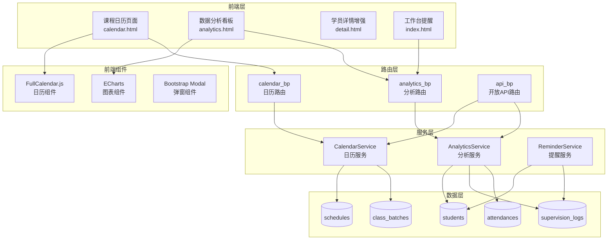
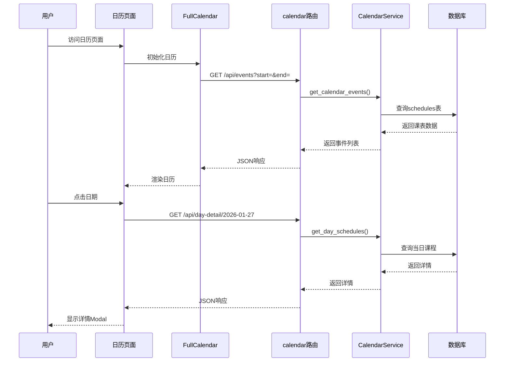
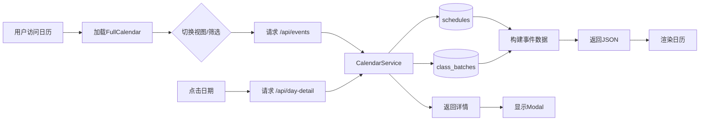

# 第三阶段 Design 文档 - 督学系统增强

## 文档信息

| 项目 | 内容 |
|------|------|
| **任务名称** | 第三阶段 - 督学系统增强 |
| **创建日期** | 2026-01-27 |
| **状态** | 🔄 架构设计中 |

---

## 一、整体架构图



---

## 二、系统分层设计

### 2.1 目录结构（新增/修改）

```
gongkao-system/
├── app/
│   ├── routes/
│   │   ├── calendar.py          # 【新增】日历路由
│   │   ├── analytics.py         # 【新增】数据分析路由
│   │   ├── api_v1.py            # 【新增】开放API路由
│   │   ├── dashboard.py         # 【修改】增加提醒功能
│   │   └── students.py          # 【修改】详情页增强
│   │
│   ├── services/
│   │   ├── calendar_service.py  # 【新增】日历服务
│   │   ├── analytics_service.py # 【新增】分析服务
│   │   └── reminder_service.py  # 【新增】提醒服务
│   │
│   ├── templates/
│   │   ├── calendar/
│   │   │   └── index.html       # 【新增】日历页面
│   │   ├── analytics/
│   │   │   └── index.html       # 【新增】分析看板
│   │   ├── dashboard/
│   │   │   └── index.html       # 【修改】增加提醒区块
│   │   └── students/
│   │       └── detail.html      # 【修改】增加课程/督学汇总
│   │
│   ├── static/
│   │   └── js/
│   │       ├── calendar.js      # 【新增】日历交互逻辑
│   │       └── analytics.js     # 【新增】图表渲染逻辑
│   │
│   └── __init__.py              # 【修改】注册新蓝图
│
├── config.py                    # 【修改】增加API配置
└── .env                         # 【修改】增加API_KEY
```

### 2.2 蓝图注册

```python
# app/__init__.py 新增蓝图
from app.routes.calendar import calendar_bp
from app.routes.analytics import analytics_bp
from app.routes.api_v1 import api_v1_bp

app.register_blueprint(calendar_bp, url_prefix='/calendar')
app.register_blueprint(analytics_bp, url_prefix='/analytics')
app.register_blueprint(api_v1_bp, url_prefix='/api/v1')
```

---

## 三、模块设计

### 3.1 课程日历模块

#### 3.1.1 路由设计

```python
# app/routes/calendar.py

calendar_bp = Blueprint('calendar', __name__)

# 页面路由
@calendar_bp.route('/')
def index():
    """日历主页面"""
    pass

# API路由
@calendar_bp.route('/api/events')
def get_events():
    """获取日历事件（FullCalendar格式）"""
    # 参数: start, end, batch_id, teacher_id, subject_id
    pass

@calendar_bp.route('/api/day-detail/<date>')
def get_day_detail(date):
    """获取指定日期的课程详情"""
    pass
```

#### 3.1.2 服务设计

```python
# app/services/calendar_service.py

class CalendarService:
    @staticmethod
    def get_calendar_events(start_date, end_date, batch_id=None, 
                           teacher_id=None, subject_id=None):
        """
        获取日历事件列表
        
        Args:
            start_date: 开始日期
            end_date: 结束日期
            batch_id: 班次ID（可选）
            teacher_id: 老师ID（可选）
            subject_id: 科目ID（可选）
        
        Returns:
            list: FullCalendar事件格式列表
            [
                {
                    "id": "schedule_1",
                    "title": "江苏事业编一期 - 言语",
                    "start": "2026-01-27",
                    "color": "#3788d8",
                    "extendedProps": {
                        "batch_id": 1,
                        "batch_name": "江苏事业编一期",
                        "subject_name": "言语",
                        "day_number": 22
                    }
                }
            ]
        """
        pass
    
    @staticmethod
    def get_day_schedules(target_date):
        """
        获取指定日期的所有课程详情
        
        Returns:
            list: 课程详情列表
        """
        pass
    
    @staticmethod
    def get_batch_colors():
        """
        获取班次颜色映射（不同班次显示不同颜色）
        """
        pass
```

#### 3.1.3 前端组件

```javascript
// app/static/js/calendar.js

document.addEventListener('DOMContentLoaded', function() {
    var calendarEl = document.getElementById('calendar');
    var calendar = new FullCalendar.Calendar(calendarEl, {
        initialView: 'dayGridMonth',
        locale: 'zh-cn',
        headerToolbar: {
            left: 'prev,next today',
            center: 'title',
            right: 'dayGridMonth,timeGridWeek'
        },
        events: '/calendar/api/events',
        eventClick: function(info) {
            // 显示详情弹窗
            showDayDetail(info.event.startStr);
        },
        // 筛选参数
        extraParams: function() {
            return {
                batch_id: document.getElementById('batchFilter').value,
                teacher_id: document.getElementById('teacherFilter').value,
                subject_id: document.getElementById('subjectFilter').value
            };
        }
    });
    calendar.render();
});

function showDayDetail(date) {
    // AJAX获取当日详情并显示Modal
}
```

#### 3.1.4 数据流向图



---

### 3.2 数据分析模块

#### 3.2.1 路由设计

```python
# app/routes/analytics.py

analytics_bp = Blueprint('analytics', __name__)

# 页面路由
@analytics_bp.route('/')
def index():
    """数据分析看板主页面"""
    pass

# API路由
@analytics_bp.route('/api/overview')
def get_overview():
    """获取概览统计（卡片数据）"""
    pass

@analytics_bp.route('/api/student-trend')
def get_student_trend():
    """学员增长趋势"""
    pass

@analytics_bp.route('/api/student-status')
def get_student_status():
    """学员状态分布"""
    pass

@analytics_bp.route('/api/supervision-ranking')
def get_supervision_ranking():
    """督学工作量排行"""
    pass

@analytics_bp.route('/api/weakness-distribution')
def get_weakness_distribution():
    """薄弱知识点分布"""
    pass

@analytics_bp.route('/api/batch-progress')
def get_batch_progress():
    """班次课程进度"""
    pass

@analytics_bp.route('/api/attendance-stats')
def get_attendance_stats():
    """考勤统计"""
    pass
```

#### 3.2.2 服务设计

```python
# app/services/analytics_service.py

class AnalyticsService:
    @staticmethod
    def get_overview_stats(days=30):
        """
        获取概览统计数据
        
        Returns:
            dict: {
                'total_students': 156,
                'new_students': 23,
                'new_students_change': 15.2,  # 较上期变化百分比
                'today_supervisions': 12,
                'pending_follow_up': 8
            }
        """
        pass
    
    @staticmethod
    def get_student_trend(days=30):
        """
        获取学员增长趋势
        
        Returns:
            dict: {
                'dates': ['2026-01-01', '2026-01-02', ...],
                'counts': [120, 122, 125, ...]
            }
        """
        pass
    
    @staticmethod
    def get_student_status_distribution():
        """
        获取学员状态分布
        
        Returns:
            list: [
                {'name': '咨询', 'value': 10},
                {'name': '试学', 'value': 15},
                {'name': '在读', 'value': 100},
                ...
            ]
        """
        pass
    
    @staticmethod
    def get_supervision_ranking(days=30, limit=10):
        """
        获取督学工作量排行
        
        Returns:
            list: [
                {'name': '张老师', 'count': 45},
                {'name': '李老师', 'count': 32},
                ...
            ]
        """
        pass
    
    @staticmethod
    def get_weakness_distribution(limit=10):
        """
        获取薄弱知识点分布（Top N）
        
        Returns:
            list: [
                {'name': '言语-逻辑填空', 'count': 23},
                ...
            ]
        """
        pass
    
    @staticmethod
    def get_batch_progress():
        """
        获取班次课程进度
        
        Returns:
            list: [
                {
                    'batch_name': '江苏事业编一期',
                    'total_days': 91,
                    'completed_days': 62,
                    'progress': 68.1
                },
                ...
            ]
        """
        pass
    
    @staticmethod
    def get_attendance_summary(batch_id=None):
        """
        获取考勤统计
        
        Returns:
            dict: {
                'total_records': 500,
                'present_rate': 92.5,
                'absent_count': 15,
                'late_count': 20,
                'leave_count': 10
            }
        """
        pass
```

#### 3.2.3 ECharts图表配置

```javascript
// app/static/js/analytics.js

// 学员增长趋势 - 折线图
function renderStudentTrend(data) {
    var chart = echarts.init(document.getElementById('studentTrendChart'));
    var option = {
        tooltip: { trigger: 'axis' },
        xAxis: {
            type: 'category',
            data: data.dates
        },
        yAxis: { type: 'value' },
        series: [{
            name: '学员数',
            type: 'line',
            smooth: true,
            data: data.counts,
            areaStyle: { opacity: 0.3 }
        }]
    };
    chart.setOption(option);
}

// 学员状态分布 - 环形图
function renderStudentStatus(data) {
    var chart = echarts.init(document.getElementById('studentStatusChart'));
    var option = {
        tooltip: { trigger: 'item' },
        legend: { orient: 'vertical', left: 'left' },
        series: [{
            name: '状态分布',
            type: 'pie',
            radius: ['40%', '70%'],
            data: data,
            emphasis: {
                itemStyle: {
                    shadowBlur: 10,
                    shadowOffsetX: 0,
                    shadowColor: 'rgba(0, 0, 0, 0.5)'
                }
            }
        }]
    };
    chart.setOption(option);
}

// 督学工作量排行 - 横向柱状图
function renderSupervisionRanking(data) {
    var chart = echarts.init(document.getElementById('supervisionRankingChart'));
    var option = {
        tooltip: { trigger: 'axis' },
        grid: { left: '20%' },
        xAxis: { type: 'value' },
        yAxis: {
            type: 'category',
            data: data.map(d => d.name).reverse()
        },
        series: [{
            name: '督学次数',
            type: 'bar',
            data: data.map(d => d.count).reverse(),
            itemStyle: { color: '#5470c6' }
        }]
    };
    chart.setOption(option);
}

// 薄弱知识点 - 横向柱状图
function renderWeaknessDistribution(data) {
    var chart = echarts.init(document.getElementById('weaknessChart'));
    var option = {
        tooltip: { trigger: 'axis' },
        grid: { left: '30%' },
        xAxis: { type: 'value', name: '人数' },
        yAxis: {
            type: 'category',
            data: data.map(d => d.name).reverse()
        },
        series: [{
            name: '人数',
            type: 'bar',
            data: data.map(d => d.count).reverse(),
            itemStyle: {
                color: function(params) {
                    var colors = ['#ee6666', '#fac858', '#91cc75', '#5470c6', '#73c0de'];
                    return colors[params.dataIndex % colors.length];
                }
            }
        }]
    };
    chart.setOption(option);
}

// 班次进度 - 进度条（使用Bootstrap）
function renderBatchProgress(data) {
    var container = document.getElementById('batchProgressContainer');
    container.innerHTML = data.map(batch => `
        <div class="mb-3">
            <div class="d-flex justify-content-between mb-1">
                <span>${batch.batch_name}</span>
                <span>${batch.progress.toFixed(1)}%</span>
            </div>
            <div class="progress">
                <div class="progress-bar" role="progressbar" 
                     style="width: ${batch.progress}%">
                    ${batch.completed_days}/${batch.total_days}天
                </div>
            </div>
        </div>
    `).join('');
}
```

---

### 3.3 开放API模块

#### 3.3.1 路由设计

```python
# app/routes/api_v1.py

from functools import wraps
from flask import Blueprint, jsonify, request, current_app

api_v1_bp = Blueprint('api_v1', __name__)

def require_api_key(f):
    """API Key验证装饰器"""
    @wraps(f)
    def decorated(*args, **kwargs):
        api_key = request.headers.get('X-API-Key')
        if not api_key or api_key != current_app.config.get('API_KEY'):
            return jsonify({
                'success': False,
                'message': '无效的API Key',
                'error_code': 'INVALID_API_KEY'
            }), 401
        return f(*args, **kwargs)
    return decorated

# 学员接口
@api_v1_bp.route('/students')
@require_api_key
def list_students():
    """获取学员列表"""
    pass

@api_v1_bp.route('/students/<int:id>')
@require_api_key
def get_student(id):
    """获取单个学员"""
    pass

# 班次接口
@api_v1_bp.route('/batches')
@require_api_key
def list_batches():
    """获取班次列表"""
    pass

@api_v1_bp.route('/batches/<int:id>')
@require_api_key
def get_batch(id):
    """获取单个班次"""
    pass

@api_v1_bp.route('/batches/<int:id>/students')
@require_api_key
def get_batch_students(id):
    """获取班次学员"""
    pass

# 薄弱项更新接口（供题库系统调用）
@api_v1_bp.route('/students/<int:id>/weakness', methods=['POST'])
@require_api_key
def update_student_weakness(id):
    """更新学员薄弱项"""
    pass
```

#### 3.3.2 响应格式规范

```python
# 成功响应
{
    "success": True,
    "data": {...},
    "message": "操作成功"
}

# 列表响应（带分页）
{
    "success": True,
    "data": [...],
    "pagination": {
        "page": 1,
        "per_page": 20,
        "total": 156,
        "pages": 8
    }
}

# 错误响应
{
    "success": False,
    "message": "错误描述",
    "error_code": "ERROR_CODE"
}
```

#### 3.3.3 配置文件

```python
# config.py 新增
class Config:
    # ... 现有配置 ...
    
    # API配置
    API_KEY = os.environ.get('API_KEY') or 'default-api-key-change-in-production'
    API_KEY_HEADER = 'X-API-Key'
    API_RATE_LIMIT = 100  # 每分钟请求限制
    
    # 跟进提醒配置
    FOLLOW_UP_REMINDER_DAYS = 7  # 超过N天未跟进则提醒
```

```env
# .env 新增
API_KEY=your-secure-api-key-here-32chars
```

---

### 3.4 提醒服务模块

#### 3.4.1 服务设计

```python
# app/services/reminder_service.py

class ReminderService:
    @staticmethod
    def get_pending_follow_up_students(days=7, supervisor_id=None, limit=10):
        """
        获取待跟进学员列表
        
        Args:
            days: 超过N天未跟进
            supervisor_id: 督学ID（可选，用于筛选负责的学员）
            limit: 返回数量限制
        
        Returns:
            list: [
                {
                    'id': 1,
                    'name': '张三',
                    'days_since_contact': 8,
                    'last_contact_date': '2026-01-19',
                    'status': '在读'
                },
                ...
            ]
        """
        pass
    
    @staticmethod
    def get_today_reminders(supervisor_id=None):
        """
        获取今日提醒汇总
        
        Returns:
            dict: {
                'pending_follow_up': [...]，    # 待跟进学员
                'today_schedules': [...],       # 今日课程
                'homework_deadlines': [...]     # 即将截止作业
            }
        """
        pass
    
    @staticmethod
    def calculate_days_since_contact(student_id):
        """
        计算距离上次联系的天数
        """
        pass
```

---

### 3.5 学员详情增强

#### 3.5.1 模板修改

```html
<!-- app/templates/students/detail.html 新增区块 -->

<!-- 课程信息 -->
<div class="card mb-4">
    <div class="card-header">
        <h5 class="mb-0"><i data-lucide="book-open"></i> 课程信息</h5>
    </div>
    <div class="card-body">
        
        <table class="table table-borderless">
            <tr>
                <td class="text-muted" width="120">报名套餐</td>
                <td>{{ student.package.name }}</td>
            </tr>
            <tr>
                <td class="text-muted">所属班次</td>
                <td>
                    
                        <span class="badge bg-primary">{{ sb.batch.name }}</span>
                    
                </td>
            </tr>
            <tr>
                <td class="text-muted">课程进度</td>
                <td>
                    <div class="progress" style="height: 20px;">
                        <div class="progress-bar" style="width: {{ course_progress.percent }}%">
                            {{ course_progress.completed }}/{{ course_progress.total }}天 ({{ course_progress.percent }}%)
                        </div>
                    </div>
                </td>
            </tr>
        </table>
        
        <p class="text-muted mb-0">暂未关联课程套餐</p>
        
    </div>
</div>

<!-- 督学汇总 -->
<div class="card mb-4">
    <div class="card-header">
        <h5 class="mb-0"><i data-lucide="message-square"></i> 督学汇总</h5>
    </div>
    <div class="card-body">
        <div class="row text-center">
            <div class="col-md-3">
                <h3 class="mb-0">{{ supervision_summary.total_logs }}</h3>
                <small class="text-muted">督学记录</small>
            </div>
            <div class="col-md-3">
                <h3 class="mb-0">{{ supervision_summary.days_since_contact }}</h3>
                <small class="text-muted">距上次沟通(天)</small>
            </div>
            <div class="col-md-3">
                <h3 class="mb-0">{{ supervision_summary.avg_frequency }}</h3>
                <small class="text-muted">平均频率(天/次)</small>
            </div>
            <div class="col-md-3">
                <h3 class="mb-0">{{ supervision_summary.main_contact_method }}</h3>
                <small class="text-muted">主要沟通方式</small>
            </div>
        </div>
    </div>
</div>

<!-- 考勤统计 -->
<div class="card mb-4">
    <div class="card-header">
        <h5 class="mb-0"><i data-lucide="check-square"></i> 考勤统计</h5>
    </div>
    <div class="card-body">
        
        <div class="row text-center">
            <div class="col-md-2">
                <h4 class="mb-0 text-primary">{{ attendance_summary.total }}</h4>
                <small class="text-muted">应出勤</small>
            </div>
            <div class="col-md-2">
                <h4 class="mb-0 text-success">{{ attendance_summary.present }}</h4>
                <small class="text-muted">实出勤</small>
            </div>
            <div class="col-md-2">
                <h4 class="mb-0 text-info">{{ attendance_summary.rate }}%</h4>
                <small class="text-muted">出勤率</small>
            </div>
            <div class="col-md-2">
                <h4 class="mb-0 text-warning">{{ attendance_summary.late }}</h4>
                <small class="text-muted">迟到</small>
            </div>
            <div class="col-md-2">
                <h4 class="mb-0 text-secondary">{{ attendance_summary.leave }}</h4>
                <small class="text-muted">请假</small>
            </div>
            <div class="col-md-2">
                <h4 class="mb-0 text-danger">{{ attendance_summary.absent }}</h4>
                <small class="text-muted">缺勤</small>
            </div>
        </div>
        
        <p class="text-muted mb-0">暂无考勤记录</p>
        
    </div>
</div>
```

---

## 四、接口契约定义

### 4.1 日历模块接口

| 接口 | 方法 | 路径 | 参数 | 返回 |
|------|------|------|------|------|
| 日历事件 | GET | `/calendar/api/events` | start, end, batch_id?, teacher_id?, subject_id? | FullCalendar事件列表 |
| 日期详情 | GET | `/calendar/api/day-detail/<date>` | - | 当日课程详情列表 |
| 筛选选项 | GET | `/calendar/api/filters` | - | 班次/老师/科目选项 |

### 4.2 分析模块接口

| 接口 | 方法 | 路径 | 参数 | 返回 |
|------|------|------|------|------|
| 概览统计 | GET | `/analytics/api/overview` | days? | 统计卡片数据 |
| 学员趋势 | GET | `/analytics/api/student-trend` | days? | 日期和数量数组 |
| 状态分布 | GET | `/analytics/api/student-status` | - | 饼图数据 |
| 督学排行 | GET | `/analytics/api/supervision-ranking` | days?, limit? | 柱状图数据 |
| 薄弱项 | GET | `/analytics/api/weakness-distribution` | limit? | 柱状图数据 |
| 班次进度 | GET | `/analytics/api/batch-progress` | - | 进度数据 |

### 4.3 开放API接口

| 接口 | 方法 | 路径 | 认证 | 返回 |
|------|------|------|------|------|
| 学员列表 | GET | `/api/v1/students` | API Key | 学员列表+分页 |
| 学员详情 | GET | `/api/v1/students/<id>` | API Key | 学员详情 |
| 班次列表 | GET | `/api/v1/batches` | API Key | 班次列表 |
| 班次详情 | GET | `/api/v1/batches/<id>` | API Key | 班次详情 |
| 班次学员 | GET | `/api/v1/batches/<id>/students` | API Key | 学员列表 |
| 更新薄弱项 | POST | `/api/v1/students/<id>/weakness` | API Key | 操作结果 |

---

## 五、数据流向图

### 5.1 日历数据流



### 5.2 分析数据流

```mermaid
flowchart LR
    A[用户访问看板] --> B[加载页面]
    B --> C[并行请求多个API]
    C --> D[/api/overview]
    C --> E[/api/student-trend]
    C --> F[/api/student-status]
    C --> G[/api/supervision-ranking]
    
    D --> H[AnalyticsService]
    E --> H
    F --> H
    G --> H
    
    H --> I[(students)]
    H --> J[(supervision_logs)]
    H --> K[(attendances)]
    
    I --> L[聚合计算]
    J --> L
    K --> L
    
    L --> M[返回JSON]
    M --> N[ECharts渲染]
```

---

## 六、异常处理策略

### 6.1 前端异常处理

```javascript
// 统一AJAX错误处理
function handleApiError(xhr, status, error) {
    if (xhr.status === 401) {
        showAlert('认证失败，请重新登录', 'danger');
        window.location.href = '/auth/login';
    } else if (xhr.status === 403) {
        showAlert('没有权限执行此操作', 'warning');
    } else if (xhr.status === 404) {
        showAlert('请求的资源不存在', 'warning');
    } else {
        showAlert('服务器错误，请稍后重试', 'danger');
    }
}
```

### 6.2 后端异常处理

```python
# API统一异常处理
@api_v1_bp.errorhandler(404)
def not_found(error):
    return jsonify({
        'success': False,
        'message': '资源不存在',
        'error_code': 'NOT_FOUND'
    }), 404

@api_v1_bp.errorhandler(500)
def internal_error(error):
    return jsonify({
        'success': False,
        'message': '服务器内部错误',
        'error_code': 'INTERNAL_ERROR'
    }), 500
```

---

## 七、前端依赖

### 7.1 CDN引入

```html
<!-- FullCalendar -->
<link href="https://cdn.jsdelivr.net/npm/fullcalendar@6.1.8/index.global.min.css" rel="stylesheet">
<script src="https://cdn.jsdelivr.net/npm/fullcalendar@6.1.8/index.global.min.js"></script>

<!-- ECharts -->
<script src="https://cdn.jsdelivr.net/npm/echarts@5.4.3/dist/echarts.min.js"></script>

<!-- FullCalendar中文语言包 -->
<script src="https://cdn.jsdelivr.net/npm/@fullcalendar/core@6.1.8/locales/zh-cn.global.min.js"></script>
```

### 7.2 版本要求

| 库 | 版本 | 用途 |
|----|------|------|
| FullCalendar | 6.1.8+ | 日历组件 |
| ECharts | 5.4.3+ | 图表组件 |
| Bootstrap | 5.3+ | UI框架（现有） |
| jQuery | 3.7+ | 交互（现有） |

---

## 八、总结

### 8.1 新增组件

| 类型 | 组件 | 说明 |
|------|------|------|
| 路由 | calendar.py | 日历模块路由 |
| 路由 | analytics.py | 分析模块路由 |
| 路由 | api_v1.py | 开放API路由 |
| 服务 | CalendarService | 日历数据服务 |
| 服务 | AnalyticsService | 分析数据服务 |
| 服务 | ReminderService | 提醒服务 |
| 模板 | calendar/index.html | 日历页面 |
| 模板 | analytics/index.html | 分析看板 |
| 静态 | calendar.js | 日历交互逻辑 |
| 静态 | analytics.js | 图表渲染逻辑 |

### 8.2 修改组件

| 组件 | 修改内容 |
|------|----------|
| `__init__.py` | 注册新蓝图 |
| `config.py` | API配置、提醒配置 |
| `dashboard.py` | 集成提醒功能 |
| `students.py` | 详情页数据增强 |
| `base.html` | 侧边栏新增菜单 |
| `dashboard/index.html` | 提醒区块 |
| `students/detail.html` | 新增信息区块 |

---

**架构设计完成，准备进入 Atomize（原子化）阶段。**
