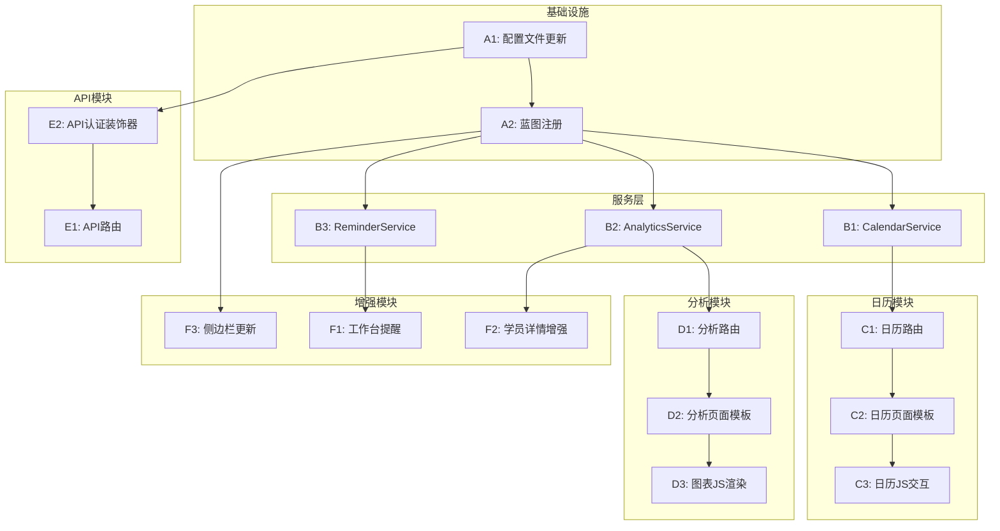

# 第三阶段 Task 文档 - 督学系统增强

## 文档信息

| 项目 | 内容 |
|------|------|
| **任务名称** | 第三阶段 - 督学系统增强 |
| **创建日期** | 2026-01-27 |
| **状态** | 🔄 任务拆分中 |

---

## 任务依赖图



---

## 原子任务清单

### A. 基础设施任务

#### A1: 配置文件更新
| 项目 | 内容 |
|------|------|
| **任务ID** | A1 |
| **任务名称** | 配置文件更新 |
| **输入契约** | 现有 `config.py` 和 `.env` 文件 |
| **输出契约** | 新增 API_KEY、FOLLOW_UP_REMINDER_DAYS 配置 |
| **实现约束** | 保持与现有配置兼容 |
| **验收标准** | 配置项可正常读取 |
| **预计复杂度** | 低 |

**修改文件**:
- `config.py`: 添加 API_KEY、API_KEY_HEADER、FOLLOW_UP_REMINDER_DAYS
- `.env`: 添加 API_KEY 环境变量

---

#### A2: 蓝图注册
| 项目 | 内容 |
|------|------|
| **任务ID** | A2 |
| **任务名称** | 注册新蓝图 |
| **输入契约** | A1完成 |
| **输出契约** | calendar_bp、analytics_bp、api_v1_bp 注册成功 |
| **实现约束** | 遵循现有蓝图注册模式 |
| **验收标准** | 三个新蓝图可访问 |
| **预计复杂度** | 低 |

**修改文件**:
- `app/__init__.py`: 导入并注册新蓝图

---

### B. 服务层任务

#### B1: CalendarService 日历服务
| 项目 | 内容 |
|------|------|
| **任务ID** | B1 |
| **任务名称** | 日历服务实现 |
| **输入契约** | A2完成，schedules/class_batches表可用 |
| **输出契约** | CalendarService类，包含get_calendar_events、get_day_schedules方法 |
| **实现约束** | 返回FullCalendar兼容格式 |
| **验收标准** | 可正确获取日期范围内的课程事件 |
| **预计复杂度** | 中 |

**新建文件**:
- `app/services/calendar_service.py`

**方法清单**:
```python
class CalendarService:
    @staticmethod
    def get_calendar_events(start_date, end_date, batch_id=None, teacher_id=None, subject_id=None)
    
    @staticmethod
    def get_day_schedules(target_date)
    
    @staticmethod
    def get_batch_colors()
```

---

#### B2: AnalyticsService 分析服务
| 项目 | 内容 |
|------|------|
| **任务ID** | B2 |
| **任务名称** | 分析服务实现 |
| **输入契约** | A2完成，students/supervision_logs/attendances表可用 |
| **输出契约** | AnalyticsService类，包含多个统计方法 |
| **实现约束** | 使用SQLAlchemy聚合查询 |
| **验收标准** | 各统计数据计算正确 |
| **预计复杂度** | 高 |

**新建文件**:
- `app/services/analytics_service.py`

**方法清单**:
```python
class AnalyticsService:
    @staticmethod
    def get_overview_stats(days=30)
    
    @staticmethod
    def get_student_trend(days=30)
    
    @staticmethod
    def get_student_status_distribution()
    
    @staticmethod
    def get_supervision_ranking(days=30, limit=10)
    
    @staticmethod
    def get_weakness_distribution(limit=10)
    
    @staticmethod
    def get_batch_progress()
    
    @staticmethod
    def get_attendance_summary(batch_id=None)
```

---

#### B3: ReminderService 提醒服务
| 项目 | 内容 |
|------|------|
| **任务ID** | B3 |
| **任务名称** | 提醒服务实现 |
| **输入契约** | A2完成，students/supervision_logs表可用 |
| **输出契约** | ReminderService类，获取待跟进学员 |
| **实现约束** | 使用FOLLOW_UP_REMINDER_DAYS配置 |
| **验收标准** | 正确识别超期未跟进学员 |
| **预计复杂度** | 中 |

**新建文件**:
- `app/services/reminder_service.py`

**方法清单**:
```python
class ReminderService:
    @staticmethod
    def get_pending_follow_up_students(days=7, supervisor_id=None, limit=10)
    
    @staticmethod
    def get_today_reminders(supervisor_id=None)
    
    @staticmethod
    def calculate_days_since_contact(student_id)
```

---

### C. 日历模块任务

#### C1: 日历路由
| 项目 | 内容 |
|------|------|
| **任务ID** | C1 |
| **任务名称** | 日历路由实现 |
| **输入契约** | B1完成 |
| **输出契约** | /calendar/ 页面路由和API路由 |
| **实现约束** | 使用Blueprint模式 |
| **验收标准** | 页面可访问，API返回正确JSON |
| **预计复杂度** | 中 |

**新建文件**:
- `app/routes/calendar.py`

**路由清单**:
```python
GET  /calendar/              # 日历主页面
GET  /calendar/api/events    # 获取日历事件
GET  /calendar/api/day-detail/<date>  # 获取日期详情
GET  /calendar/api/filters   # 获取筛选选项
```

---

#### C2: 日历页面模板
| 项目 | 内容 |
|------|------|
| **任务ID** | C2 |
| **任务名称** | 日历页面模板 |
| **输入契约** | C1完成 |
| **输出契约** | 日历页面HTML模板 |
| **实现约束** | 继承base.html，引入FullCalendar |
| **验收标准** | 页面正常渲染，日历组件显示 |
| **预计复杂度** | 中 |

**新建文件**:
- `app/templates/calendar/index.html`

**页面组件**:
- 筛选栏（班次/老师/科目下拉）
- FullCalendar日历容器
- 日期详情Modal弹窗

---

#### C3: 日历JS交互
| 项目 | 内容 |
|------|------|
| **任务ID** | C3 |
| **任务名称** | 日历前端交互逻辑 |
| **输入契约** | C2完成 |
| **输出契约** | 日历初始化、事件加载、详情弹窗 |
| **实现约束** | 使用FullCalendar 6.x API |
| **验收标准** | 日历交互正常，筛选生效 |
| **预计复杂度** | 中 |

**新建文件**:
- `app/static/js/calendar.js`

**功能点**:
- FullCalendar初始化
- 事件数据加载
- 筛选参数传递
- 日期点击弹窗
- 视图切换（月/周）

---

### D. 分析模块任务

#### D1: 分析路由
| 项目 | 内容 |
|------|------|
| **任务ID** | D1 |
| **任务名称** | 数据分析路由实现 |
| **输入契约** | B2完成 |
| **输出契约** | /analytics/ 页面路由和API路由 |
| **实现约束** | 使用Blueprint模式 |
| **验收标准** | 页面可访问，API返回正确JSON |
| **预计复杂度** | 中 |

**新建文件**:
- `app/routes/analytics.py`

**路由清单**:
```python
GET  /analytics/                    # 分析看板主页面
GET  /analytics/api/overview        # 概览统计
GET  /analytics/api/student-trend   # 学员趋势
GET  /analytics/api/student-status  # 状态分布
GET  /analytics/api/supervision-ranking  # 督学排行
GET  /analytics/api/weakness-distribution  # 薄弱项分布
GET  /analytics/api/batch-progress  # 班次进度
GET  /analytics/api/attendance-stats  # 考勤统计
```

---

#### D2: 分析页面模板
| 项目 | 内容 |
|------|------|
| **任务ID** | D2 |
| **任务名称** | 分析看板页面模板 |
| **输入契约** | D1完成 |
| **输出契约** | 分析看板HTML模板 |
| **实现约束** | 继承base.html，引入ECharts |
| **验收标准** | 页面正常渲染，图表容器显示 |
| **预计复杂度** | 中 |

**新建文件**:
- `app/templates/analytics/index.html`

**页面组件**:
- 统计卡片区（4个）
- 折线图区（学员趋势）
- 饼图区（状态分布）
- 柱状图区（督学排行、薄弱项）
- 进度条区（班次进度）

---

#### D3: 图表JS渲染
| 项目 | 内容 |
|------|------|
| **任务ID** | D3 |
| **任务名称** | 图表前端渲染逻辑 |
| **输入契约** | D2完成 |
| **输出契约** | ECharts图表初始化和数据渲染 |
| **实现约束** | 使用ECharts 5.x API |
| **验收标准** | 图表正确显示，数据正确 |
| **预计复杂度** | 高 |

**新建文件**:
- `app/static/js/analytics.js`

**功能点**:
- 页面加载时并行请求所有API
- 折线图渲染（学员趋势）
- 环形图渲染（状态分布）
- 横向柱状图渲染（督学排行）
- 横向柱状图渲染（薄弱项分布）
- 进度条渲染（班次进度）
- 响应式图表resize

---

### E. API模块任务

#### E1: API认证装饰器
| 项目 | 内容 |
|------|------|
| **任务ID** | E1 |
| **任务名称** | API Key认证装饰器 |
| **输入契约** | A1完成（API_KEY配置可用） |
| **输出契约** | require_api_key装饰器 |
| **实现约束** | 从Header读取X-API-Key |
| **验收标准** | 无效Key返回401，有效Key通过 |
| **预计复杂度** | 低 |

**包含在**:
- `app/routes/api_v1.py`

---

#### E2: 开放API路由
| 项目 | 内容 |
|------|------|
| **任务ID** | E2 |
| **任务名称** | 开放API路由实现 |
| **输入契约** | E1完成 |
| **输出契约** | /api/v1/ 下的所有API接口 |
| **实现约束** | 使用require_api_key装饰器 |
| **验收标准** | 接口返回正确JSON格式 |
| **预计复杂度** | 中 |

**新建文件**:
- `app/routes/api_v1.py`

**路由清单**:
```python
GET   /api/v1/students              # 学员列表
GET   /api/v1/students/<id>         # 学员详情
GET   /api/v1/batches               # 班次列表
GET   /api/v1/batches/<id>          # 班次详情
GET   /api/v1/batches/<id>/students # 班次学员
POST  /api/v1/students/<id>/weakness  # 更新薄弱项
```

---

### F. 增强模块任务

#### F1: 工作台提醒功能
| 项目 | 内容 |
|------|------|
| **任务ID** | F1 |
| **任务名称** | 工作台添加提醒区块 |
| **输入契约** | B3完成 |
| **输出契约** | 工作台显示待跟进学员和今日课程 |
| **实现约束** | 修改现有dashboard路由和模板 |
| **验收标准** | 提醒区块正确显示 |
| **预计复杂度** | 中 |

**修改文件**:
- `app/routes/dashboard.py`: 调用ReminderService
- `app/templates/dashboard/index.html`: 添加提醒区块

---

#### F2: 学员详情页增强
| 项目 | 内容 |
|------|------|
| **任务ID** | F2 |
| **任务名称** | 学员详情页添加新信息区块 |
| **输入契约** | B2完成 |
| **输出契约** | 学员详情页显示课程信息、督学汇总、考勤统计 |
| **实现约束** | 修改现有students路由和模板 |
| **验收标准** | 新信息区块正确显示 |
| **预计复杂度** | 中 |

**修改文件**:
- `app/routes/students.py`: 详情页添加新数据
- `app/templates/students/detail.html`: 添加新信息区块

---

#### F3: 侧边栏菜单更新
| 项目 | 内容 |
|------|------|
| **任务ID** | F3 |
| **任务名称** | 侧边栏添加新菜单项 |
| **输入契约** | A2完成 |
| **输出契约** | 侧边栏显示"课程日历"和"数据分析"菜单 |
| **实现约束** | 与现有菜单风格一致 |
| **验收标准** | 菜单项正确显示，点击可跳转 |
| **预计复杂度** | 低 |

**修改文件**:
- `app/templates/base.html`: 添加新菜单项

---

## 任务执行顺序

```
阶段1: 基础设施（并行）
├── A1: 配置文件更新
└── A2: 蓝图注册（依赖A1）

阶段2: 服务层（并行）
├── B1: CalendarService
├── B2: AnalyticsService
└── B3: ReminderService

阶段3: 日历模块（串行）
├── C1: 日历路由（依赖B1）
├── C2: 日历页面模板（依赖C1）
└── C3: 日历JS交互（依赖C2）

阶段4: 分析模块（串行）
├── D1: 分析路由（依赖B2）
├── D2: 分析页面模板（依赖D1）
└── D3: 图表JS渲染（依赖D2）

阶段5: API模块（串行）
├── E1: API认证装饰器（依赖A1）
└── E2: 开放API路由（依赖E1）

阶段6: 增强模块（并行）
├── F1: 工作台提醒（依赖B3）
├── F2: 学员详情增强（依赖B2）
└── F3: 侧边栏更新（依赖A2）
```

---

## 任务汇总

| 阶段 | 任务数 | 新建文件 | 修改文件 |
|------|--------|----------|----------|
| 基础设施 | 2 | 0 | 2 |
| 服务层 | 3 | 3 | 0 |
| 日历模块 | 3 | 3 | 0 |
| 分析模块 | 3 | 3 | 0 |
| API模块 | 2 | 1 | 0 |
| 增强模块 | 3 | 0 | 4 |
| **总计** | **16** | **10** | **6** |

---

## 新建文件清单

| 序号 | 文件路径 | 任务ID |
|------|----------|--------|
| 1 | `app/services/calendar_service.py` | B1 |
| 2 | `app/services/analytics_service.py` | B2 |
| 3 | `app/services/reminder_service.py` | B3 |
| 4 | `app/routes/calendar.py` | C1 |
| 5 | `app/routes/analytics.py` | D1 |
| 6 | `app/routes/api_v1.py` | E1, E2 |
| 7 | `app/templates/calendar/index.html` | C2 |
| 8 | `app/templates/analytics/index.html` | D2 |
| 9 | `app/static/js/calendar.js` | C3 |
| 10 | `app/static/js/analytics.js` | D3 |

---

## 修改文件清单

| 序号 | 文件路径 | 任务ID | 修改内容 |
|------|----------|--------|----------|
| 1 | `config.py` | A1 | 添加API和提醒配置 |
| 2 | `.env` | A1 | 添加API_KEY |
| 3 | `app/__init__.py` | A2 | 注册新蓝图 |
| 4 | `app/routes/dashboard.py` | F1 | 集成提醒服务 |
| 5 | `app/routes/students.py` | F2 | 详情页数据增强 |
| 6 | `app/templates/base.html` | F3 | 添加菜单项 |
| 7 | `app/templates/dashboard/index.html` | F1 | 添加提醒区块 |
| 8 | `app/templates/students/detail.html` | F2 | 添加信息区块 |

---

## 验收检查清单

| 任务ID | 验收项 | 验收方式 |
|--------|--------|----------|
| A1 | API_KEY可从配置读取 | 单元测试 |
| A2 | 三个蓝图路由可访问 | 访问测试 |
| B1 | get_calendar_events返回正确格式 | 单元测试 |
| B2 | 各统计方法计算正确 | 单元测试 |
| B3 | 待跟进学员识别正确 | 单元测试 |
| C1 | 日历API返回正确JSON | API测试 |
| C2 | 日历页面正常渲染 | 页面测试 |
| C3 | 日历交互正常 | 交互测试 |
| D1 | 分析API返回正确JSON | API测试 |
| D2 | 分析页面正常渲染 | 页面测试 |
| D3 | 图表正确显示 | 视觉测试 |
| E1 | 无效Key返回401 | API测试 |
| E2 | 所有API接口正常工作 | API测试 |
| F1 | 工作台提醒区块显示 | 页面测试 |
| F2 | 学员详情新区块显示 | 页面测试 |
| F3 | 侧边栏新菜单显示 | 页面测试 |

---

**任务拆分完成，准备进入 Approve（审批）阶段。**
