# 第二阶段 Design 文档 - 课程管理模块

## 文档信息

| 项目 | 内容 |
|------|------|
| **任务名称** | 第二阶段 - 课程管理模块开发 |
| **阶段** | Architect（架构阶段） |
| **创建日期** | 2026-01-27 |
| **状态** | ✅ 已完成 |

---

## 1. 整体架构图

### 1.1 系统架构


### 1.2 模块关系图


---

## 2. 分层设计

### 2.1 模型层设计

#### 2.1.1 models/course.py

```python
# 科目模型
class Subject(db.Model):
    __tablename__ = 'subjects'
    
    id: int              # 主键
    name: str            # 科目名称
    short_name: str      # 简称
    exam_type: str       # 考试类型 (civil/career/common)
    is_preset: bool      # 是否预设
    sort_order: int      # 排序
    status: str          # 状态 (active/inactive)
    created_at: datetime
    
    # 关系
    schedules: List[Schedule]  # 反向关系

# 招生项目模型
class Project(db.Model):
    __tablename__ = 'projects'
    
    id: int
    name: str            # 项目名称
    exam_type: str       # 考试类型
    year: int            # 招生年份
    start_date: date     # 开始日期
    end_date: date       # 结束日期
    description: str     # 描述
    status: str          # 状态 (preparing/recruiting/ended)
    created_at: datetime
    updated_at: datetime
    
    # 关系
    packages: List[Package]
    class_types: List[ClassType]

# 报名套餐模型
class Package(db.Model):
    __tablename__ = 'packages'
    
    id: int
    project_id: int      # 所属项目
    name: str            # 套餐名称
    package_type: str    # 类型 (full/period/single_type/single_subject)
    price: Decimal       # 原价
    valid_days: int      # 有效天数
    valid_start: date    # 有效期开始
    valid_end: date      # 有效期结束
    include_all_types: bool  # 是否包含所有班型
    included_type_ids: str   # 包含的班型ID
    discount_rules: str  # 优惠规则 (JSON)
    description: str
    status: str          # 状态 (active/inactive)
    sort_order: int
    created_at: datetime
    
    # 关系
    project: Project
    students: List[Student]  # 反向关系

# 班型模型
class ClassType(db.Model):
    __tablename__ = 'class_types'
    
    id: int
    project_id: int      # 所属项目
    name: str            # 班型名称
    planned_days: int    # 计划天数
    single_price: Decimal  # 单独售价
    sort_order: int      # 顺序
    description: str
    status: str          # 状态
    created_at: datetime
    
    # 关系
    project: Project
    batches: List[ClassBatch]

# 班次模型
class ClassBatch(db.Model):
    __tablename__ = 'class_batches'
    
    id: int
    class_type_id: int   # 所属班型
    name: str            # 班次名称
    batch_number: int    # 期数
    start_date: date     # 开课日期
    end_date: date       # 结课日期
    actual_days: int     # 实际天数
    max_students: int    # 招生上限
    enrolled_count: int  # 已报人数
    classroom: str       # 教室
    status: str          # 状态 (recruiting/ongoing/ended)
    created_at: datetime
    
    # 关系
    class_type: ClassType
    schedules: List[Schedule]
    student_batches: List[StudentBatch]

# 课表模型
class Schedule(db.Model):
    __tablename__ = 'schedules'
    
    id: int
    batch_id: int        # 所属班次
    schedule_date: date  # 上课日期
    day_number: int      # 第几天
    subject_id: int      # 科目
    morning_teacher_id: int    # 上午老师
    afternoon_teacher_id: int  # 下午老师
    evening_type: str    # 晚间类型 (self_study/exercise/class)
    evening_teacher_id: int    # 晚间老师
    remark: str          # 备注
    created_at: datetime
    updated_at: datetime
    
    # 关系
    batch: ClassBatch
    subject: Subject
    morning_teacher: Teacher
    afternoon_teacher: Teacher
    evening_teacher: Teacher
    change_logs: List[ScheduleChangeLog]

# 变更记录模型
class ScheduleChangeLog(db.Model):
    __tablename__ = 'schedule_change_logs'
    
    id: int
    schedule_id: int     # 关联课表
    change_type: str     # 变更类型 (teacher_change/reschedule/cancel)
    original_value: str  # 原值 (JSON)
    new_value: str       # 新值 (JSON)
    reason: str          # 变更原因
    operator_id: int     # 操作人
    created_at: datetime
    
    # 关系
    schedule: Schedule
    operator: User
```

#### 2.1.2 models/teacher.py

```python
class Teacher(db.Model):
    __tablename__ = 'teachers'
    
    id: int
    name: str            # 姓名
    phone: str           # 手机
    subject_ids: str     # 擅长科目ID (逗号分隔)
    daily_rate: Decimal  # 日薪
    hourly_rate: Decimal # 课时费
    id_card: str         # 身份证号
    bank_account: str    # 银行账号
    bank_name: str       # 开户行
    remark: str          # 备注
    status: str          # 状态 (active/inactive)
    created_at: datetime
    
    # 关系
    morning_schedules: List[Schedule]
    afternoon_schedules: List[Schedule]
    
    # 方法
    def get_subjects() -> List[Subject]
    def get_schedule_for_date(date) -> List[Schedule]
    def has_conflict(date) -> bool
```

#### 2.1.3 models/attendance.py

```python
class Attendance(db.Model):
    __tablename__ = 'attendances'
    
    id: int
    student_id: int      # 学员
    batch_id: int        # 班次
    schedule_id: int     # 课表
    attendance_date: date  # 日期
    status: str          # 状态 (present/absent/late/leave)
    check_in_time: time  # 签到时间
    remark: str          # 备注
    created_at: datetime
    
    # 关系
    student: Student
    batch: ClassBatch
    schedule: Schedule
```

#### 2.1.4 StudentBatch 关联模型

```python
class StudentBatch(db.Model):
    __tablename__ = 'student_batches'
    
    id: int
    student_id: int      # 学员
    batch_id: int        # 班次
    enroll_time: datetime  # 加入时间
    status: str          # 状态 (active/completed/dropped)
    progress_day: int    # 当前进度
    
    # 关系
    student: Student
    batch: ClassBatch
```

### 2.2 服务层设计

#### 2.2.1 services/course_service.py

```python
class CourseService:
    """课程服务 - 管理科目、项目、套餐、班型、班次"""
    
    # === 科目管理 ===
    @staticmethod
    def get_subjects(exam_type=None, status='active') -> List[Subject]
    
    @staticmethod
    def get_subject(id) -> Subject
    
    @staticmethod
    def create_subject(data) -> Subject
    
    @staticmethod
    def update_subject(id, data) -> Subject
    
    @staticmethod
    def toggle_subject_status(id) -> Subject
    
    # === 招生项目管理 ===
    @staticmethod
    def get_projects(status=None, year=None) -> List[Project]
    
    @staticmethod
    def get_project(id) -> Project
    
    @staticmethod
    def create_project(data) -> Project
    
    @staticmethod
    def update_project(id, data) -> Project
    
    @staticmethod
    def end_project(id) -> Project
    
    # === 报名套餐管理 ===
    @staticmethod
    def get_packages(project_id=None, status=None) -> List[Package]
    
    @staticmethod
    def get_package(id) -> Package
    
    @staticmethod
    def create_package(data) -> Package
    
    @staticmethod
    def update_package(id, data) -> Package
    
    @staticmethod
    def toggle_package_status(id) -> Package
    
    @staticmethod
    def calculate_price(package_id, discount_type=None, count=1) -> dict
    
    # === 班型管理 ===
    @staticmethod
    def get_class_types(project_id) -> List[ClassType]
    
    @staticmethod
    def create_class_type(data) -> ClassType
    
    @staticmethod
    def update_class_type(id, data) -> ClassType
    
    @staticmethod
    def reorder_class_types(project_id, type_ids) -> bool
    
    # === 班次管理 ===
    @staticmethod
    def get_batches(class_type_id=None, status=None) -> List[ClassBatch]
    
    @staticmethod
    def get_batch(id) -> ClassBatch
    
    @staticmethod
    def create_batch(data) -> ClassBatch
    
    @staticmethod
    def update_batch(id, data) -> ClassBatch
    
    @staticmethod
    def update_batch_status(id, status) -> ClassBatch
    
    @staticmethod
    def copy_batch(id, new_start_date) -> ClassBatch
    
    @staticmethod
    def get_batch_students(batch_id) -> List[Student]
    
    @staticmethod
    def update_enrolled_count(batch_id) -> int
```

#### 2.2.2 services/schedule_service.py

```python
class ScheduleService:
    """课表服务 - 管理排课和变更"""
    
    # === 课表查询 ===
    @staticmethod
    def get_schedules(batch_id) -> List[Schedule]
    
    @staticmethod
    def get_schedule(id) -> Schedule
    
    @staticmethod
    def get_schedule_by_date(batch_id, date) -> Schedule
    
    @staticmethod
    def get_today_schedules() -> List[Schedule]
    
    # === 课表创建 ===
    @staticmethod
    def create_schedule(data) -> Schedule
    
    @staticmethod
    def batch_create_schedules(batch_id, schedule_list) -> List[Schedule]
    """批量生成课表"""
    
    @staticmethod
    def generate_schedules(batch_id, subject_days_list) -> List[Schedule]
    """
    根据科目和天数自动生成课表
    subject_days_list: [{'subject_id': 1, 'days': 4}, ...]
    """
    
    @staticmethod
    def import_from_excel(batch_id, file) -> dict
    """
    从Excel导入课表
    返回: {'success': int, 'failed': int, 'errors': []}
    """
    
    @staticmethod
    def copy_from_batch(source_batch_id, target_batch_id) -> List[Schedule]
    """从另一个班次复制课表"""
    
    # === 课表修改 ===
    @staticmethod
    def update_schedule(id, data, operator_id, reason=None) -> Schedule
    """更新课表，自动记录变更"""
    
    @staticmethod
    def delete_schedule(id) -> bool
    
    @staticmethod
    def delete_batch_schedules(batch_id) -> int
    
    # === 变更记录 ===
    @staticmethod
    def get_change_logs(schedule_id=None, batch_id=None, teacher_id=None) -> List[ScheduleChangeLog]
    
    @staticmethod
    def record_change(schedule_id, change_type, original, new, operator_id, reason) -> ScheduleChangeLog
    
    # === 导出 ===
    @staticmethod
    def export_to_excel(batch_id) -> BytesIO
    
    @staticmethod
    def export_to_pdf(batch_id) -> BytesIO
```

#### 2.2.3 services/teacher_service.py

```python
class TeacherService:
    """老师服务 - 管理老师信息和排课"""
    
    # === 老师管理 ===
    @staticmethod
    def get_teachers(subject_id=None, status='active') -> List[Teacher]
    
    @staticmethod
    def get_teacher(id) -> Teacher
    
    @staticmethod
    def create_teacher(data) -> Teacher
    
    @staticmethod
    def update_teacher(id, data) -> Teacher
    
    @staticmethod
    def toggle_teacher_status(id) -> Teacher
    
    # === 排课相关 ===
    @staticmethod
    def get_teacher_schedules(teacher_id, start_date=None, end_date=None) -> List[Schedule]
    """获取老师的排课记录"""
    
    @staticmethod
    def check_conflict(teacher_id, date, exclude_schedule_id=None) -> bool
    """检查老师在指定日期是否有时间冲突"""
    
    @staticmethod
    def get_available_teachers(subject_id, date) -> List[Teacher]
    """获取指定日期可用的老师"""
    
    # === 统计 ===
    @staticmethod
    def get_workload(teacher_id, start_date, end_date) -> dict
    """
    获取老师工作量统计
    返回: {'total_days': int, 'morning_count': int, 'afternoon_count': int, 'total_amount': Decimal}
    """
    
    @staticmethod
    def get_all_workload(start_date, end_date) -> List[dict]
    """获取所有老师的工作量统计"""
```

#### 2.2.4 services/attendance_service.py

```python
class AttendanceService:
    """考勤服务"""
    
    @staticmethod
    def check_in(student_id, batch_id, schedule_id) -> Attendance
    """学员签到"""
    
    @staticmethod
    def mark_absent(student_id, batch_id, schedule_id, remark=None) -> Attendance
    """标记缺课"""
    
    @staticmethod
    def mark_leave(student_id, batch_id, schedule_id, remark=None) -> Attendance
    """标记请假"""
    
    @staticmethod
    def get_student_attendance(student_id, batch_id=None) -> List[Attendance]
    """获取学员考勤记录"""
    
    @staticmethod
    def get_batch_attendance(batch_id, date=None) -> List[Attendance]
    """获取班次考勤记录"""
    
    @staticmethod
    def get_attendance_stats(student_id=None, batch_id=None) -> dict
    """
    获取考勤统计
    返回: {'total': int, 'present': int, 'absent': int, 'late': int, 'leave': int, 'rate': float}
    """
```

### 2.3 路由层设计

#### 2.3.1 routes/courses.py

```python
courses_bp = Blueprint('courses', __name__, url_prefix='/courses')

# === 科目管理 ===
@courses_bp.route('/subjects')
def subject_list(): ...

@courses_bp.route('/subjects/create', methods=['GET', 'POST'])
def subject_create(): ...

@courses_bp.route('/subjects/<int:id>/edit', methods=['GET', 'POST'])
def subject_edit(id): ...

@courses_bp.route('/subjects/<int:id>/toggle', methods=['POST'])
def subject_toggle(id): ...

# === 招生项目 ===
@courses_bp.route('/projects')
def project_list(): ...

@courses_bp.route('/projects/create', methods=['GET', 'POST'])
def project_create(): ...

@courses_bp.route('/projects/<int:id>')
def project_detail(id): ...

@courses_bp.route('/projects/<int:id>/edit', methods=['GET', 'POST'])
def project_edit(id): ...

@courses_bp.route('/projects/<int:id>/end', methods=['POST'])
def project_end(id): ...

# === 报名套餐 ===
@courses_bp.route('/packages')
def package_list(): ...

@courses_bp.route('/packages/create', methods=['GET', 'POST'])
def package_create(): ...

@courses_bp.route('/packages/<int:id>/edit', methods=['GET', 'POST'])
def package_edit(id): ...

@courses_bp.route('/packages/<int:id>/toggle', methods=['POST'])
def package_toggle(id): ...

# === 班型管理 ===
@courses_bp.route('/types')
def type_list(): ...

@courses_bp.route('/types/create', methods=['GET', 'POST'])
def type_create(): ...

@courses_bp.route('/types/<int:id>/edit', methods=['GET', 'POST'])
def type_edit(id): ...

@courses_bp.route('/types/reorder', methods=['POST'])
def type_reorder(): ...

# === 班次管理 ===
@courses_bp.route('/batches')
def batch_list(): ...

@courses_bp.route('/batches/create', methods=['GET', 'POST'])
def batch_create(): ...

@courses_bp.route('/batches/<int:id>')
def batch_detail(id): ...

@courses_bp.route('/batches/<int:id>/edit', methods=['GET', 'POST'])
def batch_edit(id): ...

@courses_bp.route('/batches/<int:id>/status', methods=['POST'])
def batch_status(id): ...

@courses_bp.route('/batches/<int:id>/copy', methods=['POST'])
def batch_copy(id): ...

# === 课表管理 ===
@courses_bp.route('/batches/<int:batch_id>/schedule')
def schedule_list(batch_id): ...

@courses_bp.route('/batches/<int:batch_id>/schedule/add', methods=['GET', 'POST'])
def schedule_add(batch_id): ...

@courses_bp.route('/batches/<int:batch_id>/schedule/generate', methods=['GET', 'POST'])
def schedule_generate(batch_id): ...

@courses_bp.route('/batches/<int:batch_id>/schedule/import', methods=['GET', 'POST'])
def schedule_import(batch_id): ...

@courses_bp.route('/batches/<int:batch_id>/schedule/copy', methods=['POST'])
def schedule_copy(batch_id): ...

@courses_bp.route('/schedule/<int:id>/edit', methods=['GET', 'POST'])
def schedule_edit(id): ...

@courses_bp.route('/schedule/<int:id>/delete', methods=['POST'])
def schedule_delete(id): ...

@courses_bp.route('/batches/<int:batch_id>/schedule/export')
def schedule_export(batch_id): ...

# === 课表日历视图 ===
@courses_bp.route('/calendar')
def schedule_calendar(): ...

@courses_bp.route('/api/calendar-events')
def calendar_events(): ...

# === 老师管理 ===
@courses_bp.route('/teachers')
def teacher_list(): ...

@courses_bp.route('/teachers/create', methods=['GET', 'POST'])
def teacher_create(): ...

@courses_bp.route('/teachers/<int:id>')
def teacher_detail(id): ...

@courses_bp.route('/teachers/<int:id>/edit', methods=['GET', 'POST'])
def teacher_edit(id): ...

@courses_bp.route('/teachers/<int:id>/toggle', methods=['POST'])
def teacher_toggle(id): ...

@courses_bp.route('/teachers/<int:id>/schedule')
def teacher_schedule(id): ...

@courses_bp.route('/teachers/workload')
def teacher_workload(): ...

# === 变更记录 ===
@courses_bp.route('/change-logs')
def change_log_list(): ...

# === API端点 ===
@courses_bp.route('/api/check-teacher-conflict', methods=['POST'])
def api_check_conflict(): ...

@courses_bp.route('/api/available-teachers', methods=['GET'])
def api_available_teachers(): ...

@courses_bp.route('/api/packages/<int:project_id>')
def api_packages(project_id): ...

@courses_bp.route('/api/types/<int:project_id>')
def api_types(project_id): ...

@courses_bp.route('/api/batches/<int:type_id>')
def api_batches(type_id): ...
```

---

## 3. 核心组件设计

### 3.1 课表批量生成组件


### 3.2 老师冲突检测组件


### 3.3 变更记录组件


---

## 4. 数据流图

### 4.1 学员报名流程


### 4.2 课表管理流程

```mermaid
flowchart TD
    A[进入班次详情] --> B{选择排课方式}
    
    B -->|逐天添加| C1[选择日期]
    C1 --> C2[选择科目]
    C2 --> C3[选择老师]
    C3 --> C4{检测冲突}
    C4 -->|无冲突| C5[保存]
    C4 -->|有冲突| C6[警告/选择其他]
    C6 --> C3
    
    B -->|批量生成| D1[设置科目和天数]
    D1 --> D2[预览课表]
    D2 --> D3[确认生成]
    D3 --> D4[分配老师]
    
    B -->|Excel导入| E1[下载模板]
    E1 --> E2[填写课表]
    E2 --> E3[上传文件]
    E3 --> E4[校验数据]
    E4 --> E5[预览结果]
    E5 --> E6[确认导入]
    
    B -->|模板复制| F1[选择源班次]
    F1 --> F2[调整日期]
    F2 --> F3[确认复制]
    
    C5 --> G[课表列表]
    D4 --> G
    E6 --> G
    F3 --> G
```



---

## 5. 接口契约

### 5.1 页面路由

| 路由 | 方法 | 说明 | 权限 |
|------|------|------|------|
| `/courses/subjects` | GET | 科目列表 | admin |
| `/courses/projects` | GET | 项目列表 | admin |
| `/courses/packages` | GET | 套餐列表 | admin |
| `/courses/types` | GET | 班型列表 | admin |
| `/courses/batches` | GET | 班次列表 | all |
| `/courses/batches/{id}` | GET | 班次详情 | all |
| `/courses/batches/{id}/schedule` | GET | 课表管理 | admin |
| `/courses/teachers` | GET | 老师列表 | admin |
| `/courses/teachers/{id}` | GET | 老师详情 | admin |
| `/courses/calendar` | GET | 课表日历 | all |
| `/courses/change-logs` | GET | 变更记录 | admin |

### 5.2 API接口

| 路由 | 方法 | 说明 | 请求 | 响应 |
|------|------|------|------|------|
| `/courses/api/packages/{project_id}` | GET | 获取项目套餐 | - | `[{id, name, price}]` |
| `/courses/api/types/{project_id}` | GET | 获取项目班型 | - | `[{id, name}]` |
| `/courses/api/batches/{type_id}` | GET | 获取班型班次 | - | `[{id, name, status}]` |
| `/courses/api/check-teacher-conflict` | POST | 检测老师冲突 | `{teacher_id, date}` | `{conflict, schedules}` |
| `/courses/api/available-teachers` | GET | 获取可用老师 | `?subject_id&date` | `[{id, name}]` |
| `/courses/api/calendar-events` | GET | 日历事件 | `?start&end` | `[{title, start, end}]` |

---

## 6. 异常处理策略

### 6.1 业务异常

| 异常场景 | 处理方式 |
|---------|---------|
| 删除有班次的班型 | 返回错误提示 |
| 删除有学员的班次 | 返回错误提示 |
| 删除有课表的班次 | 提示确认后级联删除 |
| 老师时间冲突 | 警告但允许强制保存 |
| 套餐下架 | 已报名学员不受影响 |
| Excel格式错误 | 返回详细错误信息 |

### 6.2 系统异常

| 异常类型 | 处理方式 |
|---------|---------|
| 数据库错误 | 记录日志，回滚事务，显示友好提示 |
| 文件上传失败 | 返回错误信息 |
| API调用失败 | 返回JSON错误响应 |

---

## 7. 总结

### 7.1 架构决策

1. **新增1个蓝图**：`courses_bp`，统一管理课程相关路由
2. **新增3个服务类**：CourseService、ScheduleService、TeacherService
3. **新增5个模型文件**：course.py、teacher.py、attendance.py等
4. **保持分层架构**：Routes → Services → Models

### 7.2 设计要点

1. **课表批量操作**：支持多种创建方式，提高效率
2. **老师冲突检测**：排课时实时检测，保证数据一致性
3. **变更自动记录**：换老师/调课自动保存历史
4. **模块解耦**：通过服务层解耦，便于维护

### 7.3 下一步

进入 **Atomize（原子化）** 阶段：
- 拆分具体任务
- 定义每个任务的输入/输出
- 确定任务依赖关系

---

**架构状态**: ✅ 已完成  
**确认日期**: 2026-01-27  
**下一阶段**: Atomize（任务拆分）
