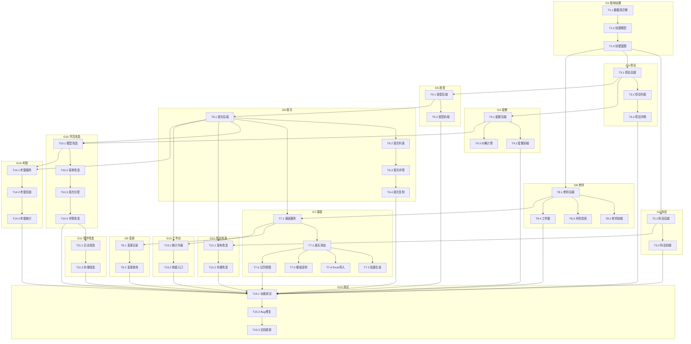

# 第二阶段 Task 文档 - 课程管理模块

## 文档信息

| 项目 | 内容 |
|------|------|
| **任务名称** | 第二阶段 - 课程管理模块开发 |
| **阶段** | Atomize（原子化阶段） |
| **创建日期** | 2026-01-27 |
| **状态** | ✅ 已完成 |

---

## 1. 任务总览

### 1.1 任务分组

| 分组 | 任务数 | 预计时间 | 说明 |
|------|--------|----------|------|
| **G1: 基础设施** | 3 | 2天 | 数据库、模型、蓝图 |
| **G2: 科目管理** | 2 | 1天 | 科目CRUD |
| **G3: 招生项目** | 3 | 1.5天 | 项目CRUD |
| **G4: 报名套餐** | 3 | 1.5天 | 套餐CRUD+优惠 |
| **G5: 班型管理** | 2 | 1天 | 班型CRUD |
| **G6: 班次管理** | 4 | 2天 | 班次CRUD+复制 |
| **G7: 课表管理** | 6 | 3天 | 课表核心功能 |
| **G8: 老师管理** | 4 | 2天 | 老师CRUD+排课 |
| **G9: 变更记录** | 2 | 1天 | 变更记录功能 |
| **G10: 学员改造** | 4 | 2天 | 学员模块整合 |
| **G11: 督学改造** | 2 | 1天 | 督学模块整合 |
| **G12: 作业改造** | 2 | 1天 | 作业模块整合 |
| **G13: 工作台升级** | 2 | 1天 | 工作台整合 |
| **G14: 考勤管理** | 3 | 1.5天 | 考勤基础功能 |
| **G15: 测试优化** | 3 | 2天 | 测试和修复 |
| **总计** | **45** | **~23天** | |

---

## 2. 任务详细清单

### G1: 基础设施

#### T1.1 数据库迁移脚本

| 属性 | 值 |
|------|-----|
| **任务ID** | T1.1 |
| **任务名称** | 创建数据库迁移脚本 |
| **优先级** | P0 |
| **前置依赖** | 无 |
| **输入契约** | DESIGN文档中的数据库设计 |
| **输出契约** | `migrations/002_add_course_tables.py` |
| **验收标准** | 执行迁移后所有新表创建成功，现有表字段正确添加 |
| **预计时间** | 4小时 |

**实现要点**:
- 创建9张新表
- 修改3张现有表
- 添加预设科目数据
- 支持回滚

---

#### T1.2 创建模型文件

| 属性 | 值 |
|------|-----|
| **任务ID** | T1.2 |
| **任务名称** | 创建课程相关模型 |
| **优先级** | P0 |
| **前置依赖** | T1.1 |
| **输入契约** | 数据库表结构 |
| **输出契约** | `app/models/course.py`, `app/models/teacher.py`, `app/models/attendance.py` |
| **验收标准** | 模型类定义正确，关系映射正确，方法可用 |
| **预计时间** | 4小时 |

**实现要点**:
- Subject, Project, Package, ClassType, ClassBatch 模型
- Schedule, ScheduleChangeLog 模型
- Teacher 模型
- StudentBatch, Attendance 模型
- 定义关系和方法

---

#### T1.3 创建蓝图和服务

| 属性 | 值 |
|------|-----|
| **任务ID** | T1.3 |
| **任务名称** | 创建课程蓝图和服务类框架 |
| **优先级** | P0 |
| **前置依赖** | T1.2 |
| **输入契约** | DESIGN文档中的服务设计 |
| **输出契约** | `app/routes/courses.py`, `app/services/course_service.py`, `app/services/teacher_service.py`, `app/services/schedule_service.py` |
| **验收标准** | 蓝图注册成功，服务类框架完整 |
| **预计时间** | 2小时 |

**实现要点**:
- 创建 courses_bp 蓝图
- 注册到 app/__init__.py
- 创建服务类骨架
- 创建模板目录结构

---

### G2: 科目管理

#### T2.1 科目管理后端

| 属性 | 值 |
|------|-----|
| **任务ID** | T2.1 |
| **任务名称** | 实现科目管理服务和路由 |
| **优先级** | P0 |
| **前置依赖** | T1.3 |
| **输入契约** | Subject模型 |
| **输出契约** | CourseService科目方法, 科目相关路由 |
| **验收标准** | 科目CRUD功能正常，预设科目不可删除 |
| **预计时间** | 3小时 |

---

#### T2.2 科目管理前端

| 属性 | 值 |
|------|-----|
| **任务ID** | T2.2 |
| **任务名称** | 实现科目管理页面 |
| **优先级** | P0 |
| **前置依赖** | T2.1 |
| **输入契约** | 科目路由 |
| **输出契约** | `templates/courses/subjects/list.html`, `form.html` |
| **验收标准** | 页面显示正确，操作流畅，UI风格统一 |
| **预计时间** | 3小时 |

---

### G3: 招生项目

#### T3.1 项目管理后端

| 属性 | 值 |
|------|-----|
| **任务ID** | T3.1 |
| **任务名称** | 实现招生项目服务和路由 |
| **优先级** | P0 |
| **前置依赖** | T1.3 |
| **输入契约** | Project模型 |
| **输出契约** | CourseService项目方法, 项目相关路由 |
| **验收标准** | 项目CRUD功能正常，状态管理正确 |
| **预计时间** | 3小时 |

---

#### T3.2 项目管理前端-列表

| 属性 | 值 |
|------|-----|
| **任务ID** | T3.2 |
| **任务名称** | 实现项目列表和表单页面 |
| **优先级** | P0 |
| **前置依赖** | T3.1 |
| **输入契约** | 项目路由 |
| **输出契约** | `templates/courses/projects/list.html`, `form.html` |
| **验收标准** | 页面显示正确，筛选功能正常 |
| **预计时间** | 3小时 |

---

#### T3.3 项目详情页

| 属性 | 值 |
|------|-----|
| **任务ID** | T3.3 |
| **任务名称** | 实现项目详情页面 |
| **优先级** | P0 |
| **前置依赖** | T3.2 |
| **输入契约** | 项目路由 |
| **输出契约** | `templates/courses/projects/detail.html` |
| **验收标准** | 显示套餐列表、班型列表、统计信息 |
| **预计时间** | 2小时 |

---

### G4: 报名套餐

#### T4.1 套餐管理后端

| 属性 | 值 |
|------|-----|
| **任务ID** | T4.1 |
| **任务名称** | 实现报名套餐服务和路由 |
| **优先级** | P0 |
| **前置依赖** | T3.1 |
| **输入契约** | Package模型 |
| **输出契约** | CourseService套餐方法, 套餐相关路由 |
| **验收标准** | 套餐CRUD功能正常，优惠规则存储正确 |
| **预计时间** | 4小时 |

---

#### T4.2 套餐管理前端

| 属性 | 值 |
|------|-----|
| **任务ID** | T4.2 |
| **任务名称** | 实现套餐管理页面 |
| **优先级** | P0 |
| **前置依赖** | T4.1 |
| **输入契约** | 套餐路由 |
| **输出契约** | `templates/courses/packages/list.html`, `form.html` |
| **验收标准** | 页面显示正确，优惠规则配置可用 |
| **预计时间** | 4小时 |

---

#### T4.3 价格计算功能

| 属性 | 值 |
|------|-----|
| **任务ID** | T4.3 |
| **任务名称** | 实现套餐价格计算 |
| **优先级** | P0 |
| **前置依赖** | T4.1 |
| **输入契约** | 套餐和优惠规则 |
| **输出契约** | calculate_price方法, API端点 |
| **验收标准** | 根据优惠类型正确计算价格 |
| **预计时间** | 2小时 |

---

### G5: 班型管理

#### T5.1 班型管理后端

| 属性 | 值 |
|------|-----|
| **任务ID** | T5.1 |
| **任务名称** | 实现班型管理服务和路由 |
| **优先级** | P0 |
| **前置依赖** | T3.1 |
| **输入契约** | ClassType模型 |
| **输出契约** | CourseService班型方法, 班型相关路由 |
| **验收标准** | 班型CRUD功能正常，排序功能正确 |
| **预计时间** | 3小时 |

---

#### T5.2 班型管理前端

| 属性 | 值 |
|------|-----|
| **任务ID** | T5.2 |
| **任务名称** | 实现班型管理页面 |
| **优先级** | P0 |
| **前置依赖** | T5.1 |
| **输入契约** | 班型路由 |
| **输出契约** | `templates/courses/types/list.html`, `form.html` |
| **验收标准** | 页面显示正确，拖拽排序可用 |
| **预计时间** | 3小时 |

---

### G6: 班次管理

#### T6.1 班次管理后端

| 属性 | 值 |
|------|-----|
| **任务ID** | T6.1 |
| **任务名称** | 实现班次管理服务和路由 |
| **优先级** | P0 |
| **前置依赖** | T5.1 |
| **输入契约** | ClassBatch模型 |
| **输出契约** | CourseService班次方法, 班次相关路由 |
| **验收标准** | 班次CRUD功能正常，状态管理正确 |
| **预计时间** | 4小时 |

---

#### T6.2 班次管理前端-列表

| 属性 | 值 |
|------|-----|
| **任务ID** | T6.2 |
| **任务名称** | 实现班次列表和表单页面 |
| **优先级** | P0 |
| **前置依赖** | T6.1 |
| **输入契约** | 班次路由 |
| **输出契约** | `templates/courses/batches/list.html`, `form.html` |
| **验收标准** | 页面显示正确，显示报名人数 |
| **预计时间** | 3小时 |

---

#### T6.3 班次详情页

| 属性 | 值 |
|------|-----|
| **任务ID** | T6.3 |
| **任务名称** | 实现班次详情页面 |
| **优先级** | P0 |
| **前置依赖** | T6.2 |
| **输入契约** | 班次路由 |
| **输出契约** | `templates/courses/batches/detail.html` |
| **验收标准** | 显示学员列表、课表、统计信息 |
| **预计时间** | 3小时 |

---

#### T6.4 班次复制功能

| 属性 | 值 |
|------|-----|
| **任务ID** | T6.4 |
| **任务名称** | 实现班次复制功能 |
| **优先级** | P1 |
| **前置依赖** | T6.3 |
| **输入契约** | 源班次 |
| **输出契约** | copy_batch方法, 复制弹窗 |
| **验收标准** | 复制班次和课表成功 |
| **预计时间** | 2小时 |

---

### G7: 课表管理

#### T7.1 课表服务基础

| 属性 | 值 |
|------|-----|
| **任务ID** | T7.1 |
| **任务名称** | 实现课表基础服务 |
| **优先级** | P0 |
| **前置依赖** | T6.1, T8.1 |
| **输入契约** | Schedule模型, Teacher模型 |
| **输出契约** | ScheduleService基础方法 |
| **验收标准** | 课表CRUD功能正常 |
| **预计时间** | 3小时 |

---

#### T7.2 课表逐天添加

| 属性 | 值 |
|------|-----|
| **任务ID** | T7.2 |
| **任务名称** | 实现课表逐天添加功能 |
| **优先级** | P0 |
| **前置依赖** | T7.1 |
| **输入契约** | 课表路由 |
| **输出契约** | `templates/courses/schedules/add.html`, `list.html` |
| **验收标准** | 可以逐天添加课表，选择科目和老师 |
| **预计时间** | 4小时 |

---

#### T7.3 课表批量生成

| 属性 | 值 |
|------|-----|
| **任务ID** | T7.3 |
| **任务名称** | 实现课表批量生成功能 |
| **优先级** | P0 |
| **前置依赖** | T7.2 |
| **输入契约** | 科目列表和天数 |
| **输出契约** | generate_schedules方法, `generate.html` |
| **验收标准** | 设置科目和天数后自动生成课表 |
| **预计时间** | 4小时 |

---

#### T7.4 课表Excel导入

| 属性 | 值 |
|------|-----|
| **任务ID** | T7.4 |
| **任务名称** | 实现课表Excel导入功能 |
| **优先级** | P0 |
| **前置依赖** | T7.2 |
| **输入契约** | Excel文件 |
| **输出契约** | import_from_excel方法, `import.html`, 模板文件 |
| **验收标准** | 上传Excel后正确解析并导入课表 |
| **预计时间** | 5小时 |

---

#### T7.5 课表模板复制

| 属性 | 值 |
|------|-----|
| **任务ID** | T7.5 |
| **任务名称** | 实现课表模板复制功能 |
| **优先级** | P1 |
| **前置依赖** | T7.2 |
| **输入契约** | 源班次ID |
| **输出契约** | copy_from_batch方法, 复制弹窗 |
| **验收标准** | 从其他班次复制课表成功 |
| **预计时间** | 2小时 |

---

#### T7.6 课表日历视图

| 属性 | 值 |
|------|-----|
| **任务ID** | T7.6 |
| **任务名称** | 实现课表日历视图 |
| **优先级** | P1 |
| **前置依赖** | T7.2 |
| **输入契约** | 课表数据 |
| **输出契约** | `templates/courses/calendar.html`, calendar_events API |
| **验收标准** | 日历视图显示所有班次课表，可点击查看详情 |
| **预计时间** | 4小时 |

---

### G8: 老师管理

#### T8.1 老师管理后端

| 属性 | 值 |
|------|-----|
| **任务ID** | T8.1 |
| **任务名称** | 实现老师管理服务和路由 |
| **优先级** | P0 |
| **前置依赖** | T1.3 |
| **输入契约** | Teacher模型 |
| **输出契约** | TeacherService, 老师相关路由 |
| **验收标准** | 老师CRUD功能正常 |
| **预计时间** | 3小时 |

---

#### T8.2 老师管理前端

| 属性 | 值 |
|------|-----|
| **任务ID** | T8.2 |
| **任务名称** | 实现老师管理页面 |
| **优先级** | P0 |
| **前置依赖** | T8.1 |
| **输入契约** | 老师路由 |
| **输出契约** | `templates/courses/teachers/list.html`, `form.html`, `detail.html` |
| **验收标准** | 页面显示正确，显示擅长科目 |
| **预计时间** | 4小时 |

---

#### T8.3 老师冲突检测

| 属性 | 值 |
|------|-----|
| **任务ID** | T8.3 |
| **任务名称** | 实现老师时间冲突检测 |
| **优先级** | P0 |
| **前置依赖** | T8.1 |
| **输入契约** | 老师ID、日期 |
| **输出契约** | check_conflict方法, API端点 |
| **验收标准** | 排课时正确检测冲突并提示 |
| **预计时间** | 3小时 |

---

#### T8.4 老师工作量统计

| 属性 | 值 |
|------|-----|
| **任务ID** | T8.4 |
| **任务名称** | 实现老师工作量统计 |
| **优先级** | P1 |
| **前置依赖** | T8.1, T7.1 |
| **输入契约** | 老师排课数据 |
| **输出契约** | get_workload方法, `workload.html` |
| **验收标准** | 正确统计上课天数和应付薪资 |
| **预计时间** | 3小时 |

---

### G9: 变更记录

#### T9.1 变更记录功能

| 属性 | 值 |
|------|-----|
| **任务ID** | T9.1 |
| **任务名称** | 实现变更记录自动保存 |
| **优先级** | P0 |
| **前置依赖** | T7.1 |
| **输入契约** | 课表修改操作 |
| **输出契约** | record_change方法 |
| **验收标准** | 换老师/调课时自动记录变更 |
| **预计时间** | 3小时 |

---

#### T9.2 变更记录查询

| 属性 | 值 |
|------|-----|
| **任务ID** | T9.2 |
| **任务名称** | 实现变更记录查询页面 |
| **优先级** | P1 |
| **前置依赖** | T9.1 |
| **输入契约** | 变更记录数据 |
| **输出契约** | `templates/courses/change_logs.html` |
| **验收标准** | 可按班次/老师/时间筛选查询 |
| **预计时间** | 2小时 |

---

### G10: 学员模块改造

#### T10.1 学员模型改造

| 属性 | 值 |
|------|-----|
| **任务ID** | T10.1 |
| **任务名称** | 改造学员模型和服务 |
| **优先级** | P0 |
| **前置依赖** | T4.1, T6.1 |
| **输入契约** | 新字段定义 |
| **输出契约** | Student模型更新, StudentService更新 |
| **验收标准** | 学员可关联套餐和班次 |
| **预计时间** | 3小时 |

---

#### T10.2 学员表单改造

| 属性 | 值 |
|------|-----|
| **任务ID** | T10.2 |
| **任务名称** | 改造学员新增/编辑页面 |
| **优先级** | P0 |
| **前置依赖** | T10.1 |
| **输入契约** | 学员路由 |
| **输出契约** | `templates/students/form.html` 更新 |
| **验收标准** | 可选择报名套餐，联动显示价格 |
| **预计时间** | 4小时 |

---

#### T10.3 学员班次分配

| 属性 | 值 |
|------|-----|
| **任务ID** | T10.3 |
| **任务名称** | 实现学员班次分配功能 |
| **优先级** | P0 |
| **前置依赖** | T10.2 |
| **输入契约** | 学员ID, 班次ID |
| **输出契约** | 学员班次关联API |
| **验收标准** | 可为学员分配/移除班次 |
| **预计时间** | 3小时 |

---

#### T10.4 学员详情页改造

| 属性 | 值 |
|------|-----|
| **任务ID** | T10.4 |
| **任务名称** | 改造学员详情页显示课程信息 |
| **优先级** | P0 |
| **前置依赖** | T10.3 |
| **输入契约** | 学员课程数据 |
| **输出契约** | `templates/students/detail.html` 更新 |
| **验收标准** | 显示课程信息、学习进度、已分配班次 |
| **预计时间** | 4小时 |

---

### G11: 督学模块改造

#### T11.1 督学日志改造

| 属性 | 值 |
|------|-----|
| **任务ID** | T11.1 |
| **任务名称** | 改造督学日志表单 |
| **优先级** | P1 |
| **前置依赖** | T10.4 |
| **输入契约** | 学员课程数据 |
| **输出契约** | `templates/supervision/log_form.html` 更新 |
| **验收标准** | 自动显示学员当前班次和进度 |
| **预计时间** | 3小时 |

---

#### T11.2 督学日志存储改造

| 属性 | 值 |
|------|-----|
| **任务ID** | T11.2 |
| **任务名称** | 督学日志存储课程信息 |
| **优先级** | P1 |
| **前置依赖** | T11.1 |
| **输入契约** | 新字段定义 |
| **输出契约** | SupervisionLog模型更新 |
| **验收标准** | 督学日志记录当时的班次和进度 |
| **预计时间** | 2小时 |

---

### G12: 作业模块改造

#### T12.1 作业发布改造

| 属性 | 值 |
|------|-----|
| **任务ID** | T12.1 |
| **任务名称** | 改造作业发布页面 |
| **优先级** | P1 |
| **前置依赖** | T6.1, T2.1 |
| **输入契约** | 班次和科目数据 |
| **输出契约** | `templates/homework/create.html` 更新 |
| **验收标准** | 可按班次布置作业，可关联科目 |
| **预计时间** | 3小时 |

---

#### T12.2 作业存储改造

| 属性 | 值 |
|------|-----|
| **任务ID** | T12.2 |
| **任务名称** | 作业存储班次和科目信息 |
| **优先级** | P1 |
| **前置依赖** | T12.1 |
| **输入契约** | 新字段定义 |
| **输出契约** | HomeworkTask模型更新 |
| **验收标准** | 作业正确关联班次和科目 |
| **预计时间** | 2小时 |

---

### G13: 工作台升级

#### T13.1 工作台统计升级

| 属性 | 值 |
|------|-----|
| **任务ID** | T13.1 |
| **任务名称** | 工作台新增课程统计 |
| **优先级** | P1 |
| **前置依赖** | T6.1, T7.1 |
| **输入契约** | 课程数据 |
| **输出契约** | `templates/dashboard/index.html` 更新 |
| **验收标准** | 显示今日课程、招生统计等 |
| **预计时间** | 3小时 |

---

#### T13.2 工作台快捷入口

| 属性 | 值 |
|------|-----|
| **任务ID** | T13.2 |
| **任务名称** | 工作台新增课程快捷入口 |
| **优先级** | P2 |
| **前置依赖** | T13.1 |
| **输入契约** | - |
| **输出契约** | 工作台页面更新 |
| **验收标准** | 显示今日课表、快速签到等入口 |
| **预计时间** | 2小时 |

---

### G14: 考勤管理

#### T14.1 考勤服务

| 属性 | 值 |
|------|-----|
| **任务ID** | T14.1 |
| **任务名称** | 实现考勤服务 |
| **优先级** | P1 |
| **前置依赖** | T6.1, T10.1 |
| **输入契约** | Attendance模型 |
| **输出契约** | AttendanceService |
| **验收标准** | 签到、缺课、请假功能正常 |
| **预计时间** | 3小时 |

---

#### T14.2 考勤页面

| 属性 | 值 |
|------|-----|
| **任务ID** | T14.2 |
| **任务名称** | 实现考勤管理页面 |
| **优先级** | P1 |
| **前置依赖** | T14.1 |
| **输入契约** | 考勤路由 |
| **输出契约** | 考勤相关页面 |
| **验收标准** | 可按班次查看和记录考勤 |
| **预计时间** | 4小时 |

---

#### T14.3 考勤统计

| 属性 | 值 |
|------|-----|
| **任务ID** | T14.3 |
| **任务名称** | 实现考勤统计功能 |
| **优先级** | P2 |
| **前置依赖** | T14.2 |
| **输入契约** | 考勤数据 |
| **输出契约** | get_attendance_stats方法, 统计视图 |
| **验收标准** | 正确统计出勤率 |
| **预计时间** | 2小时 |

---

### G15: 测试优化

#### T15.1 功能测试

| 属性 | 值 |
|------|-----|
| **任务ID** | T15.1 |
| **任务名称** | 全面功能测试 |
| **优先级** | P0 |
| **前置依赖** | G1-G14所有任务 |
| **输入契约** | 完整功能 |
| **输出契约** | 测试报告, Bug列表 |
| **验收标准** | 覆盖所有功能点 |
| **预计时间** | 8小时 |

---

#### T15.2 Bug修复

| 属性 | 值 |
|------|-----|
| **任务ID** | T15.2 |
| **任务名称** | Bug修复 |
| **优先级** | P0 |
| **前置依赖** | T15.1 |
| **输入契约** | Bug列表 |
| **输出契约** | 修复代码 |
| **验收标准** | 所有Bug修复 |
| **预计时间** | 8小时 |

---

#### T15.3 文档更新

| 属性 | 值 |
|------|-----|
| **任务ID** | T15.3 |
| **任务名称** | 更新项目文档 |
| **优先级** | P1 |
| **前置依赖** | T15.2 |
| **输入契约** | 完成的功能 |
| **输出契约** | 更新后的文档 |
| **验收标准** | 文档准确完整 |
| **预计时间** | 4小时 |

---

## 3. 任务依赖图



---

## 4. 执行计划

### Week 1 (Day 1-5)

| 日期 | 任务 | 产出 |
|------|------|------|
| Day 1 | T1.1, T1.2 | 数据库迁移，模型创建 |
| Day 2 | T1.3, T2.1, T2.2 | 蓝图创建，科目管理完成 |
| Day 3 | T3.1, T3.2, T3.3 | 招生项目管理完成 |
| Day 4 | T4.1, T4.2, T4.3 | 报名套餐管理完成 |
| Day 5 | T5.1, T5.2, T8.1 | 班型管理完成，老师后端 |

### Week 2 (Day 6-10)

| 日期 | 任务 | 产出 |
|------|------|------|
| Day 6 | T8.2, T8.3 | 老师管理完成，冲突检测 |
| Day 7 | T6.1, T6.2 | 班次后端和列表 |
| Day 8 | T6.3, T6.4 | 班次详情和复制 |
| Day 9 | T7.1, T7.2 | 课表服务，逐天添加 |
| Day 10 | T7.3, T7.4 | 批量生成，Excel导入 |

### Week 3 (Day 11-15)

| 日期 | 任务 | 产出 |
|------|------|------|
| Day 11 | T7.5, T7.6 | 模板复制，日历视图 |
| Day 12 | T8.4, T9.1, T9.2 | 工作量统计，变更记录 |
| Day 13 | T10.1, T10.2 | 学员模型和表单改造 |
| Day 14 | T10.3, T10.4 | 学员班次分配，详情改造 |
| Day 15 | T11.1, T11.2 | 督学模块改造 |

### Week 4 (Day 16-20)

| 日期 | 任务 | 产出 |
|------|------|------|
| Day 16 | T12.1, T12.2 | 作业模块改造 |
| Day 17 | T13.1, T13.2 | 工作台升级 |
| Day 18 | T14.1, T14.2 | 考勤服务和页面 |
| Day 19 | T14.3, T15.1 | 考勤统计，开始测试 |
| Day 20 | T15.1 | 继续测试 |

### Week 5 (Day 21-23)

| 日期 | 任务 | 产出 |
|------|------|------|
| Day 21 | T15.2 | Bug修复 |
| Day 22 | T15.2 | 继续Bug修复 |
| Day 23 | T15.3 | 文档更新，交付 |

---

## 5. 总结

### 5.1 任务统计

- **总任务数**: 45个
- **P0任务**: 30个
- **P1任务**: 12个
- **P2任务**: 3个
- **预计工时**: 约23天

### 5.2 关键路径

```
T1.1 → T1.2 → T1.3 → T3.1 → T5.1 → T6.1 → T7.1 → T7.2 → T10.1 → T10.4 → T15.1 → T15.2
```

### 5.3 下一步

进入 **Approve（审批）** 阶段：
- 确认任务计划
- 评估风险
- 开始执行

---

**任务拆分状态**: ✅ 已完成  
**确认日期**: 2026-01-27  
**下一阶段**: Approve（审批确认）
