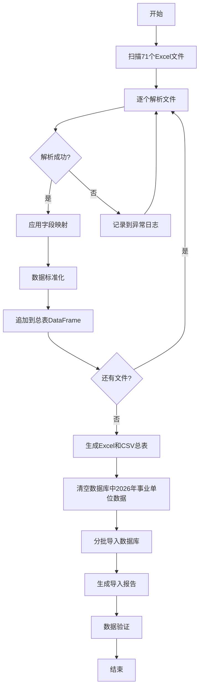

# 共识文档 - 安徽省事业单位岗位整合

## 执行决策（已确认）

基于ALIGNMENT文档的分析，用户已确认采用推荐方案，以下为最终执行标准。

---

## 一、任务目标

将安徽省事业单位2026年度招聘岗位数据整合并导入到现有公考管理系统中，实现与现有省考/国考岗位的统一管理。

**核心目标**
1. ✅ 整合71个Excel文件为统一总表
2. ✅ 导入到Position数据库表
3. ✅ 与现有选岗功能无缝集成

---

## 二、数据源确认

### 2.1 文件清单

**省级/系统级（3个文件）**
- 安徽省2026年度省直事业单位统一公开招聘岗位汇总表.xlsx（约349条）
- 国家税务总局安徽省税务系统2026年事业单位公开招聘岗位表.xlsx（约68条）
- 2026年度事业单位工作人员公开招聘岗位汇总表.xlsx（粮食储备局，约60条）

**地市级（68个文件，14个地市）**
- 合肥市岗位表/（7个文件）
- 芜湖市岗位表/（3个文件）
- 蚌埠市岗位表/（1个文件）
- 铜陵市岗位表/（5个文件）
- 黄山市岗位表/（8个文件）
- 六安市岗位表/（6个文件）
- 宣城市岗位表/（7个文件）
- 安庆市岗位表/（若干）
- 宿州市岗位表/（若干）
- 淮北市岗位表/（若干）
- 淮南市岗位表/（若干）
- 滁州市岗位表/（若干）
- 阜阳市岗位表/（若干）
- 马鞍山市岗位表/（若干）

**总计：71个Excel文件，预估3000-5000条岗位记录**

---

## 三、技术方案（已确认）

### 3.1 关键决策

✅ **决策1：考试类型命名**
- 采用：`exam_type = '事业单位'`
- 理由：简洁明确，与"省考"、"国考"格式一致

✅ **决策2：已有数据处理**
- 采用：清空2026年事业单位数据后导入
- 执行：`DELETE FROM positions WHERE year=2026 AND exam_type='事业单位'`

✅ **决策3：异常文件处理**
- 采用：跳过无法解析的文件，详细记录日志
- 策略：继续处理其他文件，最后生成异常报告供人工核查

✅ **决策4：总表格式**
- 采用：同时生成Excel和CSV两种格式
- 文件：
  - `整合后总表_2026年安徽省事业单位岗位.xlsx`
  - `整合后总表_2026年安徽省事业单位岗位.csv`

✅ **决策5：导入方式**
- 采用：命令行脚本
- 原因：快速实现，后续可扩展Web界面

---

## 四、数据模型映射

### 4.1 Position表字段映射

| Position字段 | 事业单位数据源 | 映射规则 | 示例 |
|-------------|--------------|---------|------|
| **year** | 固定值 | `2026` | 2026 |
| **exam_type** | 固定值 | `'事业单位'` | 事业单位 |
| **affiliation** | 根据数据源 | 省级文件→"省"<br>地市文件→"市" | 省/市 |
| **region_code** | 自动生成 | 地市代码（标准行政区划码） | 340100 |
| **region_name** | Excel：区县名 | 如"肥东县"、"蜀山区" | 肥东县 |
| **city** | Excel：地市名或自动提取 | 从文件夹名称提取 | 合肥市 |
| **system_type** | Excel："单位类别" | 公益一类/公益二类/公益三类 | 公益一类 |
| **department_code** | Excel："单位代码" | 保持原样（可能为空） | - |
| **department_name** | Excel："招聘单位"或"主管部门" | 完整单位名称 | 安徽省党风廉政教育基地 |
| **position_code** | Excel："岗位代码" | 保持原样 | 3000001 |
| **position_name** | Excel："岗位名称" | 如"专业技术"、"管理岗位" | 专业技术 |
| **position_desc** | Excel："备注" | 职位简介或特殊说明 | - |
| **exam_category** | Excel："公共科目类别" | A/B/C/D/E类 | 综合管理类(A类) |
| **open_ratio** | 默认值 | `3`（1:3开考比例） | 3 |
| **recruit_count** | Excel："拟聘人数" | 整数 | 2 |
| **education** | Excel："学历" | 标准化处理 | 本科及以上 |
| **major_requirement** | Excel："专业" | 完整专业要求文本 | 电气工程及其自动化... |
| **other_requirements** | Excel："其他条件"或"年龄" | 年龄、性别、政治面貌等 | 38周岁以下；限男性 |
| **apply_count** | NULL | 报名后更新 | NULL |
| **competition_ratio** | NULL | 报名后更新 | NULL |
| **min_entry_score** | NULL | 笔试后更新 | NULL |
| **max_entry_score** | NULL | 笔试后更新 | NULL |

### 4.2 字段标准化规则

**学历标准化**
- "本科" → "本科及以上"
- "研究生" → "研究生及以上"
- "大专" → "大专及以上"
- "本科及以上"、"硕士及以上" → 保持原样

**考试类别标准化**
- "综合管理类（A类）" → "综合管理类(A类)"
- "A类" → "综合管理类(A类)"
- "社会科学专技类（B类）" → "社会科学专技类(B类)"
- 保持原有分类体系

**地区名称标准化**
- 从文件夹名称提取：`六安市岗位表/` → `city='六安市'`
- 从Excel中提取区县：`region_name='金安区'`

---

## 五、实现架构

### 5.1 脚本结构

```
gongkao-system/scripts/
├── import_shiye_positions.py          # 主导入脚本（核心）
│   ├── parse_excel_files()            # 解析所有Excel
│   ├── standardize_data()             # 数据标准化
│   ├── generate_summary_table()       # 生成总表
│   └── import_to_database()           # 导入数据库
│
├── shiye_field_mapping.json           # 字段映射配置
│   └── 各种Excel列名变体的映射规则
│
└── shiye_import_log.txt               # 执行日志（自动生成）
```

### 5.2 执行流程



### 5.3 关键技术点

**1. 智能列名识别**
```python
# 支持列名变体
COLUMN_MAPPING = {
    'position_name': ['岗位名称', '岗位\n名称', '职位名称'],
    'position_code': ['岗位代码', '岗位\n代码', '职位代码'],
    'recruit_count': ['拟聘人数', '招聘人数', '计划数'],
    # ...更多映射
}
```

**2. 多行表头处理**
```python
# 自动检测并跳过标题行
df = pd.read_excel(file_path, header=None)
# 查找包含"序号"、"岗位代码"等关键字的行作为表头
header_row = find_header_row(df)
df = pd.read_excel(file_path, header=header_row)
```

**3. 分批导入**
```python
# 每次导入500条，避免内存问题
BATCH_SIZE = 500
for i in range(0, len(positions), BATCH_SIZE):
    batch = positions[i:i+BATCH_SIZE]
    db.session.bulk_insert_mappings(Position, batch)
    db.session.commit()
```

---

## 六、验收标准（明确）

### 6.1 数据完整性

- [ ] 71个文件全部扫描
- [ ] 成功解析文件数 ≥ 65个（≥91.5%成功率）
- [ ] 生成的总表记录数在预期范围（3000-5000条）
- [ ] 所有必填字段无空值（year, exam_type, city, department_name, position_name, recruit_count）

### 6.2 数据准确性

- [ ] 随机抽取10条记录，人工核对源文件，准确率100%
- [ ] 地区信息完整（city字段100%填充）
- [ ] 岗位代码无重复（同一地区内）
- [ ] 招录人数均为正整数

### 6.3 系统集成

- [ ] Position表中可查询到 `exam_type='事业单位'` 的数据
- [ ] 岗位搜索功能可按事业单位类型筛选
- [ ] 学员选岗功能可匹配事业单位岗位
- [ ] 统计功能正确显示事业单位数据

### 6.4 交付物

- [ ] Excel总表：`整合后总表_2026年安徽省事业单位岗位.xlsx`
- [ ] CSV总表：`整合后总表_2026年安徽省事业单位岗位.csv`
- [ ] 导入脚本：`import_shiye_positions.py`
- [ ] 字段映射：`shiye_field_mapping.json`
- [ ] 导入日志：`shiye_import_log.txt`
- [ ] 异常报告：`shiye_import_errors.txt`
- [ ] 数据验证SQL：`shiye_data_validation.sql`

---

## 七、边界和约束

### 7.1 功能边界

**包含**
- ✅ 数据解析和整合
- ✅ 数据导入Position表
- ✅ 基础数据验证
- ✅ 与现有功能集成

**不包含**
- ❌ 修改Position表结构
- ❌ 修改前端界面（除非发现严重不兼容）
- ❌ 添加报名数据（需后续单独处理）
- ❌ 历史数据迁移（仅处理2026年）

### 7.2 技术约束

- 复用现有Position模型，不修改表结构
- 使用Python + pandas进行数据处理
- 使用SQLAlchemy进行数据库操作
- 兼容SQLite和MySQL数据库

### 7.3 数据质量约束

- 允许部分字段为空（如：单位代码、备注）
- 对无法解析的文件，跳过并记录
- 对格式异常的数据，使用默认值或空值
- 保持源数据的原始性（不做过度加工）

---

## 八、风险和应对

| 风险 | 可能性 | 影响 | 应对措施 |
|------|-------|------|---------|
| Excel格式差异大 | 高 | 中 | 建立灵活的字段映射机制 |
| 部分文件无法解析 | 中 | 低 | 跳过并记录，人工核查 |
| 数据量超预期 | 低 | 低 | 分批导入，优化性能 |
| 字段语义不明确 | 中 | 中 | 保留原始文本，后续人工校准 |
| 岗位代码重复 | 低 | 中 | 检测并报告，必要时加前缀 |

---

## 九、后续扩展（不在本次范围）

- 事业单位报名数据实时抓取
- 事业单位竞争度分析
- 历年事业单位岗位对比
- Web管理后台批量导入功能
- 事业单位专属备考计划生成

---

**文档状态**：已确认，进入DESIGN阶段  
**确认时间**：2026-02-04  
**执行决策**：采用全部推荐方案  
**下一步**：生成DESIGN文档（详细架构设计）
