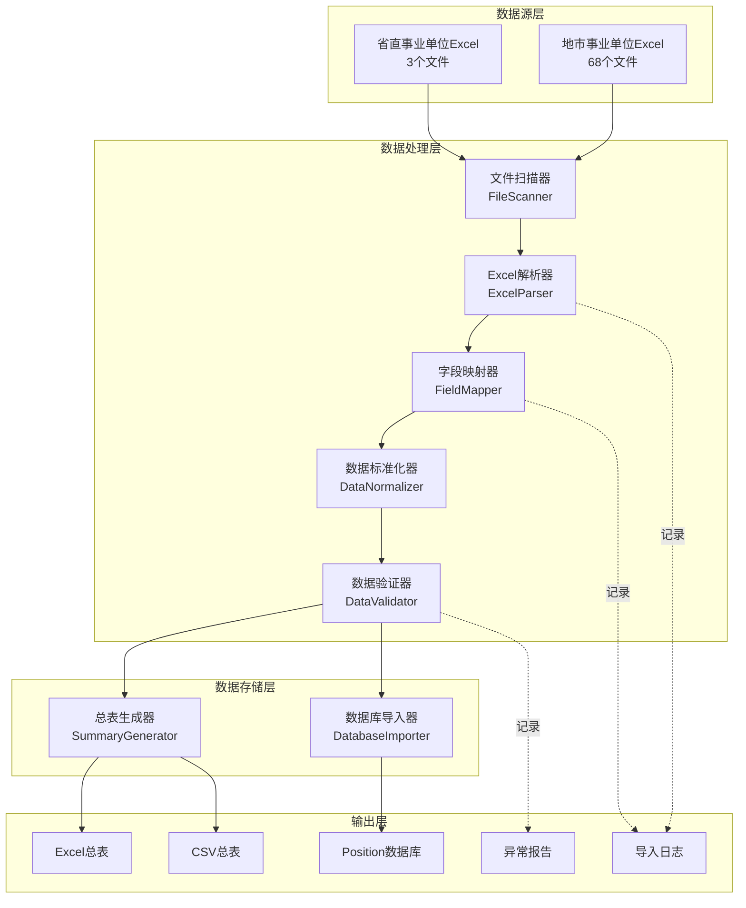
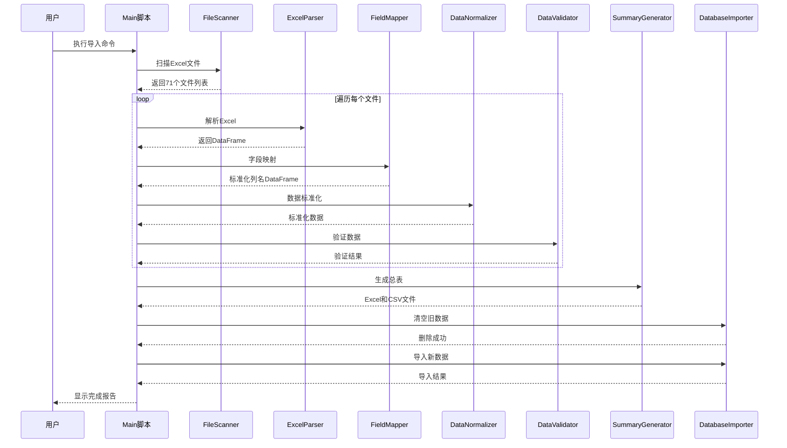

# 设计文档 - 安徽省事业单位岗位整合

## 系统架构设计

基于CONSENSUS文档的确认决策，本文档详细定义技术实现方案。

---

## 一、整体架构

### 1.1 架构图



### 1.2 核心组件

| 组件 | 职责 | 输入 | 输出 |
|------|------|------|------|
| **FileScanner** | 扫描所有Excel文件 | 根目录路径 | 文件路径列表 |
| **ExcelParser** | 解析Excel文件 | Excel文件路径 | 原始DataFrame |
| **FieldMapper** | 字段映射 | 原始DataFrame + 映射配置 | 标准化列名DataFrame |
| **DataNormalizer** | 数据标准化 | DataFrame | 标准化数据 |
| **DataValidator** | 数据验证 | DataFrame | 验证结果 + 错误列表 |
| **SummaryGenerator** | 生成总表 | 所有标准化数据 | Excel/CSV文件 |
| **DatabaseImporter** | 导入数据库 | 标准化数据 | 数据库记录 |

---

## 二、详细设计

### 2.1 模块设计

#### 模块1：FileScanner（文件扫描器）

**功能**：递归扫描目录，找到所有Excel文件

**输入**
- `root_path`：根目录路径
- `file_patterns`：文件匹配模式（默认：`*.xlsx, *.xls`）

**输出**
- `List[FileInfo]`：文件信息列表
  ```python
  FileInfo = {
      'path': str,           # 文件完整路径
      'filename': str,       # 文件名
      'city': str,           # 所属城市（从文件夹提取）
      'is_provincial': bool, # 是否省级文件
      'size': int            # 文件大小（字节）
  }
  ```

**逻辑**
```python
def scan_files(root_path):
    files = []
    
    # 扫描根目录（省级文件）
    for file in glob(root_path + '/*.xls*'):
        files.append({
            'path': file,
            'filename': os.path.basename(file),
            'city': '省直',
            'is_provincial': True,
            'size': os.path.getsize(file)
        })
    
    # 扫描子目录（地市文件）
    for city_dir in glob(root_path + '/*岗位表/'):
        city_name = extract_city_name(city_dir)
        for file in glob(city_dir + '*.xls*'):
            files.append({
                'path': file,
                'filename': os.path.basename(file),
                'city': city_name,
                'is_provincial': False,
                'size': os.path.getsize(file)
            })
    
    return files
```

---

#### 模块2：ExcelParser（Excel解析器）

**功能**：解析Excel文件，智能识别表头

**输入**
- `file_path`：Excel文件路径

**输出**
- `pd.DataFrame`：解析后的数据
- `ParseResult`：解析结果信息

**核心逻辑**

```python
def parse_excel(file_path):
    """智能解析Excel文件"""
    try:
        # 1. 读取前10行，查找表头
        df_preview = pd.read_excel(file_path, header=None, nrows=10)
        header_row = find_header_row(df_preview)
        
        # 2. 使用找到的表头行重新读取
        df = pd.read_excel(file_path, header=header_row)
        
        # 3. 清理列名（去除换行、空格）
        df.columns = [clean_column_name(col) for col in df.columns]
        
        # 4. 移除空行
        df = df.dropna(how='all')
        
        return df, ParseResult(success=True, rows=len(df))
    
    except Exception as e:
        return None, ParseResult(success=False, error=str(e))


def find_header_row(df):
    """查找表头行"""
    keywords = ['序号', '岗位代码', '岗位名称', '招聘单位', '拟聘人数']
    
    for idx, row in df.iterrows():
        row_str = ' '.join([str(v) for v in row if pd.notna(v)])
        if any(kw in row_str for kw in keywords):
            return idx
    
    return 0  # 默认第一行


def clean_column_name(col_name):
    """清理列名"""
    if pd.isna(col_name):
        return 'Unnamed'
    
    col_name = str(col_name)
    col_name = col_name.replace('\n', '').replace(' ', '')
    col_name = col_name.strip()
    
    return col_name
```

---

#### 模块3：FieldMapper（字段映射器）

**功能**：将各种列名变体映射到标准字段

**配置文件**：`shiye_field_mapping.json`

```json
{
  "position_name": {
    "keywords": ["岗位名称", "职位名称", "岗位"],
    "priority": 1
  },
  "position_code": {
    "keywords": ["岗位代码", "职位代码", "代码"],
    "priority": 1
  },
  "department_name": {
    "keywords": ["招聘单位", "单位名称", "用人单位"],
    "priority": 1
  },
  "department_name_alt": {
    "keywords": ["主管部门"],
    "priority": 2
  },
  "recruit_count": {
    "keywords": ["拟聘人数", "招聘人数", "计划数", "人数"],
    "priority": 1
  },
  "major_requirement": {
    "keywords": ["专业", "专业要求"],
    "priority": 1
  },
  "education": {
    "keywords": ["学历", "学历要求"],
    "priority": 1
  },
  "degree": {
    "keywords": ["学位", "学位要求"],
    "priority": 2
  },
  "age": {
    "keywords": ["年龄", "年龄要求"],
    "priority": 2
  },
  "other_requirements": {
    "keywords": ["其他条件", "其他要求", "备注"],
    "priority": 3
  },
  "exam_category": {
    "keywords": ["公共科目类别", "考试类别", "科目类别"],
    "priority": 1
  },
  "unit_type": {
    "keywords": ["单位类别", "单位性质"],
    "priority": 2
  },
  "contact": {
    "keywords": ["联系电话", "咨询电话", "联系方式"],
    "priority": 3
  }
}
```

**映射逻辑**

```python
def map_fields(df, mapping_config):
    """字段映射"""
    mapped_df = pd.DataFrame()
    mapping_log = {}
    
    for standard_field, config in mapping_config.items():
        keywords = config['keywords']
        
        # 查找匹配的列
        matched_col = None
        for col in df.columns:
            if any(kw in col for kw in keywords):
                matched_col = col
                break
        
        if matched_col:
            mapped_df[standard_field] = df[matched_col]
            mapping_log[standard_field] = matched_col
        else:
            mapped_df[standard_field] = None
            mapping_log[standard_field] = 'NOT_FOUND'
    
    return mapped_df, mapping_log
```

---

#### 模块4：DataNormalizer（数据标准化器）

**功能**：标准化各字段数据格式

**标准化规则**

```python
class DataNormalizer:
    
    @staticmethod
    def normalize_education(value):
        """学历标准化"""
        if pd.isna(value):
            return None
        
        value = str(value).strip()
        
        # 标准化映射
        mappings = {
            '本科': '本科及以上',
            '本科生': '本科及以上',
            '大学本科': '本科及以上',
            '研究生': '研究生及以上',
            '硕士': '研究生及以上',
            '硕士研究生': '研究生及以上',
            '大专': '大专及以上',
            '专科': '大专及以上',
            '博士': '博士及以上',
        }
        
        for key, standard in mappings.items():
            if key in value:
                return standard
        
        return value
    
    @staticmethod
    def normalize_exam_category(value):
        """考试类别标准化"""
        if pd.isna(value):
            return None
        
        value = str(value).strip()
        
        # 标准化格式
        if 'A' in value or '综合管理' in value:
            return '综合管理类(A类)'
        elif 'B' in value or '社会科学' in value:
            return '社会科学专技类(B类)'
        elif 'C' in value or '自然科学' in value:
            return '自然科学专技类(C类)'
        elif 'D' in value or '教师' in value:
            return '中小学教师类(D类)'
        elif 'E' in value or '医疗' in value:
            return '医疗卫生类(E类)'
        
        return value
    
    @staticmethod
    def normalize_recruit_count(value):
        """招聘人数标准化"""
        if pd.isna(value):
            return 1  # 默认1人
        
        try:
            count = int(float(value))
            return max(count, 1)  # 至少1人
        except:
            return 1
    
    @staticmethod
    def normalize_city_name(value):
        """城市名称标准化"""
        if pd.isna(value):
            return None
        
        value = str(value).strip()
        
        # 确保以"市"结尾
        if value and value != '省直' and not value.endswith('市'):
            value = value + '市'
        
        return value
    
    @staticmethod
    def combine_requirements(age, other, degree):
        """合并其他条件"""
        parts = []
        
        if pd.notna(age):
            parts.append(str(age))
        if pd.notna(degree):
            parts.append(f"学位：{degree}")
        if pd.notna(other):
            parts.append(str(other))
        
        return '；'.join(parts) if parts else None
```

---

#### 模块5：DataValidator（数据验证器）

**功能**：验证数据完整性和正确性

```python
class DataValidator:
    
    REQUIRED_FIELDS = [
        'year', 'exam_type', 'city', 'department_name', 
        'position_name', 'recruit_count'
    ]
    
    @staticmethod
    def validate_row(row):
        """验证单行数据"""
        errors = []
        warnings = []
        
        # 1. 必填字段检查
        for field in DataValidator.REQUIRED_FIELDS:
            if pd.isna(row.get(field)):
                errors.append(f"缺少必填字段: {field}")
        
        # 2. 招聘人数检查
        if pd.notna(row.get('recruit_count')):
            if row['recruit_count'] <= 0:
                errors.append("招聘人数必须大于0")
        
        # 3. 岗位代码检查
        if pd.isna(row.get('position_code')):
            warnings.append("缺少岗位代码")
        
        # 4. 专业要求检查
        if pd.isna(row.get('major_requirement')):
            warnings.append("缺少专业要求")
        
        return {
            'valid': len(errors) == 0,
            'errors': errors,
            'warnings': warnings
        }
    
    @staticmethod
    def validate_dataframe(df):
        """验证整个DataFrame"""
        results = {
            'total': len(df),
            'valid': 0,
            'invalid': 0,
            'warnings': 0,
            'error_rows': []
        }
        
        for idx, row in df.iterrows():
            validation = DataValidator.validate_row(row)
            
            if validation['valid']:
                results['valid'] += 1
            else:
                results['invalid'] += 1
                results['error_rows'].append({
                    'row': idx,
                    'errors': validation['errors']
                })
            
            if validation['warnings']:
                results['warnings'] += 1
        
        return results
```

---

#### 模块6：SummaryGenerator（总表生成器）

**功能**：将所有数据合并生成总表

```python
class SummaryGenerator:
    
    @staticmethod
    def generate(all_data, output_dir):
        """生成总表"""
        # 1. 合并所有数据
        summary_df = pd.concat(all_data, ignore_index=True)
        
        # 2. 排序
        summary_df = summary_df.sort_values(
            by=['city', 'region_name', 'position_code']
        )
        
        # 3. 生成Excel
        excel_path = os.path.join(
            output_dir, 
            '整合后总表_2026年安徽省事业单位岗位.xlsx'
        )
        summary_df.to_excel(excel_path, index=False)
        
        # 4. 生成CSV
        csv_path = os.path.join(
            output_dir, 
            '整合后总表_2026年安徽省事业单位岗位.csv'
        )
        summary_df.to_csv(csv_path, index=False, encoding='utf-8-sig')
        
        return {
            'excel_path': excel_path,
            'csv_path': csv_path,
            'total_rows': len(summary_df)
        }
```

---

#### 模块7：DatabaseImporter（数据库导入器）

**功能**：将数据导入Position表

```python
class DatabaseImporter:
    
    BATCH_SIZE = 500
    
    @staticmethod
    def clear_existing_data():
        """清空现有事业单位数据"""
        deleted = Position.query.filter(
            Position.year == 2026,
            Position.exam_type == '事业单位'
        ).delete()
        db.session.commit()
        
        return deleted
    
    @staticmethod
    def import_data(df):
        """批量导入数据"""
        total = len(df)
        imported = 0
        failed = 0
        errors = []
        
        # 转换为字典列表
        records = df.to_dict('records')
        
        # 分批导入
        for i in range(0, total, DatabaseImporter.BATCH_SIZE):
            batch = records[i:i + DatabaseImporter.BATCH_SIZE]
            
            try:
                db.session.bulk_insert_mappings(Position, batch)
                db.session.commit()
                imported += len(batch)
                
                # 进度显示
                progress = (i + len(batch)) / total * 100
                print(f"导入进度: {progress:.1f}% ({i + len(batch)}/{total})")
            
            except Exception as e:
                db.session.rollback()
                failed += len(batch)
                errors.append({
                    'batch': i // DatabaseImporter.BATCH_SIZE,
                    'error': str(e)
                })
        
        return {
            'total': total,
            'imported': imported,
            'failed': failed,
            'errors': errors
        }
```

---

## 三、数据流设计

### 3.1 数据流转图



---

## 四、接口定义

### 4.1 主入口函数

```python
def main():
    """主函数"""
    print("=" * 60)
    print("安徽省事业单位岗位数据导入工具")
    print("=" * 60)
    
    # 1. 初始化
    root_path = "/Users/chaim/CodeBuddy/公考项目/安徽省事业单位"
    config = load_config("shiye_field_mapping.json")
    
    # 2. 扫描文件
    print("\n[1/7] 扫描Excel文件...")
    files = FileScanner.scan_files(root_path)
    print(f"   找到 {len(files)} 个文件")
    
    # 3. 解析和处理
    print("\n[2/7] 解析Excel文件...")
    all_data = []
    parse_log = []
    
    for file_info in files:
        result = process_single_file(file_info, config)
        if result['success']:
            all_data.append(result['data'])
        parse_log.append(result)
    
    # 4. 生成总表
    print("\n[3/7] 生成总表...")
    summary_result = SummaryGenerator.generate(all_data, root_path)
    
    # 5. 数据验证
    print("\n[4/7] 验证数据...")
    summary_df = pd.concat(all_data, ignore_index=True)
    validation_result = DataValidator.validate_dataframe(summary_df)
    
    # 6. 导入数据库
    print("\n[5/7] 清空旧数据...")
    deleted = DatabaseImporter.clear_existing_data()
    print(f"   删除了 {deleted} 条旧记录")
    
    print("\n[6/7] 导入新数据...")
    import_result = DatabaseImporter.import_data(summary_df)
    
    # 7. 生成报告
    print("\n[7/7] 生成报告...")
    generate_report(parse_log, validation_result, import_result)
    
    print("\n" + "=" * 60)
    print("导入完成！")
    print("=" * 60)
```

---

## 五、异常处理策略

### 5.1 异常分类

| 异常类型 | 处理策略 | 记录级别 |
|---------|---------|---------|
| 文件不存在 | 跳过，记录日志 | WARNING |
| 文件无法打开 | 跳过，记录日志 | ERROR |
| 表头识别失败 | 跳过，记录日志 | ERROR |
| 字段映射失败 | 使用默认值，继续处理 | WARNING |
| 数据验证失败 | 跳过该行，记录日志 | WARNING |
| 数据库插入失败 | 整批回滚，记录日志 | ERROR |

### 5.2 日志格式

```python
class ImportLogger:
    
    def __init__(self, log_file):
        self.log_file = log_file
        self.entries = []
    
    def log(self, level, message, details=None):
        entry = {
            'timestamp': datetime.now().isoformat(),
            'level': level,
            'message': message,
            'details': details
        }
        self.entries.append(entry)
        
        # 实时写入文件
        with open(self.log_file, 'a', encoding='utf-8') as f:
            f.write(f"[{entry['timestamp']}] {level}: {message}\n")
            if details:
                f.write(f"  详情: {details}\n")
```

---

## 六、性能优化

### 6.1 优化策略

1. **批量读取**：使用pandas的分块读取，避免大文件内存溢出
2. **并行处理**：使用多进程并行解析Excel（可选）
3. **批量插入**：使用bulk_insert_mappings批量写入数据库
4. **索引优化**：确保Position表有合适的索引

### 6.2 预估性能

| 操作 | 预估时间 |
|------|---------|
| 文件扫描 | < 1秒 |
| 解析71个Excel | 2-3分钟 |
| 数据标准化 | 10-20秒 |
| 生成总表 | 5-10秒 |
| 数据库导入 | 30-60秒 |
| **总计** | **3-5分钟** |

---

## 七、测试策略

### 7.1 单元测试

- 测试ExcelParser的表头识别
- 测试FieldMapper的字段映射
- 测试DataNormalizer的各标准化函数
- 测试DataValidator的验证规则

### 7.2 集成测试

- 测试单个文件的完整处理流程
- 测试数据库导入和回滚
- 测试异常文件的容错处理

### 7.3 验收测试

- 随机抽取10个文件，对比总表数据与源文件
- 在UI中测试岗位搜索功能
- 测试学员选岗匹配功能

---

**文档状态**：设计完成  
**创建时间**：2026-02-04  
**下一步**：生成TASK文档（任务拆分）
