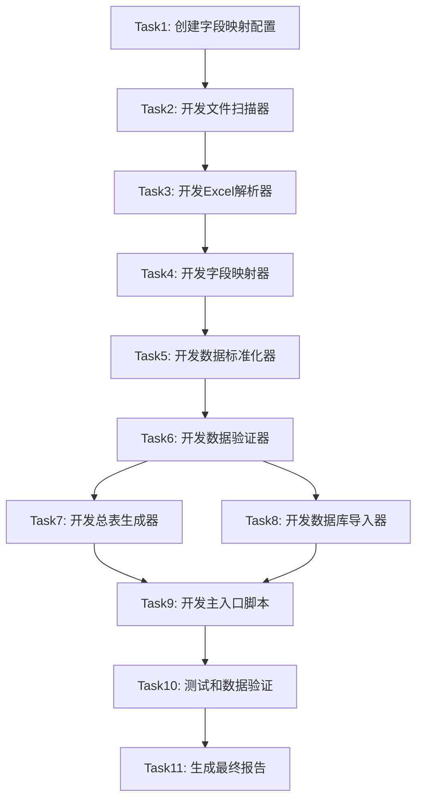

# 任务拆分文档 - 安徽省事业单位岗位整合

## 任务依赖图



---

## Task 1: 创建字段映射配置

### 输入契约
- **前置依赖**：无
- **输入数据**：样本Excel文件（已有）
- **环境依赖**：文本编辑器

### 任务描述
创建 `shiye_field_mapping.json` 配置文件，定义Excel列名到标准字段的映射规则。

### 实现步骤
1. 手工分析5-10个样本Excel文件的列名
2. 整理所有列名变体（如"岗位名称"、"岗位\n名称"、"职位名称"）
3. 定义标准字段名称
4. 编写JSON配置文件
5. 添加优先级和匹配关键词

### 输出契约
- **输出文件**：`gongkao-system/scripts/shiye_field_mapping.json`
- **验收标准**：
  - JSON格式正确，可被Python解析
  - 包含至少15个标准字段的映射
  - 每个字段包含keywords和priority

### 实现约束
- 使用JSON格式
- 关键词不少于2个变体
- 优先级：1（必须）、2（重要）、3（可选）

---

## Task 2: 开发文件扫描器

### 输入契约
- **前置依赖**：Task 1
- **输入数据**：根目录路径
- **环境依赖**：Python 3.11, os, glob模块

### 任务描述
实现FileScanner类，递归扫描目录找到所有Excel文件。

### 实现步骤
1. 创建 `gongkao-system/scripts/file_scanner.py`
2. 实现 `scan_files()` 方法
3. 实现 `extract_city_name()` 辅助方法
4. 返回文件信息列表（路径、文件名、城市、是否省级）

### 核心代码结构
```python
class FileScanner:
    @staticmethod
    def scan_files(root_path: str) -> List[Dict]:
        """扫描所有Excel文件"""
        pass
    
    @staticmethod
    def extract_city_name(folder_name: str) -> str:
        """从文件夹名提取城市名"""
        pass
```

### 输出契约
- **输出文件**：`gongkao-system/scripts/file_scanner.py`
- **返回数据**：`List[FileInfo]`
- **验收标准**：
  - 能扫描到71个Excel文件
  - 正确识别省级和地市文件
  - 正确提取城市名称

### 实现约束
- 使用Python标准库
- 支持.xls和.xlsx格式
- 容错处理（跳过无权限文件）

---

## Task 3: 开发Excel解析器

### 输入契约
- **前置依赖**：Task 2
- **输入数据**：Excel文件路径
- **环境依赖**：pandas, openpyxl

### 任务描述
实现ExcelParser类，智能识别表头并解析Excel文件。

### 实现步骤
1. 创建 `gongkao-system/scripts/excel_parser.py`
2. 实现 `parse_excel()` 方法
3. 实现 `find_header_row()` 智能表头识别
4. 实现 `clean_column_name()` 列名清理
5. 异常处理和日志记录

### 核心代码结构
```python
class ExcelParser:
    @staticmethod
    def parse_excel(file_path: str) -> Tuple[pd.DataFrame, ParseResult]:
        """解析Excel文件"""
        pass
    
    @staticmethod
    def find_header_row(df: pd.DataFrame) -> int:
        """查找表头行"""
        pass
    
    @staticmethod
    def clean_column_name(col_name: str) -> str:
        """清理列名"""
        pass
```

### 输出契约
- **输出文件**：`gongkao-system/scripts/excel_parser.py`
- **返回数据**：`(DataFrame, ParseResult)`
- **验收标准**：
  - 成功解析至少90%的文件
  - 正确识别表头行
  - 列名清理规范

### 实现约束
- 支持多种表头格式
- 跳过标题行和空行
- 记录解析失败的文件

---

## Task 4: 开发字段映射器

### 输入契约
- **前置依赖**：Task 1, Task 3
- **输入数据**：原始DataFrame, 映射配置
- **环境依赖**：pandas, json

### 任务描述
实现FieldMapper类，根据配置将Excel列名映射到标准字段。

### 实现步骤
1. 创建 `gongkao-system/scripts/field_mapper.py`
2. 加载JSON配置文件
3. 实现列名匹配算法（模糊匹配）
4. 生成映射日志
5. 处理未找到的字段

### 核心代码结构
```python
class FieldMapper:
    def __init__(self, config_path: str):
        """加载配置"""
        pass
    
    def map_fields(self, df: pd.DataFrame) -> Tuple[pd.DataFrame, Dict]:
        """字段映射"""
        pass
    
    def find_matching_column(self, columns: List[str], keywords: List[str]) -> str:
        """查找匹配的列"""
        pass
```

### 输出契约
- **输出文件**：`gongkao-system/scripts/field_mapper.py`
- **返回数据**：`(映射后DataFrame, 映射日志)`
- **验收标准**：
  - 必填字段映射率 > 95%
  - 支持列名变体匹配
  - 生成详细的映射日志

### 实现约束
- 使用配置驱动
- 支持优先级选择
- 未匹配字段设为None

---

## Task 5: 开发数据标准化器

### 输入契约
- **前置依赖**：Task 4
- **输入数据**：映射后的DataFrame
- **环境依赖**：pandas

### 任务描述
实现DataNormalizer类，标准化各字段的数据格式。

### 实现步骤
1. 创建 `gongkao-system/scripts/data_normalizer.py`
2. 实现学历标准化方法
3. 实现考试类别标准化方法
4. 实现招聘人数标准化方法
5. 实现城市名称标准化方法
6. 实现其他条件合并方法
7. 添加固定字段（year=2026, exam_type='事业单位'）

### 核心代码结构
```python
class DataNormalizer:
    @staticmethod
    def normalize(df: pd.DataFrame, city: str, is_provincial: bool) -> pd.DataFrame:
        """标准化整个DataFrame"""
        pass
    
    @staticmethod
    def normalize_education(value) -> str:
        """学历标准化"""
        pass
    
    @staticmethod
    def normalize_exam_category(value) -> str:
        """考试类别标准化"""
        pass
    
    @staticmethod
    def normalize_recruit_count(value) -> int:
        """招聘人数标准化"""
        pass
    
    @staticmethod
    def combine_requirements(age, other, degree) -> str:
        """合并其他条件"""
        pass
```

### 输出契约
- **输出文件**：`gongkao-system/scripts/data_normalizer.py`
- **返回数据**：标准化后的DataFrame
- **验收标准**：
  - 学历格式统一
  - 招聘人数均为正整数
  - year和exam_type字段正确填充
  - 城市名称规范

### 实现约束
- 保持源数据含义不变
- 处理空值和异常值
- 提供默认值策略

---

## Task 6: 开发数据验证器

### 输入契约
- **前置依赖**：Task 5
- **输入数据**：标准化后的DataFrame
- **环境依赖**：pandas

### 任务描述
实现DataValidator类，验证数据完整性和正确性。

### 实现步骤
1. 创建 `gongkao-system/scripts/data_validator.py`
2. 定义必填字段列表
3. 实现单行验证逻辑
4. 实现DataFrame验证逻辑
5. 生成验证报告

### 核心代码结构
```python
class DataValidator:
    REQUIRED_FIELDS = ['year', 'exam_type', 'city', 'department_name', 
                       'position_name', 'recruit_count']
    
    @staticmethod
    def validate_row(row: pd.Series) -> Dict:
        """验证单行"""
        pass
    
    @staticmethod
    def validate_dataframe(df: pd.DataFrame) -> Dict:
        """验证整个DataFrame"""
        pass
```

### 输出契约
- **输出文件**：`gongkao-system/scripts/data_validator.py`
- **返回数据**：验证结果字典
- **验收标准**：
  - 识别所有必填字段缺失
  - 识别数据格式错误
  - 生成详细的错误和警告列表

### 实现约束
- 区分错误（error）和警告（warning）
- 记录具体的行号和字段
- 不中断处理流程

---

## Task 7: 开发总表生成器

### 输入契约
- **前置依赖**：Task 6
- **输入数据**：所有已验证的DataFrame列表
- **环境依赖**：pandas, openpyxl

### 任务描述
实现SummaryGenerator类，合并所有数据生成Excel和CSV总表。

### 实现步骤
1. 创建 `gongkao-system/scripts/summary_generator.py`
2. 合并所有DataFrame
3. 排序（按city, region_name, position_code）
4. 导出Excel文件
5. 导出CSV文件（UTF-8 BOM编码）

### 核心代码结构
```python
class SummaryGenerator:
    @staticmethod
    def generate(all_data: List[pd.DataFrame], output_dir: str) -> Dict:
        """生成总表"""
        pass
```

### 输出契约
- **输出文件**：
  - `gongkao-system/scripts/summary_generator.py`
  - `整合后总表_2026年安徽省事业单位岗位.xlsx`
  - `整合后总表_2026年安徽省事业单位岗位.csv`
- **返回数据**：生成结果字典
- **验收标准**：
  - Excel文件可正常打开
  - CSV文件编码正确（中文无乱码）
  - 数据完整，无重复

### 实现约束
- Excel使用openpyxl引擎
- CSV使用utf-8-sig编码
- 文件保存在安徽省事业单位目录下

---

## Task 8: 开发数据库导入器

### 输入契约
- **前置依赖**：Task 6
- **输入数据**：已验证的DataFrame
- **环境依赖**：SQLAlchemy, Flask-SQLAlchemy

### 任务描述
实现DatabaseImporter类，将数据批量导入Position表。

### 实现步骤
1. 创建 `gongkao-system/scripts/database_importer.py`
2. 实现清空旧数据方法
3. 实现分批导入方法
4. 添加进度显示
5. 异常处理和回滚

### 核心代码结构
```python
class DatabaseImporter:
    BATCH_SIZE = 500
    
    @staticmethod
    def clear_existing_data() -> int:
        """清空现有事业单位数据"""
        pass
    
    @staticmethod
    def import_data(df: pd.DataFrame) -> Dict:
        """批量导入数据"""
        pass
```

### 输出契约
- **输出文件**：`gongkao-system/scripts/database_importer.py`
- **返回数据**：导入结果字典
- **验收标准**：
  - 成功导入率 > 99%
  - 进度实时显示
  - 失败数据有详细记录

### 实现约束
- 使用bulk_insert_mappings批量插入
- 每批500条，提交一次
- 异常时整批回滚
- 不使用ORM的relationship

---

## Task 9: 开发主入口脚本

### 输入契约
- **前置依赖**：Task 2-8（所有子模块）
- **输入数据**：命令行参数
- **环境依赖**：所有子模块

### 任务描述
实现主脚本 `import_shiye_positions.py`，整合所有模块完成完整流程。

### 实现步骤
1. 创建 `gongkao-system/scripts/import_shiye_positions.py`
2. 实现main()函数
3. 整合所有子模块
4. 添加进度显示
5. 生成执行日志
6. 生成最终报告

### 核心代码结构
```python
def main():
    """主函数"""
    # 1. 初始化
    # 2. 扫描文件
    # 3. 解析处理
    # 4. 生成总表
    # 5. 数据验证
    # 6. 导入数据库
    # 7. 生成报告
    pass

def process_single_file(file_info, config):
    """处理单个文件"""
    pass

if __name__ == '__main__':
    main()
```

### 输出契约
- **输出文件**：`gongkao-system/scripts/import_shiye_positions.py`
- **执行日志**：`shiye_import_log.txt`
- **异常报告**：`shiye_import_errors.txt`
- **验收标准**：
  - 完整执行流程无中断
  - 日志信息详细
  - 最终报告准确

### 实现约束
- 命令行执行
- 支持参数配置（可选）
- 异常不中断整体流程
- 最终打印统计报告

---

## Task 10: 测试和数据验证

### 输入契约
- **前置依赖**：Task 9
- **输入数据**：导入后的数据库
- **环境依赖**：数据库连接

### 任务描述
执行完整测试，验证数据正确性和系统功能。

### 实现步骤
1. 执行主脚本完成导入
2. 检查总表文件
3. 验证数据库记录数
4. 随机抽取10条记录对比源文件
5. 测试岗位搜索功能
6. 测试学员选岗匹配
7. 生成数据验证SQL

### 验证清单
- [ ] 总表Excel文件生成成功
- [ ] 总表CSV文件生成成功
- [ ] 数据库记录数符合预期（3000-5000条）
- [ ] 10条随机抽样100%准确
- [ ] 岗位搜索可筛选"事业单位"类型
- [ ] 学员选岗功能正常

### 输出契约
- **输出文件**：`gongkao-system/scripts/shiye_data_validation.sql`
- **测试报告**：记录在ACCEPTANCE文档中
- **验收标准**：所有验证清单通过

---

## Task 11: 生成最终报告

### 输入契约
- **前置依赖**：Task 10
- **输入数据**：所有执行日志和验证结果
- **环境依赖**：无

### 任务描述
整理所有结果，生成ACCEPTANCE和FINAL文档。

### 实现步骤
1. 创建 `ACCEPTANCE_安徽事业单位岗位整合.md`
2. 记录所有验收项完成情况
3. 创建 `FINAL_安徽事业单位岗位整合.md`
4. 总结项目成果
5. 创建 `TODO_安徽事业单位岗位整合.md`
6. 列出待办事项和缺失配置

### 输出契约
- **输出文件**：
  - `ACCEPTANCE_安徽事业单位岗位整合.md`
  - `FINAL_安徽事业单位岗位整合.md`
  - `TODO_安徽事业单位岗位整合.md`
- **验收标准**：
  - 文档完整
  - 总结准确
  - TODO清晰

---

## 任务执行顺序

### 串行任务（必须按顺序）
1. Task 1 → Task 2 → Task 3 → Task 4 → Task 5 → Task 6
2. Task 6 → Task 7（并行）
3. Task 6 → Task 8（并行）
4. Task 7, Task 8 → Task 9
5. Task 9 → Task 10 → Task 11

### 可并行任务
- Task 7和Task 8可以同时开发（都依赖Task 6）

---

## 时间估算

| 任务 | 预计时间 | 复杂度 |
|------|---------|--------|
| Task 1 | 30分钟 | 低 |
| Task 2 | 30分钟 | 低 |
| Task 3 | 45分钟 | 中 |
| Task 4 | 45分钟 | 中 |
| Task 5 | 60分钟 | 中 |
| Task 6 | 30分钟 | 低 |
| Task 7 | 30分钟 | 低 |
| Task 8 | 45分钟 | 中 |
| Task 9 | 45分钟 | 中 |
| Task 10 | 60分钟 | 中 |
| Task 11 | 30分钟 | 低 |
| **总计** | **6.5小时** | - |

---

**文档状态**：任务拆分完成  
**创建时间**：2026-02-04  
**下一步**：等待用户审批，然后开始执行
