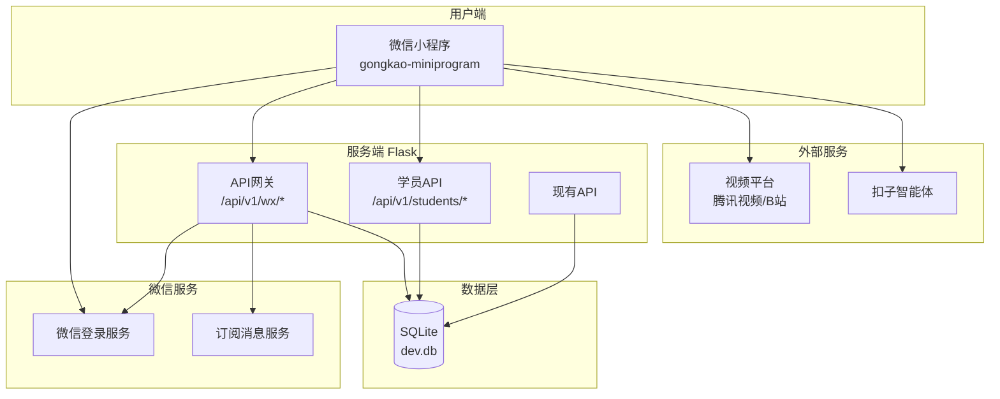
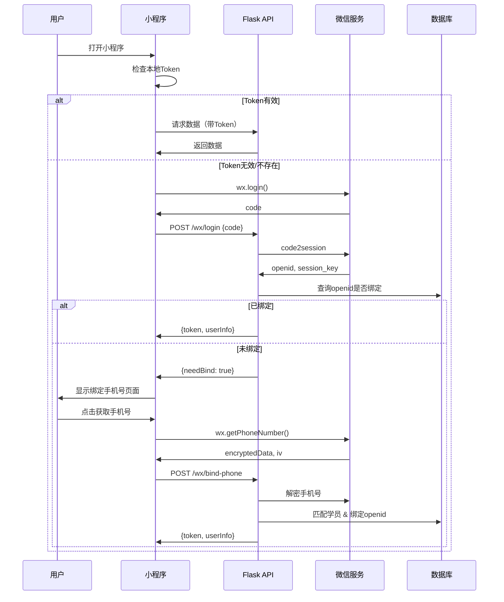
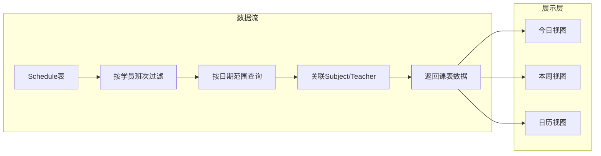
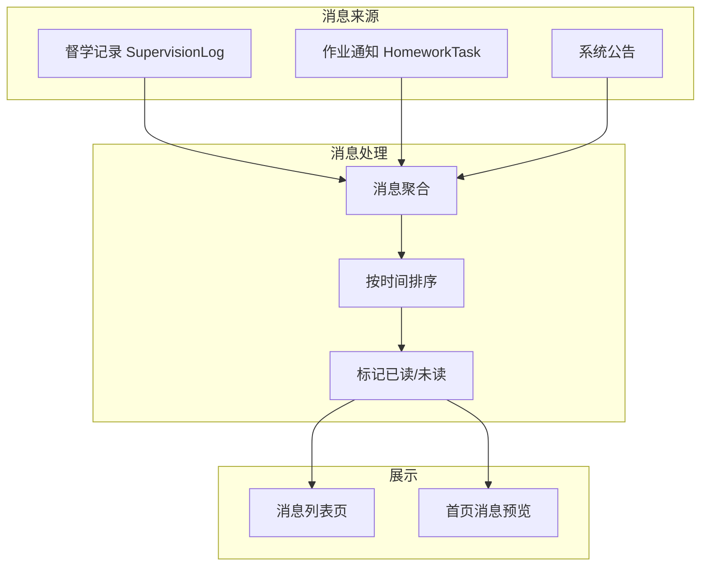
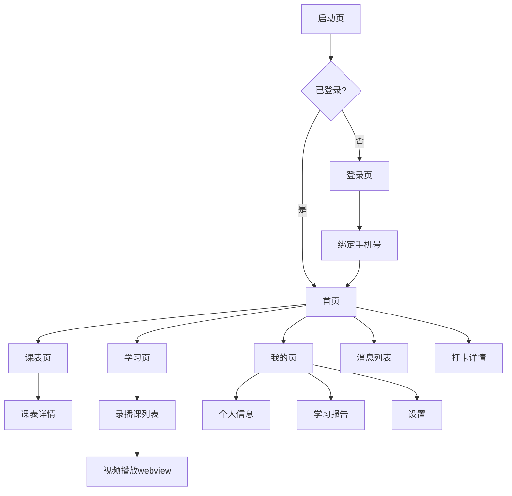
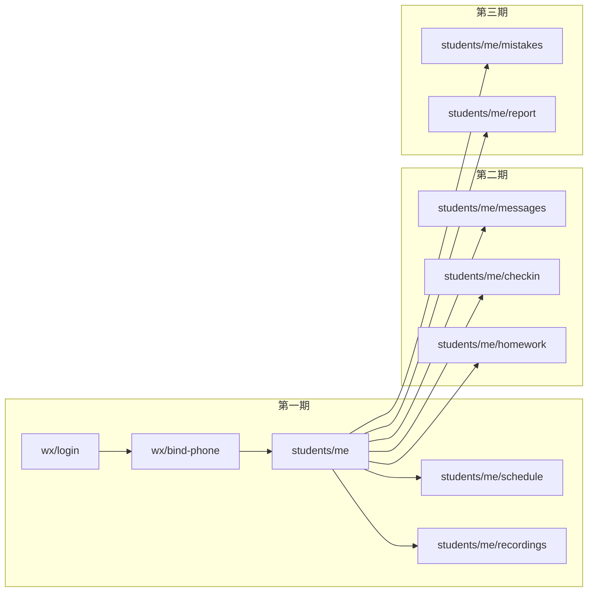

# 公考学员服务微信小程序 - 架构设计文档

> 6A工作流 - 阶段2: Architect（架构阶段）
> 创建日期: 2026-02-01

---

## 一、整体架构图



---

## 二、项目目录结构

### 2.1 小程序项目 (gongkao-miniprogram)

```
gongkao-miniprogram/
├── app.js                    # 小程序入口
├── app.json                  # 全局配置
├── app.wxss                  # 全局样式
├── project.config.json       # 项目配置
├── sitemap.json              # 页面索引配置
│
├── miniprogram_npm/          # npm包（Vant Weapp）
│
├── components/               # 自定义组件
│   ├── schedule-card/        # 课程卡片
│   ├── message-item/         # 消息项
│   ├── task-item/            # 任务项
│   └── empty-state/          # 空状态
│
├── pages/                    # 页面
│   ├── index/                # 首页（Tab1）
│   │   ├── index.js
│   │   ├── index.json
│   │   ├── index.wxml
│   │   └── index.wxss
│   │
│   ├── schedule/             # 课表（Tab2）
│   │   ├── index.js
│   │   ├── index.json
│   │   ├── index.wxml
│   │   └── index.wxss
│   │
│   ├── study/                # 学习（Tab3）
│   │   ├── index.js          # 录播课列表
│   │   └── ...
│   │
│   ├── mine/                 # 我的（Tab4）
│   │   ├── index.js
│   │   └── ...
│   │
│   ├── login/                # 登录页
│   │   ├── index.js
│   │   └── ...
│   │
│   ├── bind-phone/           # 绑定手机号
│   │   └── ...
│   │
│   ├── recording-detail/     # 录播课详情
│   │   └── ...
│   │
│   ├── messages/             # 督学消息列表
│   │   └── ...
│   │
│   ├── checkin/              # 打卡页面
│   │   └── ...
│   │
│   └── webview/              # 通用webview
│       └── ...
│
├── utils/                    # 工具函数
│   ├── request.js            # 网络请求封装
│   ├── auth.js               # 认证相关
│   ├── storage.js            # 本地存储
│   └── util.js               # 通用工具
│
├── services/                 # API服务封装
│   ├── user.js               # 用户相关API
│   ├── schedule.js           # 课表API
│   ├── recording.js          # 录播课API
│   ├── message.js            # 消息API
│   └── checkin.js            # 打卡API
│
├── images/                   # 静态图片
│   ├── tabbar/               # 底部导航图标
│   └── icons/                # 其他图标
│
└── styles/                   # 公共样式
    ├── variables.wxss        # 样式变量
    └── common.wxss           # 公共样式
```

### 2.2 后端API扩展 (gongkao-system/app/routes/)

```
app/routes/
├── wx_api.py                 # 新增：小程序专用API
│   ├── /api/v1/wx/login      # 微信登录
│   ├── /api/v1/wx/bind-phone # 绑定手机号
│   └── /api/v1/wx/subscribe  # 订阅消息
│
├── student_api.py            # 新增：学员端API
│   ├── /api/v1/students/me   # 当前学员信息
│   ├── /api/v1/students/me/schedule    # 我的课表
│   ├── /api/v1/students/me/recordings  # 我的录播课
│   ├── /api/v1/students/me/messages    # 我的消息
│   ├── /api/v1/students/me/homework    # 我的作业
│   └── /api/v1/students/me/checkin     # 打卡
│
└── api_v1.py                 # 现有API（保持不变）
```

---

## 三、核心模块设计

### 3.1 登录认证模块



### 3.2 课表模块



### 3.3 督学消息模块



---

## 四、数据模型扩展

### 4.1 学员表扩展 (students)

```sql
-- 新增字段
ALTER TABLE students ADD COLUMN wx_openid VARCHAR(64) UNIQUE;
ALTER TABLE students ADD COLUMN wx_unionid VARCHAR(64);
ALTER TABLE students ADD COLUMN wx_avatar_url VARCHAR(500);
ALTER TABLE students ADD COLUMN wx_nickname VARCHAR(100);
ALTER TABLE students ADD COLUMN last_checkin_date DATE;
ALTER TABLE students ADD COLUMN total_checkin_days INTEGER DEFAULT 0;
ALTER TABLE students ADD COLUMN consecutive_checkin_days INTEGER DEFAULT 0;
```

### 4.2 新增打卡记录表 (checkin_records)

```sql
CREATE TABLE checkin_records (
    id INTEGER PRIMARY KEY AUTOINCREMENT,
    student_id INTEGER NOT NULL,
    checkin_date DATE NOT NULL,
    checkin_time DATETIME DEFAULT CURRENT_TIMESTAMP,
    study_minutes INTEGER DEFAULT 0,
    note TEXT,
    FOREIGN KEY (student_id) REFERENCES students(id),
    UNIQUE(student_id, checkin_date)
);

CREATE INDEX idx_checkin_student ON checkin_records(student_id);
CREATE INDEX idx_checkin_date ON checkin_records(checkin_date);
```

### 4.3 新增学员消息表 (student_messages)

```sql
CREATE TABLE student_messages (
    id INTEGER PRIMARY KEY AUTOINCREMENT,
    student_id INTEGER NOT NULL,
    message_type VARCHAR(50) NOT NULL,  -- supervision/homework/system
    title VARCHAR(200) NOT NULL,
    content TEXT,
    source_id INTEGER,                   -- 关联的督学记录/作业ID
    is_read BOOLEAN DEFAULT FALSE,
    created_at DATETIME DEFAULT CURRENT_TIMESTAMP,
    FOREIGN KEY (student_id) REFERENCES students(id)
);

CREATE INDEX idx_message_student ON student_messages(student_id);
CREATE INDEX idx_message_read ON student_messages(is_read);
```

### 4.4 新增订阅消息模板表 (wx_subscribe_templates)

```sql
CREATE TABLE wx_subscribe_templates (
    id INTEGER PRIMARY KEY AUTOINCREMENT,
    template_id VARCHAR(100) NOT NULL,
    template_type VARCHAR(50) NOT NULL,  -- class_reminder/homework_reminder
    title VARCHAR(100),
    is_active BOOLEAN DEFAULT TRUE,
    created_at DATETIME DEFAULT CURRENT_TIMESTAMP
);
```

---

## 五、API接口规范

### 5.1 认证接口

#### POST /api/v1/wx/login
微信登录

**Request:**
```json
{
    "code": "微信登录code"
}
```

**Response (已绑定):**
```json
{
    "success": true,
    "data": {
        "token": "jwt_token_xxx",
        "userInfo": {
            "id": 1,
            "name": "张三",
            "phone": "138****1234",
            "className": "基础班一期"
        }
    }
}
```

**Response (未绑定):**
```json
{
    "success": true,
    "data": {
        "needBind": true,
        "sessionKey": "temp_session_key"
    }
}
```

#### POST /api/v1/wx/bind-phone
绑定手机号

**Request:**
```json
{
    "sessionKey": "temp_session_key",
    "encryptedData": "加密数据",
    "iv": "加密向量"
}
```

### 5.2 学员接口

#### GET /api/v1/students/me
获取当前学员信息

**Headers:** `Authorization: Bearer {token}`

**Response:**
```json
{
    "success": true,
    "data": {
        "id": 1,
        "name": "张三",
        "phone": "13812341234",
        "className": "基础班一期",
        "examType": "事业编",
        "targetPosition": "泗洪县XX岗位",
        "checkinStats": {
            "totalDays": 45,
            "consecutiveDays": 7,
            "todayChecked": false
        }
    }
}
```

#### GET /api/v1/students/me/schedule
获取我的课表

**Query:** `date=2026-02-01` 或 `week=2026-W05`

**Response:**
```json
{
    "success": true,
    "data": {
        "date": "2026-02-01",
        "schedules": [
            {
                "id": 1,
                "dayNumber": 5,
                "subjectName": "言语理解",
                "morningTeacher": "王老师",
                "afternoonTeacher": "李老师",
                "eveningType": "自习"
            }
        ]
    }
}
```

#### GET /api/v1/students/me/recordings
获取我的录播课

**Query:** `page=1&limit=20&subject_id=1`

**Response:**
```json
{
    "success": true,
    "data": {
        "total": 50,
        "items": [
            {
                "id": 1,
                "title": "言语理解-片段阅读",
                "recordingDate": "2026-01-15",
                "period": "上午",
                "teacherName": "王老师",
                "duration": "120分钟",
                "recordingUrl": "https://v.qq.com/xxx"
            }
        ]
    }
}
```

#### GET /api/v1/students/me/messages
获取督学消息

**Query:** `page=1&limit=20&is_read=false`

**Response:**
```json
{
    "success": true,
    "data": {
        "unreadCount": 3,
        "items": [
            {
                "id": 1,
                "type": "supervision",
                "title": "督学老师给您留言",
                "content": "今天学习状态不错，继续保持...",
                "isRead": false,
                "createdAt": "2026-02-01 10:30:00"
            }
        ]
    }
}
```

#### POST /api/v1/students/me/checkin
每日打卡

**Request:**
```json
{
    "studyMinutes": 120,
    "note": "今天复习了言语理解"
}
```

**Response:**
```json
{
    "success": true,
    "data": {
        "checkinId": 100,
        "consecutiveDays": 8,
        "totalDays": 46,
        "message": "打卡成功！连续打卡8天"
    }
}
```

---

## 六、页面结构设计

### 6.1 TabBar结构

```
┌─────────────────────────────┐
│                             │
│        页面内容区域          │
│                             │
├─────┬─────┬─────┬───────────┤
│ 首页 │ 课表 │ 学习 │    我的   │
│ 🏠  │ 📅  │ 📚  │    👤     │
└─────┴─────┴─────┴───────────┘
```

### 6.2 首页设计

```
┌─────────────────────────────┐
│ 头部：用户信息 + 打卡按钮     │
│ ┌─────────────────────────┐ │
│ │ 👤 张三 | 基础班一期     │ │
│ │ 🔥 连续打卡 7 天         │ │
│ │         [今日打卡] ✓     │ │
│ └─────────────────────────┘ │
├─────────────────────────────┤
│ 今日课程                    │
│ ┌─────────────────────────┐ │
│ │ 📖 上午 言语理解 王老师   │ │
│ │ 📖 下午 判断推理 李老师   │ │
│ │ 📝 晚间 自习             │ │
│ └─────────────────────────┘ │
├─────────────────────────────┤
│ 待办任务 (2)                │
│ ┌─────────────────────────┐ │
│ │ □ 完成今日作业           │ │
│ │ □ 复习昨天错题 5道       │ │
│ └─────────────────────────┘ │
├─────────────────────────────┤
│ 督学消息 (3条新消息) >       │
│ ┌─────────────────────────┐ │
│ │ 💬 王老师：今天表现不错   │ │
│ │ 💬 系统：明天上午9点上课  │ │
│ └─────────────────────────┘ │
└─────────────────────────────┘
```

### 6.3 页面导航图



---

## 七、技术实现要点

### 7.1 请求封装

```javascript
// utils/request.js
const BASE_URL = 'https://shxtj.chaim.top/api/v1';

const request = (options) => {
  return new Promise((resolve, reject) => {
    const token = wx.getStorageSync('token');
    wx.request({
      url: BASE_URL + options.url,
      method: options.method || 'GET',
      data: options.data,
      header: {
        'Content-Type': 'application/json',
        'Authorization': token ? `Bearer ${token}` : ''
      },
      success: (res) => {
        if (res.statusCode === 401) {
          // Token过期，跳转登录
          wx.navigateTo({ url: '/pages/login/index' });
          reject(new Error('未登录'));
        } else if (res.data.success) {
          resolve(res.data);
        } else {
          reject(new Error(res.data.message));
        }
      },
      fail: reject
    });
  });
};
```

### 7.2 JWT认证

```python
# 后端JWT实现
import jwt
from datetime import datetime, timedelta
from functools import wraps

def generate_token(student_id):
    payload = {
        'student_id': student_id,
        'exp': datetime.utcnow() + timedelta(days=7)
    }
    return jwt.encode(payload, current_app.config['SECRET_KEY'], algorithm='HS256')

def require_student_auth(f):
    @wraps(f)
    def decorated(*args, **kwargs):
        token = request.headers.get('Authorization', '').replace('Bearer ', '')
        if not token:
            return jsonify({'success': False, 'message': '未登录'}), 401
        try:
            payload = jwt.decode(token, current_app.config['SECRET_KEY'], algorithms=['HS256'])
            g.student_id = payload['student_id']
        except jwt.ExpiredSignatureError:
            return jsonify({'success': False, 'message': 'Token已过期'}), 401
        except jwt.InvalidTokenError:
            return jsonify({'success': False, 'message': '无效Token'}), 401
        return f(*args, **kwargs)
    return decorated
```

---

## 八、接口依赖关系图



---

## 九、下一步

完成架构设计后，进入 **Atomize（原子化）阶段**：
1. 拆分原子任务
2. 明确每个任务的输入输出
3. 确定任务依赖关系
4. 使用4个并发agent执行开发

---

> **状态**: 架构设计完成 ✅
