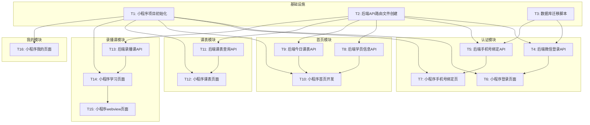

# 公考学员服务微信小程序 - 任务清单

> 6A工作流 - 阶段3: Atomize（原子化阶段）
> 创建日期: 2026-02-01

---

## 任务依赖关系图

---

## 第一批任务（可并行）

### T1: 小程序项目初始化
**优先级**: P0 | **预估**: 30min | **可并行**: 是

**输入契约**:
- 无前置依赖

**输出契约**:
- 创建完整的小程序项目目录结构
- 配置 app.json（tabBar、pages、window）
- 配置 project.config.json（appid占位）
- 安装并构建 Vant Weapp
- 创建通用样式文件
- 创建 request.js 请求封装
- 创建 auth.js 认证工具

**实现约束**:
- 使用原生微信小程序
- 使用 Vant Weapp 组件库
- 后端地址：https://shxtj.chaim.top

**验收标准**:
- [ ] 微信开发者工具可正常打开项目
- [ ] 4个TabBar页面骨架存在
- [ ] Vant组件可正常使用

---

### T2: 后端API路由文件创建
**优先级**: P0 | **预估**: 20min | **可并行**: 是

**输入契约**:
- 现有Flask项目结构

**输出契约**:
- 创建 `app/routes/wx_api.py` 微信接口路由
- 创建 `app/routes/student_api.py` 学员接口路由
- 在 `app/__init__.py` 注册蓝图
- 创建JWT认证装饰器

**实现约束**:
- 遵循现有代码风格
- 使用 PyJWT 库
- API前缀: `/api/v1/wx/*` 和 `/api/v1/students/*`

**验收标准**:
- [ ] 路由文件创建成功
- [ ] 蓝图注册成功
- [ ] 服务可正常启动

---

### T3: 数据库迁移脚本
**优先级**: P0 | **预估**: 15min | **可并行**: 是

**输入契约**:
- 现有数据库模型

**输出契约**:
- 创建迁移脚本 `add_miniprogram_tables.py`
- 扩展students表（wx_openid, wx_unionid, checkin字段）
- 创建checkin_records表
- 创建student_messages表

**实现约束**:
- 使用SQLite ALTER TABLE（注意限制）
- 提供回滚方案

**验收标准**:
- [ ] 迁移脚本可成功执行
- [ ] 新字段/表创建成功
- [ ] 不影响现有数据

---

### T4: 后端微信登录API
**优先级**: P0 | **预估**: 30min | **依赖**: T2, T3

**输入契约**:
- wx_api.py 路由文件
- 数据库迁移完成

**输出契约**:
- POST `/api/v1/wx/login` 接口
- 接收code，调用微信code2session
- 返回token或needBind标识

**实现约束**:
- 需要配置微信AppID和AppSecret到.env
- 使用requests调用微信API

**验收标准**:
- [ ] 接口可正常访问
- [ ] code换取openid成功
- [ ] 已绑定用户返回token
- [ ] 未绑定用户返回needBind

---

## 第二批任务（依赖第一批）

### T5: 后端手机号绑定API
**优先级**: P0 | **预估**: 30min | **依赖**: T4

**输入契约**:
- T4完成

**输出契约**:
- POST `/api/v1/wx/bind-phone` 接口
- 解密微信手机号
- 匹配学员并绑定openid

**验收标准**:
- [ ] 手机号解密成功
- [ ] 匹配学员并绑定
- [ ] 返回JWT token

---

### T6: 小程序登录页面
**优先级**: P0 | **预估**: 40min | **依赖**: T1, T4

**输入契约**:
- 小程序项目初始化完成
- 登录API完成

**输出契约**:
- pages/login/index 页面
- 微信授权登录按钮
- 登录流程完整

**验收标准**:
- [ ] 页面UI美观
- [ ] 登录流程正常
- [ ] 已绑定用户直接进入首页

---

### T7: 小程序手机号绑定页
**优先级**: P0 | **预估**: 30min | **依赖**: T1, T5

**输入契约**:
- 小程序项目初始化完成
- 绑定API完成

**输出契约**:
- pages/bind-phone/index 页面
- 获取手机号按钮
- 绑定成功跳转首页

**验收标准**:
- [ ] 页面UI美观
- [ ] 获取手机号正常
- [ ] 绑定后跳转首页

---

### T8: 后端学员信息API
**优先级**: P0 | **预估**: 20min | **依赖**: T2

**输入契约**:
- student_api.py路由文件

**输出契约**:
- GET `/api/v1/students/me` 接口
- 返回当前学员信息
- 包含打卡统计

**验收标准**:
- [ ] 需要认证才能访问
- [ ] 返回完整学员信息
- [ ] 打卡统计正确

---

### T9: 后端今日课表API
**优先级**: P0 | **预估**: 25min | **依赖**: T2

**输入契约**:
- student_api.py路由文件

**输出契约**:
- GET `/api/v1/students/me/schedule` 接口
- 支持date和week参数
- 返回课表列表

**验收标准**:
- [ ] 正确关联学员班次
- [ ] 课表数据完整
- [ ] 支持日期筛选

---

### T10: 小程序首页开发
**优先级**: P0 | **预估**: 60min | **依赖**: T6, T8, T9

**输入契约**:
- 登录功能完成
- 学员信息API完成
- 课表API完成

**输出契约**:
- pages/index/index 首页
- 用户信息卡片
- 今日课程展示
- 待办任务列表（占位）
- 督学消息预览（占位）

**验收标准**:
- [ ] 页面布局美观
- [ ] 数据正确展示
- [ ] 下拉刷新正常

---

## 第三批任务

### T11: 后端课表查询API
**优先级**: P0 | **预估**: 25min | **依赖**: T2

**输入契约**:
- student_api.py路由文件

**输出契约**:
- 完善课表API
- 支持周视图数据

**验收标准**:
- [ ] 周视图数据正确
- [ ] 关联科目和老师

---

### T12: 小程序课表页面
**优先级**: P0 | **预估**: 50min | **依赖**: T1, T11

**输入契约**:
- 课表API完成

**输出契约**:
- pages/schedule/index 页面
- 今日/本周切换
- 课表卡片展示

**验收标准**:
- [ ] 切换视图正常
- [ ] 课表展示正确
- [ ] UI美观

---

### T13: 后端录播课API
**优先级**: P0 | **预估**: 25min | **依赖**: T2

**输入契约**:
- student_api.py路由文件

**输出契约**:
- GET `/api/v1/students/me/recordings` 接口
- 分页支持
- 科目筛选

**验收标准**:
- [ ] 只返回学员班次的录播
- [ ] 分页正确
- [ ] 筛选正常

---

### T14: 小程序学习页面
**优先级**: P0 | **预估**: 50min | **依赖**: T1, T13

**输入契约**:
- 录播课API完成

**输出契约**:
- pages/study/index 页面
- 录播课列表
- 科目分类筛选
- 点击跳转播放

**验收标准**:
- [ ] 列表展示正确
- [ ] 筛选功能正常
- [ ] 跳转播放正常

---

### T15: 小程序webview页面
**优先级**: P1 | **预估**: 20min | **依赖**: T14

**输入契约**:
- 学习页面完成

**输出契约**:
- pages/webview/index 页面
- 通用webview容器
- 支持视频外链

**验收标准**:
- [ ] 视频可正常播放
- [ ] 返回正常

---

### T16: 小程序我的页面
**优先级**: P1 | **预估**: 40min | **依赖**: T1, T8

**输入契约**:
- 学员信息API完成

**输出契约**:
- pages/mine/index 页面
- 个人信息展示
- 学习数据统计
- 功能入口列表

**验收标准**:
- [ ] 信息展示正确
- [ ] 统计数据正确
- [ ] 功能入口可点击

---

## 任务分配方案（4个并发Agent）

### 批次1：基础设施（并行）

| Agent | 任务 | 说明 |
|-------|------|------|
| Agent-1 | T1: 小程序项目初始化 | 前端基础 |
| Agent-2 | T2: 后端API路由文件 | 后端基础 |
| Agent-3 | T3: 数据库迁移脚本 | 数据层 |
| Agent-4 | 空闲（等待批次2） | - |

### 批次2：核心功能（并行）

| Agent | 任务 | 说明 |
|-------|------|------|
| Agent-1 | T4: 微信登录API | 后端认证 |
| Agent-2 | T8: 学员信息API | 后端数据 |
| Agent-3 | T9: 今日课表API | 后端数据 |
| Agent-4 | T13: 录播课API | 后端数据 |

### 批次3：前端页面（并行）

| Agent | 任务 | 说明 |
|-------|------|------|
| Agent-1 | T6+T7: 登录+绑定页面 | 前端认证 |
| Agent-2 | T10: 首页开发 | 核心页面 |
| Agent-3 | T12: 课表页面 | 功能页面 |
| Agent-4 | T14+T15: 学习页面+webview | 功能页面 |

### 批次4：完善收尾（并行）

| Agent | 任务 | 说明 |
|-------|------|------|
| Agent-1 | T5: 手机号绑定API | 后端完善 |
| Agent-2 | T11: 课表API完善 | 后端完善 |
| Agent-3 | T16: 我的页面 | 前端完善 |
| Agent-4 | 联调测试 | 整体验证 |

---

## 验收检查清单

### 功能验收
- [ ] 微信登录流程正常
- [ ] 手机号绑定正常
- [ ] 首页数据展示正确
- [ ] 课表查询正常
- [ ] 录播课列表正常
- [ ] 视频播放跳转正常
- [ ] 我的页面信息正确

### 技术验收
- [ ] 所有API返回格式统一
- [ ] JWT认证有效
- [ ] 错误处理友好
- [ ] 加载状态显示
- [ ] 空状态处理

---

> **状态**: 任务拆分完成 ✅
> **下一步**: 使用4个并发Agent执行开发
