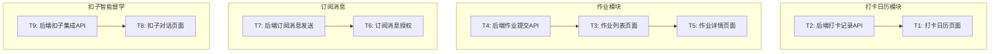

# 微信小程序第二期功能 - 任务清单

> 打卡日历 + 作业管理 + 订阅消息 + 扣子智能督学
> 创建日期: 2026-02-01

---

## 功能范围

### 核心功能
1. **打卡日历** - 可视化打卡记录，激励学习习惯
2. **作业管理** - 查看作业、提交完成状态
3. **订阅消息** - 上课提醒、作业提醒推送
4. **扣子督学** - 嵌入智能督学对话

---

## 任务依赖关系图

---

## 详细任务清单

### T1: 打卡日历页面
**优先级**: P1 | **预估**: 60min

**输入契约**:
- 打卡功能已完成
- 后端打卡记录API

**输出契约**:
- pages/checkin/index 页面
- 日历视图展示打卡记录
- 显示连续打卡天数
- 打卡统计图表

**验收标准**:
- [ ] 日历组件显示打卡状态
- [ ] 连续打卡天数突出显示
- [ ] 可以查看历史打卡记录
- [ ] 今日可以打卡

---

### T2: 后端打卡记录API
**优先级**: P1 | **预估**: 30min

**输入契约**:
- checkin_records表已创建

**输出契约**:
- GET `/api/v1/students/me/checkin-history` 获取打卡记录
- GET `/api/v1/students/me/checkin-calendar` 获取日历数据

**验收标准**:
- [ ] 返回指定月份的打卡记录
- [ ] 返回连续打卡统计
- [ ] 性能良好

---

### T3: 作业列表页面
**优先级**: P1 | **预估**: 50min

**输入契约**:
- 后端作业API已完成

**输出契约**:
- pages/homework/index 页面
- 待完成/已完成Tab切换
- 作业卡片展示
- 标记完成功能

**验收标准**:
- [ ] 显示作业列表
- [ ] 区分待完成/已完成
- [ ] 可以标记完成
- [ ] 显示截止时间

---

### T4: 后端作业提交API
**优先级**: P1 | **预估**: 25min

**输入契约**:
- HomeworkSubmission模型

**输出契约**:
- POST `/api/v1/students/me/homework/<id>/submit` 提交作业
- PUT `/api/v1/students/me/homework/<id>/complete` 标记完成

**验收标准**:
- [ ] 可以提交作业
- [ ] 可以标记完成
- [ ] 记录提交时间

---

### T5: 作业详情页面
**优先级**: P1 | **预估**: 40min

**输入契约**:
- 作业列表页面完成

**输出契约**:
- pages/homework/detail 页面
- 作业内容展示
- 提交按钮

**验收标准**:
- [ ] 显示作业详情
- [ ] 可以提交
- [ ] 显示提交状态

---

### T6: 订阅消息授权
**优先级**: P1 | **预估**: 45min

**输入契约**:
- 小程序已认证

**输出契约**:
- 在合适位置添加订阅消息授权
- 保存用户订阅状态

**验收标准**:
- [ ] 用户可以订阅消息
- [ ] 记录订阅状态
- [ ] 引导用户订阅

---

### T7: 后端订阅消息发送
**优先级**: P1 | **预估**: 50min

**输入契约**:
- 微信订阅消息模板已配置

**输出契约**:
- POST `/api/v1/wx/send-subscribe` 发送订阅消息
- 定时任务：上课提醒、作业提醒

**验收标准**:
- [ ] 可以发送订阅消息
- [ ] 上课前30分钟提醒
- [ ] 作业截止前1天提醒

---

### T8: 扣子对话页面
**优先级**: P2 | **预估**: 40min

**输入契约**:
- 扣子Bot已创建

**输出契约**:
- pages/coze/index 页面
- 嵌入扣子对话组件
- 传递学员上下文

**验收标准**:
- [ ] 可以与扣子对话
- [ ] 学员信息已传递
- [ ] 对话记录保存

---

### T9: 后端扣子集成API
**优先级**: P2 | **预估**: 30min

**输入契约**:
- 扣子API Key

**输出契约**:
- POST `/api/v1/coze/chat` 转发对话请求
- 传递学员上下文

**验收标准**:
- [ ] 可以调用扣子API
- [ ] 学员信息正确传递
- [ ] 响应正常返回

---

## 并发执行计划

### 批次1：核心功能（4个Agent并行）

| Agent | 任务 | 说明 |
|-------|------|------|
| Agent-1 | T1+T2: 打卡日历 | 页面+API |
| Agent-2 | T3+T4: 作业管理 | 页面+API |
| Agent-3 | T6+T7: 订阅消息 | 授权+发送 |
| Agent-4 | T8+T9: 扣子督学 | 对话+API |

---

> **状态**: 任务清单已创建
> **下一步**: 启动4个并发Agent执行
