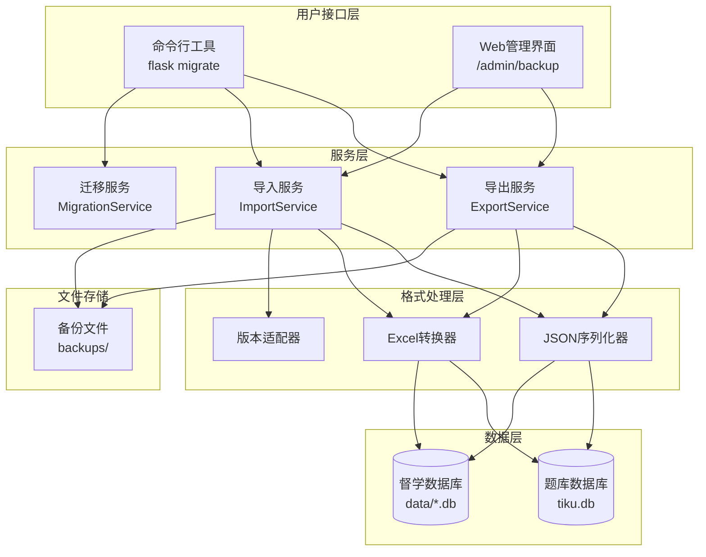
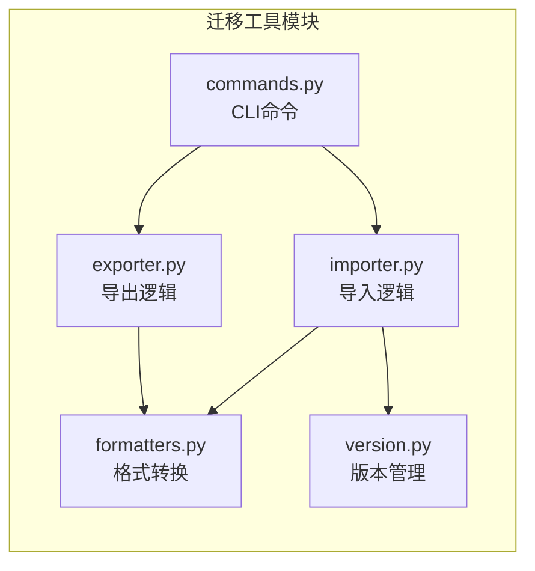
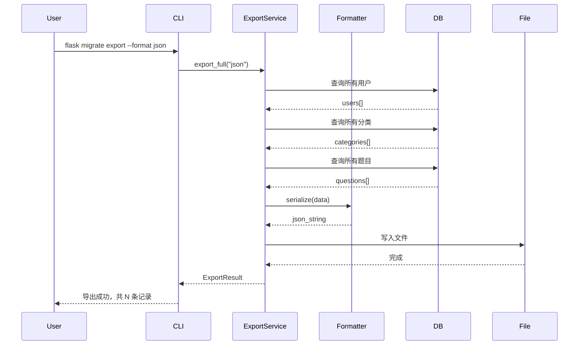
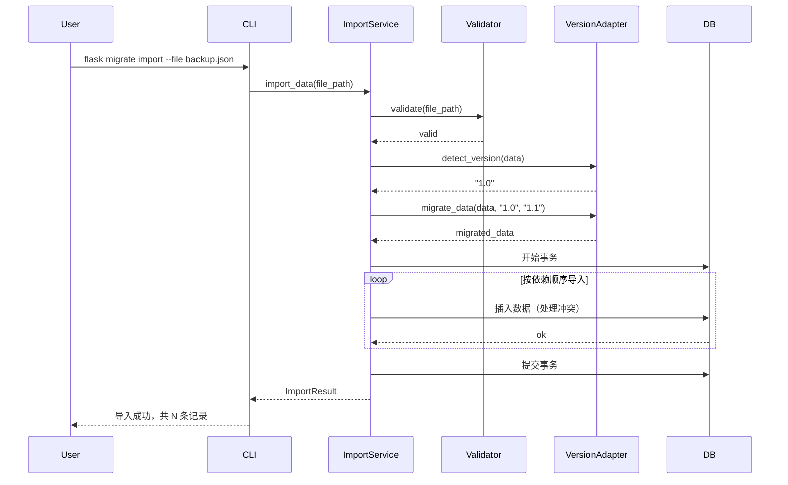

# 设计文档：数据迁移工具

## 1. 整体架构图



## 2. 模块依赖关系



## 3. 核心组件设计

### 3.1 导出服务 (ExportService)

```python
class ExportService:
    """数据导出服务"""
    
    def export_full(format: str, output_path: str) -> ExportResult:
        """完整导出所有数据"""
        
    def export_incremental(format: str, since: datetime, output_path: str) -> ExportResult:
        """增量导出（指定时间之后的变更）"""
        
    def export_modules(format: str, modules: List[str], output_path: str) -> ExportResult:
        """模块化导出"""
        
    def get_export_stats() -> Dict:
        """获取可导出数据统计"""
```

### 3.2 导入服务 (ImportService)

```python
class ImportService:
    """数据导入服务"""
    
    def validate(file_path: str) -> ValidationResult:
        """验证导入文件格式和完整性"""
        
    def preview(file_path: str) -> PreviewResult:
        """预览导入内容（统计、冲突检测）"""
        
    def import_data(file_path: str, strategy: ConflictStrategy) -> ImportResult:
        """执行导入"""
        
    def rollback(import_id: str) -> bool:
        """回滚指定的导入操作"""
```

### 3.3 版本适配器 (VersionAdapter)

```python
class VersionAdapter:
    """版本兼容适配器"""
    
    def detect_version(data: Dict) -> str:
        """检测数据版本"""
        
    def migrate_data(data: Dict, from_version: str, to_version: str) -> Dict:
        """将旧版本数据迁移到新版本格式"""
        
    def get_migration_path(from_version: str, to_version: str) -> List[str]:
        """获取版本迁移路径"""
```

## 4. 数据流向图

### 4.1 导出流程



### 4.2 导入流程



## 5. 接口契约

### 5.1 CLI命令

```bash
# 导出命令
flask migrate export
    --format [json|excel|both]  # 导出格式
    --output PATH               # 输出路径
    --modules MODULE,...        # 可选，指定模块
    --since DATETIME            # 可选，增量导出起始时间
    --system [tiku|duxue|all]   # 可选，指定系统

# 导入命令
flask migrate import
    --file PATH                          # 导入文件路径
    --conflict [skip|overwrite|error]    # 冲突处理策略
    --dry-run                            # 可选，预览模式

# 查看状态
flask migrate status                     # 查看可导出数据统计
flask migrate history                    # 查看导入/导出历史
```

### 5.2 导出数据结构

```python
@dataclass
class ExportMeta:
    version: str                    # 数据格式版本
    system: str                     # 系统标识
    export_time: datetime           # 导出时间
    export_type: str               # full/incremental/module
    modules: List[str]             # 包含的模块
    incremental_since: Optional[datetime]
    total_records: int             # 总记录数
    checksum: str                  # 数据校验和

@dataclass  
class ExportData:
    meta: ExportMeta
    data: Dict[str, List[Dict]]    # 各模块数据
    relations: Dict                # 关联关系映射
```

### 5.3 导入结果结构

```python
@dataclass
class ImportResult:
    success: bool
    import_id: str                 # 导入操作ID（用于回滚）
    imported_counts: Dict[str, int]  # 各模块导入数量
    skipped_counts: Dict[str, int]   # 各模块跳过数量
    conflict_counts: Dict[str, int]  # 各模块冲突数量
    errors: List[str]              # 错误信息
    warnings: List[str]            # 警告信息
    duration: float                # 耗时（秒）
```

## 6. 异常处理策略

### 6.1 导出异常

| 异常类型 | 处理策略 |
|----------|----------|
| 数据库连接失败 | 终止并报错 |
| 文件写入失败 | 终止并报错 |
| 内存不足 | 分批导出 |

### 6.2 导入异常

| 异常类型 | 处理策略 |
|----------|----------|
| 文件格式错误 | 验证阶段报错 |
| 版本不兼容 | 尝试适配，失败则报错 |
| 数据冲突 | 根据策略处理 |
| 外键约束失败 | 事务回滚 |
| 任何异常 | 事务回滚，保护原有数据 |

## 7. 文件结构

```
gongkao-tiku-system/
├── app/
│   ├── migrate/                    # 新增：迁移工具模块
│   │   ├── __init__.py
│   │   ├── commands.py             # CLI命令定义
│   │   ├── exporter.py             # 导出服务
│   │   ├── importer.py             # 导入服务
│   │   ├── formatters/
│   │   │   ├── __init__.py
│   │   │   ├── json_formatter.py   # JSON格式处理
│   │   │   └── excel_formatter.py  # Excel格式处理
│   │   ├── version.py              # 版本适配器
│   │   └── utils.py                # 工具函数
│   └── routes/
│       └── migrate.py              # Web接口（可选）
├── migrations/                     # Flask-Migrate迁移文件
│   ├── versions/
│   ├── alembic.ini
│   └── env.py
└── backups/                        # 备份文件存储目录
```

## 8. 依赖管理

### 新增依赖

```txt
# requirements.txt 新增
Flask-Migrate==4.0.5    # 数据库迁移管理
alembic==1.13.1         # 底层迁移引擎
openpyxl>=3.1.2         # Excel支持（已有）
```
