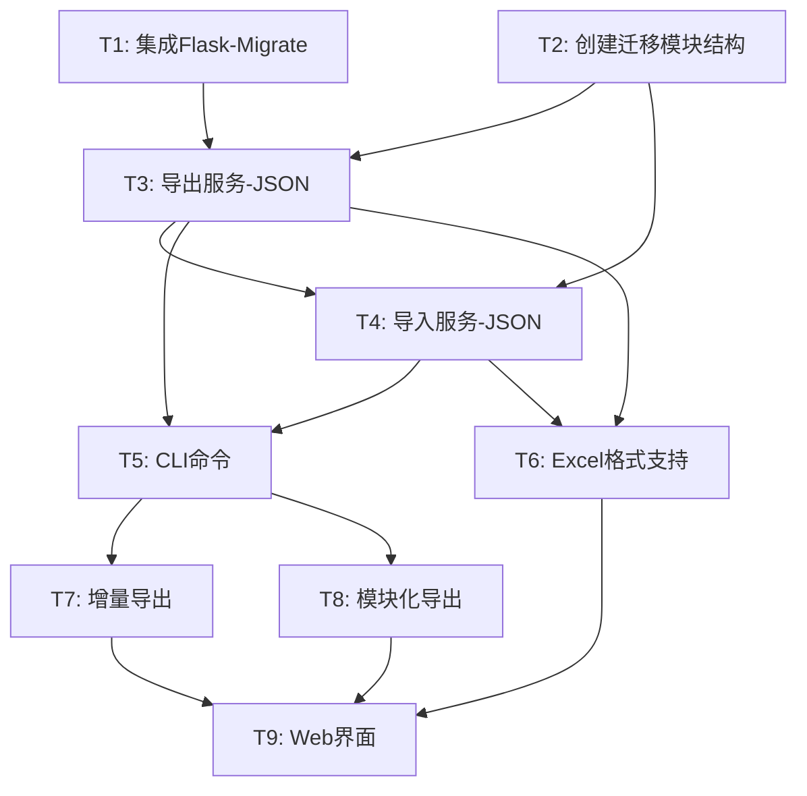

# 任务拆分文档：数据迁移工具

## 任务依赖图



---

## T1: 集成Flask-Migrate

### 输入契约
- 前置依赖：无
- 输入数据：现有项目结构
- 环境依赖：Python环境、已有Flask应用

### 输出契约
- 输出数据：migrations目录、初始化迁移脚本
- 交付物：
  - `requirements.txt` 添加 Flask-Migrate 依赖
  - `migrations/` 目录结构
  - `app/__init__.py` 中集成 Migrate
- 验收标准：
  - `flask db init` 成功执行
  - `flask db migrate` 生成初始迁移
  - `flask db upgrade` 应用迁移

### 实现约束
- 技术栈：Flask-Migrate 4.x
- 不影响现有数据库数据

---

## T2: 创建迁移模块结构

### 输入契约
- 前置依赖：无
- 输入数据：设计文档中的模块结构

### 输出契约
- 交付物：
  ```
  app/migrate/
  ├── __init__.py
  ├── commands.py
  ├── exporter.py
  ├── importer.py
  ├── formatters/
  │   ├── __init__.py
  │   ├── json_formatter.py
  │   └── excel_formatter.py
  ├── version.py
  └── utils.py
  ```
- 验收标准：
  - 模块可正常导入
  - 基础类/函数框架已定义

---

## T3: 导出服务-JSON格式

### 输入契约
- 前置依赖：T1, T2
- 输入数据：数据库模型定义
- 环境依赖：SQLAlchemy连接正常

### 输出契约
- 交付物：`app/migrate/exporter.py` 完整实现
- 功能：
  - 导出所有用户数据
  - 导出所有题目分类
  - 导出所有题目数据
  - 导出所有练习记录
  - 导出所有错题本和薄弱项
- 验收标准：
  - 生成的JSON文件格式正确
  - 包含完整的meta信息
  - 数据量与数据库一致
  - 导出时间 < 5分钟（10万条数据）

### 实现要点
```python
# 导出顺序（按依赖关系）
1. users（无依赖）
2. categories（无依赖）
3. question_books（依赖users）
4. questions（依赖categories, question_books）
5. practice_tasks（依赖question_books, users）
6. student_submissions（依赖practice_tasks）
7. practices（依赖users, categories）
8. practice_details（依赖practices, questions）
9. mistakes（依赖users, questions）
10. weaknesses（依赖users, categories）
```

---

## T4: 导入服务-JSON格式

### 输入契约
- 前置依赖：T3
- 输入数据：JSON导出文件
- 环境依赖：目标数据库可写

### 输出契约
- 交付物：`app/migrate/importer.py` 完整实现
- 功能：
  - 验证导入文件格式
  - 检测数据版本
  - 按依赖顺序导入数据
  - 处理ID映射（旧ID -> 新ID）
  - 处理数据冲突（跳过/覆盖/报错）
  - 事务管理（失败回滚）
- 验收标准：
  - 空数据库导入成功
  - 导入后数据与导出一致
  - 冲突处理策略生效
  - 失败时数据库保持原状

### 实现要点
```python
# 导入顺序（与导出相同）
# 关键：维护ID映射表
id_mapping = {
    'users': {old_id: new_id, ...},
    'categories': {...},
    ...
}
```

---

## T5: CLI命令实现

### 输入契约
- 前置依赖：T3, T4
- 输入数据：导出/导入服务

### 输出契约
- 交付物：`app/migrate/commands.py` 完整实现
- 功能：
  ```bash
  flask migrate export --format json --output backup.json
  flask migrate import --file backup.json --conflict skip
  flask migrate status
  ```
- 验收标准：
  - 命令在 `flask --help` 中可见
  - 参数解析正确
  - 错误信息友好
  - 进度显示清晰

---

## T6: Excel格式支持

### 输入契约
- 前置依赖：T3, T4
- 输入数据：openpyxl库

### 输出契约
- 交付物：`app/migrate/formatters/excel_formatter.py`
- 功能：
  - 导出为多Sheet的Excel文件
  - 从Excel文件导入数据
  - 支持中文表头
  - 自动列宽调整
- 验收标准：
  - Excel文件可用WPS/Office打开
  - 数据格式人工可读
  - 可编辑后重新导入

---

## T7: 增量导出功能

### 输入契约
- 前置依赖：T5
- 输入数据：时间戳参数

### 输出契约
- 功能：
  ```bash
  flask migrate export --since "2026-01-01T00:00:00"
  ```
- 验收标准：
  - 只导出指定时间后创建/修改的数据
  - meta中记录增量信息
  - 可与完整备份叠加导入

---

## T8: 模块化导出功能

### 输入契约
- 前置依赖：T5
- 输入数据：模块列表参数

### 输出契约
- 功能：
  ```bash
  flask migrate export --modules questions,users
  ```
- 验收标准：
  - 只导出指定模块
  - 自动包含依赖模块
  - meta中记录模块列表

---

## T9: Web管理界面（可选）

### 输入契约
- 前置依赖：T6, T7, T8
- 输入数据：所有服务

### 输出契约
- 交付物：
  - `app/routes/migrate.py`
  - `app/templates/migrate/` 模板文件
- 功能：
  - 备份列表页面
  - 导出向导
  - 导入向导（上传、预览、确认）
- 验收标准：
  - 界面可访问
  - 操作流程清晰
  - 显示操作进度

---

## 执行顺序

```
第一阶段（核心功能）：
T1 → T2 → T3 → T4 → T5
     ↓
第二阶段（格式扩展）：
     T6
     ↓
第三阶段（增强功能）：
T7, T8（可并行）
     ↓
第四阶段（可视化）：
     T9
```

## 时间估算

| 任务 | 复杂度 | 预计工作量 |
|------|--------|------------|
| T1 | 低 | 15分钟 |
| T2 | 低 | 10分钟 |
| T3 | 中 | 30分钟 |
| T4 | 中 | 30分钟 |
| T5 | 低 | 15分钟 |
| T6 | 中 | 25分钟 |
| T7 | 低 | 10分钟 |
| T8 | 低 | 10分钟 |
| T9 | 高 | 可选，后续实现 |

**第一阶段总计**：约1.5小时
