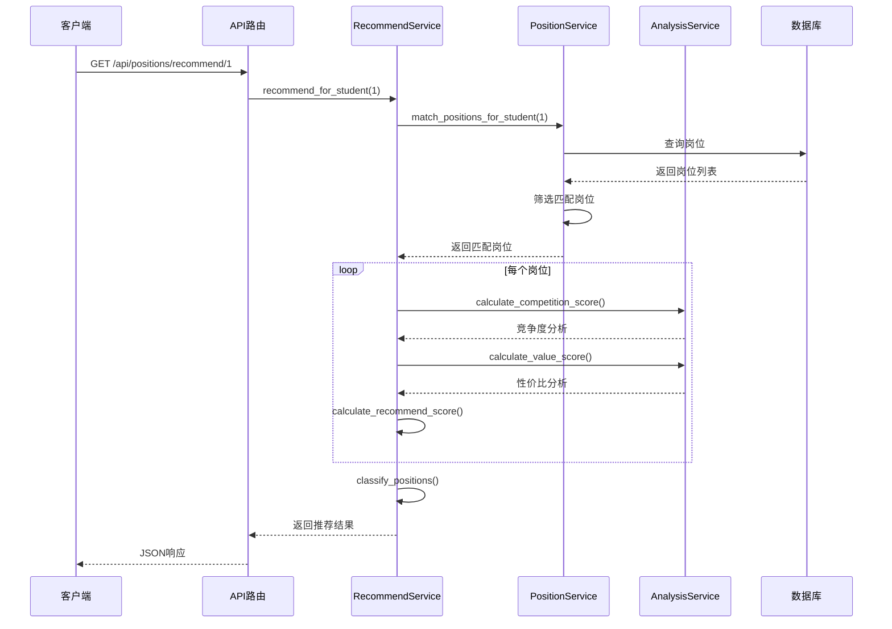
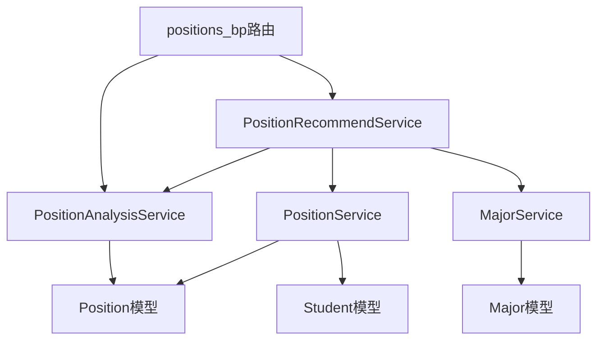

# DESIGN - 安徽省事业单位数据分析集成

## 阶段2: Architect (架构设计)

**创建日期**: 2026-02-05  
**状态**: 架构设计完成 ✅

---

## 一、整体架构图

```mermaid
graph TB
    subgraph 前端/客户端
        A1[岗位详情页] --> B1
        A2[学员详情页] --> B2
        A3[选岗向导] --> B2
    end
    
    subgraph API路由层
        B1[/api/positions/analysis/id]
        B2[/api/positions/recommend/student_id]
    end
    
    subgraph 业务逻辑层
        C1[PositionAnalysisService<br/>岗位分析服务]
        C2[PositionRecommendService<br/>智能推荐服务]
        C3[PositionService<br/>岗位筛选服务-复用]
        C4[MajorService<br/>专业匹配服务-复用]
    end
    
    subgraph 数据访问层
        D1[(Position<br/>岗位表)]
        D2[(Student<br/>学员表)]
        D3[(Major<br/>专业表)]
    end
    
    B1 --> C1
    B2 --> C2
    C2 --> C3
    C2 --> C1
    C1 --> D1
    C3 --> D1
    C3 --> D2
    C3 --> C4
    C4 --> D3
```

---

## 二、核心服务设计

### 2.1 PositionAnalysisService（岗位分析服务）

```python
class PositionAnalysisService:
    """
    岗位分析服务
    
    职责：
    - 计算岗位竞争度
    - 评估岗位性价比
    - 分析地市发展水平
    - 生成分析报告
    """
    
    # 地市发展评级（1-10分）
    CITY_RATING = {
        '省直': 10, '合肥市': 10,
        '芜湖市': 8, '马鞍山市': 8, '滁州市': 8,
        '六安市': 6, '阜阳市': 6, '淮南市': 6, 
        '安庆市': 6, '蚌埠市': 6, '铜陵市': 6,
        '宿州市': 4, '淮北市': 4, '黄山市': 4, 
        '池州市': 4, '宣城市': 4
    }
    
    @staticmethod
    def calculate_competition_score(position: Position) -> Dict:
        """
        计算竞争度分数（0-100）
        
        权重：
        - 招录人数（40%）
        - 学历要求（30%）
        - 专业限制（20%）
        - 其他条件（10%）
        
        Returns:
            {
                'score': float,  # 竞争度分数
                'level': str,    # low/medium/high
                'details': Dict  # 详细评分
            }
        """
        pass
    
    @staticmethod
    def calculate_value_score(position: Position) -> Dict:
        """
        计算性价比分数（0-100）
        
        权重：
        - 竞争度（40%）- 越低越好
        - 地域发展（30%）
        - 单位等级（20%）
        - 稳定性（10%）
        
        Returns:
            {
                'score': float,  # 性价比分数
                'level': str,    # high/medium/low
                'details': Dict  # 详细评分
            }
        """
        pass
    
    @staticmethod
    def analyze_position(position: Position) -> Dict:
        """
        综合分析岗位
        
        Returns:
            {
                'position_id': int,
                'competition': Dict,  # 竞争度分析
                'value': Dict,        # 性价比分析
                'city_rating': int,   # 地市评级
                'recommendation': str # 推荐建议
            }
        """
        pass
```

### 2.2 PositionRecommendService（智能推荐服务）

```python
class PositionRecommendService:
    """
    智能推荐服务
    
    职责：
    - 为学员推荐岗位
    - 岗位分类（冲刺/稳妥/保底）
    - 生成推荐理由
    """
    
    @staticmethod
    def recommend_for_student(
        student_id: int,
        year: int = 2026,
        exam_type: str = '事业单位',
        preferences: Dict = None
    ) -> Dict:
        """
        为学员推荐岗位
        
        Args:
            student_id: 学员ID
            year: 年份
            exam_type: 考试类型
            preferences: 偏好设置（城市、单位类型等）
        
        Returns:
            {
                'student': Dict,
                'total_matched': int,
                'sprint': List[Dict],  # 冲刺岗位（5个）
                'stable': List[Dict],  # 稳妥岗位（10个）
                'safe': List[Dict],    # 保底岗位（5个）
                'summary': Dict        # 统计摘要
            }
        """
        pass
    
    @staticmethod
    def calculate_recommend_score(
        position: Position,
        student: Student,
        preferences: Dict = None
    ) -> float:
        """
        计算推荐分数（0-100）
        
        权重：
        - 条件匹配度（40%）
        - 竞争度适配（30%）
        - 偏好匹配度（20%）
        - 发展前景（10%）
        
        Returns:
            推荐分数
        """
        pass
    
    @staticmethod
    def classify_positions(
        positions: List[Tuple[Position, float]],
        student: Student
    ) -> Dict:
        """
        将岗位分类为冲刺/稳妥/保底
        
        规则：
        - 冲刺：竞争度高但匹配度好，推荐分数top 20%
        - 稳妥：竞争度中等，匹配度好，中间50%
        - 保底：竞争度低，稳定性高，底部30%
        
        Returns:
            {
                'sprint': List,  # 冲刺岗位
                'stable': List,  # 稳妥岗位
                'safe': List     # 保底岗位
            }
        """
        pass
```

---

## 三、算法详细设计

### 3.1 竞争度预测算法

```python
def calculate_competition_score(position):
    score = 0
    details = {}
    
    # 1. 招录人数（40%）- 人数越少竞争越大
    recruit_count = position.recruit_count or 1
    if recruit_count == 1:
        recruit_score = 100
    elif recruit_count <= 3:
        recruit_score = 80
    elif recruit_count <= 5:
        recruit_score = 60
    elif recruit_count <= 10:
        recruit_score = 40
    else:
        recruit_score = 20
    
    score += recruit_score * 0.4
    details['recruit'] = {'score': recruit_score, 'count': recruit_count}
    
    # 2. 学历要求（30%）- 要求越高竞争越小
    education = position.education or ''
    if '博士' in education:
        edu_score = 20  # 博士要求，竞争很小
    elif '研究生' in education and '仅限' in education:
        edu_score = 30
    elif '研究生' in education:
        edu_score = 40
    elif '本科' in education and '仅限' in education:
        edu_score = 60
    elif '本科' in education:
        edu_score = 70
    elif '大专' in education:
        edu_score = 80
    else:
        edu_score = 90  # 学历不限，竞争大
    
    score += edu_score * 0.3
    details['education'] = {'score': edu_score, 'requirement': education}
    
    # 3. 专业限制（20%）- 限制越多竞争越小
    major = position.major_requirement or ''
    if '不限' in major:
        major_score = 100  # 专业不限，竞争大
    elif len(major) > 50:  # 限制很多专业
        major_score = 40
    elif len(major) > 20:  # 限制几个专业
        major_score = 60
    else:  # 限制某个大类
        major_score = 80
    
    score += major_score * 0.2
    details['major'] = {'score': major_score, 'requirement': major[:50]}
    
    # 4. 其他条件（10%）- 有特殊要求竞争小
    other = position.other_requirements or ''
    other_score = 100  # 默认无特殊要求
    if '党员' in other or '中共党员' in other:
        other_score -= 20
    if '基层' in other and '年' in other:
        other_score -= 20
    if '应届' in other:
        other_score -= 10
    other_score = max(other_score, 20)
    
    score += other_score * 0.1
    details['other'] = {'score': other_score, 'requirements': other[:50]}
    
    # 确定竞争度等级
    if score < 40:
        level = 'low'
    elif score < 70:
        level = 'medium'
    else:
        level = 'high'
    
    return {
        'score': round(score, 1),
        'level': level,
        'details': details
    }
```

### 3.2 性价比评估算法

```python
def calculate_value_score(position):
    score = 0
    details = {}
    
    # 1. 竞争度（40%）- 竞争越低性价比越高
    competition = calculate_competition_score(position)
    comp_value = 100 - competition['score']  # 反转分数
    score += comp_value * 0.4
    details['competition'] = comp_value
    
    # 2. 地域发展（30%）
    city = position.city or ''
    city_rating = CITY_RATING.get(city, 4)
    city_score = city_rating * 10  # 转换为0-100分
    score += city_score * 0.3
    details['city'] = {'name': city, 'rating': city_rating, 'score': city_score}
    
    # 3. 单位等级（20%）
    # 从单位名称推断等级
    dept = position.department_name or ''
    if '省' in dept or any(k in dept for k in ['厅', '局', '委']):
        unit_score = 90  # 省级单位
    elif '市' in dept:
        unit_score = 70  # 市级单位
    elif '县' in dept or '区' in dept:
        unit_score = 50  # 县区级
    elif '乡' in dept or '镇' in dept:
        unit_score = 30  # 乡镇级
    else:
        unit_score = 60  # 其他
    
    score += unit_score * 0.2
    details['unit'] = {'name': dept[:30], 'score': unit_score}
    
    # 4. 岗位稳定性（10%）
    # 事业单位都较稳定，主要看编制
    stability_score = 80  # 默认分数
    score += stability_score * 0.1
    details['stability'] = stability_score
    
    # 确定性价比等级
    if score >= 70:
        level = 'high'
    elif score >= 40:
        level = 'medium'
    else:
        level = 'low'
    
    return {
        'score': round(score, 1),
        'level': level,
        'details': details
    }
```

### 3.3 推荐分数算法

```python
def calculate_recommend_score(position, student, preferences):
    score = 0
    
    # 1. 条件匹配度（40%）- 使用PositionService的匹配结果
    match_result = PositionService._match_single_position(student, position)
    if not match_result['is_match']:
        return 0  # 不符合条件，直接返回0
    
    match_score = match_result['score']  # 0-100
    score += match_score * 0.4
    
    # 2. 竞争度适配（30%）- 根据学员水平匹配难度
    competition = calculate_competition_score(position)
    comp_score = competition['score']
    
    # 假设学员水平为中等（50分）
    student_level = 50  # 可扩展为根据学员历史成绩计算
    
    # 竞争度越接近学员水平，分数越高
    difficulty_fit = 100 - abs(comp_score - student_level)
    score += difficulty_fit * 0.3
    
    # 3. 偏好匹配度（20%）
    preference_score = 100  # 默认满分
    
    if preferences:
        # 城市偏好
        if preferences.get('cities') and position.city:
            if position.city in preferences['cities']:
                preference_score = 100
            else:
                preference_score = 60
        
        # 单位类型偏好
        if preferences.get('department_type'):
            dept = position.department_name or ''
            if preferences['department_type'] in dept:
                preference_score = min(preference_score, 100)
            else:
                preference_score = min(preference_score, 70)
    
    score += preference_score * 0.2
    
    # 4. 发展前景（10%）- 基于地市和单位等级
    value = calculate_value_score(position)
    prospect_score = value['score']
    score += prospect_score * 0.1
    
    return round(score, 1)
```

---

## 四、API接口设计

### 4.1 岗位分析接口

```
GET /api/positions/analysis/<position_id>

响应：
{
    "success": true,
    "data": {
        "position_id": 123,
        "position_name": "综合管理岗",
        "department_name": "安徽省教育厅",
        "city": "省直",
        "competition": {
            "score": 65.5,
            "level": "medium",
            "details": {
                "recruit": {"score": 80, "count": 2},
                "education": {"score": 70, "requirement": "本科及以上"},
                "major": {"score": 60, "requirement": "..."},
                "other": {"score": 80, "requirements": "..."}
            }
        },
        "value": {
            "score": 72.3,
            "level": "high",
            "details": {
                "competition": 34.5,
                "city": {"name": "省直", "rating": 10, "score": 100},
                "unit": {"name": "安徽省教育厅", "score": 90},
                "stability": 80
            }
        },
        "recommendation": "该岗位位于省直机关，性价比高，竞争度中等，建议符合条件的考生报考。"
    }
}
```

### 4.2 智能推荐接口

```
GET /api/positions/recommend/<student_id>?year=2026&exam_type=事业单位

可选参数：
- cities: 偏好城市（逗号分隔）
- department_type: 偏好单位类型
- strategy: 推荐策略（aggressive/balanced/conservative）

响应：
{
    "success": true,
    "data": {
        "student": {
            "id": 1,
            "name": "张三",
            "education": "本科",
            "major": "计算机科学与技术"
        },
        "total_matched": 156,
        "sprint": [  // 冲刺岗位（5个）
            {
                "position": {...},
                "recommend_score": 85.5,
                "competition": {...},
                "value": {...},
                "reason": "该岗位竞争激烈但待遇优厚，建议冲刺"
            }
        ],
        "stable": [  // 稳妥岗位（10个）
            {
                "position": {...},
                "recommend_score": 75.2,
                "competition": {...},
                "value": {...},
                "reason": "竞争度适中，匹配度高，推荐报考"
            }
        ],
        "safe": [  // 保底岗位（5个）
            {
                "position": {...},
                "recommend_score": 65.8,
                "competition": {...},
                "value": {...},
                "reason": "竞争较小，稳定性高，适合保底"
            }
        ],
        "summary": {
            "avg_competition": 45.6,
            "avg_value": 68.3,
            "sprint_count": 5,
            "stable_count": 10,
            "safe_count": 5
        }
    }
}
```

---

## 五、数据流向图



---

## 六、模块依赖关系



---

## 七、错误处理策略

| 错误类型 | 处理策略 |
|---------|---------|
| 学员信息不完整 | 返回错误提示，指出缺失字段 |
| 岗位ID不存在 | 返回404错误 |
| 无匹配岗位 | 返回空列表，提供放宽条件建议 |
| 算法计算异常 | 记录日志，返回默认分数 |
| 数据库查询失败 | 捕获异常，返回500错误 |

---

## 八、性能优化策略

1. **数据库索引**：确保Position表的city、education、exam_type字段有索引
2. **批量查询**：使用SQLAlchemy的批量查询避免N+1问题
3. **分页处理**：对大量结果进行分页
4. **后续优化**：可添加Redis缓存热门推荐结果

---

**文档状态**: 架构设计完成 ✅  
**下一步**: 进入代码实施阶段
