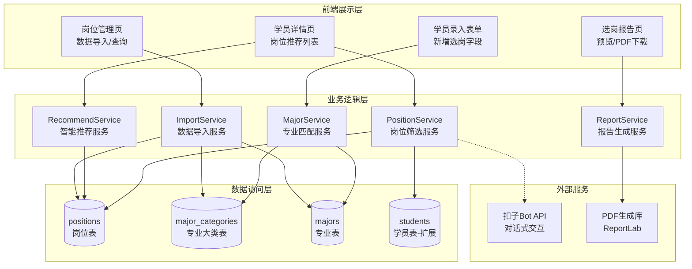
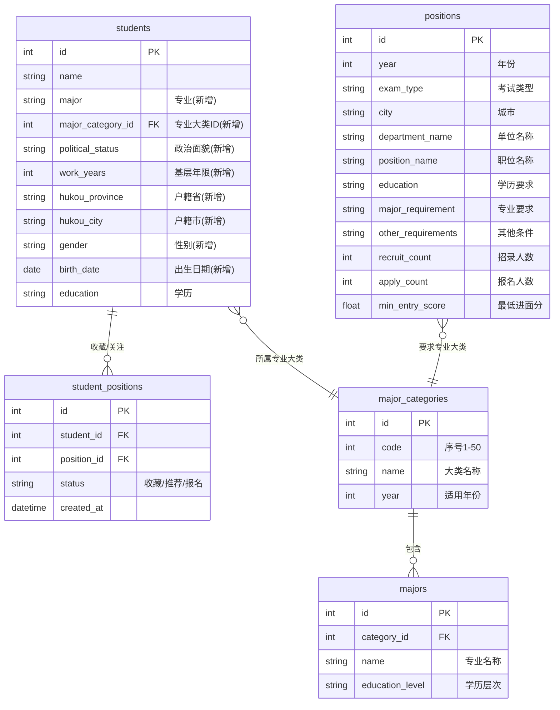
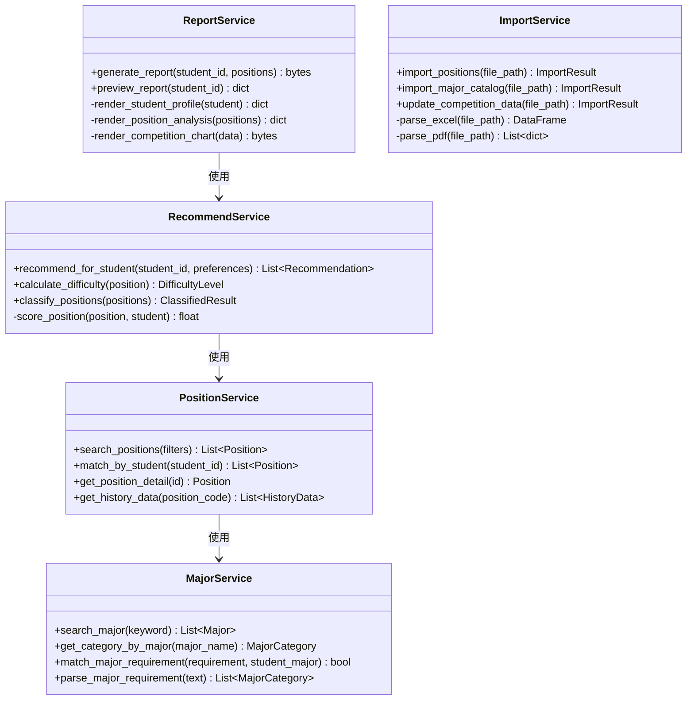
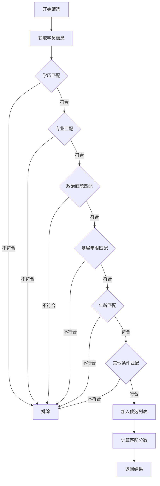
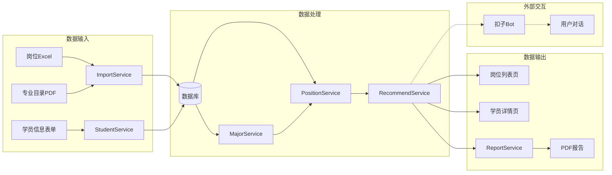
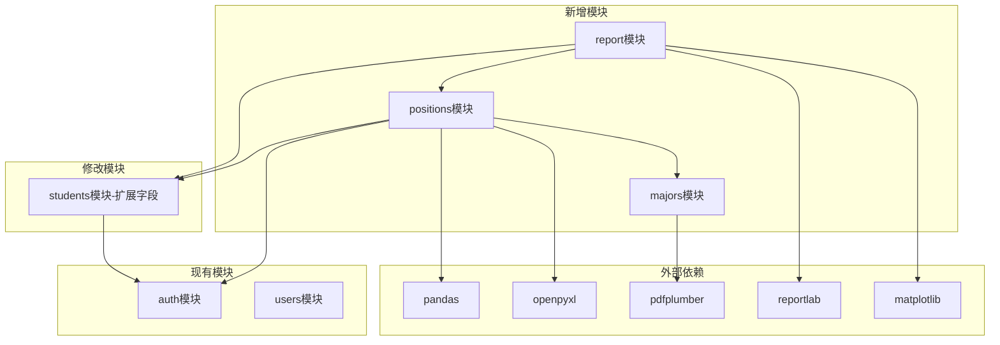

# DESIGN - 智能选岗系统

## 阶段2: Architect (架构设计)

**创建日期**: 2026-01-28  
**状态**: 架构设计中

---

## 一、整体架构图



---

## 二、分层设计

### 2.1 数据层设计

#### 2.1.1 数据库ER图



### 2.2 业务层设计

#### 2.2.1 核心服务类图



### 2.3 接口设计

#### 2.3.1 API路由设计

```python
# 岗位管理路由
positions_bp = Blueprint('positions', __name__, url_prefix='/positions')

# GET  /positions/                    - 岗位列表（支持筛选）
# GET  /positions/<id>                - 岗位详情
# POST /positions/import              - 导入岗位数据
# POST /positions/import-majors       - 导入专业目录
# GET  /positions/match/<student_id>  - 根据学员匹配岗位
# GET  /positions/recommend/<student_id> - 智能推荐岗位
# GET  /positions/report/<student_id> - 生成选岗报告
# GET  /positions/report/<student_id>/download - 下载PDF报告
```

#### 2.3.2 核心接口定义

**1. 岗位筛选接口**

```
GET /positions/match/<student_id>

请求参数：
- city: 城市筛选（可选）
- department_type: 单位类型（可选）
- difficulty: 难度级别（可选，easy/medium/hard）

响应：
{
    "success": true,
    "total": 156,
    "positions": [
        {
            "id": 1,
            "position_name": "经济体制改革处四级主任科员",
            "department_name": "省发展和改革委员会",
            "city": "省级机关",
            "education": "研究生",
            "major_requirement": "经济类、公共管理类",
            "recruit_count": 1,
            "apply_count": 89,
            "competition_ratio": 89.0,
            "min_entry_score": 142.5,
            "difficulty_level": "hard",
            "match_score": 95
        }
    ]
}
```

**2. 智能推荐接口**

```
GET /positions/recommend/<student_id>

请求参数：
- preference_city: 偏好城市
- preference_type: 偏好单位类型
- strategy: 推荐策略（aggressive/balanced/conservative）

响应：
{
    "success": true,
    "student_profile": {
        "name": "张三",
        "education": "本科",
        "major": "法学",
        "major_category": "法律类",
        "political_status": "党员",
        "work_years": 2
    },
    "recommendations": {
        "sprint": [...],      // 冲刺岗位（难度高但匹配度好）
        "stable": [...],      // 稳妥岗位（难度适中）
        "safe": [...]         // 保底岗位（难度低）
    },
    "summary": {
        "total_matched": 156,
        "recommended_count": 15,
        "avg_competition_ratio": 45.6
    }
}
```

**3. 报告生成接口**

```
GET /positions/report/<student_id>

响应：
{
    "success": true,
    "report_data": {
        "student": {...},
        "analysis": {...},
        "positions": [...],
        "charts": {...}
    }
}

GET /positions/report/<student_id>/download

响应：PDF文件流
```

---

## 三、核心组件设计

### 3.1 岗位筛选引擎



#### 3.1.1 匹配规则详解

**学历匹配规则**：

| 岗位要求 | 本科可报 | 研究生可报 | 专科可报 |
|----------|----------|------------|----------|
| 仅限本科 | ✓ | ✗ | ✗ |
| 本科及以上 | ✓ | ✓ | ✗ |
| 仅限研究生 | ✗ | ✓ | ✗ |
| 研究生及以上 | ✗ | ✓ | ✗ |
| 大专及以上 | ✓ | ✓ | ✓ |
| 大专或本科 | ✓ | ✗ | ✓ |

**专业匹配规则**：

```python
def match_major(requirement: str, student_major: str, student_category: str) -> bool:
    """
    专业匹配逻辑
    1. 如果要求为"不限"，返回True
    2. 如果要求包含具体专业名称，精确匹配
    3. 如果要求包含专业大类，匹配学员所属大类
    4. 支持"XX类"的模糊匹配
    """
    if '不限' in requirement:
        return True
    
    # 解析专业要求中的大类
    required_categories = parse_major_categories(requirement)
    
    # 检查学员专业大类是否在要求范围内
    if student_category in required_categories:
        return True
    
    # 精确匹配专业名称
    if student_major in requirement:
        return True
    
    return False
```

**政治面貌匹配规则**：

| 岗位要求 | 党员可报 | 预备党员可报 | 团员可报 | 群众可报 |
|----------|----------|--------------|----------|----------|
| 中共党员 | ✓ | ✓ | ✗ | ✗ |
| 不限 | ✓ | ✓ | ✓ | ✓ |

### 3.2 智能推荐算法

```python
def calculate_recommendation_score(position, student, preferences):
    """
    计算推荐分数（0-100）
    
    评分维度：
    - 条件匹配度 (40%)
    - 竞争难度适配 (30%)
    - 偏好匹配度 (20%)
    - 发展前景评估 (10%)
    """
    score = 0
    
    # 1. 条件匹配度 (40分)
    match_score = calculate_match_score(position, student)
    score += match_score * 0.4
    
    # 2. 竞争难度适配 (30分)
    difficulty = calculate_difficulty(position)
    student_level = estimate_student_level(student)
    difficulty_fit = 100 - abs(difficulty - student_level)
    score += difficulty_fit * 0.3
    
    # 3. 偏好匹配度 (20分)
    preference_score = calculate_preference_score(position, preferences)
    score += preference_score * 0.2
    
    # 4. 发展前景 (10分)
    prospect_score = estimate_prospect(position)
    score += prospect_score * 0.1
    
    return score


def classify_positions(positions, student):
    """
    将岗位分为冲刺、稳妥、保底三档
    
    分类规则：
    - 冲刺：竞争比 > 50:1 或 进面分 > 学员预估分+10
    - 稳妥：竞争比 20-50:1，进面分在学员预估分±5
    - 保底：竞争比 < 20:1 或 进面分 < 学员预估分-10
    """
    sprint = []   # 冲刺
    stable = []   # 稳妥
    safe = []     # 保底
    
    for pos in positions:
        difficulty = calculate_difficulty(pos)
        if difficulty >= 70:
            sprint.append(pos)
        elif difficulty >= 40:
            stable.append(pos)
        else:
            safe.append(pos)
    
    return {
        'sprint': sorted(sprint, key=lambda x: x['score'], reverse=True)[:5],
        'stable': sorted(stable, key=lambda x: x['score'], reverse=True)[:5],
        'safe': sorted(safe, key=lambda x: x['score'], reverse=True)[:5]
    }
```

### 3.3 选岗报告设计

#### 3.3.1 报告结构

```
┌─────────────────────────────────────────────────────────────┐
│                    智能选岗分析报告                          │
│                    生成时间：2026-01-28                      │
├─────────────────────────────────────────────────────────────┤
│  一、学员基本信息                                            │
│  ┌─────────────────────────────────────────────────────┐   │
│  │ 姓名：张三        学历：本科        专业：法学        │   │
│  │ 政治面貌：党员    基层年限：2年     年龄：25岁       │   │
│  │ 户籍：江苏南京    报考类型：江苏省考                  │   │
│  └─────────────────────────────────────────────────────┘   │
├─────────────────────────────────────────────────────────────┤
│  二、条件分析                                                │
│  ┌─────────────────────────────────────────────────────┐   │
│  │ ✓ 学历条件：可报考本科及以上、仅限本科等岗位         │   │
│  │ ✓ 专业条件：属于"法律类"，可报考法律类相关岗位      │   │
│  │ ✓ 政治面貌：党员身份，可报考所有政治面貌要求的岗位  │   │
│  │ ✓ 基层经历：2年经历，满足多数岗位要求               │   │
│  └─────────────────────────────────────────────────────┘   │
├─────────────────────────────────────────────────────────────┤
│  三、匹配岗位统计                                            │
│  ┌─────────────────────────────────────────────────────┐   │
│  │  [饼图：按城市分布]     [柱状图：按竞争难度分布]     │   │
│  │  符合条件岗位：156个    平均竞争比：45.6:1           │   │
│  └─────────────────────────────────────────────────────┘   │
├─────────────────────────────────────────────────────────────┤
│  四、推荐岗位TOP15                                           │
│  ┌─────────────────────────────────────────────────────┐   │
│  │ 【冲刺岗位】（高风险高回报）                          │   │
│  │ 1. 南京市税务局 - 税务稽查四级主任科员               │   │
│  │    竞争比：89:1 | 去年进面分：145.5 | 推荐指数：⭐⭐⭐│   │
│  │ ...                                                   │   │
│  │ 【稳妥岗位】（推荐报考）                              │   │
│  │ 1. 江宁区人民法院 - 法官助理                         │   │
│  │    竞争比：35:1 | 去年进面分：138.2 | 推荐指数：⭐⭐⭐⭐│   │
│  │ ...                                                   │   │
│  │ 【保底岗位】（竞争较小）                              │   │
│  │ 1. 溧水区司法局 - 综合管理                           │   │
│  │    竞争比：15:1 | 去年进面分：125.8 | 推荐指数：⭐⭐⭐ │   │
│  └─────────────────────────────────────────────────────┘   │
├─────────────────────────────────────────────────────────────┤
│  五、备考建议                                                │
│  ┌─────────────────────────────────────────────────────┐   │
│  │ 1. 根据您的条件，建议优先考虑法院、检察院系统岗位    │   │
│  │ 2. 南京地区竞争激烈，可考虑周边城市如镇江、扬州     │   │
│  │ 3. 建议行测目标分数：75分，申论目标：65分            │   │
│  └─────────────────────────────────────────────────────┘   │
└─────────────────────────────────────────────────────────────┘
```

#### 3.3.2 报告样式设计

```python
# 报告配色方案
COLORS = {
    'primary': '#1a73e8',      # 主色调-蓝色
    'secondary': '#34a853',    # 次要-绿色
    'warning': '#fbbc05',      # 警告-黄色
    'danger': '#ea4335',       # 危险-红色
    'text': '#202124',         # 正文-深灰
    'text_secondary': '#5f6368', # 次要文字
    'background': '#ffffff',   # 背景-白色
    'border': '#dadce0'        # 边框-浅灰
}

# 字体设计
FONTS = {
    'title': ('思源黑体', 24, 'bold'),
    'heading1': ('思源黑体', 18, 'bold'),
    'heading2': ('思源黑体', 14, 'bold'),
    'body': ('思源宋体', 11, 'normal'),
    'small': ('思源宋体', 9, 'normal')
}
```

---

## 四、数据流向图



---

## 五、异常处理策略

### 5.1 数据导入异常

| 异常类型 | 处理策略 |
|----------|----------|
| Excel格式错误 | 返回详细错误信息，指出问题行列 |
| 数据缺失 | 记录警告，继续导入其他数据 |
| 重复数据 | 按年份+职位代码去重，更新已有数据 |
| PDF解析失败 | 降级到手动录入模式 |

### 5.2 匹配异常

| 异常类型 | 处理策略 |
|----------|----------|
| 专业无法匹配 | 返回所有"不限专业"的岗位 |
| 学员信息不完整 | 提示必填字段，引导完善 |
| 无符合岗位 | 放宽条件重新筛选，给出建议 |

### 5.3 报告生成异常

| 异常类型 | 处理策略 |
|----------|----------|
| 图表生成失败 | 降级为纯文本模式 |
| PDF渲染超时 | 分页生成，异步处理 |
| 字体缺失 | 使用系统默认字体 |

---

## 六、模块依赖关系图



---

## 七、设计验证

### 7.1 架构可行性

- [x] Flask框架支持所有设计的路由和服务
- [x] SQLite能够处理6000+岗位数据查询
- [x] ReportLab支持中文PDF生成
- [x] 与现有系统无架构冲突

### 7.2 性能预估

| 操作 | 预估耗时 | 依据 |
|------|----------|------|
| 导入6000岗位 | ~20秒 | pandas批量插入 |
| 单次筛选查询 | <1秒 | 索引优化 |
| 报告生成 | ~5秒 | ReportLab性能 |

### 7.3 扩展性

- 支持后续添加更多省份数据
- 支持扩展更多推荐算法
- 支持添加更多报告模板

---

**文档状态**: 设计完成  
**下一步**: 进入任务拆分阶段（TASK文档）
