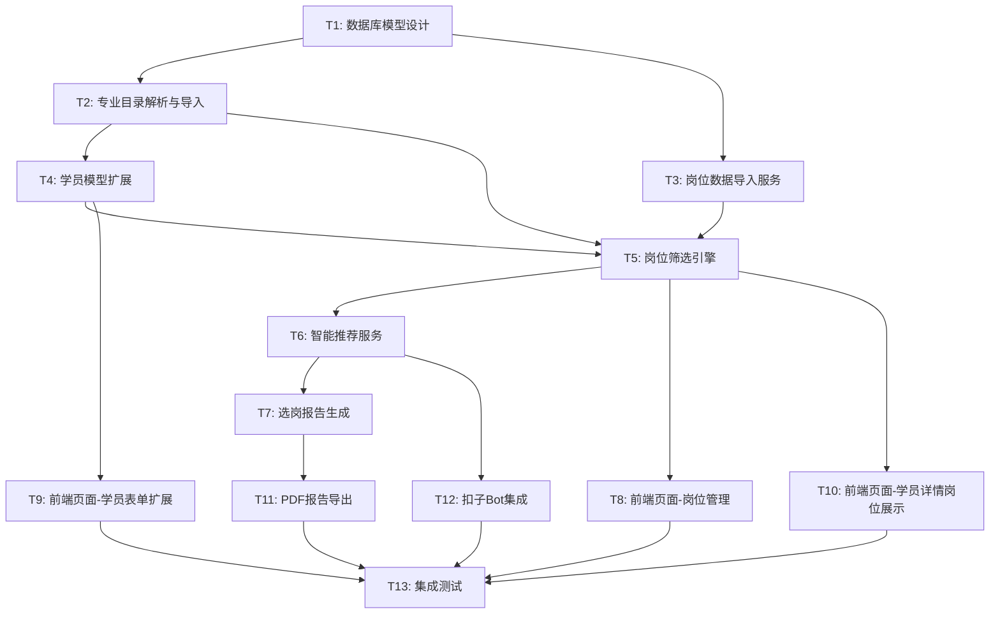

# TASK - 智能选岗系统

## 阶段3: Atomize (任务拆分)

**创建日期**: 2026-01-28  
**状态**: 任务拆分中

---

## 一、任务依赖图



---

## 二、任务清单

### T1: 数据库模型设计

| 属性 | 值 |
|------|-----|
| **任务ID** | T1 |
| **任务名称** | 数据库模型设计 |
| **优先级** | P0 |
| **预估工作量** | 中 |
| **依赖任务** | 无 |

#### 输入契约
- DESIGN文档中的数据模型设计
- 现有Student模型结构

#### 输出契约
- `app/models/position.py` - 岗位模型
- `app/models/major.py` - 专业目录模型
- 数据库迁移脚本

#### 实现约束
- 复用现有db实例
- 添加适当的索引
- 字段注释完整

#### 验收标准
- [ ] Position模型创建成功
- [ ] MajorCategory模型创建成功
- [ ] Major模型创建成功
- [ ] 数据库表创建成功
- [ ] 关系定义正确

---

### T2: 专业目录解析与导入

| 属性 | 值 |
|------|-----|
| **任务ID** | T2 |
| **任务名称** | 专业目录PDF解析与导入 |
| **优先级** | P0 |
| **预估工作量** | 中 |
| **依赖任务** | T1 |

#### 输入契约
- PDF文件：`04-江苏省2026年度考试录用公务员专业参考目录.pdf`
- MajorCategory和Major模型

#### 输出契约
- `app/services/major_service.py` - 专业服务
- 解析后的专业数据入库（50个大类，数千个专业）

#### 实现约束
- 使用pdfplumber解析PDF
- 正确区分研究生/本科/专科
- 处理特殊字符和换行

#### 验收标准
- [ ] 能解析PDF获取50个专业大类
- [ ] 每个大类下的专业按学历层次分类
- [ ] 数据完整性验证通过
- [ ] 支持专业名称模糊搜索

---

### T3: 岗位数据导入服务

| 属性 | 值 |
|------|-----|
| **任务ID** | T3 |
| **任务名称** | 岗位Excel数据导入 |
| **优先级** | P0 |
| **预估工作量** | 中 |
| **依赖任务** | T1 |

#### 输入契约
- Excel文件：2024/2025年岗位表
- Position模型

#### 输出契约
- `app/services/import_service.py` - 导入服务
- 导入后的岗位数据（6000+条）

#### 实现约束
- 使用pandas + openpyxl
- 支持多Sheet导入
- 处理表头不规范情况
- 支持增量更新

#### 验收标准
- [ ] 能正确解析2024江苏省考Excel
- [ ] 能正确解析2025江苏省考Excel
- [ ] 数据字段映射正确
- [ ] 支持重复数据更新
- [ ] 导入6000+岗位耗时<30秒

---

### T4: 学员模型扩展

| 属性 | 值 |
|------|-----|
| **任务ID** | T4 |
| **任务名称** | 学员模型新增选岗字段 |
| **优先级** | P0 |
| **预估工作量** | 小 |
| **依赖任务** | T2 |

#### 输入契约
- 现有Student模型
- 新增字段需求：专业、政治面貌、基层年限、户籍、性别、出生日期

#### 输出契约
- 更新后的`app/models/student.py`
- 数据库迁移脚本

#### 实现约束
- 不影响现有数据
- 新字段支持空值（向后兼容）
- 添加专业大类外键关联

#### 验收标准
- [ ] 7个新字段添加成功
- [ ] 现有学员数据不受影响
- [ ] 外键关系正确

---

### T5: 岗位筛选引擎

| 属性 | 值 |
|------|-----|
| **任务ID** | T5 |
| **任务名称** | 岗位筛选匹配引擎 |
| **优先级** | P0 |
| **预估工作量** | 大 |
| **依赖任务** | T2, T3, T4 |

#### 输入契约
- 学员信息（含新字段）
- 岗位数据
- 专业目录映射

#### 输出契约
- `app/services/position_service.py` - 岗位筛选服务
- 筛选API接口

#### 实现约束
- 学历匹配规则实现
- 专业匹配规则实现（支持大类匹配）
- 政治面貌匹配规则
- 基层年限匹配规则
- 年龄匹配规则
- 其他条件解析

#### 验收标准
- [ ] 学历匹配规则正确
- [ ] 专业匹配规则正确（含大类）
- [ ] 政治面貌匹配正确
- [ ] 筛选响应时间<2秒
- [ ] 结果准确率>95%

---

### T6: 智能推荐服务

| 属性 | 值 |
|------|-----|
| **任务ID** | T6 |
| **任务名称** | 智能推荐算法 |
| **优先级** | P1 |
| **预估工作量** | 中 |
| **依赖任务** | T5 |

#### 输入契约
- 筛选后的岗位列表
- 学员偏好设置
- 历史竞争数据

#### 输出契约
- `app/services/recommend_service.py` - 推荐服务
- 推荐API接口

#### 实现约束
- 推荐分数计算算法
- 难度评估算法
- 冲刺/稳妥/保底分类

#### 验收标准
- [ ] 推荐分数计算逻辑正确
- [ ] 难度评估合理
- [ ] 分类结果符合预期
- [ ] 支持偏好参数调整

---

### T7: 选岗报告生成

| 属性 | 值 |
|------|-----|
| **任务ID** | T7 |
| **任务名称** | 选岗报告内容生成 |
| **优先级** | P1 |
| **预估工作量** | 中 |
| **依赖任务** | T6 |

#### 输入契约
- 学员信息
- 推荐岗位列表
- 统计分析数据

#### 输出契约
- `app/services/report_service.py` - 报告服务
- 报告数据结构

#### 实现约束
- 学员条件分析
- 岗位统计图表数据
- 推荐岗位详情
- 备考建议生成

#### 验收标准
- [ ] 报告内容全面
- [ ] 数据准确
- [ ] 图表数据正确

---

### T8: 前端页面-岗位管理

| 属性 | 值 |
|------|-----|
| **任务ID** | T8 |
| **任务名称** | 岗位管理页面开发 |
| **优先级** | P1 |
| **预估工作量** | 中 |
| **依赖任务** | T5 |

#### 输入契约
- 岗位API接口
- 现有页面模板风格

#### 输出契约
- `app/templates/positions/list.html` - 岗位列表
- `app/templates/positions/import.html` - 数据导入
- `app/routes/positions.py` - 路由

#### 实现约束
- 复用现有UI组件
- 支持筛选和搜索
- 分页展示
- 数据导入上传

#### 验收标准
- [ ] 岗位列表展示正确
- [ ] 筛选功能正常
- [ ] 数据导入功能正常
- [ ] UI风格一致

---

### T9: 前端页面-学员表单扩展

| 属性 | 值 |
|------|-----|
| **任务ID** | T9 |
| **任务名称** | 学员表单新增选岗字段 |
| **优先级** | P0 |
| **预估工作量** | 小 |
| **依赖任务** | T4 |

#### 输入契约
- 现有学员表单
- 新增字段需求

#### 输出契约
- 更新后的`app/templates/students/form.html`
- 专业搜索组件

#### 实现约束
- 专业支持搜索选择
- 省市联动下拉
- 表单验证

#### 验收标准
- [ ] 7个新字段表单元素添加
- [ ] 专业搜索功能正常
- [ ] 省市联动正常
- [ ] 表单提交正常

---

### T10: 前端页面-学员详情岗位展示

| 属性 | 值 |
|------|-----|
| **任务ID** | T10 |
| **任务名称** | 学员详情页岗位推荐展示 |
| **优先级** | P1 |
| **预估工作量** | 中 |
| **依赖任务** | T5 |

#### 输入契约
- 学员详情页
- 岗位推荐接口

#### 输出契约
- 更新后的`app/templates/students/detail.html`
- 岗位推荐卡片组件

#### 实现约束
- 展示匹配岗位数量
- 展示推荐岗位列表
- 支持查看详情
- 支持生成报告入口

#### 验收标准
- [ ] 岗位推荐区域展示
- [ ] 数据加载正确
- [ ] 交互体验流畅

---

### T11: PDF报告导出

| 属性 | 值 |
|------|-----|
| **任务ID** | T11 |
| **任务名称** | PDF报告渲染与导出 |
| **优先级** | P1 |
| **预估工作量** | 大 |
| **依赖任务** | T7 |

#### 输入契约
- 报告数据
- 报告模板设计

#### 输出契约
- PDF生成模块
- 下载接口

#### 实现约束
- 使用ReportLab
- 支持中文字体
- 包含图表
- 美观的排版

#### 验收标准
- [ ] PDF生成成功
- [ ] 中文显示正常
- [ ] 图表渲染正确
- [ ] 排版美观
- [ ] 生成耗时<10秒

---

### T12: 扣子Bot集成

| 属性 | 值 |
|------|-----|
| **任务ID** | T12 |
| **任务名称** | 对话式选岗Bot集成 |
| **优先级** | P2 |
| **预估工作量** | 中 |
| **依赖任务** | T6 |

#### 输入契约
- 现有扣子集成配置
- 推荐服务接口

#### 输出契约
- 扣子Bot配置
- API对接代码

#### 实现约束
- 复用现有扣子集成
- 定义选岗相关意图
- 返回格式化结果

#### 验收标准
- [ ] Bot能理解选岗查询
- [ ] 能返回推荐岗位
- [ ] 支持多轮对话

---

### T13: 集成测试

| 属性 | 值 |
|------|-----|
| **任务ID** | T13 |
| **任务名称** | 系统集成测试 |
| **优先级** | P0 |
| **预估工作量** | 中 |
| **依赖任务** | T8-T12 |

#### 输入契约
- 所有功能模块
- 测试数据

#### 输出契约
- 测试报告
- Bug修复

#### 实现约束
- 覆盖主要功能流程
- 边界条件测试
- 性能测试

#### 验收标准
- [ ] 数据导入流程正常
- [ ] 学员录入流程正常
- [ ] 岗位筛选流程正常
- [ ] 报告生成流程正常
- [ ] 无严重Bug

---

## 三、任务执行顺序

```
第一批（并行）：
├── T1: 数据库模型设计
│
第二批（并行）：
├── T2: 专业目录解析
├── T3: 岗位数据导入
│
第三批：
├── T4: 学员模型扩展
│
第四批（并行）：
├── T5: 岗位筛选引擎
├── T9: 学员表单扩展
│
第五批（并行）：
├── T6: 智能推荐服务
├── T8: 岗位管理页面
├── T10: 学员详情页岗位展示
│
第六批（并行）：
├── T7: 报告内容生成
├── T12: 扣子Bot集成
│
第七批：
├── T11: PDF报告导出
│
第八批：
├── T13: 集成测试
```

---

## 四、风险评估

| 风险项 | 影响程度 | 应对措施 |
|--------|----------|----------|
| PDF专业目录解析困难 | 中 | 预留手动录入备选方案 |
| 专业匹配规则复杂 | 高 | 先实现基本匹配，逐步优化 |
| PDF报告中文字体 | 中 | 提前测试字体兼容性 |
| 扣子API变更 | 低 | 做好接口隔离 |

---

**文档状态**: 任务拆分完成  
**下一步**: 进入审批阶段（APPROVE）
