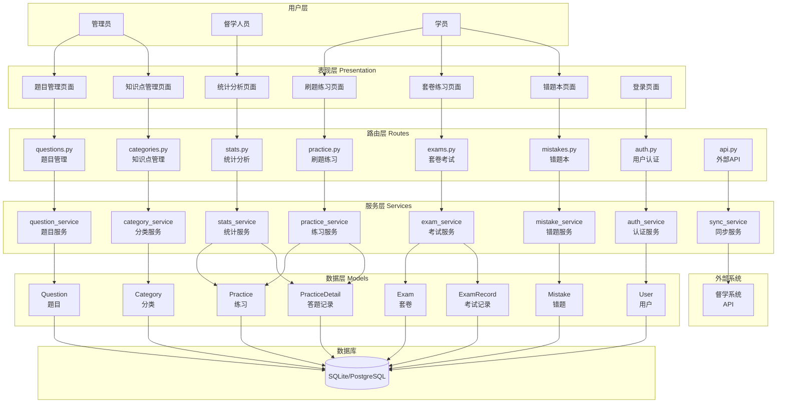
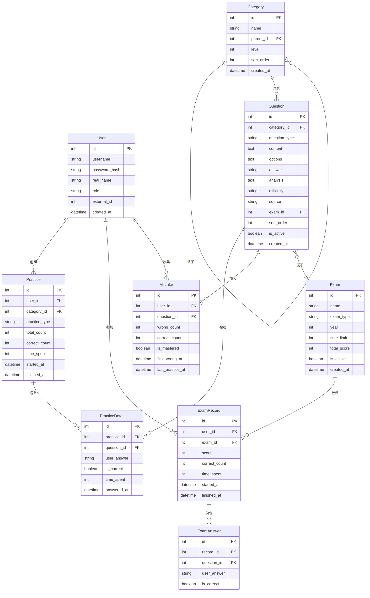

# 架构设计文档 - 公考题库系统

## 文档信息
- **创建日期**：2026-01-28
- **更新日期**：2026-01-28
- **文档版本**：v1.1
- **任务阶段**：Architect（架构阶段）
- **依赖文档**：CONSENSUS_题库系统.md, 题库系统核心需求对话记录.md

---

## 0. 核心设计理念（来自需求对话）

### 0.1 核心痛点与解决方案

```
当前流程（繁琐）：
督学布置任务 → 学员做题 → 学员报告结果 → 督学手动记录 → 手动分析薄弱项

理想流程（高效）：
督学上传题本 → AI分析分类入库 → 生成二维码 → 学员扫码填错题号 → 自动统计分析
```

### 0.2 AI智能导入（核心功能）

**设计原则**：每次导入的题目格式可能不同，通过AI分析后统一格式入库

```
┌─────────────────────────────────────────────────────────────────┐
│                     AI智能导入流程                               │
├─────────────────────────────────────────────────────────────────┤
│                                                                   │
│  【步骤1】督学上传题本                                            │
│  ┌──────────────────────────────────────┐                        │
│  │ 📄 上传: 言语理解_Day15练习.pdf       │                        │
│  │ 📝 备注: 50题，片段阅读为主           │                        │
│  └──────────────────────────────────────┘                        │
│                        ↓                                          │
│  【步骤2】AI自动分析（调用GPT-4V/Claude）                         │
│  ┌──────────────────────────────────────┐                        │
│  │ • OCR识别文字                         │                        │
│  │ • 提取每道题的题干+选项               │                        │
│  │ • 识别正确答案（如果有）              │                        │
│  │ • 生成答案解析                        │                        │
│  │ • 自动分类（三级分类）                │                        │
│  │ • 提取考察核心                        │                        │
│  │ • 总结解题技巧                        │                        │
│  └──────────────────────────────────────┘                        │
│                        ↓                                          │
│  【步骤3】督学审核确认                                            │
│  ┌──────────────────────────────────────┐                        │
│  │ 第1题  UID: Q-2026-YY-000001         │                        │
│  │ ─────────────────────────────────     │                        │
│  │ 题干: 随着科技的发展...               │                        │
│  │ 选项: A.xxx  B.xxx✓  C.xxx  D.xxx    │                        │
│  │ 答案: B                               │                        │
│  │ 解析: 文段通过"但是"转折...          │                        │
│  │ 分类: 言语 > 片段阅读 > 主旨概括      │                        │
│  │ 考察核心: 转折关系识别                │                        │
│  │ 解题技巧: 看到"但是"答案在转折后      │                        │
│  │ ─────────────────────────────────     │                        │
│  │ [✓ 确认] [✏️ 修改] [🗑️ 删除]         │                        │
│  └──────────────────────────────────────┘                        │
│                        ↓                                          │
│  【步骤4】确认入库                                                │
│  • 生成唯一UID                                                    │
│  • 统一格式存储                                                   │
│  • 关联题本信息                                                   │
│                                                                   │
└─────────────────────────────────────────────────────────────────┘
```

### 0.3 二维码扫码提交流程

```
┌─────────────────────────────────────────────────────────────────┐
│                     学员扫码提交流程                              │
├─────────────────────────────────────────────────────────────────┤
│                                                                   │
│  【步骤1】督学创建练习任务                                        │
│  ┌──────────────────────────────────────┐                        │
│  │ 任务名称: Day15言语专项练习           │                        │
│  │ 关联题本: 言语专项50题                │                        │
│  │ 适用班次: 2026江苏事业编第一期        │                        │
│  │ 截止时间: 2026-01-28 22:00           │                        │
│  │                                       │                        │
│  │       ┌─────────┐                     │                        │
│  │       │ [二维码] │  ← 学员扫这个       │                        │
│  │       └─────────┘                     │                        │
│  └──────────────────────────────────────┘                        │
│                        ↓                                          │
│  【步骤2】学员扫码提交（无需登录）                                 │
│  ┌──────────────────────────────────────┐                        │
│  │ 姓名: [张三      ]                    │                        │
│  │ 班次: [2026江苏事业编第一期 ▼]       │                        │
│  │ 手机尾号: [1234 ]                     │                        │
│  │ ─────────────────────────────────     │                        │
│  │ 完成题数: [45 ] / 50题                │                        │
│  │ 错误题号: [3,7,15,22,38]              │                        │
│  │ 用时(分钟): [55]                      │                        │
│  │ ─────────────────────────────────     │                        │
│  │ [提交]                                │                        │
│  └──────────────────────────────────────┘                        │
│                        ↓                                          │
│  【步骤3】自动分析                                                │
│  • 根据错题号匹配题目UID                                          │
│  • 获取每题的分类信息                                             │
│  • 统计各分类错误数量                                             │
│  • 计算正确率                                                     │
│  • 更新学员薄弱项标签                                             │
│  • 生成错题集                                                     │
│  • 同步到督学系统                                                 │
│                                                                   │
└─────────────────────────────────────────────────────────────────┘
```

---

## 1. 整体架构图



---

## 2. 项目目录结构

```
tiku-system/
├── app/
│   ├── __init__.py              # Flask应用初始化
│   ├── models/                   # 数据模型
│   │   ├── __init__.py
│   │   ├── user.py              # 用户模型
│   │   ├── question.py          # 题目模型
│   │   ├── category.py          # 分类模型
│   │   ├── practice.py          # 练习模型
│   │   ├── exam.py              # 套卷模型
│   │   └── mistake.py           # 错题模型
│   ├── routes/                   # 路由层
│   │   ├── __init__.py
│   │   ├── auth.py              # 认证路由
│   │   ├── questions.py         # 题目管理路由
│   │   ├── categories.py        # 分类管理路由
│   │   ├── practice.py          # 刷题练习路由
│   │   ├── exams.py             # 套卷考试路由
│   │   ├── mistakes.py          # 错题本路由
│   │   ├── stats.py             # 统计路由
│   │   └── api.py               # 外部API路由
│   ├── services/                 # 服务层
│   │   ├── __init__.py
│   │   ├── auth_service.py      # 认证服务
│   │   ├── question_service.py  # 题目服务
│   │   ├── category_service.py  # 分类服务
│   │   ├── practice_service.py  # 练习服务
│   │   ├── exam_service.py      # 考试服务
│   │   ├── mistake_service.py   # 错题服务
│   │   ├── stats_service.py     # 统计服务
│   │   ├── sync_service.py      # 同步服务
│   │   └── import_service.py    # 导入服务
│   ├── templates/                # HTML模板
│   │   ├── base.html            # 基础模板
│   │   ├── auth/
│   │   │   └── login.html       # 登录页
│   │   ├── questions/
│   │   │   ├── list.html        # 题目列表
│   │   │   ├── form.html        # 题目表单
│   │   │   ├── detail.html      # 题目详情
│   │   │   └── import.html      # 批量导入
│   │   ├── categories/
│   │   │   └── list.html        # 分类管理
│   │   ├── practice/
│   │   │   ├── select.html      # 选择练习
│   │   │   ├── doing.html       # 答题页面
│   │   │   └── result.html      # 练习结果
│   │   ├── exams/
│   │   │   ├── list.html        # 套卷列表
│   │   │   ├── doing.html       # 考试页面
│   │   │   └── result.html      # 考试结果
│   │   ├── mistakes/
│   │   │   ├── list.html        # 错题列表
│   │   │   └── review.html      # 错题回顾
│   │   ├── stats/
│   │   │   ├── personal.html    # 个人统计
│   │   │   └── overview.html    # 班级概览
│   │   └── errors/
│   │       ├── 403.html
│   │       ├── 404.html
│   │       └── 500.html
│   ├── static/                   # 静态资源
│   │   ├── css/
│   │   │   ├── bootstrap.min.css
│   │   │   ├── style.css        # 全局样式
│   │   │   └── practice.css     # 刷题样式
│   │   ├── js/
│   │   │   ├── jquery.min.js
│   │   │   ├── bootstrap.bundle.min.js
│   │   │   ├── chart.min.js     # 图表
│   │   │   ├── common.js        # 公共函数
│   │   │   ├── practice.js      # 刷题逻辑
│   │   │   └── exam.js          # 考试逻辑
│   │   └── images/
│   │       └── logo.png
│   └── utils/                    # 工具类
│       ├── __init__.py
│       ├── decorators.py        # 装饰器
│       ├── helpers.py           # 辅助函数
│       └── validators.py        # 验证器
├── migrations/                   # 数据库迁移
├── tests/                        # 测试文件
├── config.py                     # 配置文件
├── requirements.txt              # 依赖列表
├── run.py                        # 启动文件
├── import_questions.py           # 题目导入脚本
└── README.md                     # 项目说明
```

---

## 3. 数据库设计

### 3.1 ER图



### 3.2 核心数据表设计

#### 3.2.1 用户表（users）

```sql
CREATE TABLE users (
    id INTEGER PRIMARY KEY AUTOINCREMENT,
    username VARCHAR(50) UNIQUE NOT NULL,
    password_hash VARCHAR(255),
    real_name VARCHAR(50),
    role VARCHAR(20) NOT NULL DEFAULT 'student',  -- admin, supervisor, student
    external_id INTEGER,  -- 督学系统的用户ID
    avatar VARCHAR(255),
    last_login DATETIME,
    is_active BOOLEAN DEFAULT TRUE,
    created_at DATETIME DEFAULT CURRENT_TIMESTAMP,
    updated_at DATETIME DEFAULT CURRENT_TIMESTAMP
);

CREATE INDEX idx_users_external_id ON users(external_id);
CREATE INDEX idx_users_role ON users(role);
```

#### 3.2.2 知识点分类表（categories）

```sql
CREATE TABLE categories (
    id INTEGER PRIMARY KEY AUTOINCREMENT,
    name VARCHAR(100) NOT NULL,
    parent_id INTEGER,
    level INTEGER NOT NULL DEFAULT 1,  -- 1=一级, 2=二级, 3=三级
    sort_order INTEGER DEFAULT 0,
    description TEXT,
    question_count INTEGER DEFAULT 0,  -- 题目数量缓存
    is_active BOOLEAN DEFAULT TRUE,
    created_at DATETIME DEFAULT CURRENT_TIMESTAMP,
    updated_at DATETIME DEFAULT CURRENT_TIMESTAMP,
    FOREIGN KEY (parent_id) REFERENCES categories(id)
);

CREATE INDEX idx_categories_parent ON categories(parent_id);
CREATE INDEX idx_categories_level ON categories(level);
```

#### 3.2.3 题目表（questions）

```sql
CREATE TABLE questions (
    id INTEGER PRIMARY KEY AUTOINCREMENT,
    category_id INTEGER NOT NULL,
    question_type VARCHAR(20) NOT NULL DEFAULT 'single',  -- single, multiple, judge
    content TEXT NOT NULL,  -- 题干内容
    options TEXT,  -- JSON格式: {"A": "选项A", "B": "选项B", ...}
    answer VARCHAR(10) NOT NULL,  -- 正确答案: A / AB / TRUE
    analysis TEXT,  -- 解析
    difficulty VARCHAR(20) DEFAULT 'medium',  -- easy, medium, hard
    source VARCHAR(100),  -- 来源: "2025国考行测"
    exam_id INTEGER,  -- 所属套卷ID
    sort_order INTEGER DEFAULT 0,  -- 套卷内顺序
    tags VARCHAR(255),  -- 标签
    practice_count INTEGER DEFAULT 0,  -- 练习次数
    correct_rate DECIMAL(5,2) DEFAULT 0,  -- 正确率缓存
    is_active BOOLEAN DEFAULT TRUE,
    created_at DATETIME DEFAULT CURRENT_TIMESTAMP,
    updated_at DATETIME DEFAULT CURRENT_TIMESTAMP,
    FOREIGN KEY (category_id) REFERENCES categories(id),
    FOREIGN KEY (exam_id) REFERENCES exams(id)
);

CREATE INDEX idx_questions_category ON questions(category_id);
CREATE INDEX idx_questions_exam ON questions(exam_id);
CREATE INDEX idx_questions_difficulty ON questions(difficulty);
CREATE INDEX idx_questions_type ON questions(question_type);
```

#### 3.2.4 套卷表（exams）

```sql
CREATE TABLE exams (
    id INTEGER PRIMARY KEY AUTOINCREMENT,
    name VARCHAR(200) NOT NULL,  -- "2025年国考行测真题"
    exam_type VARCHAR(50),  -- 国考/省考/事业编/模拟卷
    year INTEGER,  -- 年份
    province VARCHAR(50),  -- 省份（省考）
    time_limit INTEGER DEFAULT 120,  -- 考试时长（分钟）
    total_questions INTEGER DEFAULT 0,  -- 题目总数
    total_score DECIMAL(5,1) DEFAULT 100,  -- 总分
    pass_score DECIMAL(5,1),  -- 及格分
    description TEXT,
    is_active BOOLEAN DEFAULT TRUE,
    created_at DATETIME DEFAULT CURRENT_TIMESTAMP
);

CREATE INDEX idx_exams_type ON exams(exam_type);
CREATE INDEX idx_exams_year ON exams(year);
```

#### 3.2.5 练习记录表（practices）

```sql
CREATE TABLE practices (
    id INTEGER PRIMARY KEY AUTOINCREMENT,
    user_id INTEGER NOT NULL,
    category_id INTEGER,  -- 练习的知识点
    practice_type VARCHAR(20) NOT NULL,  -- category=专项, mistake=错题, random=随机
    total_count INTEGER DEFAULT 0,  -- 总题数
    answered_count INTEGER DEFAULT 0,  -- 已答题数
    correct_count INTEGER DEFAULT 0,  -- 正确数
    time_spent INTEGER DEFAULT 0,  -- 用时（秒）
    status VARCHAR(20) DEFAULT 'doing',  -- doing, finished, abandoned
    started_at DATETIME DEFAULT CURRENT_TIMESTAMP,
    finished_at DATETIME,
    FOREIGN KEY (user_id) REFERENCES users(id),
    FOREIGN KEY (category_id) REFERENCES categories(id)
);

CREATE INDEX idx_practices_user ON practices(user_id);
CREATE INDEX idx_practices_category ON practices(category_id);
CREATE INDEX idx_practices_status ON practices(status);
CREATE INDEX idx_practices_started ON practices(started_at);
```

#### 3.2.6 练习明细表（practice_details）

```sql
CREATE TABLE practice_details (
    id INTEGER PRIMARY KEY AUTOINCREMENT,
    practice_id INTEGER NOT NULL,
    question_id INTEGER NOT NULL,
    user_answer VARCHAR(10),  -- 用户答案
    is_correct BOOLEAN,
    time_spent INTEGER DEFAULT 0,  -- 本题用时（秒）
    answered_at DATETIME,
    FOREIGN KEY (practice_id) REFERENCES practices(id),
    FOREIGN KEY (question_id) REFERENCES questions(id)
);

CREATE INDEX idx_practice_details_practice ON practice_details(practice_id);
CREATE INDEX idx_practice_details_question ON practice_details(question_id);
CREATE INDEX idx_practice_details_correct ON practice_details(is_correct);
```

#### 3.2.7 考试记录表（exam_records）

```sql
CREATE TABLE exam_records (
    id INTEGER PRIMARY KEY AUTOINCREMENT,
    user_id INTEGER NOT NULL,
    exam_id INTEGER NOT NULL,
    total_count INTEGER DEFAULT 0,
    answered_count INTEGER DEFAULT 0,
    correct_count INTEGER DEFAULT 0,
    score DECIMAL(5,1),
    time_spent INTEGER DEFAULT 0,  -- 用时（秒）
    status VARCHAR(20) DEFAULT 'doing',  -- doing, finished, timeout
    started_at DATETIME DEFAULT CURRENT_TIMESTAMP,
    finished_at DATETIME,
    FOREIGN KEY (user_id) REFERENCES users(id),
    FOREIGN KEY (exam_id) REFERENCES exams(id)
);

CREATE INDEX idx_exam_records_user ON exam_records(user_id);
CREATE INDEX idx_exam_records_exam ON exam_records(exam_id);
```

#### 3.2.8 考试答题表（exam_answers）

```sql
CREATE TABLE exam_answers (
    id INTEGER PRIMARY KEY AUTOINCREMENT,
    record_id INTEGER NOT NULL,
    question_id INTEGER NOT NULL,
    user_answer VARCHAR(10),
    is_correct BOOLEAN,
    FOREIGN KEY (record_id) REFERENCES exam_records(id),
    FOREIGN KEY (question_id) REFERENCES questions(id)
);

CREATE INDEX idx_exam_answers_record ON exam_answers(record_id);
```

#### 3.2.9 错题表（mistakes）

```sql
CREATE TABLE mistakes (
    id INTEGER PRIMARY KEY AUTOINCREMENT,
    user_id INTEGER NOT NULL,
    question_id INTEGER NOT NULL,
    category_id INTEGER,  -- 冗余字段，方便查询
    wrong_count INTEGER DEFAULT 1,  -- 错误次数
    correct_count INTEGER DEFAULT 0,  -- 回顾时答对次数
    is_mastered BOOLEAN DEFAULT FALSE,  -- 是否已掌握（连续2次答对）
    first_wrong_at DATETIME DEFAULT CURRENT_TIMESTAMP,
    last_practice_at DATETIME,
    FOREIGN KEY (user_id) REFERENCES users(id),
    FOREIGN KEY (question_id) REFERENCES questions(id),
    FOREIGN KEY (category_id) REFERENCES categories(id),
    UNIQUE(user_id, question_id)
);

CREATE INDEX idx_mistakes_user ON mistakes(user_id);
CREATE INDEX idx_mistakes_category ON mistakes(category_id);
CREATE INDEX idx_mistakes_mastered ON mistakes(is_mastered);
```

#### 3.2.10 薄弱项统计表（weaknesses）

```sql
CREATE TABLE weaknesses (
    id INTEGER PRIMARY KEY AUTOINCREMENT,
    user_id INTEGER NOT NULL,
    category_id INTEGER NOT NULL,
    total_count INTEGER DEFAULT 0,  -- 该知识点总答题数
    correct_count INTEGER DEFAULT 0,  -- 正确数
    accuracy_rate DECIMAL(5,2) DEFAULT 0,  -- 正确率
    level VARCHAR(20),  -- red/yellow/green
    last_practice_at DATETIME,
    updated_at DATETIME DEFAULT CURRENT_TIMESTAMP,
    FOREIGN KEY (user_id) REFERENCES users(id),
    FOREIGN KEY (category_id) REFERENCES categories(id),
    UNIQUE(user_id, category_id)
);

CREATE INDEX idx_weaknesses_user ON weaknesses(user_id);
CREATE INDEX idx_weaknesses_level ON weaknesses(level);
```

---

## 4. 核心服务设计

### 4.0 AI解析服务（AIParseService）⭐ 核心服务

```python
class AIParseService:
    """
    AI智能解析服务
    
    核心功能：解析各种格式的题目文档，统一格式入库
    支持格式：PDF、Word、图片
    AI引擎：GPT-4V / Claude
    """
    
    def parse_document(self, file_path: str, file_type: str) -> dict:
        """
        解析文档，提取所有题目
        
        参数:
            file_path: 文件路径
            file_type: 文件类型 (pdf/docx/image)
        
        返回:
            {
                "success": True,
                "total_questions": 50,
                "questions": [...],
                "parse_log": "..."
            }
        """
        pass
    
    def extract_questions_with_ai(self, content: str) -> List[dict]:
        """
        调用AI提取题目信息
        
        返回每道题的:
        - 题干
        - 选项A/B/C/D
        - 正确答案（如有）
        - 解析（AI生成）
        - 分类（三级）
        - 考察核心
        - 解题技巧
        """
        pass
    
    def classify_question(self, question_content: str) -> dict:
        """
        AI智能分类题目
        
        返回:
            {
                "level1": "言语理解与表达",
                "level2": "片段阅读",
                "level3": "主旨概括题",
                "sub_type": "关联词主旨题"
            }
        """
        pass
    
    def generate_analysis(self, question: dict) -> dict:
        """
        AI生成答案解析、考察核心、解题技巧
        """
        pass
    
    def ocr_image(self, image_path: str) -> str:
        """
        OCR识别图片中的文字
        """
        pass


class QuestionBookService:
    """
    题本管理服务
    
    题本 = 一次上传的题目集合（如"行测套卷练习十一"）
    """
    
    def create_book(self, data: dict) -> QuestionBook:
        """
        创建题本
        
        data = {
            "name": "行测套卷练习十一",
            "source": "2025国考真题",
            "subject": "行测",
            "file_path": "/uploads/xxx.pdf"
        }
        """
        pass
    
    def upload_and_parse(self, file, metadata: dict) -> dict:
        """
        上传文件并调用AI解析
        
        返回解析结果（待审核）
        """
        pass
    
    def confirm_questions(self, book_id: int, questions: List[dict]) -> bool:
        """
        审核确认题目入库
        
        督学审核后批量入库
        """
        pass
    
    def get_book_questions(self, book_id: int) -> List[Question]:
        """
        获取题本下的所有题目
        """
        pass


class PracticeTaskService:
    """
    练习任务服务
    
    练习任务 = 督学布置给学员的作业
    """
    
    def create_task(self, data: dict) -> PracticeTask:
        """
        创建练习任务
        
        data = {
            "name": "Day15言语专项练习",
            "book_id": 1,
            "question_range": [1, 50],
            "batch_ids": [1, 2],
            "deadline": "2026-01-28 22:00"
        }
        """
        pass
    
    def generate_qrcode(self, task_id: int) -> str:
        """
        生成二维码和提交链接
        
        返回二维码图片路径
        """
        pass
    
    def get_submit_url(self, task_id: int) -> str:
        """
        获取学员提交链接（H5页面）
        """
        pass


class StudentSubmitService:
    """
    学员提交服务
    
    处理学员扫码提交的错题信息
    """
    
    def submit_result(self, task_id: int, data: dict) -> dict:
        """
        学员提交结果
        
        data = {
            "name": "张三",
            "batch_id": 1,
            "phone_tail": "1234",
            "completed_count": 45,
            "wrong_numbers": [3, 7, 15, 22, 38],
            "time_spent": 55
        }
        """
        pass
    
    def match_student(self, name: str, batch_id: int, phone_tail: str) -> Student:
        """
        匹配学员（从督学系统获取）
        """
        pass
    
    def analyze_mistakes(self, task_id: int, wrong_numbers: List[int]) -> dict:
        """
        分析错题
        
        返回:
            {
                "total_wrong": 5,
                "accuracy_rate": 88.9,
                "category_stats": [
                    {"category": "语句排序", "count": 2, "level": "red"},
                    {"category": "主旨概括", "count": 1, "level": "yellow"}
                ],
                "questions": [...]
            }
        """
        pass
    
    def sync_to_supervision(self, student_id: int, analysis: dict) -> bool:
        """
        同步薄弱项到督学系统
        """
        pass

```

---

### 4.1 认证服务（AuthService）

```python
class AuthService:
    """用户认证服务"""
    
    def login(self, username: str, password: str) -> Optional[User]:
        """本地登录"""
        pass
    
    def login_with_external(self, external_token: str) -> Optional[User]:
        """通过督学系统认证"""
        # 调用督学系统API验证token
        # 获取用户信息，创建或更新本地用户
        pass
    
    def sync_user_from_external(self, external_id: int) -> User:
        """从督学系统同步用户信息"""
        pass
    
    def check_permission(self, user: User, permission: str) -> bool:
        """检查权限"""
        pass
```

### 4.2 题目服务（QuestionService）

```python
class QuestionService:
    """题目管理服务"""
    
    def create_question(self, data: dict) -> Question:
        """创建题目"""
        pass
    
    def update_question(self, question_id: int, data: dict) -> Question:
        """更新题目"""
        pass
    
    def delete_question(self, question_id: int) -> bool:
        """删除题目（软删除）"""
        pass
    
    def get_questions_by_category(self, category_id: int, 
                                   limit: int = 50,
                                   shuffle: bool = True) -> List[Question]:
        """按知识点获取题目"""
        pass
    
    def import_from_excel(self, file_path: str) -> dict:
        """从Excel批量导入题目"""
        # 返回 {"success": 100, "failed": 2, "errors": [...]}
        pass
    
    def update_question_stats(self, question_id: int, is_correct: bool):
        """更新题目统计（练习次数、正确率）"""
        pass
```

### 4.3 练习服务（PracticeService）

```python
class PracticeService:
    """刷题练习服务"""
    
    def start_practice(self, user_id: int, category_id: int, 
                       count: int = 50) -> Practice:
        """开始专项练习"""
        # 1. 创建练习记录
        # 2. 获取题目列表
        # 3. 创建练习明细（待答状态）
        pass
    
    def submit_answer(self, practice_id: int, question_id: int,
                      answer: str, time_spent: int) -> dict:
        """提交答案"""
        # 1. 判断对错
        # 2. 更新练习明细
        # 3. 如果错误，加入错题本
        # 4. 更新薄弱项统计
        # 返回 {"is_correct": True, "correct_answer": "A", "analysis": "..."}
        pass
    
    def finish_practice(self, practice_id: int) -> Practice:
        """完成练习"""
        # 1. 更新练习状态
        # 2. 计算统计数据
        # 3. 同步到督学系统
        pass
    
    def get_practice_result(self, practice_id: int) -> dict:
        """获取练习结果"""
        pass
    
    def abandon_practice(self, practice_id: int) -> bool:
        """放弃练习"""
        pass
```

### 4.4 考试服务（ExamService）

```python
class ExamService:
    """套卷考试服务"""
    
    def start_exam(self, user_id: int, exam_id: int) -> ExamRecord:
        """开始考试"""
        pass
    
    def save_answer(self, record_id: int, question_id: int, 
                    answer: str) -> bool:
        """保存答案（不判断对错）"""
        pass
    
    def submit_exam(self, record_id: int) -> ExamRecord:
        """交卷"""
        # 1. 判断所有题目对错
        # 2. 计算得分
        # 3. 更新错题本
        # 4. 更新薄弱项
        pass
    
    def get_exam_result(self, record_id: int) -> dict:
        """获取考试结果（含解析）"""
        pass
    
    def check_timeout(self, record_id: int) -> bool:
        """检查是否超时"""
        pass
```

### 4.5 错题服务（MistakeService）

```python
class MistakeService:
    """错题本服务"""
    
    def add_mistake(self, user_id: int, question_id: int) -> Mistake:
        """添加错题"""
        pass
    
    def get_mistakes(self, user_id: int, category_id: int = None,
                     only_unmastered: bool = True) -> List[Mistake]:
        """获取错题列表"""
        pass
    
    def start_review(self, user_id: int, category_id: int = None,
                     count: int = 20) -> Practice:
        """开始错题回顾"""
        pass
    
    def update_mistake_status(self, mistake_id: int, is_correct: bool):
        """更新错题状态"""
        # 答对则correct_count+1
        # 连续2次答对则标记为已掌握
        pass
    
    def get_mistake_stats(self, user_id: int) -> dict:
        """获取错题统计"""
        pass
```

### 4.6 统计服务（StatsService）

```python
class StatsService:
    """统计分析服务"""
    
    def get_user_stats(self, user_id: int) -> dict:
        """获取用户刷题统计"""
        # 返回: {
        #   "total_questions": 500,
        #   "correct_count": 340,
        #   "accuracy_rate": 68.0,
        #   "practice_days": 15,
        #   "total_time": 3600,  # 秒
        #   "today_count": 50,
        #   "streak_days": 7  # 连续刷题天数
        # }
        pass
    
    def get_category_stats(self, user_id: int) -> List[dict]:
        """获取各知识点统计"""
        # 返回各模块的答题数、正确率
        pass
    
    def get_weakness_list(self, user_id: int) -> List[dict]:
        """获取薄弱项列表"""
        pass
    
    def get_practice_trend(self, user_id: int, days: int = 30) -> List[dict]:
        """获取练习趋势（近N天）"""
        pass
    
    def get_class_overview(self) -> dict:
        """获取班级总览（管理员用）"""
        pass
```

### 4.7 同步服务（SyncService）

```python
class SyncService:
    """与督学系统同步服务"""
    
    def __init__(self):
        self.api_base = config.SUPERVISION_API_URL
        self.api_key = config.SUPERVISION_API_KEY
    
    def sync_user(self, external_id: int) -> User:
        """同步用户信息"""
        # GET /api/v1/students/{id}
        pass
    
    def sync_weakness(self, user_id: int, category_id: int,
                      accuracy_rate: float, practice_count: int) -> bool:
        """同步薄弱项到督学系统"""
        # POST /api/v1/students/{id}/weakness
        pass
    
    def sync_practice_record(self, user_id: int, practice: Practice) -> bool:
        """同步练习记录"""
        pass
    
    def batch_sync_weaknesses(self, user_id: int) -> bool:
        """批量同步所有薄弱项"""
        pass
```

---

## 5. 核心页面设计

### 5.1 页面列表

| 页面 | 路由 | 权限 | 功能 |
|------|------|------|------|
| 登录页 | /login | 公开 | 用户登录 |
| 首页 | / | 登录 | 导航+快速入口 |
| 题目列表 | /questions | 管理员 | 题目管理 |
| 题目导入 | /questions/import | 管理员 | 批量导入 |
| 知识点管理 | /categories | 管理员 | 分类管理 |
| 专项练习 | /practice | 学员 | 选择知识点刷题 |
| 答题页面 | /practice/{id}/doing | 学员 | 刷题界面 |
| 练习结果 | /practice/{id}/result | 学员 | 查看结果 |
| 套卷列表 | /exams | 学员 | 选择套卷 |
| 考试页面 | /exams/{id}/doing | 学员 | 模拟考试 |
| 考试结果 | /exams/{id}/result | 学员 | 查看成绩 |
| 错题本 | /mistakes | 学员 | 错题列表 |
| 错题回顾 | /mistakes/review | 学员 | 回顾练习 |
| 个人统计 | /stats | 学员 | 个人数据 |
| 班级概览 | /stats/overview | 管理员 | 班级数据 |

### 5.2 核心页面布局

#### 5.2.1 答题页面布局

```
┌─────────────────────────────────────────────────────────────┐
│  ←返回  │  专项练习：图形推理  │  进度：15/50  │  用时：12:35 │
├─────────────────────────────────────────────────────────────┤
│                                                              │
│  ┌──────────────────────────────────────────────────────┐   │
│  │  第15题                                               │   │
│  │                                                       │   │
│  │  [题目图片/内容]                                      │   │
│  │                                                       │   │
│  │  从所给的四个选项中，选择最恰当的一项：               │   │
│  │                                                       │   │
│  │  ○ A. [选项A内容]                                    │   │
│  │  ● B. [选项B内容]  ✓                                 │   │
│  │  ○ C. [选项C内容]                                    │   │
│  │  ○ D. [选项D内容]                                    │   │
│  │                                                       │   │
│  └──────────────────────────────────────────────────────┘   │
│                                                              │
│  ┌──────────────────────────────────────────────────────┐   │
│  │  ✅ 回答正确！                                        │   │
│  │  正确答案：B                                          │   │
│  │                                                       │   │
│  │  📖 解析：                                            │   │
│  │  本题考查图形旋转规律。观察题干图形，每个图形...      │   │
│  │                                                       │   │
│  │  🏷️ 知识点：判断推理 > 图形推理 > 旋转规律           │   │
│  └──────────────────────────────────────────────────────┘   │
│                                                              │
│  ┌────────────────┐  ┌────────────────┐                     │
│  │    ← 上一题    │  │    下一题 →    │                     │
│  └────────────────┘  └────────────────┘                     │
│                                                              │
│  ┌──────────────────────────────────────────────────────┐   │
│  │  题目导航：                                           │   │
│  │  [1][2][3][4][5][6][7][8][9][10]...                   │   │
│  │  ■=已答  □=未答  ●=当前  ✓=对  ✗=错                  │   │
│  └──────────────────────────────────────────────────────┘   │
│                                                              │
│                    [ 完成并交卷 ]                            │
└─────────────────────────────────────────────────────────────┘
```

#### 5.2.2 练习结果页面布局

```
┌─────────────────────────────────────────────────────────────┐
│                     📊 练习结果                              │
├─────────────────────────────────────────────────────────────┤
│                                                              │
│  ┌─────────────┐  ┌─────────────┐  ┌─────────────┐          │
│  │   正确率     │  │   答题数     │  │   用时      │          │
│  │    72%      │  │   50题      │  │  45分钟     │          │
│  │   36/50     │  │             │  │             │          │
│  └─────────────┘  └─────────────┘  └─────────────┘          │
│                                                              │
│  ┌──────────────────────────────────────────────────────┐   │
│  │  📈 各模块表现                                        │   │
│  ├──────────────────────────────────────────────────────┤   │
│  │  规律类     ████████░░ 80% (8/10)    🟢              │   │
│  │  重构类     ██████░░░░ 60% (6/10)    🟡              │   │
│  │  分类分组   ████░░░░░░ 40% (4/10)    🔴              │   │
│  │  叠加类     ██████████ 100% (5/5)    🟢              │   │
│  │  对称类     ██████████ 100% (5/5)    🟢              │   │
│  └──────────────────────────────────────────────────────┘   │
│                                                              │
│  ┌──────────────────────────────────────────────────────┐   │
│  │  ❌ 错题回顾 (14题)                                   │   │
│  ├──────────────────────────────────────────────────────┤   │
│  │  第3题  分类分组   你选B，正确答案A   [查看解析]      │   │
│  │  第7题  重构类     你选C，正确答案D   [查看解析]      │   │
│  │  第12题 分类分组   你选A，正确答案C   [查看解析]      │   │
│  │  ...                                                  │   │
│  │  [查看全部错题]                                       │   │
│  └──────────────────────────────────────────────────────┘   │
│                                                              │
│  ┌────────────────┐  ┌────────────────┐                     │
│  │   再做一次     │  │   返回首页     │                     │
│  └────────────────┘  └────────────────┘                     │
│                                                              │
└─────────────────────────────────────────────────────────────┘
```

---

## 6. API接口设计

### 6.1 内部API（页面调用）

#### 6.1.1 练习相关

```
# 开始练习
POST /api/practice/start
Request: {"category_id": 5, "count": 50}
Response: {"practice_id": 123, "questions": [...]}

# 提交答案
POST /api/practice/{id}/answer
Request: {"question_id": 10, "answer": "B", "time_spent": 45}
Response: {"is_correct": true, "correct_answer": "B", "analysis": "..."}

# 完成练习
POST /api/practice/{id}/finish
Response: {"result": {...}}

# 获取练习状态
GET /api/practice/{id}/status
Response: {"answered": 15, "total": 50, "time_spent": 720}
```

#### 6.1.2 考试相关

```
# 开始考试
POST /api/exam/start
Request: {"exam_id": 1}
Response: {"record_id": 456, "questions": [...], "time_limit": 7200}

# 保存答案
POST /api/exam/{record_id}/answer
Request: {"question_id": 10, "answer": "B"}
Response: {"success": true}

# 交卷
POST /api/exam/{record_id}/submit
Response: {"result": {...}}

# 获取剩余时间
GET /api/exam/{record_id}/time
Response: {"remaining": 3600, "status": "doing"}
```

### 6.2 外部API（督学系统调用）

```
# 获取学员刷题统计
GET /api/v1/stats/{external_id}
Headers: X-API-Key: xxx
Response: {
    "total_questions": 500,
    "correct_count": 340,
    "accuracy_rate": 68.0,
    "practice_days": 15,
    "last_practice": "2026-01-28",
    "weaknesses": [
        {"category": "数量关系/排列组合", "accuracy": 45.0, "count": 20}
    ]
}

# 获取学员最近练习记录
GET /api/v1/practices/{external_id}?limit=10
Headers: X-API-Key: xxx
Response: {
    "records": [
        {
            "date": "2026-01-28",
            "category": "图形推理",
            "count": 50,
            "correct": 36,
            "accuracy": 72.0,
            "time_spent": 2700
        }
    ]
}

# 获取学员错题数量
GET /api/v1/mistakes/{external_id}/count
Headers: X-API-Key: xxx
Response: {"total": 85, "unmastered": 42}
```

---

## 7. 配置管理

### 7.1 配置文件

```python
# config.py

import os
from datetime import timedelta

class Config:
    """基础配置"""
    SECRET_KEY = os.environ.get('SECRET_KEY') or 'tiku-secret-key-change-me'
    SQLALCHEMY_TRACK_MODIFICATIONS = False
    
    # 登录配置
    REMEMBER_COOKIE_DURATION = timedelta(days=7)
    
    # 分页配置
    QUESTIONS_PER_PAGE = 20
    PRACTICES_PER_PAGE = 10
    
    # 练习配置
    DEFAULT_PRACTICE_COUNT = 50  # 默认每次刷题数量
    MAX_PRACTICE_COUNT = 200  # 最大刷题数量
    
    # 错题配置
    MASTERY_THRESHOLD = 2  # 连续答对次数，标记为已掌握
    
    # 薄弱项判定
    WEAKNESS_MIN_COUNT = 10  # 最少答题数
    WEAKNESS_RED_THRESHOLD = 50  # 红色阈值
    WEAKNESS_YELLOW_THRESHOLD = 70  # 黄色阈值
    
    # 督学系统对接
    SUPERVISION_API_URL = os.environ.get('SUPERVISION_API_URL') or 'http://localhost:5000/api/v1'
    SUPERVISION_API_KEY = os.environ.get('SUPERVISION_API_KEY') or 'dev-api-key'
    
    # 题目导入
    UPLOAD_FOLDER = 'uploads'
    ALLOWED_EXTENSIONS = {'xlsx', 'xls'}


class DevelopmentConfig(Config):
    """开发环境配置"""
    DEBUG = True
    SQLALCHEMY_DATABASE_URI = 'sqlite:///tiku_dev.db'


class ProductionConfig(Config):
    """生产环境配置"""
    DEBUG = False
    SQLALCHEMY_DATABASE_URI = os.environ.get('DATABASE_URL') or 'sqlite:///tiku_prod.db'


config = {
    'development': DevelopmentConfig,
    'production': ProductionConfig,
    'default': DevelopmentConfig
}
```

### 7.2 环境变量

```bash
# .env 文件（不提交Git）

# Flask配置
SECRET_KEY=your-production-secret-key
FLASK_ENV=development

# 数据库
DATABASE_URL=sqlite:///tiku.db

# 督学系统API
SUPERVISION_API_URL=http://localhost:5000/api/v1
SUPERVISION_API_KEY=your-api-key
```

---

## 8. 质量门控

### 8.1 架构检查

- [x] 分层清晰（路由-服务-模型）
- [x] 模块职责单一
- [x] 依赖关系无循环
- [x] 与督学系统架构一致

### 8.2 数据库检查

- [x] 表结构完整
- [x] 索引设计合理
- [x] 外键关系正确
- [x] 字段类型适当

### 8.3 接口检查

- [x] REST风格一致
- [x] 错误码统一
- [x] 认证机制完整
- [x] 外部API安全

---

## 9. 下一步

### 即将进入
**阶段4: Atomize（原子化阶段）**
- 拆分开发任务
- 定义任务依赖关系
- 评估任务复杂度

---

*文档状态：架构设计完成 ✅*
