# 任务分解文档 - 公考题库系统

## 文档信息
- **创建日期**：2026-01-28
- **更新日期**：2026-01-28
- **文档版本**：v1.1
- **任务阶段**：Atomize（原子化阶段）
- **依赖文档**：DESIGN_题库系统.md, 题库系统核心需求对话记录.md

---

## 1. 任务总览

### 1.1 开发阶段划分

| 阶段 | 名称 | 任务数 | 预计周期 | 备注 |
|------|------|--------|---------|------|
| Phase 0 | 项目初始化 | 4 | 2天 | |
| Phase 1 | 基础模块 | 5 | 1周 | |
| **Phase 2A** | **题本管理+AI解析** ⭐ | **6** | **1.5周** | **核心功能** |
| **Phase 2B** | **二维码扫码提交** ⭐ | **5** | **1周** | **核心功能** |
| Phase 3 | 在线刷题练习 | 5 | 1.5周 | 可选功能 |
| Phase 4 | 套卷考试 | 4 | 1周 | 可选功能 |
| Phase 5 | 错题本增强 | 3 | 0.5周 | |
| Phase 6 | 统计与对接 | 4 | 1周 | |
| Phase 7 | 测试与优化 | 3 | 1周 | |

**总计：39个任务，8-10周**

### 1.2 核心功能优先级 ⭐

根据需求对话记录，以下是**最核心**的功能（必须优先实现）：

```
┌─────────────────────────────────────────────────────────────────┐
│  核心功能（P0）- 解决督学痛点                                     │
├─────────────────────────────────────────────────────────────────┤
│  1. 题本上传 + AI智能解析 → 统一格式入库                         │
│  2. 创建练习任务 → 生成二维码                                    │
│  3. 学员扫码提交错题号（H5页面，无需登录）                        │
│  4. 自动分析错题 → 统计薄弱项 → 同步督学系统                     │
├─────────────────────────────────────────────────────────────────┤
│  可选功能（P1/P2）- 增强体验                                     │
├─────────────────────────────────────────────────────────────────┤
│  5. 在线刷题练习（学员登录后在系统内答题）                        │
│  6. 套卷模拟考试（限时）                                         │
│  7. 错题回顾练习                                                 │
│  8. 数据统计看板                                                 │
└─────────────────────────────────────────────────────────────────┘
```

### 1.2 任务依赖图

```mermaid
graph TD
    subgraph "Phase 0: 项目初始化"
        T01[T01: 项目框架搭建]
        T02[T02: 数据库模型创建]
        T03[T03: 知识点数据初始化]
        T04[T04: 基础模板创建]
    end
    
    subgraph "Phase 1: 基础模块"
        T11[T11: 用户认证模块]
        T12[T12: 权限装饰器]
        T13[T13: 公共组件]
        T14[T14: 首页导航]
        T15[T15: 错误页面]
    end
    
    subgraph "Phase 2: 题目管理"
        T21[T21: 题目CRUD]
        T22[T22: 题目列表页]
        T23[T23: 知识点管理页]
        T24[T24: 题目批量导入]
    end
    
    subgraph "Phase 3: 刷题练习"
        T31[T31: 练习服务核心]
        T32[T32: 选择练习页]
        T33[T33: 答题页面]
        T34[T34: 练习结果页]
        T35[T35: 薄弱项计算]
    end
    
    subgraph "Phase 4: 套卷考试"
        T41[T41: 套卷管理]
        T42[T42: 考试服务]
        T43[T43: 考试页面]
        T44[T44: 考试结果页]
    end
    
    subgraph "Phase 5: 错题本"
        T51[T51: 错题服务]
        T52[T52: 错题列表页]
        T53[T53: 错题回顾]
    end
    
    subgraph "Phase 6: 统计与对接"
        T61[T61: 统计服务]
        T62[T62: 个人统计页]
        T63[T63: 班级概览页]
        T64[T64: 督学系统对接]
    end
    
    subgraph "Phase 7: 测试优化"
        T71[T71: 单元测试]
        T72[T72: 集成测试]
        T73[T73: 性能优化]
    end
    
    T01 --> T02 --> T03 --> T04
    T04 --> T11 --> T12 --> T13 --> T14 --> T15
    T15 --> T21 --> T22 --> T23 --> T24
    T24 --> T31 --> T32 --> T33 --> T34 --> T35
    T35 --> T41 --> T42 --> T43 --> T44
    T44 --> T51 --> T52 --> T53
    T53 --> T61 --> T62 --> T63 --> T64
    T64 --> T71 --> T72 --> T73
```



---

## 2. 详细任务定义

---

### Phase 0: 项目初始化

#### T01: 项目框架搭建

| 属性 | 内容 |
|------|------|
| **任务ID** | T01 |
| **任务名称** | 项目框架搭建 |
| **前置依赖** | 无 |
| **输入契约** | 无 |
| **输出契约** | 可运行的Flask项目骨架 |
| **验收标准** | `python run.py` 能启动，访问localhost:5001显示欢迎页 |
| **预计时间** | 2小时 |

**实现要点：**
1. 创建项目目录结构
2. 创建 `requirements.txt` 依赖文件
3. 创建 `config.py` 配置文件
4. 创建 `app/__init__.py` Flask工厂函数
5. 创建 `run.py` 启动文件
6. 创建 `.env` 环境变量文件
7. 创建 `.gitignore` 文件

---

#### T02: 数据库模型创建

| 属性 | 内容 |
|------|------|
| **任务ID** | T02 |
| **任务名称** | 数据库模型创建 |
| **前置依赖** | T01 |
| **输入契约** | DESIGN文档中的数据库设计 |
| **输出契约** | 所有数据模型文件，数据库表创建脚本 |
| **验收标准** | `db.create_all()` 成功创建所有表 |
| **预计时间** | 3小时 |

**实现要点：**
1. 创建 `models/user.py` - 用户模型
2. 创建 `models/category.py` - 分类模型
3. 创建 `models/question.py` - 题目模型
4. 创建 `models/practice.py` - 练习模型
5. 创建 `models/exam.py` - 套卷和考试记录模型
6. 创建 `models/mistake.py` - 错题模型
7. 创建 `models/weakness.py` - 薄弱项模型
8. 创建 `init_db.py` 初始化脚本

---

#### T03: 知识点数据初始化

| 属性 | 内容 |
|------|------|
| **任务ID** | T03 |
| **任务名称** | 知识点数据初始化 |
| **前置依赖** | T02 |
| **输入契约** | CONSENSUS文档中的知识点分类体系 |
| **输出契约** | 知识点初始化脚本，categories表有数据 |
| **验收标准** | 运行脚本后，三级分类数据完整导入 |
| **预计时间** | 2小时 |

**实现要点：**
1. 创建 `init_categories.py` 脚本
2. 定义完整的三级分类数据
3. 批量插入categories表
4. 验证数据完整性

---

#### T04: 基础模板创建

| 属性 | 内容 |
|------|------|
| **任务ID** | T04 |
| **任务名称** | 基础模板创建 |
| **前置依赖** | T01 |
| **输入契约** | 督学系统的UI风格参考 |
| **输出契约** | base.html模板，静态资源文件 |
| **验收标准** | 页面样式与督学系统保持一致 |
| **预计时间** | 3小时 |

**实现要点：**
1. 下载Bootstrap 5、jQuery等依赖
2. 创建 `static/css/style.css` 全局样式
3. 创建 `templates/base.html` 基础模板
4. 创建导航栏、侧边栏组件
5. 创建 `static/js/common.js` 公共函数

---

### Phase 1: 基础模块

#### T11: 用户认证模块

| 属性 | 内容 |
|------|------|
| **任务ID** | T11 |
| **任务名称** | 用户认证模块 |
| **前置依赖** | T02, T04 |
| **输入契约** | User模型 |
| **输出契约** | 登录/注销功能，Flask-Login集成 |
| **验收标准** | 用户可登录/注销，session正常工作 |
| **预计时间** | 4小时 |

**实现要点：**
1. 配置 Flask-Login
2. 创建 `services/auth_service.py`
3. 创建 `routes/auth.py`
4. 创建 `templates/auth/login.html`
5. 实现用户loader
6. 创建测试管理员账号

---

#### T12: 权限装饰器

| 属性 | 内容 |
|------|------|
| **任务ID** | T12 |
| **任务名称** | 权限装饰器 |
| **前置依赖** | T11 |
| **输入契约** | 用户角色定义 |
| **输出契约** | @admin_required, @supervisor_required装饰器 |
| **验收标准** | 不同角色访问受限页面正确拦截 |
| **预计时间** | 2小时 |

**实现要点：**
1. 创建 `utils/decorators.py`
2. 实现 `@admin_required` 装饰器
3. 实现 `@supervisor_required` 装饰器
4. 实现 `@api_key_required` 装饰器（外部API）

---

#### T13: 公共组件

| 属性 | 内容 |
|------|------|
| **任务ID** | T13 |
| **任务名称** | 公共组件 |
| **前置依赖** | T04 |
| **输入契约** | UI设计规范 |
| **输出契约** | 分页组件、消息提示、确认弹窗等 |
| **验收标准** | 组件可在各页面复用 |
| **预计时间** | 3小时 |

**实现要点：**
1. 创建分页宏 `macros/pagination.html`
2. 创建消息提示组件（flash messages）
3. 创建确认弹窗组件
4. 创建加载动画组件
5. 创建表格组件样式

---

#### T14: 首页导航

| 属性 | 内容 |
|------|------|
| **任务ID** | T14 |
| **任务名称** | 首页导航 |
| **前置依赖** | T11, T13 |
| **输入契约** | 用户角色 |
| **输出契约** | 首页，根据角色显示不同菜单 |
| **验收标准** | 管理员、学员看到不同的导航菜单 |
| **预计时间** | 2小时 |

**实现要点：**
1. 创建 `routes/main.py` 主路由
2. 创建 `templates/index.html` 首页
3. 实现角色菜单判断逻辑
4. 添加快速入口卡片

---

#### T15: 错误页面

| 属性 | 内容 |
|------|------|
| **任务ID** | T15 |
| **任务名称** | 错误页面 |
| **前置依赖** | T04 |
| **输入契约** | 无 |
| **输出契约** | 403/404/500错误页面 |
| **验收标准** | 错误发生时显示友好提示页 |
| **预计时间** | 1小时 |

**实现要点：**
1. 创建 `templates/errors/403.html`
2. 创建 `templates/errors/404.html`
3. 创建 `templates/errors/500.html`
4. 注册Flask错误处理器

---

### Phase 2A: 题本管理+AI解析 ⭐ 核心功能

#### T2A1: 题本数据模型

| 属性 | 内容 |
|------|------|
| **任务ID** | T2A1 |
| **任务名称** | 题本数据模型设计 |
| **前置依赖** | T02 |
| **输入契约** | DESIGN文档中的题本和题目数据结构 |
| **输出契约** | QuestionBook、Question模型（含UID生成） |
| **验收标准** | 模型支持三级分类、UID唯一、题本-题目关联正确 |
| **预计时间** | 3小时 |

**实现要点：**
1. 创建 `models/question_book.py` - 题本模型
2. 扩展 `models/question.py` - 添加UID、考察核心、解题技巧字段
3. 创建 `models/category.py` - 三级分类模型
4. 实现UID生成器：`Q-{年份}-{科目简码}-{6位序号}`
5. 创建题本-题目关联关系

---

#### T2A2: AI解析服务

| 属性 | 内容 |
|------|------|
| **任务ID** | T2A2 |
| **任务名称** | AI智能解析服务 |
| **前置依赖** | T2A1 |
| **输入契约** | PDF/Word/图片文件 |
| **输出契约** | 解析后的题目列表（待审核） |
| **验收标准** | 能正确识别题干、选项、分类，支持多种文档格式 |
| **预计时间** | 8小时 |

**实现要点：**
1. 创建 `services/ai_parse_service.py`
2. 实现Word解析器（python-docx）
3. 实现PDF解析器（PyPDF2 + OCR可选）
4. 实现AI分析接口调用（OpenAI/Claude API）
5. 实现题目提取逻辑
6. 实现智能分类
7. 实现解析/考察核心/解题技巧生成
8. 创建 `.env` 配置AI API Key

---

#### T2A3: 题本上传页面

| 属性 | 内容 |
|------|------|
| **任务ID** | T2A3 |
| **任务名称** | 题本上传页面 |
| **前置依赖** | T2A2 |
| **输入契约** | 上传表单需求 |
| **输出契约** | 题本上传页面，支持拖拽上传 |
| **验收标准** | 能上传PDF/Word，显示上传进度 |
| **预计时间** | 4小时 |

**实现要点：**
1. 创建 `routes/books.py` - 题本路由
2. 创建 `templates/books/upload.html`
3. 实现文件上传（拖拽+点击）
4. 实现上传进度显示
5. 调用AI解析服务
6. 显示"正在解析中..."状态

---

#### T2A4: 解析结果审核页面

| 属性 | 内容 |
|------|------|
| **任务ID** | T2A4 |
| **任务名称** | 解析结果审核页面 |
| **前置依赖** | T2A3 |
| **输入契约** | AI解析结果 |
| **输出契约** | 审核页面，可编辑每道题的信息 |
| **验收标准** | 显示所有解析题目，可编辑题干/选项/答案/分类 |
| **预计时间** | 6小时 |

**实现要点：**
1. 创建 `templates/books/review.html`
2. 显示题目列表（可折叠）
3. 每道题可编辑：题干、选项、答案、解析、分类
4. 分类选择器（三级联动）
5. 批量确认/单个确认
6. 重新解析某题功能

---

#### T2A5: 题目入库

| 属性 | 内容 |
|------|------|
| **任务ID** | T2A5 |
| **任务名称** | 审核后题目入库 |
| **前置依赖** | T2A4 |
| **输入契约** | 审核确认的题目数据 |
| **输出契约** | 题目正式入库，生成UID |
| **验收标准** | 题目存入数据库，UID唯一，关联题本 |
| **预计时间** | 3小时 |

**实现要点：**
1. 创建 `services/question_book_service.py`
2. 实现批量入库
3. 生成题目UID
4. 更新题本统计信息
5. 记录入库日志

---

#### T2A6: 题本列表管理

| 属性 | 内容 |
|------|------|
| **任务ID** | T2A6 |
| **任务名称** | 题本列表管理页面 |
| **前置依赖** | T2A5 |
| **输入契约** | 题本数据 |
| **输出契约** | 题本列表页，可查看/编辑/删除 |
| **验收标准** | 显示所有题本，可点击查看包含的题目 |
| **预计时间** | 4小时 |

**实现要点：**
1. 创建 `templates/books/list.html`
2. 显示题本列表（名称、题目数、上传时间）
3. 点击查看题目列表
4. 删除题本功能
5. 分页

---

### Phase 2B: 二维码扫码提交 ⭐ 核心功能

#### T2B1: 练习任务模型

| 属性 | 内容 |
|------|------|
| **任务ID** | T2B1 |
| **任务名称** | 练习任务数据模型 |
| **前置依赖** | T2A1 |
| **输入契约** | 练习任务需求 |
| **输出契约** | PracticeTask模型、StudentSubmission模型 |
| **验收标准** | 支持关联题本、班次、截止时间 |
| **预计时间** | 2小时 |

**实现要点：**
1. 创建 `models/practice_task.py`
2. 创建 `models/student_submission.py`
3. 关联题本和题目范围
4. 关联班次（从督学系统获取）

---

#### T2B2: 创建练习任务

| 属性 | 内容 |
|------|------|
| **任务ID** | T2B2 |
| **任务名称** | 创建练习任务页面 |
| **前置依赖** | T2B1, T2A6 |
| **输入契约** | 题本列表、班次列表 |
| **输出契约** | 创建任务页面，生成二维码 |
| **验收标准** | 能创建任务，自动生成二维码和提交链接 |
| **预计时间** | 5小时 |

**实现要点：**
1. 创建 `routes/tasks.py`
2. 创建 `templates/tasks/create.html`
3. 选择题本、题目范围
4. 选择班次（多选）
5. 设置截止时间
6. 生成二维码（qrcode库）
7. 生成提交链接

---

#### T2B3: 学员H5提交页面

| 属性 | 内容 |
|------|------|
| **任务ID** | T2B3 |
| **任务名称** | 学员扫码提交H5页面 |
| **前置依赖** | T2B2 |
| **输入契约** | 任务ID |
| **输出契约** | 移动端H5页面，无需登录 |
| **验收标准** | 手机扫码可打开，填写信息后提交 |
| **预计时间** | 6小时 |

**实现要点：**
1. 创建 `routes/submit.py` - 公开路由（无需登录）
2. 创建 `templates/submit/form.html` - 移动端适配
3. 显示任务名称、题目数量、截止时间
4. 输入：姓名、班次选择、手机尾号
5. 输入：完成题数、错误题号、用时
6. 提交成功提示
7. 防重复提交

---

#### T2B4: 错题自动分析

| 属性 | 内容 |
|------|------|
| **任务ID** | T2B4 |
| **任务名称** | 错题自动分析服务 |
| **前置依赖** | T2B3 |
| **输入契约** | 提交的错题号 |
| **输出契约** | 错题分析结果、薄弱项统计 |
| **验收标准** | 根据错题号匹配题目，统计各分类错误数 |
| **预计时间** | 5小时 |

**实现要点：**
1. 创建 `services/submit_service.py`
2. 匹配学员（调用督学系统API或本地匹配）
3. 根据错题号匹配题目UID
4. 获取每题分类信息
5. 统计各分类错误数量
6. 计算正确率
7. 判定薄弱项等级（红/黄/绿）
8. 生成错题集数据

---

#### T2B5: 同步督学系统

| 属性 | 内容 |
|------|------|
| **任务ID** | T2B5 |
| **任务名称** | 同步结果到督学系统 |
| **前置依赖** | T2B4 |
| **输入契约** | 分析结果 |
| **输出契约** | 同步到督学系统的薄弱项和练习记录 |
| **验收标准** | 督学系统能看到学员的薄弱项更新 |
| **预计时间** | 4小时 |

**实现要点：**
1. 创建 `services/sync_service.py`
2. 调用督学系统API推送薄弱项
3. 推送练习完成记录
4. 错误重试机制
5. 同步日志记录

---

### Phase 2: 题目管理（基础CRUD）

#### T21: 题目CRUD

| 属性 | 内容 |
|------|------|
| **任务ID** | T21 |
| **任务名称** | 题目CRUD服务 |
| **前置依赖** | T02 |
| **输入契约** | Question模型 |
| **输出契约** | QuestionService，题目增删改查API |
| **验收标准** | 所有CRUD操作正常，API测试通过 |
| **预计时间** | 4小时 |

**实现要点：**
1. 创建 `services/question_service.py`
2. 实现create_question()
3. 实现update_question()
4. 实现delete_question()（软删除）
5. 实现get_question()
6. 实现list_questions()（分页、筛选）
7. 创建 `routes/questions.py` API

---

#### T22: 题目列表页

| 属性 | 内容 |
|------|------|
| **任务ID** | T22 |
| **任务名称** | 题目列表页 |
| **前置依赖** | T21, T13 |
| **输入契约** | QuestionService |
| **输出契约** | 题目列表、筛选、搜索页面 |
| **验收标准** | 可查看、搜索、筛选题目，支持分页 |
| **预计时间** | 4小时 |

**实现要点：**
1. 创建 `templates/questions/list.html`
2. 实现按知识点筛选
3. 实现关键词搜索
4. 实现分页显示
5. 添加新增/编辑/删除按钮
6. 创建 `templates/questions/form.html` 表单

---

#### T23: 知识点管理页

| 属性 | 内容 |
|------|------|
| **任务ID** | T23 |
| **任务名称** | 知识点管理页 |
| **前置依赖** | T03, T13 |
| **输入契约** | Category模型 |
| **输出契约** | 知识点树形管理页面 |
| **验收标准** | 可增删改知识点，树形结构正确显示 |
| **预计时间** | 4小时 |

**实现要点：**
1. 创建 `services/category_service.py`
2. 创建 `routes/categories.py`
3. 创建 `templates/categories/list.html`
4. 实现树形结构展示
5. 实现添加/编辑/删除功能
6. 实现拖拽排序（可选）

---

#### T24: 题目批量导入

| 属性 | 内容 |
|------|------|
| **任务ID** | T24 |
| **任务名称** | 题目批量导入 |
| **前置依赖** | T21, T23 |
| **输入契约** | Excel文件格式定义 |
| **输出契约** | 导入功能，导入结果报告 |
| **验收标准** | 100题Excel导入成功，错误行有提示 |
| **预计时间** | 6小时 |

**实现要点：**
1. 创建 `services/import_service.py`
2. 定义Excel模板格式
3. 实现Excel解析逻辑
4. 实现数据验证
5. 实现批量插入
6. 创建 `templates/questions/import.html`
7. 生成导入结果报告

---

### Phase 3: 核心功能-刷题练习

#### T31: 练习服务核心

| 属性 | 内容 |
|------|------|
| **任务ID** | T31 |
| **任务名称** | 练习服务核心 |
| **前置依赖** | T21 |
| **输入契约** | Practice模型，Question模型 |
| **输出契约** | PracticeService核心方法 |
| **验收标准** | 开始练习、提交答案、完成练习流程正常 |
| **预计时间** | 6小时 |

**实现要点：**
1. 创建 `services/practice_service.py`
2. 实现start_practice() - 开始练习
3. 实现get_practice_questions() - 获取题目
4. 实现submit_answer() - 提交答案
5. 实现finish_practice() - 完成练习
6. 实现abandon_practice() - 放弃练习
7. 创建 `routes/practice.py` API

---

#### T32: 选择练习页

| 属性 | 内容 |
|------|------|
| **任务ID** | T32 |
| **任务名称** | 选择练习页 |
| **前置依赖** | T31, T23 |
| **输入契约** | 知识点分类数据 |
| **输出契约** | 选择知识点+题数的页面 |
| **验收标准** | 可选择知识点和题数，开始练习 |
| **预计时间** | 3小时 |

**实现要点：**
1. 创建 `templates/practice/select.html`
2. 显示知识点树形选择
3. 显示各知识点题目数量
4. 添加题数选择（10/20/50/100）
5. 显示开始练习按钮

---

#### T33: 答题页面

| 属性 | 内容 |
|------|------|
| **任务ID** | T33 |
| **任务名称** | 答题页面 |
| **前置依赖** | T31 |
| **输入契约** | 练习题目数据 |
| **输出契约** | 完整的答题交互页面 |
| **验收标准** | 答题、判断、显示解析、切换题目功能正常 |
| **预计时间** | 8小时 |

**实现要点：**
1. 创建 `templates/practice/doing.html`
2. 创建 `static/js/practice.js`
3. 实现题目显示（支持图片）
4. 实现选项选择交互
5. 实现答案提交和判断
6. 实现解析展示
7. 实现题目导航（答题卡）
8. 实现上一题/下一题切换
9. 实现计时器
10. 实现自动保存

---

#### T34: 练习结果页

| 属性 | 内容 |
|------|------|
| **任务ID** | T34 |
| **任务名称** | 练习结果页 |
| **前置依赖** | T31, T33 |
| **输入契约** | 练习记录数据 |
| **输出契约** | 结果统计页面 |
| **验收标准** | 显示正确率、各模块表现、错题列表 |
| **预计时间** | 4小时 |

**实现要点：**
1. 创建 `templates/practice/result.html`
2. 显示总体统计（正确率、用时）
3. 显示各知识点表现（图表）
4. 显示错题列表（可查看解析）
5. 添加再做一次按钮
6. 使用Chart.js绘制图表

---

#### T35: 薄弱项计算

| 属性 | 内容 |
|------|------|
| **任务ID** | T35 |
| **任务名称** | 薄弱项计算 |
| **前置依赖** | T31 |
| **输入契约** | 练习明细数据 |
| **输出契约** | 薄弱项自动计算和更新 |
| **验收标准** | 练习完成后薄弱项正确计算，颜色标记正确 |
| **预计时间** | 4小时 |

**实现要点：**
1. 创建 `services/weakness_service.py`
2. 实现calculate_weakness() - 计算单个知识点
3. 实现update_weakness() - 更新薄弱项记录
4. 实现get_weakness_level() - 判断红/黄/绿
5. 在practice_service中调用
6. 添加薄弱项变化日志

---

### Phase 4: 核心功能-套卷考试

#### T41: 套卷管理

| 属性 | 内容 |
|------|------|
| **任务ID** | T41 |
| **任务名称** | 套卷管理 |
| **前置依赖** | T21 |
| **输入契约** | Exam模型 |
| **输出契约** | 套卷CRUD，套卷列表页 |
| **验收标准** | 可创建、编辑套卷，关联题目 |
| **预计时间** | 4小时 |

**实现要点：**
1. 创建 `services/exam_service.py`
2. 实现套卷CRUD
3. 实现题目关联
4. 创建 `routes/exams.py`
5. 创建 `templates/exams/list.html` - 学员选择套卷
6. 创建 `templates/exams/manage.html` - 管理员管理套卷

---

#### T42: 考试服务

| 属性 | 内容 |
|------|------|
| **任务ID** | T42 |
| **任务名称** | 考试服务 |
| **前置依赖** | T41 |
| **输入契约** | ExamRecord模型 |
| **输出契约** | 考试流程核心服务 |
| **验收标准** | 开始考试、保存答案、交卷、超时处理正常 |
| **预计时间** | 5小时 |

**实现要点：**
1. 扩展 `services/exam_service.py`
2. 实现start_exam() - 开始考试
3. 实现save_answer() - 保存答案（不判断对错）
4. 实现submit_exam() - 交卷（批量判断）
5. 实现check_timeout() - 超时检查
6. 实现calculate_score() - 计算分数

---

#### T43: 考试页面

| 属性 | 内容 |
|------|------|
| **任务ID** | T43 |
| **任务名称** | 考试页面 |
| **前置依赖** | T42 |
| **输入契约** | 考试题目数据 |
| **输出契约** | 考试答题页面 |
| **验收标准** | 答题、保存、倒计时、交卷功能正常 |
| **预计时间** | 6小时 |

**实现要点：**
1. 创建 `templates/exams/doing.html`
2. 创建 `static/js/exam.js`
3. 实现倒计时显示
4. 实现答案自动保存
5. 实现答题卡（显示已答/未答）
6. 实现交卷确认
7. 实现超时自动交卷

---

#### T44: 考试结果页

| 属性 | 内容 |
|------|------|
| **任务ID** | T44 |
| **任务名称** | 考试结果页 |
| **前置依赖** | T42 |
| **输入契约** | 考试记录数据 |
| **输出契约** | 考试结果页面 |
| **验收标准** | 显示得分、各模块得分、可查看解析 |
| **预计时间** | 4小时 |

**实现要点：**
1. 创建 `templates/exams/result.html`
2. 显示总得分、正确率
3. 显示各模块得分分布
4. 显示题目列表（对/错标记）
5. 点击题目查看解析
6. 显示排名（可选）

---

### Phase 5: 核心功能-错题本

#### T51: 错题服务

| 属性 | 内容 |
|------|------|
| **任务ID** | T51 |
| **任务名称** | 错题服务 |
| **前置依赖** | T31 |
| **输入契约** | Mistake模型 |
| **输出契约** | 错题收集、回顾、掌握判定服务 |
| **验收标准** | 错题自动收集，连续答对后标记掌握 |
| **预计时间** | 4小时 |

**实现要点：**
1. 创建 `services/mistake_service.py`
2. 实现add_mistake() - 添加错题
3. 实现get_mistakes() - 获取错题列表
4. 实现update_mistake_status() - 更新掌握状态
5. 实现start_review() - 开始错题回顾
6. 创建 `routes/mistakes.py`

---

#### T52: 错题列表页

| 属性 | 内容 |
|------|------|
| **任务ID** | T52 |
| **任务名称** | 错题列表页 |
| **前置依赖** | T51 |
| **输入契约** | 错题数据 |
| **输出契约** | 错题列表页面 |
| **验收标准** | 可按知识点筛选，显示错误次数 |
| **预计时间** | 3小时 |

**实现要点：**
1. 创建 `templates/mistakes/list.html`
2. 显示错题列表（分页）
3. 按知识点筛选
4. 显示已掌握/未掌握筛选
5. 显示错误次数和最后练习时间
6. 添加开始回顾按钮

---

#### T53: 错题回顾

| 属性 | 内容 |
|------|------|
| **任务ID** | T53 |
| **任务名称** | 错题回顾 |
| **前置依赖** | T51, T33 |
| **输入契约** | 错题列表 |
| **输出契约** | 错题回顾练习功能 |
| **验收标准** | 可练习错题，答对后更新掌握状态 |
| **预计时间** | 3小时 |

**实现要点：**
1. 复用T33的答题页面
2. 修改练习类型为"mistake"
3. 答对后调用update_mistake_status()
4. 显示进步提示（如"已连续答对2次，标记为已掌握"）

---

### Phase 6: 统计与对接

#### T61: 统计服务

| 属性 | 内容 |
|------|------|
| **任务ID** | T61 |
| **任务名称** | 统计服务 |
| **前置依赖** | T31, T35 |
| **输入契约** | 练习记录、薄弱项数据 |
| **输出契约** | 完整的统计服务 |
| **验收标准** | 个人统计、班级统计数据正确 |
| **预计时间** | 5小时 |

**实现要点：**
1. 创建 `services/stats_service.py`
2. 实现get_user_stats() - 个人总体统计
3. 实现get_category_stats() - 各知识点统计
4. 实现get_weakness_list() - 薄弱项列表
5. 实现get_practice_trend() - 练习趋势
6. 实现get_class_overview() - 班级概览
7. 创建 `routes/stats.py`

---

#### T62: 个人统计页

| 属性 | 内容 |
|------|------|
| **任务ID** | T62 |
| **任务名称** | 个人统计页 |
| **前置依赖** | T61 |
| **输入契约** | 个人统计数据 |
| **输出契约** | 个人数据看板页面 |
| **验收标准** | 显示刷题量、正确率、薄弱项、趋势图 |
| **预计时间** | 4小时 |

**实现要点：**
1. 创建 `templates/stats/personal.html`
2. 显示总体数据卡片
3. 显示各模块正确率雷达图
4. 显示薄弱项列表（红黄绿标记）
5. 显示练习趋势折线图
6. 显示连续刷题天数

---

#### T63: 班级概览页

| 属性 | 内容 |
|------|------|
| **任务ID** | T63 |
| **任务名称** | 班级概览页 |
| **前置依赖** | T61 |
| **输入契约** | 班级统计数据 |
| **输出契约** | 班级数据概览页面 |
| **验收标准** | 显示班级平均正确率、学员排名、活跃度 |
| **预计时间** | 4小时 |

**实现要点：**
1. 创建 `templates/stats/overview.html`
2. 显示班级整体数据
3. 显示学员刷题排行榜
4. 显示各知识点班级平均正确率
5. 显示需要关注的学员（正确率低/不活跃）

---

#### T64: 督学系统对接

| 属性 | 内容 |
|------|------|
| **任务ID** | T64 |
| **任务名称** | 督学系统对接 |
| **前置依赖** | T35, T61 |
| **输入契约** | 督学系统API文档 |
| **输出契约** | 完整的API对接功能 |
| **验收标准** | 薄弱项同步、用户验证、数据查询正常 |
| **预计时间** | 6小时 |

**实现要点：**
1. 创建 `services/sync_service.py`
2. 实现sync_user() - 从督学系统同步用户
3. 实现sync_weakness() - 推送薄弱项
4. 实现verify_token() - 验证督学系统token
5. 创建 `routes/api.py` - 外部API
6. 实现API Key认证
7. 实现练习完成后自动同步
8. 添加同步失败重试机制

---

### Phase 7: 测试与优化

#### T71: 单元测试

| 属性 | 内容 |
|------|------|
| **任务ID** | T71 |
| **任务名称** | 单元测试 |
| **前置依赖** | Phase 1-6 |
| **输入契约** | 所有服务代码 |
| **输出契约** | 单元测试用例 |
| **验收标准** | 核心服务测试覆盖率>80% |
| **预计时间** | 4小时 |

**实现要点：**
1. 创建 `tests/` 目录结构
2. 编写question_service测试
3. 编写practice_service测试
4. 编写exam_service测试
5. 编写mistake_service测试
6. 编写stats_service测试

---

#### T72: 集成测试

| 属性 | 内容 |
|------|------|
| **任务ID** | T72 |
| **任务名称** | 集成测试 |
| **前置依赖** | T71, T64 |
| **输入契约** | 完整系统 |
| **输出契约** | 集成测试用例、测试报告 |
| **验收标准** | 主要流程测试通过，与督学系统对接正常 |
| **预计时间** | 4小时 |

**实现要点：**
1. 编写完整刷题流程测试
2. 编写考试流程测试
3. 编写错题回顾流程测试
4. 编写API对接测试
5. 生成测试报告

---

#### T73: 性能优化

| 属性 | 内容 |
|------|------|
| **任务ID** | T73 |
| **任务名称** | 性能优化 |
| **前置依赖** | T72 |
| **输入契约** | 性能测试结果 |
| **输出契约** | 优化后的系统 |
| **验收标准** | 页面加载<2秒，API响应<500ms |
| **预计时间** | 4小时 |

**实现要点：**
1. 添加数据库查询索引
2. 优化分页查询
3. 添加缓存（可选）
4. 优化前端资源加载
5. 压缩静态资源
6. 添加懒加载

---

## 3. 任务执行顺序

### 3.1 推荐执行路径

```
Week 1: T01 → T02 → T03 → T04 → T11 → T12
Week 2: T13 → T14 → T15 → T21 → T22 → T23
Week 3: T24 → T31 → T32 → T33
Week 4: T34 → T35 → T41 → T42
Week 5: T43 → T44 → T51 → T52 → T53
Week 6: T61 → T62 → T63 → T64
Week 7: T71 → T72 → T73 → 上线准备
```

### 3.2 并行可能性

以下任务可以并行执行：
- T03（知识点初始化）与 T04（模板创建）
- T22（题目列表）与 T23（知识点管理）
- T62（个人统计）与 T63（班级概览）

---

## 4. 风险识别

| 任务 | 风险 | 应对措施 |
|------|------|---------|
| T24 | Excel格式多样，解析困难 | 提供标准模板，严格验证 |
| T33 | 答题页面交互复杂 | 分步实现，先基础后增强 |
| T43 | 考试倒计时和断网处理 | 本地存储+定时同步 |
| T64 | API对接可能有兼容问题 | 先测试后开发 |

---

## 5. 检查清单

### 5.1 任务完整性检查

- [x] 任务覆盖所有功能需求
- [x] 每个任务有明确的输入/输出
- [x] 每个任务有验收标准
- [x] 依赖关系无循环

### 5.2 可行性检查

- [x] 任务粒度适中（2-8小时）
- [x] 技术实现可行
- [x] 时间评估合理

---

*文档状态：任务分解完成 ✅*
