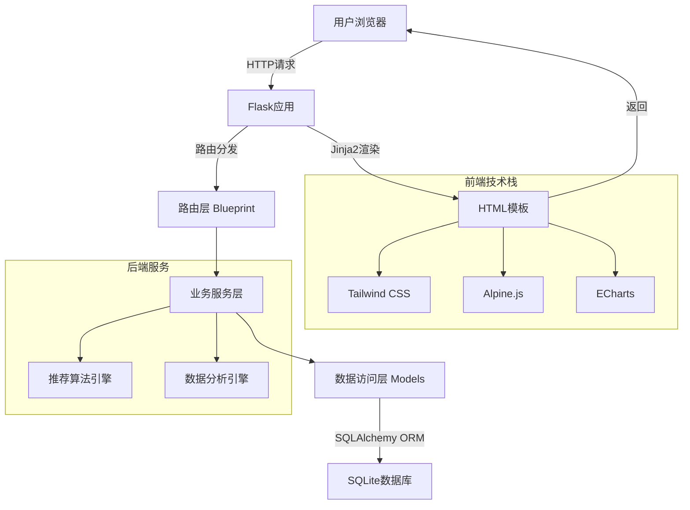
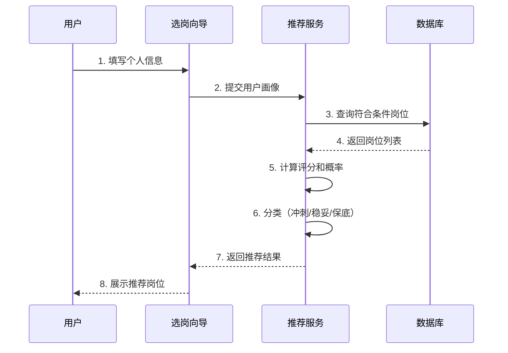

# 安徽事业单位智能选岗系统 - 设计文档

**版本**: V1.0  
**日期**: 2026-02-05  
**状态**: ✅ 设计完成并实现

---

## 一、系统架构设计

### 1.1 整体架构图



### 1.2 模块划分

```
shiye-system/
├── backend/                    # 后端应用
│   ├── app/
│   │   ├── models/            # 数据模型层
│   │   │   ├── position.py   # 岗位模型
│   │   │   ├── user.py       # 用户模型
│   │   │   ├── favorite.py   # 收藏模型
│   │   │   └── recommendation.py # 推荐记录
│   │   │
│   │   ├── services/          # 业务逻辑层
│   │   │   ├── position_service.py # 岗位服务
│   │   │   ├── recommend_service.py # 推荐服务
│   │   │   ├── analysis_service.py # 分析服务
│   │   │   └── competitiveness_service.py # 评估服务
│   │   │
│   │   ├── routes/            # 路由控制层
│   │   │   ├── index.py      # 首页路由
│   │   │   ├── positions.py  # 岗位路由
│   │   │   ├── wizard.py     # 选岗向导路由
│   │   │   ├── api.py        # API路由
│   │   │   ├── evaluation.py # 评估路由
│   │   │   └── comparison.py # 对比路由
│   │   │
│   │   └── templates/         # 前端模板
│   │       ├── base.html     # 基础模板
│   │       ├── index.html    # 首页
│   │       ├── positions/    # 岗位相关
│   │       ├── wizard/       # 选岗向导
│   │       ├── evaluation/   # 竞争力评估
│   │       └── comparison/   # 地市对比
│   │
│   ├── config.py              # 配置文件
│   └── run.py                 # 启动文件
│
├── scripts/                    # 工具脚本
│   ├── import_positions_simple.py # 数据导入
│   └── optimize_database.py   # 性能优化
│
└── data/                       # 数据目录
    └── database/              # 数据库文件
        └── shiye_dev.db       # SQLite数据库
```

---

## 二、数据库设计

### 2.1 核心表结构

#### positions 表（岗位信息）

| 字段名 | 类型 | 说明 | 索引 |
|-------|------|------|------|
| id | INTEGER | 主键 | PK |
| year | INTEGER | 年份 | ✓ |
| exam_type | VARCHAR(20) | 考试类型 | ✓ |
| city | VARCHAR(50) | 城市 | ✓ |
| department_name | VARCHAR(200) | 单位名称 | ✓ |
| position_name | VARCHAR(200) | 岗位名称 | |
| education | VARCHAR(100) | 学历要求 | ✓ |
| major_requirement | TEXT | 专业要求 | |
| recruit_count | INTEGER | 招录人数 | |
| estimated_salary | INTEGER | 预估年薪 | |
| estimated_competition_ratio | FLOAT | 预估竞争比 | ✓ |
| difficulty_level | VARCHAR(20) | 难度等级 | |
| recommendation_score | FLOAT | 推荐评分 | ✓ |

#### user_profiles 表（用户画像）

| 字段名 | 类型 | 说明 |
|-------|------|------|
| id | INTEGER | 主键 |
| user_id | INTEGER | 用户ID |
| education | VARCHAR(20) | 学历 |
| major | VARCHAR(100) | 专业 |
| estimated_score | INTEGER | 预估分数 |
| preferred_cities | TEXT | 期望城市（JSON） |
| competitiveness_score | INTEGER | 竞争力评分 |

#### favorites 表（收藏）

| 字段名 | 类型 | 说明 |
|-------|------|------|
| id | INTEGER | 主键 |
| user_id | INTEGER | 用户ID |
| position_id | INTEGER | 岗位ID |
| note | TEXT | 笔记 |

#### recommendations 表（推荐记录）

| 字段名 | 类型 | 说明 |
|-------|------|------|
| id | INTEGER | 主键 |
| user_id | INTEGER | 用户ID |
| position_id | INTEGER | 岗位ID |
| landing_probability | FLOAT | 上岸概率 |
| recommendation_type | VARCHAR(20) | 推荐类型 |

### 2.2 索引策略

**已创建的12个索引**:
1. idx_positions_year_exam - 年份+考试类型
2. idx_positions_city - 城市
3. idx_positions_system - 系统类型
4. idx_positions_education - 学历
5. idx_positions_category - 考试类别
6. idx_positions_dept_name - 单位名称
7. idx_positions_competition - 竞争比
8. idx_positions_score - 推荐评分
9. idx_favorites_user - 收藏用户
10. idx_favorites_position - 收藏岗位
11. idx_recommendations_user - 推荐用户
12. idx_recommendations_created - 推荐时间

---

## 三、核心算法设计

### 3.1 推荐算法

#### 综合评分公式

```python
综合评分 = Σ(维度分数 × 权重)

= 上岸概率 × 30%
+ 待遇水平 × 25%
+ 发展空间 × 20%
+ 生活质量 × 15%
+ 综合评价 × 10%
```

#### 上岸概率公式

```python
上岸概率 = 基础概率 × 学历系数 × 专业系数 × 分数系数 × 地域系数

其中：
- 基础概率 = 1 / 预估竞争比
- 学历系数 = {博士:3.0, 研究生:1.8, 本科:1.0, 专科:0.7}
- 专业系数 = {精确:1.5, 大类:1.2, 相关:1.0, 不限:0.8}
- 分数系数 = f(用户分数 - 历年最低分)
- 地域系数 = 本地1.3, 外地1.0
```

### 3.2 竞争比预估模型

基于以下因素预估：
1. **城市基础竞争比**（来自历年数据）
2. **学历要求调整**（博士×0.05, 研究生×0.35...）
3. **专业限制调整**（不限×1.8, 严格×0.7）
4. **招聘人数调整**（≥5人×0.9, =1人×1.1）
5. **隶属关系调整**（省直×1.3, 基层×0.5）

### 3.3 薪资预估模型

```python
预估年薪 = 城市基础薪资 + 层级加成 + 学历加成 + 系统加成

- 城市基础: 省直12万, 合肥11万, 沿江9-10万, 皖北7-8万
- 省直加成: +2万
- 博士加成: +10万
- 研究生加成: +3万
- 医疗系统: +2万
- 高校系统: +1万
```

---

## 四、界面设计

### 4.1 设计原则

1. **简洁直观**：核心信息突出，次要信息隐藏
2. **数据可视**：图表展示，降低理解成本
3. **操作便捷**：流程简单，步骤清晰
4. **响应式**：适配PC/平板/手机

### 4.2 色彩系统

```css
--primary: #2563EB (蓝色 - 专业可信)
--success: #10B981 (绿色 - 成功保底)
--warning: #F59E0B (黄色 - 注意警告)
--danger: #EF4444 (红色 - 高风险)
--purple: #8B5CF6 (紫色 - 高端优质)
```

### 4.3 核心页面

1. **首页** - 系统介绍+快速入口
2. **智能选岗向导** - 5步流程+推荐结果
3. **岗位列表** - 搜索筛选+分页展示
4. **岗位详情** - 完整信息+分析建议
5. **数据仪表盘** - 多维度图表展示
6. **地市对比** - 16地市全面对比

---

## 五、数据流设计

### 5.1 智能选岗流程



### 5.2 岗位搜索流程


---

## 六、性能优化设计

### 6.1 数据库优化

**索引策略**:
- 单列索引：常用筛选字段
- 复合索引：year+exam_type
- 覆盖索引：减少回表

**查询优化**:
- 避免SELECT *
- 使用LIMIT限制结果
- 批量提交事务

### 6.2 缓存策略（未来）

```python
# Redis缓存
- 城市列表：缓存1天
- 统计数据：缓存1小时
- 推荐结果：缓存10分钟
```

### 6.3 前端优化

- CDN加速（Tailwind/Alpine/ECharts）
- 图片懒加载
- 代码压缩
- 资源合并

---

## 七、安全设计

### 7.1 数据安全
- SQL注入防护（ORM参数化）
- XSS防护（模板自动转义）
- CSRF防护（Flask内置）

### 7.2 用户安全
- 密码加密（werkzeug.security）
- Session管理（Flask-Login）
- 权限控制（角色验证）

---

## 八、异常处理

### 8.1 数据异常
- CSV读取失败 → 提示用户，记录日志
- 数据格式错误 → 跳过该行，继续导入
- 数据库连接失败 → 重试机制

### 8.2 业务异常
- 无匹配岗位 → 友好提示，建议放宽条件
- 推荐超时 → 返回部分结果
- 图表渲染失败 → 降级为表格展示

### 8.3 系统异常
- 500错误 → 自定义错误页面
- 404错误 → 导航提示
- 503错误 → 维护提示

---

**设计文档状态**: ✅ 完成  
**实现状态**: ✅ 已实现  
**测试状态**: 🔄 进行中
